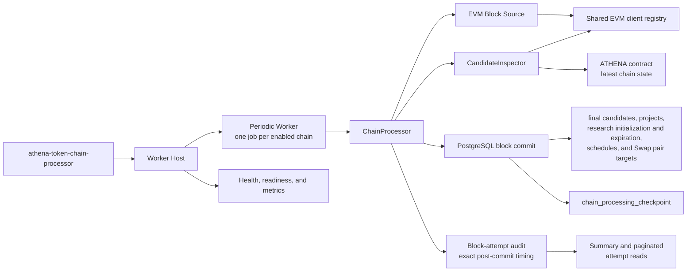

# Token Chain Processor

## Scope

The Token Chain Processor discovers contract-creation transactions on configured
EVM chains, validates every candidate from each block, initializes accepted
Token Intelligence projects, and persists the complete block result before
advancing to the next block. It owns per-chain scheduling, initial lookback,
numeric processing checkpoints, candidate inspection, the atomic block commit,
chain-time research attention expiration, per-attempt processing diagnostics,
and processor health reporting. Every started block attempt records its outcome,
four main-stage durations, processing counts, and error for API and UI analysis.

Scheduled research collection, report generation, project selection, and Swap
log collection are outside this boundary. The processor does initialize the two
Swap pair targets that the independent [Token Swap Processor](swap-processor.md)
later observes. The public Token chain-checkpoint API exposes the processor's
progress and running or stopped status.

## Source Locations

| Concern | Source | Key symbols |
| --- | --- | --- |
| Local process declaration | [Procfile](../../../Procfile) | `token-chain-processor` process |
| Local process orchestration | [hack/local-runtime.sh](../../../hack/local-runtime.sh) | `configure_token_node_ws_proxy`, `start_runtime`, `stop_runtime` |
| Binary dispatch | [cmd/main.go](../../../cmd/main.go) | `main`, `ATHENA_BINARY_NAME` dispatch |
| Processor composition | [cmd/athena-token-chain-processor/commands/athena-token-chain-processor.go](../../../cmd/athena-token-chain-processor/commands/athena-token-chain-processor.go) | `NewCommand` |
| Shared worker startup | [cmd/tokenworker/common.go](../../../cmd/tokenworker/common.go) | `CommonFlags.Bind`, `CommonFlags.Open` |
| Chain command configuration | [cmd/tokenchain/flags.go](../../../cmd/tokenchain/flags.go) | `Flags.Bind`, `Flags.Registry` |
| Fixed chain registry | [internal/token/chainregistry/registry.go](../../../internal/token/chainregistry/registry.go) | `New`, `Registry.EnabledChains` |
| Synchronous application flow | [internal/token/discovery/application/chain_processor.go](../../../internal/token/discovery/application/chain_processor.go) | `ChainProcessor.RunOnce`, `ChainProcessor.StartChain`, `ChainProcessor.StopChain` |
| Candidate inspection | [internal/token/adapters/evm/candidate_inspector.go](../../../internal/token/adapters/evm/candidate_inspector.go) | `CandidateInspector.InspectCandidates` |
| EVM block source | [internal/token/adapters/evm/block_source.go](../../../internal/token/adapters/evm/block_source.go) | `LatestBlockHeader`, `BlockHeaderByNumber`, `DiscoverProjectBlock` |
| EVM client lifecycle | [internal/token/adapters/evm/chain_client_registry.go](../../../internal/token/adapters/evm/chain_client_registry.go) | `Client`, `Reset`, `Close` |
| Chain, checkpoint, and attempt persistence | [internal/token/adapters/postgres/chain_store.go](../../../internal/token/adapters/postgres/chain_store.go), [internal/token/adapters/postgres/chain_block_processing_attempt_store.go](../../../internal/token/adapters/postgres/chain_block_processing_attempt_store.go) | `SyncChains`, `StartChainBlockProcessingAttempt`, `CompleteChainBlockProcessingAttempt`, `GetChainBlockProcessingSummary` |
| Atomic block persistence | [internal/token/adapters/postgres/chain_processing_store.go](../../../internal/token/adapters/postgres/chain_processing_store.go) | `ChainRepository.CommitProcessedBlock` |
| Public operations API | [internal/tokenapi/chain_service.go](../../../internal/tokenapi/chain_service.go) | `GetChainCheckpoint`, `GetChainProcessingSummary`, `ListChainProcessingAttempts` |
| Administrator processing UI | [ui/src/app/pages/chain-processing.tsx](../../../ui/src/app/pages/chain-processing.tsx) | `ChainProcessingPage` |
| Periodic execution | [internal/token/workerhost/periodic.go](../../../internal/token/workerhost/periodic.go) | `PeriodicWorker`, `runJob` |
| Process lifecycle | [internal/token/workerhost/host.go](../../../internal/token/workerhost/host.go) | `Host.Run`, `stopResources` |
| Health and metrics | [internal/token/telemetry/server.go](../../../internal/token/telemetry/server.go), [internal/token/telemetry/tracker.go](../../../internal/token/telemetry/tracker.go) | `Server`, `Tracker` |

## Architecture

`NewCommand` creates one shared PostgreSQL connection, chain registry, EVM
client registry, candidate inspector, processor application, and worker host. It
creates one independent periodic job for every enabled chain. Different chains
may run concurrently, but each chain processes blocks strictly in block-number
order and never overlaps two blocks.

The application layer coordinates EVM reads before opening the final PostgreSQL
transaction. The block source owns block retrieval and contract-creation
extraction. The inspector owns ATHENA validation, latest-state code and receipt
reads, pair derivation, and related-wallet inspection. PostgreSQL owns the
all-or-nothing persistence of the resulting candidates, accepted projects,
research initialization, WETH and USDT Swap pair targets, and processing
checkpoint. Each block's timestamp is also the authoritative clock for expiring
same-chain projects that remain `researching`.

## Runtime Flow

1. The `token-chain-processor` Procfile process runs `cmd/main.go` with
   `ATHENA_BINARY_NAME=athena-token-chain-processor`. The dispatcher selects the
   processor Cobra command.
2. `CommonFlags.Open` builds the fixed Ethereum Mainnet and BSC Mainnet registry,
   applies Token migrations when enabled, connects to Token PostgreSQL,
   synchronizes both chains, initializes missing processing checkpoints at
   cursor `0` with status `stopped`, and creates the worker host.
3. The command creates one periodic job for each enabled chain and fails startup
   when no chain is enabled. Each job marks its chain `running`, creates its poll
   ticker, and invokes `RunOnce` immediately.
4. `RunOnce` loads the chain checkpoint and returns without processing when the
   chain is disabled or stopped. It obtains one latest-block header snapshot as
   the finite upper bound for that run.
5. A fresh cursor uses the configured initial lookback and the average block
   interval across the latest 100-block sample to estimate a start block. The
   initialized cursor is stored as `start - 1`, so restart resumes from that
   durable position rather than recalculating the range.
6. The processor handles the inclusive range from `cursor + 1` through the
   latest snapshot one block at a time. It creates a `running` attempt before
   reloading the checkpoint. Creating a new attempt reconciles older `running`
   rows for the chain: a block already covered by the cursor becomes
   `succeeded` with incomplete timing, while an uncommitted attempt becomes
   `interrupted`. An operator stop completes the new attempt as `cancelled`.
7. `DiscoverProjectBlock` fetches the block once and always returns its number
   and timestamp, including when no contract creation exists. Every transaction
   with a nil `To` address becomes a candidate whose contract address is derived
   from its sender and deployment nonce. The candidate retains that nonce,
   transaction index, and the same deployment block position.
8. Candidates retain block transaction order and are inspected in deterministic
   consecutive chunks of at most 100. Chunks execute sequentially. Each chunk
   makes one ATHENA `ValidateERC20` call against latest chain state, then performs
   code, deployment-receipt, and initial-recipient inspection with at most 10
   candidates in flight. Inspection results preserve input order.
9. An invalid ERC-20 or a candidate with no current runtime code becomes a final
   `rejected` candidate. An accepted result includes metadata, supply, code hash,
   canonical wrapped-native and USDT pairs, creator wallet, and up to 10
   externally owned initial-recipient wallets.
10. After every candidate has a final result, one PostgreSQL transaction writes
    all `validated` and `rejected` candidate rows. For each validated candidate
    it also creates the project, `researching` state, six active one-shot
    collection schedules, related wallets, initial recipients, and independent
    `collecting` Swap targets for the nonzero WETH and USDT pair addresses. Both
    targets start at the complete project deployment block and derive their
    chain-time observation deadlines from that block's timestamp. Each research
    state independently fixes its attention deadline to the deployment block
    timestamp plus the configured research TTL. The transaction then expires
    same-chain `researching` states whose deadline is at or before the current
    block timestamp, recording the actual expiry block. A missing or zero pair
    fails the block. The transaction advances
    `chain_processing_checkpoint` to the current block only after all block data
    has been written.
11. After the business transaction returns, the processor completes the attempt
    with exact checkpoint-read, discovery, validation, persistence, and summed
    total durations in microseconds. Persistence includes the database commit.
    Failures and cancellations retain every reached stage, the terminal stage,
    and the error. A failed post-commit attempt update fails the loop without
    reversing the committed business transaction; the next attempt reconciles
    it from the cursor as a successful row with incomplete timing.
12. Completing a successful attempt backfills its block time onto every retry
    for the same chain and block, then removes rows older than 72 hours relative
    to that chain timestamp. Unknown-time rows are removed only after a known
    expired block-number boundary proves that they are outside the window.
13. A block with no candidates skips inspection but still applies chain-time
    research expiration and commits its checkpoint. The next block is not
    fetched until the current block transaction commits.
14. Reaching the latest snapshot completes the run. The next poll obtains a new
    latest snapshot and continues at the durable cursor plus one.
15. On `SIGINT` or `SIGTERM`, the host cancels the workers, waits for their
    goroutines, marks configured chains `stopped`, stops telemetry, closes EVM
    clients, and closes PostgreSQL.

## State / Data

`chain_processing_checkpoint` is the durable source of per-chain progress and
execution status:

- `chain_id` identifies the independently processed chain.
- `cursor_block_number` is the highest block for which discovery, validation,
  project/research/Swap-target initialization, and checkpoint persistence have
  all committed.
- `status` is `running` while the process owns the chain job and `stopped` after
  graceful shutdown or an API status update.

The checkpoint is numeric. It stores no block hash and does not model chain
reorganizations. Public `TokenChainCheckpoint` API fields and routes map the
internal processing cursor and its running or stopped status.

`chain_block_processing_attempt` is the operational audit record for every
started block attempt. Identity is `(chain_id, block_number, attempt_number)`.
Statuses are `running`, `succeeded`, `failed`, `cancelled`, and `interrupted`.
The row stores block time when known, terminal stage, error, four nullable stage
durations, their total, processing counts, wall-clock audit timestamps, and
whether successful timing is complete. Total duration is the sum of the four
processor stages and excludes the audit record's own database writes.

Summary reads anchor one-, 24-, or 72-hour windows at the latest retained
successful block time. Average, fastest, slowest, and stage averages include
only successful attempts with complete timing. Failure rate is failed attempts
divided by succeeded plus failed attempts; other outcome counts remain
separate. An exact block-number filter overrides the window. Null block-time
attempts remain available through exact lookup and current-attempt listing but
do not enter chain-time aggregates.

`project_candidate` is the audit record for every discovered contract creation.
It stores both the deployment transaction's block index and its sender nonce;
accepted projects retain the same immutable deployment metadata. Its only
persisted statuses are `validated` and `rejected`. It has no pending queue,
claim token, lock timestamp, or lease expiry. Candidate identity remains unique
by chain and contract.

Accepted results also create the project, its initial research graph, and one
`project_swap_pair` target for each `weth` and `usdt` pair kind. Pair targets
store the accepted project's chain, nonzero pair address, inclusive deployment
block and time, and initial 24-hour and seven-day chain-time deadlines. The
research state stores a fixed chain-time attention deadline; an `expired` state
also stores the block number and timestamp that performed the transition. The
project, research initialization and expiration, six schedules, related
wallets, initial recipients, Swap targets, all candidate outcomes from the
block, and the checkpoint share one transaction. Until that transaction
commits, none of the block is visible as processed.

The independent [Token Swap Processor](swap-processor.md) follows the committed
checkpoint and owns all later event, count, completion, and expiration updates.

The EVM client registry caches one selected WebSocket client per chain. Endpoint
selection probes configured nodes concurrently under a shared 15-second
deadline and caches the lowest-latency healthy endpoint. A block, header,
contract-call, code, or receipt failure resets the cached client so the next
attempt probes again.

## Configuration

| Setting | Behavior |
| --- | --- |
| `ATHENA_TOKEN_{ETH,BSC}_ENABLED` / `--{eth,bsc}-enabled` | Required strict boolean. Ethereum Mainnet is chain ID `1`; BSC Mainnet is chain ID `56`. |
| `ATHENA_TOKEN_{ETH,BSC}_NODE_WS_URLS` / `--{eth,bsc}-node-ws-urls` | Required non-empty WebSocket node pool for each chain. |
| `ATHENA_TOKEN_{ETH,BSC}_ATHENA_CONTRACT` / `--{eth,bsc}-athena-contract` | Required deployed ATHENA contract address for each chain. |
| `ATHENA_TOKEN_{ETH,BSC}_PROCESSOR_INITIAL_LOOKBACK_DURATION` / `--{eth,bsc}-processor-initial-lookback-duration` | Required initial lookback. Go duration syntax; minimum one second. |
| `ATHENA_TOKEN_{ETH,BSC}_PROCESSOR_POLL_INTERVAL` / `--{eth,bsc}-processor-poll-interval` | Required positive periodic interval. Maintained values are `15s` for Ethereum and `1s` for BSC. |
| `ATHENA_TOKEN_{ETH,BSC}_SWAP_POLL_INTERVAL` / `--{eth,bsc}-swap-poll-interval` | Required positive shared-registry setting. The Chain Processor validates but does not consume it. |
| `ATHENA_TOKEN_RESEARCH_TTL` / `--research-ttl` | Whole-second research attention duration added to each new project's deployment block timestamp. Default 24 hours; accepted range 1 hour through 30 days. Existing deadlines are not recomputed. |
| `ATHENA_TOKEN_NODE_WS_PROXY_URL` / `--node-ws-proxy-url` | Optional HTTP, HTTPS, or SOCKS5 proxy used only by shared Token EVM WebSocket connections. Empty means direct dialing. |
| `ATHENA_TOKEN_POSTGRES_DSN` | Token database used for migrations, chain synchronization, complete block commits, readiness, and public checkpoint reads. |
| `ATHENA_POSTGRES_AUTO_MIGRATE` | Controls embedded Token migration during connection setup; default `true`. |
| `ATHENA_TOKEN_HEALTH_LISTEN_ADDRESS` / `--health-listen-address` | Processor telemetry listener; default `127.0.0.1:8110`. |
| `ATHENA_TOKEN_HEALTH_STALE_AFTER` / `--health-stale-after` | Maximum age of the last successful loop before readiness fails; default 2 minutes. |
| `ATHENA_LOG_FORMAT`, `ATHENA_LOG_LEVEL` / command flags | Shared worker logging format and level. |

Every maintained chain setting is required even when that chain is disabled.
The maintained configuration enables Ethereum and disables BSC. Both chains use
a `168h` initial lookback. Block-time estimation always uses 100 blocks,
validation chunks contain at most 100 candidates, per-candidate inspection
concurrency is 10, and attempt history retains 72 hours of processed chain
time. These are application constants rather than configuration.

`make run` supplies the dedicated WSL Token node proxy when applicable and
removes process-wide proxy variables from children. Manual and production
launches use the explicit dedicated proxy only. Local PostgreSQL survives
ordinary stop in the `athena-local-postgres-data` volume; `make run-reset`
deletes that volume and restores fresh-checkpoint behavior.

## Invariants

- Cursor `0` triggers initial-range estimation only after a latest header is
  available; a positive cursor resumes at exactly `cursor + 1`.
- One latest header snapshot gives each `RunOnce` a finite upper bound.
- Blocks for one chain are discovered, validated, and committed sequentially.
- Candidate chunks and inspection results preserve block transaction order.
- A committed cursor means every candidate from that block has a final status
  and every accepted candidate's project, research graph, and two Swap targets
  also committed, and every due same-chain research expiration was applied.
- Project research expiration uses the processed block timestamp, never process
  wall-clock time. Stopping the processor freezes lifecycle advancement until
  the missing blocks are processed in order.
- Rejected candidates never create projects, research schedules, or Swap targets.
- No candidate can persist as pending or be claimed by another process.
- The processor reads `latest` state and assumes the observed chain does not
  reorganize; it performs no block-hash verification, finality delay, or rollback.
- Swap logs and later observation-state changes are not part of this block
  transaction; only initial WETH and USDT target creation is included.
- Block-attempt audit writes do not participate in the business transaction. A
  complete success therefore includes commit latency; a crash in the narrow
  post-commit window is represented as successful with incomplete timing and
  excluded from duration aggregates.
- Retention advances only with successfully processed block timestamps. Wall
  clock passage while processing is stopped cannot remove attempt history.

## Failure Recovery

Invalid chain, contract, proxy, or database configuration; migration or chain
synchronization failure; failure to mark a checkpoint running; or health-port
binding failure prevents startup.

Failure to obtain headers leaves a fresh cursor at zero or an established cursor
unchanged. A block fetch, ATHENA call, code read, receipt read, sender derivation,
or inspection-shape error fails the current block before persistence. An invalid
ERC-20 is a normal rejected outcome and does not fail the block.

Any candidate, project, research initialization or expiration, wallet,
Swap-target, or checkpoint write failure rolls back the complete block
transaction. The periodic job retries
from the unchanged cursor, so the same block may be read and inspected again
but cannot become partially committed. Cancellation likewise prevents a
not-yet-committed block from advancing the checkpoint.

Attempt creation failure prevents block work from starting. When PostgreSQL
remains available, a stage failure or cancellation completes the durable
attempt with partial timing. If completion cannot be stored, the next attempt
reconciles the older `running` row using the cursor. A successful business
commit followed by an audit-completion failure is recovered as an incomplete
success and never causes the committed block to be processed again.

The processor intentionally does not detect or repair a chain reorganization.
Its numeric checkpoint records the latest-state chain observed when each block
was processed.

## Observability

The processor exposes:

- `GET /healthz` for worker-host liveness.
- `GET /readyz` for PostgreSQL readiness and every enabled chain's
  `chain_processor` job scope. A process may be live but not ready during initial
  catch-up, after a failed loop, or when the last success becomes stale.
- `GET /metrics` for per-chain loop successes and failures, processed counts,
  last-success and last-error timestamps, consecutive failures, and shared
  Token pipeline diagnostics.

Range and block logs identify the chain, cursor, target height, current block,
remaining block count, and candidate totals. Every completed block reports its
block timestamp, expired research-state count, separate discovery, validation,
and persistence durations, plus validated and rejected counts. Failures identify the stage and phase duration without logging
a completion event for cancellation. EVM client-selection logs identify the
chain, credential-free endpoint, probe duration, and dedicated proxy state.

The public Token Operations API additionally exposes
`GetChainProcessingSummary` and `ListChainProcessingAttempts`. The administrator
UI route `/token/chain-processing` combines checkpoint controls, chain and
chain-time filters, successful-duration KPIs, average stage bars, and expandable
attempt history. No per-candidate timing record is stored or exposed.

## Change Checklist

- [ ] Recheck process wiring, one-job-per-chain creation, and shutdown ordering.
- [ ] Recheck lookback estimation, latest snapshot, numeric cursor, and sequential block boundaries.
- [ ] Recheck candidate ordering, 100-candidate chunks, and inspection concurrency.
- [ ] Recheck the complete block transaction, final-only candidate states, and
      research expiration plus WETH and USDT Swap-target initialization.
- [ ] Recheck API checkpoint mapping, retries, health/readiness, logs, and metrics.
- [ ] Recheck attempt reconciliation, post-commit timing completion, chain-time retention, summary filters, and paginated reads.
- [ ] Keep the [design index](../README.md) entry current.
