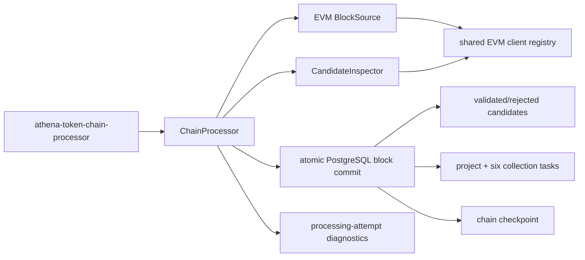

# Token Chain Processor

## Scope

The Token Chain Processor scans configured EVM chains in block order, discovers
contract-creation candidates, validates Token projects, and atomically
initializes accepted projects. A committed accepted project includes its code
hash, two canonical pairs, creator and initial recipients, and exactly six
one-time collection tasks. The block checkpoint moves only after the complete
block result commits.

Collection execution and ProjectProfile construction are separate processes.
The Chain Processor has no project expiry, recurring schedule, report,
selection, or trend responsibility.

## Source Locations

| Concern | Source | Key symbols |
| --- | --- | --- |
| Process composition | [cmd/athena-token-chain-processor/commands/athena-token-chain-processor.go](../../../cmd/athena-token-chain-processor/commands/athena-token-chain-processor.go) | `NewCommand` |
| Application flow | [internal/token/discovery/application/chain_processor.go](../../../internal/token/discovery/application/chain_processor.go) | `ChainProcessor.RunOnce`, `StartChain`, `StopChain` |
| Candidate inspection | [internal/token/adapters/evm/candidate_inspector.go](../../../internal/token/adapters/evm/candidate_inspector.go) | `CandidateInspector.InspectCandidates` |
| Block source | [internal/token/adapters/evm/block_source.go](../../../internal/token/adapters/evm/block_source.go) | `DiscoverProjectBlock`, `LatestBlockHeader` |
| Atomic persistence | [internal/token/adapters/postgres/chain_processing_store.go](../../../internal/token/adapters/postgres/chain_processing_store.go) | `ChainRepository.CommitProcessedBlock` |
| Attempt diagnostics | [internal/token/adapters/postgres/chain_block_processing_attempt_store.go](../../../internal/token/adapters/postgres/chain_block_processing_attempt_store.go) | attempt start/complete/summary methods |
| Schema | [internal/token/adapters/postgres/migrations/000001_init.sql](../../../internal/token/adapters/postgres/migrations/000001_init.sql) | checkpoint, candidate, project, and collection-task tables |
| Public operations API | [internal/tokenapi/chain_service.go](../../../internal/tokenapi/chain_service.go) | checkpoint and processing-attempt reads |

## Architecture

One periodic job runs for every enabled chain. Chains may progress concurrently;
one chain is strictly sequential. EVM discovery and validation complete before
the final database transaction. PostgreSQL is the visibility boundary for the
whole block.

## Runtime Flow

1. Startup validates the fixed chain registry, applies migrations when enabled,
   synchronizes chains, initializes checkpoints, and starts one periodic job per
   enabled chain.
2. `RunOnce` snapshots the latest block and processes `cursor + 1` through that
   finite bound. A fresh cursor estimates its start from the configured
   lookback and recent average block interval.
3. Each block attempt is persisted as `running`; interrupted earlier attempts
   are reconciled from the durable cursor.
4. Contract creations are inspected in deterministic chunks of at most 100.
   ATHENA validates ERC-20 behavior, while code, receipt, metadata, canonical
   pairs, creator, and up to ten initial EOA recipients are collected with
   bounded concurrency. Receipt transfers anchor recipient ratios to the
   deployment transaction; the ratio is explicitly an estimate.
5. Invalid ERC-20s and contracts without current runtime code become final
   `rejected` candidates. Valid candidates retain deployment transaction
   position, nonce, metadata, supply, code hash, and project context.
6. One PostgreSQL transaction first locks the durable checkpoint and requires
   its cursor to equal the preceding block, then writes every candidate outcome. For each accepted
   candidate it idempotently creates the project graph, inserts all six fixed
   collection types, and verifies the project has exactly six distinct tasks.
   Rediscovery of a committed project reuses its immutable project context and
   only verifies the six-task invariant.
7. The transaction advances the checkpoint with a compare-and-set only after
   all project and task writes succeed. A concurrent instance that already
   committed the block is observed without rewriting data or moving the cursor
   backward. A missing or zero canonical pair fails the block.
8. The attempt is completed outside the business transaction with stage
   durations, counts, terminal stage, and error. Restart resumes from the
   committed cursor.
9. Graceful shutdown cancels jobs, waits for them, marks checkpoints stopped,
   closes EVM clients and PostgreSQL, and stops telemetry.

## State / Data

`chain_processing_checkpoint` is the numeric highest fully committed block per
chain and has operator-visible `running` or `stopped` status. It stores no block
hash and does not model reorganization.

`chain_block_processing_attempt` records every attempt, its status, terminal
stage, stage durations, candidate counts, timestamps, and error. Successful
duration summaries include only rows with complete timing; history is retained
for 72 hours of processed chain time.

`project_candidate` is final-only: `validated` or `rejected`. An accepted
candidate creates one project and the immutable discovery context used by
collectors. The fixed tasks are `chain_state`, `wallet_asset_state`,
`simulation_result`, `ave`, `contract_code_source`, and
`wallet_normal_transactions`. The `(project_id, data_type)` uniqueness
constraint makes rediscovery idempotent.

## Configuration

Per-chain settings select enablement, WebSocket endpoints, ATHENA contract,
initial lookback, and processor poll interval. The shared Token PostgreSQL DSN
and auto-migration setting control persistence. The dedicated Token node proxy
is optional. Health listen address defaults to
`127.0.0.1:8110`; stale readiness defaults to two minutes.

Ethereum Mainnet is chain `1` and BSC Mainnet is chain `56`. Every maintained
chain setting is validated even for a disabled chain. Block-time estimation
uses 100 recent blocks, validation chunks contain at most 100 candidates, and
per-candidate inspection concurrency is ten.

## Invariants

- A committed cursor covers every candidate outcome in that block.
- Every accepted project visible behind the cursor has its complete context,
  two nonzero canonical pairs, and exactly six unique collection tasks.
- Rejected candidates create no project or collection tasks.
- Blocks for one chain commit strictly in ascending order.
- Candidate ordering remains block transaction order through persistence.
- Discovery makes no scheduled or recurring work and performs no lifecycle
  expiration.
- The processor assumes no chain reorganization and performs no rollback.

## Failure Recovery

Configuration, migration, synchronization, or health-listener failure prevents
startup. Header, block, ATHENA, code, receipt, sender, or shape errors fail the
current block before its checkpoint advances and reset the cached chain client
when appropriate.

Any candidate, project, wallet, six-task, or checkpoint write failure rolls
back the complete business transaction. The next poll retries
from the unchanged cursor. A crash after the business commit but before attempt
completion is reconciled as successful with incomplete diagnostic timing.

## Observability

The process exposes `/healthz`, `/readyz`, and `/metrics`. Readiness covers
PostgreSQL and every enabled chain job. Logs and attempt APIs expose the chain,
block, stage, counts, exact stage durations, errors, and incomplete timing.
Shared pipeline diagnostics include the six collection queues created by this
processor.

## Change Checklist

- [ ] Recheck candidate ordering, validation boundaries, and accepted context.
- [ ] Recheck project context, six-task, and checkpoint atomicity.
- [ ] Recheck duplicate discovery against all unique constraints.
- [ ] Recheck attempt reconciliation, duration accounting, and retention.
- [ ] Recheck chain registry, proxy, health, and shutdown behavior.
- [ ] Keep the [design index](../README.md) current.
