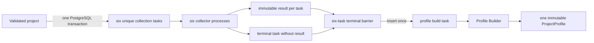

# Token Collection and Project Profile

> 设计状态：已实现
>
> 相关目标需求（讨论中）：[Token 两板块目标设计](../../requirements/token/token.md)

## Scope

Token collection turns every validated project into six one-time evidence
records and then builds exactly one immutable project profile. PostgreSQL is the
durable work queue and consistency boundary. There is no scheduler, recurring
collection, or public mutation operation; the pipeline ends after its profile
task reaches a terminal state.

Project discovery owns atomic project and task creation. Six dedicated
collector processes own external reads. The Profile Builder only consumes
persisted project context and evidence; it never calls an external provider.

## Source Locations

| Concern | Source | Key symbols |
| --- | --- | --- |
| Collection domain | [internal/token/collection/model.go](../../../internal/token/collection/model.go), [internal/token/collection/payload.go](../../../internal/token/collection/payload.go) | `DataType`, `Task`, `Result`, V1 payloads |
| Collector orchestration | [internal/token/collection/application/collector.go](../../../internal/token/collection/application/collector.go) | `Collector.RunOnce`, `TaskRepository`, `TaskProcessor` |
| Six processors | [internal/token/collection/application/processors.go](../../../internal/token/collection/application/processors.go) | `ChainStateProcessor`, `WalletAssetStateProcessor`, `SimulationResultProcessor`, `AveProcessor`, `ContractSourceProcessor`, `WalletNormalTransactionsProcessor` |
| Profile domain | [internal/token/profile/model.go](../../../internal/token/profile/model.go), [internal/token/profile/builder.go](../../../internal/token/profile/builder.go) | `ProjectProfile`, `ProjectProfileV1`, `Build` |
| Profile worker | [internal/token/profile/application/builder.go](../../../internal/token/profile/application/builder.go) | `Builder.RunOnce`, `BuildRepository` |
| PostgreSQL repositories | [internal/token/adapters/postgres/collection_task_store.go](../../../internal/token/adapters/postgres/collection_task_store.go), [internal/token/adapters/postgres/profile_store.go](../../../internal/token/adapters/postgres/profile_store.go) | `CollectionRepository`, `ProfileRepository` |
| Schema and queue SQL | [internal/token/adapters/postgres/migrations/000001_init.sql](../../../internal/token/adapters/postgres/migrations/000001_init.sql), [internal/token/adapters/postgres/queries/project_data_collection_task.sql](../../../internal/token/adapters/postgres/queries/project_data_collection_task.sql), [internal/token/adapters/postgres/queries/project_profile_build_task.sql](../../../internal/token/adapters/postgres/queries/project_profile_build_task.sql) | collection/result/profile tables, claim and fencing queries |
| Process wiring | [cmd/athena-token-collector/commands/athena-token-collector.go](../../../cmd/athena-token-collector/commands/athena-token-collector.go), [cmd/athena-token-profile-builder/commands/athena-token-profile-builder.go](../../../cmd/athena-token-profile-builder/commands/athena-token-profile-builder.go) | `NewCommand` |
| Public reads | [internal/tokenapi/project_data_collection_task_service.go](../../../internal/tokenapi/project_data_collection_task_service.go), [internal/tokenapi/project_detail_service.go](../../../internal/tokenapi/project_detail_service.go) | `GetCollectionTask`, `ListCollectionTasks`, `GetProjectProfile` |

## Architecture

The queue uses `FOR UPDATE SKIP LOCKED` so multiple instances may compete for
work without sharing in-memory coordination. A claim increments
`claim_generation` and sets a lease. Every renewal and terminal write is
fenced by task identity, `running` status, and the captured generation. External
RPC and HTTP calls run outside transactions.

## Runtime Flow

1. The Chain Processor saves a validated project, code hash, canonical wrapped
   native and USDT pairs, creator, and initial recipients. The same transaction
   inserts the fixed six data types with `ON CONFLICT DO NOTHING`, verifies all
   six exist, and only then advances the block checkpoint.
2. Every collector polls once per second and claims at most one task of its own
   data type. A pending eligible task or an expired running lease may be
   claimed; lease recovery does not increment `failure_count`.
3. A claim lasts 90 seconds. The worker renews it every 30 seconds, then renews
   once more immediately before its terminal transition. Renewal failure
   cancels work and prevents the worker from persisting its output. Lease
   comparisons use PostgreSQL's real wall clock so waiting on a project lock
   cannot preserve an already-expired claim through transaction-start time.
4. A processor performs one bounded collection and returns a versioned payload,
   optional actual chain block, and any specialized rows. Payload normalization
   produces a deterministic content hash.
5. A successful commit locks the Project row first, validates the fenced task,
   writes the result and specialized rows idempotently, marks the task
   `succeeded`, and checks the six-task barrier in one transaction. Replaying
   the same generation after that commit succeeds only when its content hash
   matches the immutable result; a different hash is an integrity failure.
6. A real provider error increments `failure_count`. The first two failures
   return to `pending` after the data-type retry interval. The third locks the
   Project row, marks the task `failed`, and applies the same barrier.
7. When exactly six tasks exist and all are `succeeded` or `failed`, the commit
   inserts the project's unique profile build task with conflict ignored.
8. The Profile Builder claims one task with the same 90-second lease and
   30-second heartbeat, loads only persisted inputs, and builds a canonical V1
   profile. Every `time.Time` value in the immutable profile is normalized to
   UTC and truncated to microsecond precision before JSON encoding and hashing.
   The successful assembly time is included as `builtAt`; its JSON value and
   `TIMESTAMPTZ` projection therefore compare exactly after a database round
   trip. All-success evidence yields `complete`; any failed source yields
   `incomplete` with its data types.
9. Profile insertion and build-task completion share one fenced transaction.
   Replaying the completed generation with an equal hash is idempotent success;
   a different hash is an integrity failure. Build failures retry after one and
   two seconds and become terminal on the third failure.

## State / Data

`project_data_collection_task` is unique on `(project_id, data_type)` and uses
`pending`, `running`, `succeeded`, and `failed`. It stores eligibility,
generation, lease, failure, terminal, and audit fields. Partial indexes cover
eligible pending work and expired running work by data type.

`project_data_collection_result` is one-to-one with a task and also unique by
project and type. It stores schema version, JSONB payload, content hash,
optional actual block number, and collection time. Contract source text remains
deduplicated in `contract_code`; wallet transaction details retain one
association per project and wallet while profile summaries deduplicate by
transaction hash.

`project_profile_build_task` is keyed by project and has the same status,
failure, lease, and fencing shape. `project_profile` is also keyed by project;
it stores one canonical JSONB profile plus content hash, completeness and failed
types, and denormalized market, source, and pair projections used by list
queries. Profiles are never updated.

The six payload contracts are:

- `chain_state`: fixed-block Token and pair facts, balances, liquidity, quote,
  `reserveUpdatedAt`, and three factual pair signals.
- `wallet_asset_state`: creator plus up to ten distinct initial EOA recipients,
  with native, wrapped-native, USDT, and `trackedAssetUsdtValue` values.
- `simulation_result`: six fixed-block `...CallSucceeded` signals using the same
  explicit block tag as the ATHENA state read.
- `ave`: chain-and-contract-validated Token market data, provider-owned
  `aveRisk`, and exact canonical-pair matches.
- `contract_code_source`: code hash, `verified` or `unverified`, and shared
  artifact reference; absence of source is successful evidence. A Code Hash
  cache hit reuses the recorded source and original provider-fetch timestamp.
- `wallet_normal_transactions`: all-or-nothing bounded pre-deployment samples
  and aggregate counts, flows, methods, counterparties, and capped wallets;
  zero transactions is successful evidence.

## Configuration

All workers use `ATHENA_TOKEN_POSTGRES_DSN`, auto-migration settings, the fixed
chain registry, and their common health options. Collectors select one type via
`ATHENA_TOKEN_DATA_TYPE` or `--data-type`. Chain collectors use the configured
EVM WebSocket endpoints and ATHENA contract. Ave uses its API key and base URL;
source and normal-transaction collectors use Etherscan Manager.

Retry intervals default to 15 seconds for chain state; one minute for wallet
assets and simulation; five minutes for Ave; and ten minutes for contract
source and normal transactions. Polling is one second. Lease and heartbeat
durations are fixed at 90 and 30 seconds.

## Invariants

- A committed validated project has exactly the six defined collection tasks.
- One project/type has at most one task and one result; one project has at most
  one build task and one profile.
- Expired workers cannot renew, retry, fail, or commit after a later claim; only
  an already-completed generation may replay its identical immutable hash.
- Provider calls never hold database locks or transactions.
- Project-row locking serializes terminal task commits and prevents a missed
  final barrier transition.
- Only real collection failures consume the three-attempt budget.
- Every profile is derived solely from the persisted six-task snapshot.

## Failure Recovery

A worker crash leaves a running task recoverable after lease expiry without
changing its failure count. Database failure before commit leaves no result,
specialized partial data, task transition, or profile enqueue visible. A
persistence error after external collection is retried through lease recovery
and does not consume a provider failure. The contract-source processor treats a
shared Code Hash cache read failure the same way instead of charging it to the
external-source attempt budget.

The normal-transaction processor buffers all related-wallet pages and commits
only after every wallet succeeds. Source-not-verified and no-transaction
responses are valid successful results. A permanently failed collector still
opens the barrier, allowing an incomplete profile. A permanently failed Profile
Builder is exposed as profile state `failed`; there is no public retry endpoint.

## Observability

Each process exposes `/healthz`, `/readyz`, and `/metrics`. Readiness covers
PostgreSQL plus the process job. Queue diagnostics group collection work by data
type and status and expose pending age; profile build status and age are
reported separately. Worker telemetry identifies scope, processed count,
duration, consecutive failures, and last error/success. Collection task APIs
expose attempts, lease timestamps, terminal time, error, and complete evidence.

## Change Checklist

- [ ] Keep the fixed six-type set synchronized across discovery, schema,
      collectors, API, and UI.
- [ ] Recheck claim SQL, generation fencing, lease recovery, and Project lock
      ordering.
- [ ] Recheck result canonicalization, specialized-row atomicity, and immutable
      profile hashing.
- [ ] Recheck complete/incomplete/failed derivation and public status mappings.
- [ ] Recheck process declarations, health scopes, queue metrics, and retry
      intervals.
- [ ] Keep the [design index](../README.md) current.
