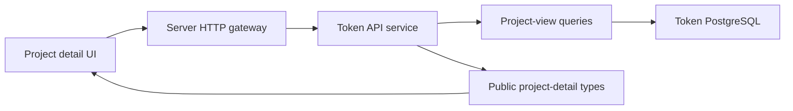

# Token Project Detail Read Model

## Scope

This capability exposes one read-only, project-centered view of Token
Intelligence data and renders it in the ATHENA UI. It owns the aggregate current
snapshot, metric trends, paginated observation history, and paginated
pre-deployment wallet transaction query. It also owns the project detail page's
refresh and lazy-loading behavior.

Project discovery, collection scheduling and execution, observation writes,
report construction, selection decisions, contract-source acquisition, and
transaction ingestion remain owned by their existing subsystems. The detail
read model only composes their committed state.

## Source Locations

| Concern | Source | Key symbols |
| --- | --- | --- |
| Read-model types and query logic | [`internal/token/projectview/model.go`](../../../internal/token/projectview/model.go), [`internal/token/projectview/application/queries.go`](../../../internal/token/projectview/application/queries.go) | `Detail`, `TrendResult`, `Queries`, `buildTrendSeries`, `downsampleLTTB` |
| PostgreSQL composition | [`internal/token/adapters/postgres/project_view_store.go`](../../../internal/token/adapters/postgres/project_view_store.go) | `ProjectViewStore`, `GetProjectDetail`, `ListProjectObservationsPage`, `ListProjectWalletNormalTransactionsPage` |
| SQL queries | [`internal/token/adapters/postgres/queries/project_observation.sql`](../../../internal/token/adapters/postgres/queries/project_observation.sql), [`internal/token/adapters/postgres/queries/project_data_collection_schedule.sql`](../../../internal/token/adapters/postgres/queries/project_data_collection_schedule.sql), [`internal/token/adapters/postgres/queries/project_wallet_normal_transaction.sql`](../../../internal/token/adapters/postgres/queries/project_wallet_normal_transaction.sql) | `ListProjectTrendObservations`, `ListProjectDataCollectionSchedulesByProject`, `ListProjectWalletNormalTransactions`, count queries |
| Token API application boundary | [`internal/tokenapi/project_detail_service.go`](../../../internal/tokenapi/project_detail_service.go), [`internal/tokenapi/helpers.go`](../../../internal/tokenapi/helpers.go) | `GetProjectDetail`, `ListProjectTrends`, `ListProjectObservations`, `ListProjectWalletNormalTransactions`, `mapProjectDetail` |
| Public HTTP and authorization boundary | [`internal/server/tokenapi/catalog.proto`](../../../internal/server/tokenapi/catalog.proto), [`internal/server/tokenapi/tokenapi.go`](../../../internal/server/tokenapi/tokenapi.go), [`internal/server/authz.go`](../../../internal/server/authz.go) | project detail HTTP bindings, proxy methods, `tokenAPIUnaryPermission` |
| Public data contract | [`pkg/apis/application/v1alpha1/tokenapi_types.go`](../../../pkg/apis/application/v1alpha1/tokenapi_types.go) | `TokenProjectDetail`, `TokenProjectTrends`, `TokenProjectObservation`, `TokenWalletNormalTransaction` |
| UI data client | [`ui/src/app/shared/services/token-service.ts`](../../../ui/src/app/shared/services/token-service.ts) | `getProjectDetail`, `listProjectTrends`, `listProjectObservations`, `listProjectWalletNormalTransactions` |
| UI page and chart | [`ui/src/app/pages/project-detail.tsx`](../../../ui/src/app/pages/project-detail.tsx), [`ui/src/app/pages/project-detail-chart.tsx`](../../../ui/src/app/pages/project-detail-chart.tsx) | `ProjectDetailPage`, six tab components, `ProjectTrendChart` |

## Architecture

The server exposes four project-scoped reads:

- `GET /api/v1/tokens/projects/{project_id}` returns the current aggregate.
- `GET /api/v1/tokens/projects/{project_id}/trends` returns typed metric series.
- `GET /api/v1/tokens/projects/{project_id}/observations` returns one filtered
  observation-history page.
- `GET /api/v1/tokens/projects/{project_id}/wallet-normal-transactions` returns
  one filtered transaction page.

All four methods use the Token API `projects` read permission. Report revision,
selection, and collection-task history continue to use their existing endpoints
and permissions. A caller can therefore load the project snapshot even when one
of those adjacent history permissions is unavailable.

`ProjectViewStore` is a read adapter over the existing SQLC query set. It
returns domain models rather than API types. The Token API mapper decodes the
five current observation payloads into typed snapshot sections and preserves
the observation metadata and raw JSON for history consumers.

## Runtime Flow

### Current snapshot

1. The UI enters `/token/projects/:projectID` after navigation from the Projects
   table.
2. The server validates a positive project ID and queries the project. A missing
   row becomes a successful `found: false` response.
3. The read adapter composes the current research state, current report and
   selection, five current observation pointers, related wallets, initial
   recipients, collection schedules, per-wallet transaction counts, and the
   project-wide transaction count.
4. The API mapper exposes the project identity and typed observation content.
   Collection schedules expose `retryIntervalSecs`, their terminal status, and
   `nextRunAt` only while another attempt remains possible. Integer and decimal
   values that may exceed JavaScript precision remain strings.
5. While the document is visible, the UI reloads only this current snapshot
   every 30 seconds. Returning to a visible document triggers an immediate
   snapshot reload.
6. The Market tab matches Ave pairs to the project's canonical wrapped-native
   and USDT pair addresses. It displays one pair detail card at a time, defaults
   to wrapped native, and falls back to USDT when the wrapped-native pair is
   absent. Unavailable pair choices are disabled.

The aggregate consists of independent read queries and is not a
transaction-level database snapshot. Each returned entity is committed state,
but a collection or report transition can become visible between component
queries.

The collection summary renders `failed` as an error state, labels the configured
delay as `Retry interval`, and displays `Next attempt` only for active schedules.

### Trends and history

1. A tab performs its first request only when the tab is opened.
2. Trend range defaults to `24h`; accepted ranges are `1h`, `6h`, `24h`, and
   `7d`.
3. Trend queries read Ave and chain-state observations from the start of the
   range, decode V1 payloads, sort each metric by observation time, and preserve
   the original decimal string in every point.
4. A series with more than 500 points is reduced with Largest-Triangle-Three-
   Buckets. The first and last points are always retained.
5. Observation and wallet-transaction endpoints apply their filters before
   pagination. Transactions are ordered by block number and transaction
   position descending.
6. Report, selection, task, observation, source, trend, and transaction history
   do not participate in the 30-second refresh. Manual Refresh reloads the
   current snapshot and the currently active tab.

## State / Data

This capability adds no durable tables and performs no writes. It reads:

- `project` and `contract_code` for identity and source availability;
- `project_research_state`, `project_report_revision`, and
  `project_selection` for lifecycle state;
- `project_current_observation` and `project_observation` for typed current
  state and historical trend points;
- `project_data_collection_schedule` and
  `project_data_collection_task` for collection status and history;
- `project_related_wallet` and `project_initial_recipient` for wallet roles;
- `project_wallet_normal_transaction` for counts and paginated transaction
  rows.

The API transmits total supply, balances, reserves, liquidity, gas price,
transaction value, market values, and high-precision decimal metrics as
strings. JavaScript converts values to floating point only for compact visual
formatting and SVG coordinates; raw values remain available in tooltips, copied
text, and JSON.

The current Ave observation exposes at most the canonical wrapped-native and
USDT pairs. The UI still matches by contract address instead of relying on array
position, so pair identity remains explicit at the presentation boundary.

## Configuration

There is no runtime configuration specific to this read model.

| Constant | Value | Behavior |
| --- | --- | --- |
| Current snapshot interval | 30 seconds | Reloads while the browser document is visible. |
| Default trend range | 24 hours | Used when the request omits `range`. |
| Accepted trend ranges | `1h`, `6h`, `24h`, `7d` | Other values are rejected before querying. |
| Maximum points per trend series | 500 | Applies LTTB when a series exceeds the limit. |
| Default Ave pair selection | Wrapped native, then USDT | Keeps the current selection while it remains available and otherwise falls back in priority order. |
| Desktop minimum width | 1280 pixels | Matches the existing ATHENA UI shell. |

## Invariants

- Every project-detail read is scoped by one positive project ID.
- The aggregate endpoint does not mutate collection, report, selection, or
  transaction state.
- Missing observation sections remain absent; the UI renders them as
  `Not collected` or `Unknown` and does not convert absence to `false` or zero.
- Collection schedules expose retry timing rather than a periodic refresh
  cadence. Completed, failed, and paused schedules have no next attempt.
- Ave key-pair choices are enabled only when the current observation contains
  the exact project pair contract, and the detail card never displays an
  unrelated Ave pair.
- High-precision values cross the API boundary as strings.
- Observation history excludes wallet normal transactions because those rows
  have their own normalized, filterable endpoint.
- Every returned trend series is chronological, contains no more than 500
  points, and retains its first and last observation.
- Project-level reads require the `projects` read permission. Adjacent history
  endpoints retain their own resource permissions.

## Failure Recovery

The capability is read-only, so retrying cannot create duplicate state. Invalid
IDs, ranges, data types, addresses, and receipt statuses return gRPC validation
errors that the HTTP gateway maps to request failures.

A missing project renders a dedicated Not Found state. Failure of the aggregate
request leaves any previously loaded aggregate visible through the shared
asynchronous state hook. Trend, source, transaction, observation, report,
selection, and task failures render within their own section and do not clear
the current project snapshot or other successful sections.

An invalid stored trend payload fails that trend request instead of emitting a
partially decoded series. A subsequent reload re-runs the read without any
cleanup requirement.

## Observability

The endpoints use the existing server and Token API request logging, gRPC status
mapping, health checks, and PostgreSQL readiness behavior. The current snapshot
and trend responses include generation timestamps. Observation, schedule,
task, report, selection, source, and transaction records expose their own
checked, observed, built, decided, collected, or updated timestamps for
diagnosis.

## Change Checklist

- [ ] The four project-scoped endpoints and `projects` permission mapping remain aligned.
- [ ] Aggregate composition matches the typed public contract and observation V1 schemas.
- [ ] Precision-sensitive values remain strings across the API and UI boundary.
- [ ] Trend ranges, metric extraction, ordering, and 500-point LTTB limit remain current.
- [ ] Current-snapshot polling and tab history loading retain their separate refresh behavior.
- [ ] Missing and partial-failure states remain distinguishable in the UI.
- [ ] Source links and named symbols resolve.
- [ ] The [design index](../README.md) contains the correct entry.
