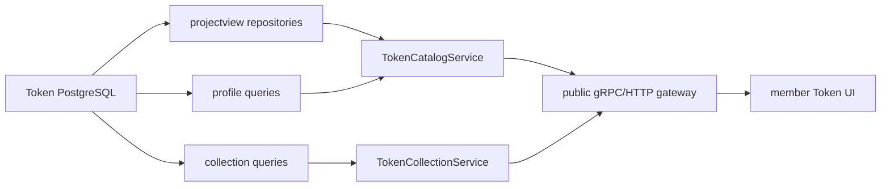

# Token Project Read Model

## Scope

The Token project read model exposes validated projects, their six-source
collection progress, one immutable ProjectProfile, contract source, related
wallets, bounded pre-deployment transactions, and independent Swap activity.
It owns list filtering and projection, project-detail assembly, public Token
API mapping, and the member UI's Token pages. It does not schedule work or call
external market, explorer, or chain providers.

## Source Locations

| Concern | Source | Key symbols |
| --- | --- | --- |
| Read-domain models | [internal/token/projectview/model.go](../../../internal/token/projectview/model.go) | `ProjectListItem`, `ProjectListFilter`, `Detail` |
| Application queries | [internal/token/projectview/application/queries.go](../../../internal/token/projectview/application/queries.go) | `Queries` |
| PostgreSQL projection | [internal/token/adapters/postgres/project_list_view_store.go](../../../internal/token/adapters/postgres/project_list_view_store.go), [internal/token/adapters/postgres/project_view_store.go](../../../internal/token/adapters/postgres/project_view_store.go) | `ListProjectsPage`, `GetProjectDetail` |
| Profile read application | [internal/token/profile/application/queries.go](../../../internal/token/profile/application/queries.go) | `Queries.GetProjectProfile` |
| API handlers and mapping | [internal/tokenapi/project_service.go](../../../internal/tokenapi/project_service.go), [internal/tokenapi/project_detail_service.go](../../../internal/tokenapi/project_detail_service.go), [internal/tokenapi/helpers.go](../../../internal/tokenapi/helpers.go) | `ListProjects`, `GetProjectDetail`, `GetProjectProfile` |
| Collection API | [internal/tokenapi/project_data_collection_task_service.go](../../../internal/tokenapi/project_data_collection_task_service.go) | `GetCollectionTask`, `ListCollectionTasks` |
| Public contracts | [internal/server/tokenapi/catalog.proto](../../../internal/server/tokenapi/catalog.proto), [internal/server/tokenapi/collection.proto](../../../internal/server/tokenapi/collection.proto), [internal/server/tokenapi/types.proto](../../../internal/server/tokenapi/types.proto) | `TokenCatalogService`, `TokenCollectionService` |
| Shared API types | [pkg/apis/application/v1alpha1/tokenapi_types.go](../../../pkg/apis/application/v1alpha1/tokenapi_types.go) | `TokenProjectListItem`, `TokenProjectDetail`, `TokenProjectProfile`, `TokenCollectionTask` |
| Member UI | [ui/src/app/member/pages](../../../ui/src/app/member/pages), [ui/src/app/shared/services/token-service.ts](../../../ui/src/app/shared/services/token-service.ts) | project list/detail and collection-task pages, `tokenService` |

## Architecture

List reads use denormalized profile columns for market and pair summaries, so
they do not decode profile JSON per row. Detail reads assemble canonical
project data, the optional single profile, six task details, related wallets,
initial recipients, per-wallet transaction association counts, and the
distinct transaction-hash total. Full normalized result payloads are returned
by the single collection-task endpoint.

## Runtime Flow

1. `GET /api/v1/tokens/projects` validates paging, contract and code-hash,
   workflow status, detected/clear pair-signal, and integer quote filters
   before issuing one paged list query. Chain ID and project ID are returned
   as project identity but are not list-filter inputs.
2. Every list item exposes discovery identity; collection progress as `x/6`;
   `collectionStatus`; `profileState`; optional profile completeness and build
   time; Ave market projection; and wrapped-native and USDT pair projections.
3. `GET /api/v1/tokens/projects/{project_id}` returns the derived
   `collectionStatus` and `profileState`, the same optional profile as the
   dedicated profile route, all six collection task summaries/results, wallet
   context, and pre-deployment transaction counts.
4. `GET /api/v1/tokens/projects/{project_id}/profile` returns the immutable
   profile or `found=false` while its build is pending or permanently failed.
5. `GET /api/v1/tokens/collection-tasks` returns paged task summaries filtered
   by project, data type, and status. The task-ID route adds the complete
   versioned evidence payload and content hash when collection succeeded.
6. Contract source, wallet transaction, Swap activity, and Swap event routes
   remain separate bounded reads linked from project detail.
7. The project list polls only while at least one visible collection or profile
   build remains pending/running. Project detail uses its detail request alone
   for status display and polling. Terminal pages stop automatically and retain
   manual refresh.

## State / Data

`collection_status` is derived from exactly six task rows:

- `queued`: six are pending and none is running or terminal.
- `collecting`: at least one is pending/running and none has failed terminally.
- `complete`: all six succeeded.
- `needs_attention`: at least one failed, including while another task remains
  nonterminal.

`profile_state` is derived from the immutable profile and its build task:

- `pending`: no profile exists and the build task is absent, pending, or running.
- `complete`: the profile exists with completeness `complete`.
- `incomplete`: the profile exists with completeness `incomplete`.
- `failed`: no profile exists and the build task exhausted three failures.

Pair filters use one shared predicate over the factual V1 wrapped-native and
USDT profile projections. Each of `pairTokenBalanceExceedsTotalSupply`,
`lpMinimumSupplyOnly`, and `fixedFeeAddressLpShareGte90Percent` accepts only
`detected` and `clear` states. Quote filters accept inclusive minimum and
maximum integer USDT values; missing profiles, pairs, signals, or quote values
are not selectable states.

When any pair condition is enabled, one created wrapped-native or USDT pair
must satisfy every enabled signal and quote condition. Conditions cannot be
satisfied by combining values from different pairs. The response continues to
project the wrapped-native and USDT pair summaries independently.

The typed profile response contains completeness, failed sources, market and
`aveRisk`, contract-source status, both pair summaries, wallet totals,
pre-deployment transaction summary, and six evidence references. `profileJson`
contains the full canonical V1 content, including per-wallet roles, allocation,
assets, simulation call-success signals, top methods, and counterparties.

## Configuration

The API uses the shared Token PostgreSQL DSN and Token API gRPC/listen settings.
Paging defaults and limits are enforced by the existing API helpers. The UI
uses the shared authenticated request client and module-aware cache. All read
endpoints are side-effect free.

## Invariants

- Project list/detail/profile/task views use the collection/profile vocabulary
  consistently across domain, transport, and UI layers.
- Project list filtering does not accept chain ID or project ID, while list and
  detail responses retain both identity fields.
- The list's market and pair data are projections of the same immutable profile
  returned by detail and profile routes.
- A filtered project has one created wrapped-native or USDT pair that satisfies
  the complete shared pair predicate.
- Project detail contains at most one profile and at most six logical tasks.
- Collection-task list responses omit no task status fields; a single-task read
  is the authoritative full evidence response.
- The transaction total is distinct by transaction hash even when a transaction
  is associated with multiple related wallets.
- Swap terminal states remain visible but never change collection or profile
  status.

## Failure Recovery

Invalid filters fail before database access. Malformed persisted addresses,
hashes, numeric projections, payloads, or inconsistent optional projection
groups fail the request rather than fabricating a partial view. A missing
project/profile/task returns `found=false`; storage failures are mapped to an
internal API error.

Read endpoints are side-effect free. UI request caches are invalidated by
manual refresh or active-work polling. A failed poll leaves the last successful
view available with an error surface and does not mutate backend state.

## Observability

Token API request tracing and standard gRPC/HTTP status logging cover each
route. Worker health and queue metrics explain why a list item remains queued,
collecting, or pending. The data-source cards expose failure count, lease and
terminal timestamps, last error, schema version, content hash, source block,
and collection time for per-project diagnosis.

## Change Checklist

- [ ] Recheck list-status SQL against the four collection and four profile states.
- [ ] Recheck profile projection columns against canonical profile construction.
- [ ] Recheck every filter across public proto, facade, internal handler,
      repository, UI service, and UI controls, including the single-pair
      requirement for the shared pair predicate.
- [ ] Recheck project detail and standalone profile equality.
- [ ] Recheck list and detail status projection, active-only polling, and manual
      refresh behavior.
- [ ] Keep the [design index](../README.md) current.
