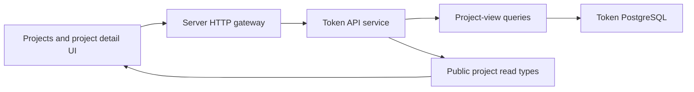

# Token Project Read Model

## Scope

This capability exposes the project-centered Token Intelligence read surface and
renders it in the ATHENA UI. It owns the unified paginated project list, its
current research, Report, Evaluation, and trusted Selection projection, the
aggregate project-detail snapshot, metric trends, paginated histories, and
pre-deployment wallet transaction reads. It also exposes independent WETH and
USDT Swap activity summaries plus paginated events for one sampled block. The
capability owns the Projects page's two presentation views and the project
detail page's polling, manual-refresh, and lazy-loading behavior.

Project discovery, collection scheduling and execution, observation writes,
report construction, selection decisions, contract-source acquisition, and
transaction ingestion remain owned by their existing subsystems. The project
read model only composes their committed state.

## Source Locations

| Concern | Source | Key symbols |
| --- | --- | --- |
| Read-model types and query logic | [`internal/token/projectview/model.go`](../../../internal/token/projectview/model.go), [`internal/token/projectview/application/queries.go`](../../../internal/token/projectview/application/queries.go) | `ProjectListFilter`, `ProjectListItem`, `ProjectReportSummary`, `Detail`, `SwapActivity`, `TrendResult`, `Queries` |
| PostgreSQL composition | [`internal/token/adapters/postgres/project_list_view_store.go`](../../../internal/token/adapters/postgres/project_list_view_store.go), [`internal/token/adapters/postgres/project_view_store.go`](../../../internal/token/adapters/postgres/project_view_store.go), [`internal/token/adapters/postgres/project_swap_view_store.go`](../../../internal/token/adapters/postgres/project_swap_view_store.go) | `ProjectViewRepository`, `ListProjectsPage`, `GetProjectDetail`, `GetProjectSwapActivity`, `ListProjectSwapEventsPage` |
| SQL queries | [`internal/token/adapters/postgres/queries/project_view.sql`](../../../internal/token/adapters/postgres/queries/project_view.sql), [`internal/token/adapters/postgres/queries/project_observation.sql`](../../../internal/token/adapters/postgres/queries/project_observation.sql), [`internal/token/adapters/postgres/queries/project_data_collection_schedule.sql`](../../../internal/token/adapters/postgres/queries/project_data_collection_schedule.sql), [`internal/token/adapters/postgres/queries/project_wallet_normal_transaction.sql`](../../../internal/token/adapters/postgres/queries/project_wallet_normal_transaction.sql), [`internal/token/adapters/postgres/queries/project_swap_view.sql`](../../../internal/token/adapters/postgres/queries/project_swap_view.sql) | unified project page, trend, history, Swap aggregate, and Swap event queries |
| Fixed Swap assets | [`internal/token/chainregistry/registry.go`](../../../internal/token/chainregistry/registry.go) | `AssetMetadata`, `ChainAssets`, `FixedAssets` |
| Token API application boundary | [`internal/tokenapi/project_service.go`](../../../internal/tokenapi/project_service.go), [`internal/tokenapi/project_detail_service.go`](../../../internal/tokenapi/project_detail_service.go), [`internal/tokenapi/helpers.go`](../../../internal/tokenapi/helpers.go) | `ListProjects`, `GetProjectDetail`, `GetProjectSwapActivity`, `ListProjectSwapEvents`, project-view mappers |
| Public HTTP and authorization boundary | [`internal/server/tokenapi/catalog.proto`](../../../internal/server/tokenapi/catalog.proto), [`internal/server/tokenapi/tokenapi.go`](../../../internal/server/tokenapi/tokenapi.go), [`internal/server/authz.go`](../../../internal/server/authz.go) | project HTTP bindings, proxy methods, `rbacGRPCMethods`, and `authorizeGRPC` |
| Public data contract | [`pkg/apis/application/v1alpha1/tokenapi_types.go`](../../../pkg/apis/application/v1alpha1/tokenapi_types.go) | `TokenProjectListItem`, `TokenProjectReportSummary`, `TokenProjectPairRiskSummary`, `TokenProjectDetail`, `TokenReportRevision`, `TokenProjectSwapActivity` |
| UI data client | [`ui/src/app/shared/services/token-service.ts`](../../../ui/src/app/shared/services/token-service.ts) | `listProjects`, `getProjectDetail`, `listReportRevisions`, `getProjectSwapActivity` |
| UI pages and visualizations | [`ui/src/app/pages/projects.tsx`](../../../ui/src/app/pages/projects.tsx), [`ui/src/app/pages/project-detail.tsx`](../../../ui/src/app/pages/project-detail.tsx), [`ui/src/app/pages/project-report-tab.tsx`](../../../ui/src/app/pages/project-report-tab.tsx), [`ui/src/app/pages/project-detail-chart.tsx`](../../../ui/src/app/pages/project-detail-chart.tsx), [`ui/src/app/pages/project-swap-activity.tsx`](../../../ui/src/app/pages/project-swap-activity.tsx) | `ProjectsPage`, `ProjectDetailPage`, `ProjectReportTab`, `ProjectTrendChart`, `ProjectSwapActivityTab` |
| Shared detail values | [`ui/src/app/pages/project-detail-values.tsx`](../../../ui/src/app/pages/project-detail-values.tsx) | `ProjectTimeValue`, `ProjectExplorerValue`, `ProjectExactValue`, `ProjectRawTokenAmount` |

## Architecture

The server exposes one paginated project collection read and six project-scoped
reads:

- `GET /api/v1/tokens/projects` returns one filtered project page with its
  current Report and Evaluation projection.
- `GET /api/v1/tokens/projects/{project_id}` returns the current aggregate.
- `GET /api/v1/tokens/projects/{project_id}/trends` returns typed metric series.
- `GET /api/v1/tokens/projects/{project_id}/observations` returns one filtered
  observation-history page.
- `GET /api/v1/tokens/projects/{project_id}/wallet-normal-transactions` returns
  one filtered transaction page.
- `GET /api/v1/tokens/projects/{project_id}/swap-activity` returns both Pair
  targets and at most 100 sampled blocks for each target.
- `GET /api/v1/tokens/projects/{project_id}/swap-pairs/{pair_kind}/blocks/{block_number}/events`
  returns one sampled block's decoded events in transaction and log order.

All seven methods use the Token API `projects` read permission. Report revision,
selection, and collection-task history continue to use their existing endpoints
and permissions. A caller can therefore load the project snapshot even when one
of those adjacent history permissions is unavailable.

`ProjectViewRepository` is a read adapter over the existing SQLC query set. It
returns domain models rather than API types. Project pagination belongs to this
aggregate instead of `catalog`; `catalog.Project` continues to represent only
the project entity. The Token API mapper decodes the five current observation
payloads into typed snapshot sections and preserves the observation metadata and
raw JSON for history consumers.

## Runtime Flow

### Unified project page

1. The UI requests one page through `ListProjects`. Accepted filters are chain,
   project ID, contract, code hash, research status, Report state, Evaluation
   status, and trusted Selection outcome. Empty strings mean no filter; the API
   rejects values outside the public status sets before querying PostgreSQL.
2. `ProjectViewRepository.ListProjectsPage` opens a read-only, repeatable-read
   transaction. `CountProjectListItems` and `ListProjectListItems` execute with
   identical filters inside that transaction, so `total` and rows describe the
   same committed snapshot.
3. The query starts from `project` and uses one-to-zero-or-one `LEFT JOIN`s to
   `project_research_state`, its `current_report_revision`, the Evaluation task
   for that exact Report revision, and `current_selection_id`. Every project
   remains eligible for the page even when it has no research state or Report.
   The Evaluation join is one-to-one because
   `(project_id, report_revision)` is unique.
4. A Selection outcome is current and trustworthy only when the joined task is
   `succeeded`, `last_evaluated_report_revision` equals the current Report
   revision, and `current_selection_id` resolves to a Selection owned by the
   project. The Selection row's own `report_revision` is intentionally not
   compared: a repeated decision can reuse an older Selection row while the
   research state atomically records that the current Report was evaluated.
   Pending, running, and failed tasks therefore expose no old outcome.
5. `report_state=none`, `evaluation_status=none`, and
   `selection_outcome=none` match missing current state rather than a stored
   literal. All other status filters are exact. Rows are ordered by
   `project.created_at DESC, project.id DESC`.
6. Each WETH/WBNB or USDT Pair risk projection is independently either absent
   or contains all five fields. The outer risk summary is absent only when both
   Pair projections are absent. A partially populated Pair fails the read as a
   storage invariant error instead of mapping database `NULL` to a safe-looking
   boolean or zero. Quote projections must be finite exact integers; `NaN`,
   infinity, or fractional values fail the read. Valid quote values cross the
   API boundary as decimal integer strings.

The Projects page renders the same response as two projections. `Overview` is
the default URL state; `view=report-risk` selects the Report Risk projection.
The Overview table and card omit transaction index and code hash from their
display, while code hash remains an accepted list filter. `view` never reaches
the API and is not part of the request dependency, so switching projections
preserves filters, page, page size, total, and the loaded rows without issuing
the same request again.

Report Risk uses a second presentation-only URL parameter, `riskSection`, to
split the desktop projection into `Status`, `WETH / WBNB`, and `USDT` tables.
Status is canonical when the parameter is absent; the other canonical values
are `wrapped-native` and `usdt`. Invalid values normalize to Status, and
`riskSection` is removed outside
`view=report-risk`. Changing sections preserves filters, page, page size,
total, and rows because `riskSection` is not part of the list request or its
dependency. Clearing filters likewise retains the active Report Risk section
and page size.

The desktop Status section groups research, Report, Evaluation, and trusted
Selection fields into summary columns; its Evaluation error can be expanded
with a keyboard-operable control. Each Pair section presents Report revision
and completeness context followed by Created, Remove Liquidity, Mint, Quote
USDT, and Last Swap. The tables fit the available desktop surface and do not
render the former combined horizontal risk matrix. At viewport widths up to
900 pixels, Overview uses semantic project cards. Report Risk switches to its
semantic cards at 1100 pixels; each card contains the complete Status data and
all five fields for both wrapped-native and USDT Pair snapshots. Both compact
layouts retain the same rows and paginator as their desktop projections.

### Current snapshot

1. The UI enters `/token/projects/:projectID` after navigation from the Projects
   table.
2. The server validates a positive project ID and queries the project. A missing
   row becomes a successful `found: false` response.
3. The read adapter composes the current research state, current Report, the
   Evaluation task for that exact Report revision, `current_selection_id`, five
   current observation pointers, related wallets, initial recipients,
   collection schedules, per-wallet transaction counts, and the project-wide
   transaction count. The same trusted-outcome rules used by the list apply to
   the detail Evaluation summary.
4. The API mapper exposes the project identity and typed observation content.
   Collection schedules expose `retryIntervalSecs`, their terminal status, and
   `nextRunAt` only while another attempt remains possible. Integer and decimal
   values that may exceed JavaScript precision remain strings.
5. While the document is visible, the UI reloads only this current snapshot
   every 30 seconds. Returning to a visible document triggers an immediate
   snapshot reload.
6. The Market tab matches Ave pairs to the project's canonical wrapped-native
   and USDT pair addresses. It displays one pair detail card at a time, defaults
   to wrapped native, and falls back to USDT when the wrapped-native pair is
   absent. Unavailable pair choices are disabled.

The detail tabs are ordered `Overview`, `Report`, `Market & Liquidity`, `Swap
Activity`, `Wallets`, `Transactions`, `Contract`, and `Research`. The Report tab
uses only the current Report's stored risk snapshot; it never substitutes the
newer live `chainState` observation. Wrapped-native labels come from chain
metadata, so BSC presents WBNB while the internal Pair kind remains `weth`.

The aggregate consists of independent read queries and is not a
transaction-level database snapshot. Each returned entity is committed state,
but a collection or report transition can become visible between component
queries.

The collection summary renders `failed` as an error state, labels the configured
delay as `Retry interval`, and displays `Next attempt` only for active schedules.

### Trends and history

1. A tab performs its first request only when the tab is opened.
2. Trend range defaults to `24h`; accepted ranges are `1h`, `6h`, `24h`, and
   `7d`.
3. Trend queries read Ave and chain-state observations from the start of the
   range, decode V1 payloads, sort each metric by observation time, and preserve
   the original decimal string in every point.
4. A series with more than 500 points is reduced with Largest-Triangle-Three-
   Buckets. The first and last points are always retained.
5. Observation and wallet-transaction endpoints apply their filters before
   pagination. Transactions are ordered by block number and transaction
   position descending.
6. Report, selection, task, observation, source, trend, and transaction history
   do not participate in the 30-second snapshot refresh. Report revision history
   moved from Research to the dedicated Report tab; it loads only on the first
   Report-tab entry, pagination, or an explicit Refresh while Report is active.
   A history failure remains local and does not hide the current Report.
7. Manual Refresh always reloads the current detail snapshot and increments only
   the active tab's refresh counter. Counters are retained per tab, so switching
   tabs cannot make a previously active tab observe a counter rollback and issue
   an extra request. Research retains the collection plan, Selection timeline,
   observation history, and collection-task history.

### Swap activity

1. The UI does not request Swap data until the `Swap Activity` tab becomes
   active.
2. `GetProjectSwapActivity` opens a read-only, repeatable-read PostgreSQL
   transaction. Project identity, the two Pair targets, Pair-wide totals, and
   both sampled-block lists therefore come from one committed snapshot even
   while the Swap Processor commits another block.
3. The adapter requires exactly one `weth` and one `usdt` target. It resolves
   the Project token as Base and the chain's fixed wrapped-native or USDT asset
   as Quote, then derives the Base token index by EVM address ordering.
4. PostgreSQL maps token0/token1 amounts to Base/Quote flows, classifies every
   event, and aggregates Pair and block counts without loading all event rows
   into Go. A simple buy has Quote In and Base Out only; a simple sell has Base
   In and Quote Out only. Every other shape is `complex`.
5. Simple events produce Quote-per-Base execution prices. Block OHLC follows
   transaction index, log index, and event ID order. VWAP divides total simple
   Quote flow by total simple Base flow. Numeric arithmetic is retained through
   100 decimal places and never uses binary floating point at the API boundary.
6. The UI renders two Pair cards keyed by Pair kind, two independent
   100-cell activity grids, two sparse timeline panels with a shared Time or
   Block X range, and a client-paginated sampled-block table. It never joins
   WETH/WBNB and USDT values or connects sparse observations.
7. Opening a sampled block requests a server-paginated event page, ordered by
   transaction index, log index, and event ID. Closing the drawer cancels the
   request; event pages do not participate in polling.
8. While the tab and document are visible, at least one Pair is `collecting`,
   and no request is in flight, the activity reloads every 30 seconds.
   Activating the tab or returning to the visible document reloads immediately.
   Both terminal Pair states stop polling. Refresh failures retain the last
   successful activity snapshot.

## State / Data

This capability adds no durable tables and performs no writes. It reads:

- `project` and `contract_code` for identity and source availability;
- `project_research_state`, `project_report_revision`,
  `project_selection_evaluation_task`, and `project_selection` for current
  Report, Evaluation, and trusted outcome state;
- `project_current_observation` and `project_observation` for typed current
  state and historical trend points;
- `project_data_collection_schedule` and
  `project_data_collection_task` for collection status and history;
- `project_related_wallet` and `project_initial_recipient` for wallet roles;
- `project_wallet_normal_transaction` for counts and paginated transaction
  rows.
- `project_swap_pair`, `project_swap_block`, and `project_swap_event` for
  independent Pair lifecycle, sampled blocks, and decoded event detail.

The API transmits total supply, balances, reserves, liquidity, gas price,
transaction value, market values, and high-precision decimal metrics as
strings. JavaScript converts values to floating point only for compact visual
formatting and SVG coordinates; raw values remain available in tooltips, copied
text, and JSON.

The list and revision contracts share `TokenProjectReportRiskSummary`. Its Pair
objects are optional so missing Report-time chain state remains unknown.
Whenever a Pair object exists, Created, Remove Liquidity, Mint, Quote USDT, and
Last Swap are all present. `TokenProjectReportEvaluationSummary` separates task
status, failed attempts, last error, and update time from the optional trusted
outcome and its evaluation time.

The current Ave observation exposes at most the canonical wrapped-native and
USDT pairs. The UI still matches by contract address instead of relying on array
position, so pair identity remains explicit at the presentation boundary.

Swap Base and Quote amounts, block numbers, block and time gaps, transaction and
log positions, and execution prices are decimal strings in the public
contract. Counts bounded by the 100-block view remain numeric. The UI uses
`BigInt` and string slicing for exact quantity display; conversion to
JavaScript `Number` is restricted to SVG coordinates. Tooltips, tables, and
event detail retain the exact source string.

The fixed assets are Ethereum WETH with 18 decimals and USDT with 6 decimals,
and BSC WBNB and USDT with 18 decimals each. Their addresses match the ATHENA
contract's Pair derivation inputs. These values provide units and token
ordering; the read model does not request token metadata from an EVM node.

## Configuration

There is no runtime configuration specific to this read model.

| Constant | Value | Behavior |
| --- | --- | --- |
| Current snapshot interval | 30 seconds | Reloads while the browser document is visible. |
| Swap activity interval | 30 seconds | Reloads only while its tab and document are visible and either Pair is collecting. |
| Swap activity block target | 100 per Pair | WETH and USDT targets remain independent, including when their addresses match. |
| Swap event page size | 50 in the UI, maximum 200 in the API | Event detail is loaded only for the opened block. |
| Execution-price decimal places | 100 | PostgreSQL and event-detail mapping use decimal round-half-up and trim trailing zeroes. |
| Default trend range | 24 hours | Used when the request omits `range`. |
| Accepted trend ranges | `1h`, `6h`, `24h`, `7d` | Other values are rejected before querying. |
| Maximum points per trend series | 500 | Applies LTTB when a series exceeds the limit. |
| Default Ave pair selection | Wrapped native, then USDT | Keeps the current selection while it remains available and otherwise falls back in priority order. |
| Overview compact layout breakpoint | 900 pixels | Overview becomes a semantic project card that omits transaction index and code hash; project-detail revision history also becomes cards and the shell uses overlay navigation. |
| Report Risk compact layout breakpoint | 1100 pixels | The root layout may shrink below its desktop minimum and section controls and tables are replaced by cards containing complete Status, wrapped-native, and USDT data; overlay navigation still begins at 900 pixels. |

## Invariants

- Project pagination starts from `project`; missing research, Report, Evaluation,
  or Selection rows never remove an otherwise matching project.
- Project page count and rows use identical filters in one read-only,
  repeatable-read transaction and use the same deterministic ordering.
- A current outcome requires the exact current Report task to be succeeded, the
  research state's last evaluated revision to match, and `current_selection_id`
  to resolve. A Selection row's original Report revision is not a freshness
  signal.
- Report-time Pair risk is absent or complete. Unknown storage values are never
  serialized as `false`, zero, `Clear`, or `Not created`.
- Every project-detail read is scoped by one positive project ID.
- The aggregate endpoint does not mutate collection, report, selection, or
  transaction state.
- Missing observation sections remain absent; the UI renders them as
  `Not collected` or `Unknown` and does not convert absence to `false` or zero.
- Collection schedules expose retry timing rather than a periodic refresh
  cadence. Completed, failed, and paused schedules have no next attempt.
- Ave key-pair choices are enabled only when the current observation contains
  the exact project pair contract, and the detail card never displays an
  unrelated Ave pair.
- High-precision values cross the API boundary as strings.
- Observation history excludes wallet normal transactions because those rows
  have their own normalized, filterable endpoint.
- Every returned trend series is chronological, contains no more than 500
  points, and retains its first and last observation.
- Project-level reads require the `projects` read permission. Adjacent history
  endpoints retain their own resource permissions.
- Report revision history is lazy and independent from the 30-second current
  snapshot poll. Refresh counters are monotonic per tab.
- Swap activity contains exactly two independently identified targets ordered
  `weth`, then `usdt`; Pair address is never a UI or aggregation identity.
- A Pair's block count equals its returned block rows, sample indexes are
  continuous from one, and every sampled block contains at least one event.
- A completed Pair contains exactly 100 blocks. An expired Pair contains fewer
  than 100 and retains all collected observations.
- Buy, sell, and complex counts partition the event count. Complex events never
  contribute to simple-trade Quote volume or execution price.
- Pair-wide transaction origins use a global distinct `tx_from` count; they are
  not calculated by summing block-level distinct counts.
- Swap metrics describe Pair-accounting flows and execution prices. They are
  not user receipts, reserve spot prices, historical USD values, slippage, or
  price impact.

## Failure Recovery

The capability is read-only, so retrying cannot create duplicate state. Invalid
IDs, ranges, data types, addresses, and receipt statuses return gRPC validation
errors that the HTTP gateway maps to request failures.

Invalid project-list status filters return `InvalidArgument` before a database
read. A malformed stored Pair risk projection fails the page or revision request
instead of presenting a partial matrix. The repeatable-read page transaction is
rolled back on count, list, mapping, or context failure and is safe to retry.

A missing project renders a dedicated Not Found state. Failure of the aggregate
request leaves any previously loaded aggregate visible through the shared
asynchronous state hook. Trend, source, transaction, observation, Report
history, Selection, and task failures render within their own section and do not
clear the current project snapshot or other successful sections. No Report, no
risk snapshot, empty history, and failed history remain separate UI states.

An invalid stored trend payload fails that trend request instead of emitting a
partially decoded series. A subsequent reload re-runs the read without any
cleanup requirement.

A missing project returns `found: false` for Swap activity. A missing Project,
Pair kind, or sampled block returns an empty event page. Stored Swap invariant
violations fail the activity request as an internal error instead of exposing a
partial or misleading visualization. Activity retries are read-only and keep
the previous successful snapshot visible.

## Observability

The endpoints use the existing server and Token API request logging, gRPC status
mapping, health checks, and PostgreSQL readiness behavior. The current snapshot
and the activity and trend responses include generation timestamps. Project
Report and Evaluation summaries expose independent built, task-updated, and
trusted-evaluated timestamps. Observation, schedule, task, Selection, source,
and transaction records expose their own checked, observed, decided, collected,
or updated timestamps for diagnosis.

## Change Checklist

- [ ] The unified project page and six project-scoped endpoints remain aligned with the `projects` permission.
- [ ] Project list joins remain one-to-one `LEFT JOIN`s, filters apply before pagination, and count/list share a repeatable-read transaction.
- [ ] Current Evaluation and outcome trust use the current Report revision and `current_selection_id`, never `selection.report_revision`.
- [ ] Projects Overview and Report Risk remain two projections of one request; `view` and `riskSection` preserve canonical URL state without becoming request dependencies.
- [ ] Overview omits transaction index and code hash from tables and cards while code hash remains filterable.
- [ ] Desktop Report Risk sections avoid a combined horizontal matrix, and compact Report Risk cards retain complete Status and both Pair projections.
- [ ] Report risk absence remains distinguishable from safe boolean values in lists, detail, and revision history.
- [ ] Aggregate composition matches the typed public contract and observation V1 schemas.
- [ ] Precision-sensitive values remain strings across the API and UI boundary.
- [ ] Trend ranges, metric extraction, ordering, and 500-point LTTB limit remain current.
- [ ] Current-snapshot polling, per-tab manual refresh, and lazy Report history retain their separate behavior.
- [ ] Missing and partial-failure states remain distinguishable in the UI.
- [ ] WETH/USDT Pair identity, exact integer strings, strict Swap semantics,
      sparse charts, terminal polling, and lazy event pagination remain aligned.
- [ ] Source links and named symbols resolve.
- [ ] The [design index](../README.md) contains the correct entry.
