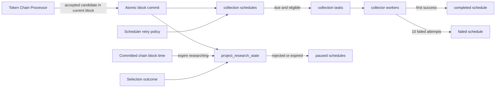

# Token Research Lifecycle

## Scope

The Token Research Lifecycle begins when the Token Chain Processor accepts a project candidate while synchronously processing its deployment block. It owns creation and expiration of the project's research state, initialization and maintenance of one-shot data-collection schedules, and creation of collection tasks while a project remains eligible for research.

Block discovery and candidate inspection inside the Chain Processor, collector-specific payload construction, report generation, and selection policy are adjacent stages. This document records how selection outcomes affect collection eligibility, but it does not define how those outcomes are decided. Ave uses the same lifecycle and schedule machinery as the other collectors; its request and pair-retention behavior is documented in [Ave Market Data Collection](ave-market-data.md).

## Source Locations

| Concern | Source | Key symbols |
| --- | --- | --- |
| Local process declaration | [Procfile](../../../Procfile) | `token-scheduler` process |
| Attention-window configuration | [cmd/athena-token-chain-processor/commands/athena-token-chain-processor.go](../../../cmd/athena-token-chain-processor/commands/athena-token-chain-processor.go) | `NewCommand` |
| Scheduler composition and retry configuration | [cmd/athena-token-scheduler/commands/athena-token-scheduler.go](../../../cmd/athena-token-scheduler/commands/athena-token-scheduler.go) | `NewCommand` |
| Chain Processor initialization flow | [internal/token/discovery/application/chain_processor.go](../../../internal/token/discovery/application/chain_processor.go) | `ChainProcessor.RunOnce`, `defaultResearchSchedules` |
| Atomic block and project initialization | [internal/token/adapters/postgres/chain_processing_store.go](../../../internal/token/adapters/postgres/chain_processing_store.go) | `ChainRepository.CommitProcessedBlock` |
| Scheduler application flow | [internal/token/research/application/scheduler.go](../../../internal/token/research/application/scheduler.go) | `NewScheduler`, `Initialize`, `RunOnce` |
| Lifecycle and schedule persistence | [internal/token/adapters/postgres/collection_schedule_store.go](../../../internal/token/adapters/postgres/collection_schedule_store.go) | `ApplyResearchPolicy`, `MaintainResearchSchedules`, `CreateCollectionTaskIfDue` |
| Research-state queries | [internal/token/adapters/postgres/queries/project_research_state.sql](../../../internal/token/adapters/postgres/queries/project_research_state.sql) | `CreateProjectResearchState`, `ExpireProjectResearchStatesForBlock`, `UpdateProjectResearchSelection` |
| Schedule queries | [internal/token/adapters/postgres/queries/project_data_collection_schedule.sql](../../../internal/token/adapters/postgres/queries/project_data_collection_schedule.sql) | `ListDueProjectDataCollectionSchedules`, `PauseTerminalProjectDataCollectionSchedules` |
| Task claim eligibility | [internal/token/adapters/postgres/queries/project_data_collection_task.sql](../../../internal/token/adapters/postgres/queries/project_data_collection_task.sql) | `ClaimProjectDataCollectionTasks` |
| Schema and defaults | [internal/token/adapters/postgres/migrations/000001_init.sql](../../../internal/token/adapters/postgres/migrations/000001_init.sql) | `project_research_state`, `project_data_collection_schedule`, `project_data_collection_task` |
| Domain state | [internal/token/research/model.go](../../../internal/token/research/model.go) | `ProjectResearchStatus`, `DataCollectionType`, `DataCollectionScheduleStatus`, `TaskStatus` |
| Periodic execution | [internal/token/workerhost/periodic.go](../../../internal/token/workerhost/periodic.go) | `PeriodicWorker`, `runJob` |
| Health and metrics | [internal/token/telemetry/server.go](../../../internal/token/telemetry/server.go), [internal/token/telemetry/tracker.go](../../../internal/token/telemetry/tracker.go) | `Server`, `Tracker` |

## Architecture

The Token Chain Processor decides whether each candidate from the current block is a valid project. PostgreSQL commits all final candidate outcomes, accepted projects, their research state, schedules, related wallets, initial recipients, chain-time research expirations, and the processing checkpoint in one block transaction. The Scheduler owns retry policy, terminal-schedule maintenance, and task production. Collector workers claim tasks only for projects whose research state remains eligible.

Selection updates the shared research state. The lifecycle does not depend on any collector's payload format or vendor-specific request policy.

## Runtime Flow

1. The Token Chain Processor fetches each complete block, retaining its number and timestamp even when it contains no project candidates. It inspects every candidate before opening the final database transaction. A rejected inspection produces only a final `rejected` candidate and no research state or schedules.
2. The block commit atomically inserts accepted projects, stores final candidate outcomes, initializes research state and schedules, expires due research states for the same chain, and then advances the chain processing checkpoint.
3. A new research state stores `attention_expiry_block_time = project.block_time + TTL`. The immutable deployment block is the attention-window start. The deadline is fixed when the project is created and is preserved when the same deployment block is replayed.
4. Every project receives one active schedule for `chain_state`, `wallet_asset_state`, `simulation_result`, `ave`, `contract_code_source`, and `wallet_normal_transactions`. Every initial `next_run_at` is the Chain Processor's current UTC time, so the first task is due immediately.
5. At Scheduler startup, `Initialize` applies the configured per-data-type retry intervals to active schedules. It never changes an existing project's attention deadline.
6. Every committed chain block changes same-chain `researching` states whose deadline is less than or equal to the block timestamp to `expired`, recording the first processed expiry block number and timestamp. The Scheduler job runs once per second and pauses active schedules belonging to `expired` or `rejected` projects before listing new work.
7. The Scheduler lists due active schedules only for `researching` or `selected` projects. For each due schedule, a PostgreSQL transaction locks the schedule, rechecks its revision and due time, creates one task, advances `next_run_at` to the nominal retry time, and commits both changes together.
8. Collector workers claim pending tasks only while both the research state and collection schedule remain eligible. The research state must be `researching` or `selected`, and the schedule must be `active`.
9. A complete collection attempt includes the external read, normalization, and atomic PostgreSQL commit. The first successful attempt marks the task `succeeded`, commits its data, and changes the schedule to `completed` in the same transaction. An unchanged observation still completes its schedule without creating a new observation or report build.
10. An attempt failure returns the same task to `pending` with `available_at = failed_at + retry_interval`. Attempts one through nine keep the schedule active and update its failure count, last error, and `next_run_at`. Failure ten marks both task and schedule `failed`, clears `next_run_at`, and prevents further claims or task creation.
11. Empty results are successful when the provider request itself succeeded. This includes an empty contract source and an empty related-wallet transaction set. Contract-source absence creates no observation, so a report can remain incomplete after every schedule reaches a terminal state.
12. A `selected` outcome moves a `researching` project to `selected`. Expiration applies only to `researching`. A `rejected` outcome can stop either a researching or selected project; the next maintenance run pauses its still-active schedules.
13. On `SIGINT` or `SIGTERM`, the shared worker host cancels the periodic job, stops the health server, and closes PostgreSQL after the job exits.

## State / Data

`project_research_state` has one row per project. Its lifecycle statuses are:

- `researching`: eligible for scheduled collection and subject to its chain-time attention deadline.
- `selected`: eligible for continued collection and not subject to TTL expiration.
- `rejected`: terminal and ineligible for collection.
- `expired`: terminal result of committing the first processed chain block at or after the attention deadline while still researching.

`project.block_number` and `project.block_time` are the immutable attention start. `attention_expiry_block_time` stores the fixed Unix-second deadline. `expired_block_number` and `expired_block_time` are present only for `expired` and identify the block that committed the transition. `created_at` and `updated_at` remain operational database timestamps and never control attention eligibility. Report, evidence, and selection revision fields coordinate downstream analysis but do not change schedule timing by themselves.

`project_data_collection_schedule` is unique by project and data type. Its status is `active`, `completed`, `failed`, or `paused`; it stores the retry interval, next attempt time, latest task revision, and recent collection outcome. `completed`, `failed`, and `paused` schedules have no `next_run_at`.

Task creation and schedule advancement share a transaction. Failure retries reuse the same task row. The task's `attempts` field counts failed calls and is bounded at ten. The due query excludes a schedule while its current revision is pending or running, preventing overlapping work for the same project and data type.

## Configuration

| Setting | Behavior |
| --- | --- |
| `ATHENA_TOKEN_RESEARCH_TTL` / `--research-ttl` | Chain Processor setting used to add whole seconds to a new project's deployment block timestamp. The default is 24 hours; environment parsing accepts 1 hour through 30 days. Changes affect only projects created afterward. |
| `ATHENA_TOKEN_CHAIN_STATE_RETRY_INTERVAL` / `--chain-state-retry-interval` | Delay after a failed chain-state attempt. Default 15 seconds. |
| `ATHENA_TOKEN_WALLET_ASSET_RETRY_INTERVAL` / `--wallet-asset-retry-interval` | Delay after a failed wallet-asset attempt. Default 1 minute. |
| `ATHENA_TOKEN_SIMULATION_RETRY_INTERVAL` / `--simulation-retry-interval` | Delay after a failed simulation-result attempt. Default 1 minute. |
| `ATHENA_TOKEN_AVE_RETRY_INTERVAL` / `--ave-retry-interval` | Delay after a failed Ave attempt. Default 5 minutes. |
| `ATHENA_TOKEN_CONTRACT_SOURCE_RETRY_INTERVAL` / `--contract-source-retry-interval` | Delay after a failed contract-source attempt. Default 10 minutes. |
| `ATHENA_TOKEN_WALLET_NORMAL_TRANSACTIONS_RETRY_INTERVAL` / `--wallet-normal-transactions-retry-interval` | Delay after a failed related-wallet normal-transaction attempt. Default 10 minutes. |
| `ATHENA_TOKEN_HEALTH_LISTEN_ADDRESS` / `--health-listen-address` | Shared telemetry listener. The Scheduler default is `127.0.0.1:8112`. |

The Chain Processor application fallback is 24 hours when it is built without a positive TTL. It rejects non-whole-second durations before processing blocks, and project initialization rejects block-time addition or signed-database conversion overflow. The schema requires an explicit chain-time deadline; recreating an existing development database is the supported way to apply the current initial schema.

## Invariants

- The research window begins at the token deployment block timestamp and defaults to 24 hours of chain time.
- The deadline is immutable after project creation. Process restart or a later TTL configuration change does not recompute it.
- Only `researching` can expire. `selected` remains eligible until each schedule succeeds, exhausts its attempts, or a later rejection stops the remaining active work.
- Attention expiration is driven only by successfully committed Chain Processor blocks. Wall-clock passage and Scheduler execution cannot expire a project.
- `rejected` and `expired` projects cannot produce or claim new collection work; their active schedules are paused by lifecycle maintenance.
- Final candidate persistence, project creation, research-state creation, schedule creation, related-wallet persistence, initial-recipient persistence, and the deployment-block checkpoint are committed atomically.
- Schedule locking and expected-revision checks prevent duplicate task revisions during concurrent scheduling.
- Every collector completes its schedule after the first successful end-to-end attempt, including successful empty results.
- Attempts one through nine reuse the same pending task after the configured retry delay. Attempt ten is terminal and leaves both the task and schedule failed.
- A completed, failed, or paused schedule cannot produce or claim collection work.

## Failure Recovery

Failure anywhere in the Chain Processor's block commit rolls back every candidate, project initialization, research expiration, and checkpoint change from that block. The unchanged processing checkpoint causes the complete block to be discovered and inspected again.

Scheduler initialization failure prevents the worker from becoming operational. During steady state, lifecycle maintenance, due-listing, or task-creation failure fails the current one-second loop and is retried by the periodic worker. Task creation and schedule advancement roll back together, so the next loop sees the previous due state rather than a partially advanced schedule.

If the Chain Processor is stopped or behind the network head, wall-clock time does not expire research. After recovery it processes blocks in order, and the first committed block at or after the stored deadline performs the transition. Collector claim queries independently enforce research eligibility, which prevents an expired project from claiming queued tasks even before the Scheduler pauses its schedules.

Provider, normalization, or persistence failures all count as failed collection attempts. Moving a task back to pending and updating its schedule failure state share one transaction. The tenth failure similarly commits the failed task and failed schedule together. A process loss while a task is running does not consume an attempt; the expired lease makes the same task claimable again.

## Observability

The Scheduler uses the shared telemetry server:

- `GET /healthz` reports whether the worker host is live.
- `GET /readyz` includes PostgreSQL readiness and the `research_scheduler` periodic-job scope.
- `GET /metrics` exposes loop successes, failures, processed task counts, last-success and last-error times, consecutive failures, and shared queue diagnostics.

Failed lifecycle or scheduling loops emit `token periodic job failed` with the job name and error. Successful loops that create tasks emit the shared periodic-worker debug log with `job` and `processed`. Schedule rows expose the terminal status, retry interval, next attempt, consecutive failed attempts, last successful check, and latest error for collector-level diagnosis.

Chain Processor block-completion logs include the committed `block_time` and `expired_research_state_count`, making each chain-time lifecycle transition attributable to its processing block.

## Change Checklist

- [ ] Recheck Chain Processor project initialization and the complete block transaction boundary.
- [ ] Recheck TTL anchoring, status transitions, and selection effects.
- [ ] Recheck schedule defaults, due eligibility, task revisions, and claim eligibility.
- [ ] Recheck chain-time expiration, terminal-state pause behavior, and recovery after Chain Processor downtime.
- [ ] Recheck flags, environment defaults, health/readiness, logs, and metrics.
- [ ] Update the [design index](../README.md) if this capability is moved or split.
