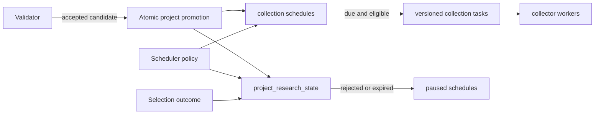

# Token Research Lifecycle

## Scope

The Token Research Lifecycle begins when the Validator accepts a project candidate. It owns creation and expiration of the project's research state, initialization and maintenance of data-collection schedules, and creation of versioned collection tasks while a project remains eligible for research.

Scanner discovery, candidate inspection, collector-specific payload construction, report generation, and selection policy are adjacent stages. This document records how selection outcomes affect collection eligibility, but it does not define how those outcomes are decided. Ave uses the same lifecycle and schedule machinery as the other collectors; Ave-specific request behavior is outside this scope.

## Source Locations

| Concern | Source | Key symbols |
| --- | --- | --- |
| Local process declaration | [Procfile](../../../Procfile) | `token-scheduler` process |
| Scheduler composition and configuration | [cmd/athena-token-scheduler/commands/athena-token-scheduler.go](../../../cmd/athena-token-scheduler/commands/athena-token-scheduler.go) | `NewCommand` |
| Validator promotion flow | [internal/token/discovery/application/validator.go](../../../internal/token/discovery/application/validator.go) | `Validator.RunOnce`, `defaultResearchSchedules` |
| Atomic project initialization | [internal/token/adapters/postgres/project_validator_store.go](../../../internal/token/adapters/postgres/project_validator_store.go) | `PromoteCandidateAndInitializeResearch` |
| Scheduler application flow | [internal/token/research/application/scheduler.go](../../../internal/token/research/application/scheduler.go) | `NewScheduler`, `Initialize`, `RunOnce` |
| Lifecycle and schedule persistence | [internal/token/adapters/postgres/collection_schedule_store.go](../../../internal/token/adapters/postgres/collection_schedule_store.go) | `ApplyResearchPolicy`, `MaintainResearchLifecycle`, `CreateCollectionTaskIfDue` |
| Research-state queries | [internal/token/adapters/postgres/queries/project_research_state.sql](../../../internal/token/adapters/postgres/queries/project_research_state.sql) | `CreateProjectResearchState`, `ApplyProjectResearchTTL`, `ExpireProjectResearchStates`, `UpdateProjectResearchSelection` |
| Schedule queries | [internal/token/adapters/postgres/queries/project_data_collection_schedule.sql](../../../internal/token/adapters/postgres/queries/project_data_collection_schedule.sql) | `ListDueProjectDataCollectionSchedules`, `PauseTerminalProjectDataCollectionSchedules` |
| Task claim eligibility | [internal/token/adapters/postgres/queries/project_data_collection_task.sql](../../../internal/token/adapters/postgres/queries/project_data_collection_task.sql) | `ClaimProjectDataCollectionTasks` |
| Schema and defaults | [internal/token/adapters/postgres/migrations/000001_init.sql](../../../internal/token/adapters/postgres/migrations/000001_init.sql) | `project_research_state`, `project_data_collection_schedule`, `project_data_collection_task` |
| Domain state | [internal/token/research/model.go](../../../internal/token/research/model.go) | `ProjectResearchStatus`, `DataCollectionType`, `DataCollectionScheduleStatus`, `TaskStatus` |
| Periodic execution | [internal/token/workerhost/periodic.go](../../../internal/token/workerhost/periodic.go) | `PeriodicWorker`, `runJob` |
| Health and metrics | [internal/token/telemetry/server.go](../../../internal/token/telemetry/server.go), [internal/token/telemetry/tracker.go](../../../internal/token/telemetry/tracker.go) | `Server`, `Tracker` |

## Architecture

The Validator decides whether an inspected candidate is a valid project. PostgreSQL promotes an accepted candidate and initializes its research state, schedules, related wallets, and initial recipients in one transaction. The Scheduler owns time-based lifecycle maintenance and task production. Collector workers claim tasks only for projects whose research state remains eligible.

Selection updates the shared research state. The lifecycle does not depend on any collector's payload format or vendor-specific request policy.

## Runtime Flow

1. The Validator claims and inspects pending project candidates. A rejected inspection marks only the candidate rejected and does not create research state or schedules.
2. For an accepted inspection, `PromoteCandidateAndInitializeResearch` atomically upserts the project, marks the candidate validated, inserts a `researching` state, creates the configured active schedules, and stores the related wallets and initial recipients.
3. The research state's `created_at` is the start of its research window. Its schema default sets `expires_at` to one day after insertion. The project's deployment or discovery time does not define the TTL.
4. Every project receives `chain_state` every 15 seconds, `wallet_asset_state` every minute, `simulation_result` every minute, `ave` every 5 minutes, `contract_code_source` every 10 minutes, and the one-time `wallet_normal_transactions` schedule with a 10-minute retry interval. Every initial `next_run_at` is the Validator's current UTC time.
5. At Scheduler startup, `Initialize` applies the configured intervals to active schedules and recomputes `expires_at = created_at + TTL` for every state that is still `researching`. This makes the Scheduler's configured policy authoritative for active research.
6. The Scheduler job runs once per second. Each run first changes overdue `researching` states to `expired`, then changes active schedules belonging to `expired` or `rejected` projects to `paused`.
7. The Scheduler lists due active schedules only for `researching` or `selected` projects. For each due schedule, a PostgreSQL transaction locks the schedule, rechecks its revision and due time, creates the next task revision, advances `next_run_at`, and commits both changes together.
8. Collector workers claim pending tasks only while the project's research state is `researching` or `selected`. Tasks left pending after a project becomes `expired` or `rejected` are therefore no longer claimable.
9. A `selected` outcome moves a `researching` project to `selected`. Expiration applies only to `researching`, so selected projects continue collection without a TTL cutoff. A `rejected` outcome can stop either a researching or selected project; the next maintenance run pauses its active schedules.
10. A collector can mark a schedule `completed` when its data no longer needs periodic collection. Contract source completes after source is recorded. Wallet normal transactions complete after every distinct related-wallet request succeeds and the complete result set is committed, including when every result is empty. Lifecycle maintenance only pauses schedules that are still active.
11. On `SIGINT` or `SIGTERM`, the shared worker host cancels the periodic job, stops the health server, and closes PostgreSQL after the job exits.

## State / Data

`project_research_state` has one row per project. Its lifecycle statuses are:

- `researching`: eligible for scheduled collection and subject to `expires_at`.
- `selected`: eligible for continued collection and not subject to TTL expiration.
- `rejected`: terminal and ineligible for collection.
- `expired`: terminal result of reaching `expires_at` while still researching.

`created_at` anchors the TTL. `expires_at` stores its evaluated deadline. Report, evidence, and selection revision fields coordinate downstream analysis but do not change schedule timing by themselves.

`project_data_collection_schedule` is unique by project and data type. Its status is `active`, `completed`, or `paused`; it stores the refresh interval, next due time, latest task revision, and recent collection outcome. The revision connects each schedule to an ordered stream of `project_data_collection_task` rows.

Task creation and schedule advancement share a transaction. The due query excludes a schedule while its current revision is pending or running, preventing overlapping work for the same project and data type.

## Configuration

| Setting | Behavior |
| --- | --- |
| `ATHENA_TOKEN_RESEARCH_TTL` / `--research-ttl` | Research duration measured from `project_research_state.created_at`. The default is 24 hours; environment parsing accepts 1 hour through 30 days. |
| `ATHENA_TOKEN_CHAIN_STATE_INTERVAL` / `--chain-state-interval` | Chain-state collection interval. Default 15 seconds. |
| `ATHENA_TOKEN_WALLET_ASSET_INTERVAL` / `--wallet-asset-interval` | Wallet-asset collection interval. Default 1 minute. |
| `ATHENA_TOKEN_SIMULATION_INTERVAL` / `--simulation-interval` | Simulation-result collection interval. Default 1 minute. |
| `ATHENA_TOKEN_AVE_INTERVAL` / `--ave-interval` | Ave collection interval. Default 5 minutes. |
| `ATHENA_TOKEN_CONTRACT_SOURCE_INTERVAL` / `--contract-source-interval` | Contract-source collection interval. Default 10 minutes. |
| `ATHENA_TOKEN_WALLET_NORMAL_TRANSACTIONS_INTERVAL` / `--wallet-normal-transactions-interval` | Retry interval for the one-time related-wallet normal-transaction collection. Default 10 minutes. |
| `ATHENA_TOKEN_HEALTH_LISTEN_ADDRESS` / `--health-listen-address` | Shared telemetry listener. The Scheduler default is `127.0.0.1:8112`. |

The application-layer fallback TTL is also 24 hours when a Scheduler is built without a positive TTL. The initial schema assigns the same one-day default to direct research-state inserts. A newly created development database receives this schema default; recreating an existing development database is the supported way to apply the current initial schema.

## Invariants

- The research window begins at research-state creation, not at token deployment, discovery, or validation inspection start.
- The default research window is 24 hours, and Scheduler initialization always derives the deadline from `created_at` for states still researching.
- Only `researching` can expire. `selected` continues collection until a later rejection or another explicit schedule completion.
- `rejected` and `expired` projects cannot produce or claim new collection work; their active schedules are paused by lifecycle maintenance.
- Project promotion, research-state creation, schedule creation, related-wallet persistence, and initial-recipient persistence commit atomically.
- Schedule locking and expected-revision checks prevent duplicate task revisions during concurrent scheduling.
- Contract source and wallet normal transactions complete their schedules after their one-time success and do not produce later task revisions.
- Every collector, including Ave, follows the same research eligibility rules; collector-specific frequencies remain independently configured.

## Failure Recovery

Failure anywhere in accepted-candidate promotion rolls back the entire transaction, so a candidate cannot become validated without its project research state and schedules. A later Validator loop can retry from durable candidate state.

Scheduler initialization failure prevents the worker from becoming operational. During steady state, lifecycle maintenance, due-listing, or task-creation failure fails the current one-second loop and is retried by the periodic worker. Task creation and schedule advancement roll back together, so the next loop sees the previous due state rather than a partially advanced schedule.

If a project crosses its deadline while the Scheduler is unavailable, the first successful maintenance run after recovery expires it before listing due schedules. Collector claim queries independently enforce research eligibility, which prevents terminal projects from claiming queued tasks even before their schedules are paused.

## Observability

The Scheduler uses the shared telemetry server:

- `GET /healthz` reports whether the worker host is live.
- `GET /readyz` includes PostgreSQL readiness and the `research_scheduler` periodic-job scope.
- `GET /metrics` exposes loop successes, failures, processed task counts, last-success and last-error times, consecutive failures, and shared queue diagnostics.

Failed lifecycle or scheduling loops emit `token periodic job failed` with the job name and error. Successful loops that create tasks emit the shared periodic-worker debug log with `job` and `processed`. Schedule rows preserve `last_checked_at`, `consecutive_failures`, and `last_error` for collector-level diagnosis.

## Change Checklist

- [ ] Recheck Validator promotion and its transaction boundary.
- [ ] Recheck TTL anchoring, status transitions, and selection effects.
- [ ] Recheck schedule defaults, due eligibility, task revisions, and claim eligibility.
- [ ] Recheck terminal-state pause behavior and recovery after Scheduler downtime.
- [ ] Recheck flags, environment defaults, health/readiness, logs, and metrics.
- [ ] Update the [design index](../README.md) if this capability is moved or split.
