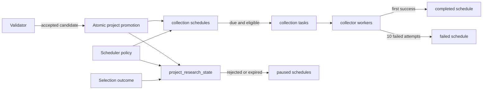

# Token Research Lifecycle

## Scope

The Token Research Lifecycle begins when the Validator accepts a project candidate. It owns creation and expiration of the project's research state, initialization and maintenance of one-shot data-collection schedules, and creation of collection tasks while a project remains eligible for research.

Scanner discovery, candidate inspection, collector-specific payload construction, report generation, and selection policy are adjacent stages. This document records how selection outcomes affect collection eligibility, but it does not define how those outcomes are decided. Ave uses the same lifecycle and schedule machinery as the other collectors; its request and pair-retention behavior is documented in [Ave Market Data Collection](ave-market-data.md).

## Source Locations

| Concern | Source | Key symbols |
| --- | --- | --- |
| Local process declaration | [Procfile](../../../Procfile) | `token-scheduler` process |
| Scheduler composition and configuration | [cmd/athena-token-scheduler/commands/athena-token-scheduler.go](../../../cmd/athena-token-scheduler/commands/athena-token-scheduler.go) | `NewCommand` |
| Validator promotion flow | [internal/token/discovery/application/validator.go](../../../internal/token/discovery/application/validator.go) | `Validator.RunOnce`, `defaultResearchSchedules` |
| Atomic project initialization | [internal/token/adapters/postgres/project_validator_store.go](../../../internal/token/adapters/postgres/project_validator_store.go) | `PromoteCandidateAndInitializeResearch` |
| Scheduler application flow | [internal/token/research/application/scheduler.go](../../../internal/token/research/application/scheduler.go) | `NewScheduler`, `Initialize`, `RunOnce` |
| Lifecycle and schedule persistence | [internal/token/adapters/postgres/collection_schedule_store.go](../../../internal/token/adapters/postgres/collection_schedule_store.go) | `ApplyResearchPolicy`, `MaintainResearchLifecycle`, `CreateCollectionTaskIfDue` |
| Research-state queries | [internal/token/adapters/postgres/queries/project_research_state.sql](../../../internal/token/adapters/postgres/queries/project_research_state.sql) | `CreateProjectResearchState`, `ApplyProjectResearchTTL`, `ExpireProjectResearchStates`, `UpdateProjectResearchSelection` |
| Schedule queries | [internal/token/adapters/postgres/queries/project_data_collection_schedule.sql](../../../internal/token/adapters/postgres/queries/project_data_collection_schedule.sql) | `ListDueProjectDataCollectionSchedules`, `PauseTerminalProjectDataCollectionSchedules` |
| Task claim eligibility | [internal/token/adapters/postgres/queries/project_data_collection_task.sql](../../../internal/token/adapters/postgres/queries/project_data_collection_task.sql) | `ClaimProjectDataCollectionTasks` |
| Schema and defaults | [internal/token/adapters/postgres/migrations/000001_init.sql](../../../internal/token/adapters/postgres/migrations/000001_init.sql) | `project_research_state`, `project_data_collection_schedule`, `project_data_collection_task` |
| Domain state | [internal/token/research/model.go](../../../internal/token/research/model.go) | `ProjectResearchStatus`, `DataCollectionType`, `DataCollectionScheduleStatus`, `TaskStatus` |
| Periodic execution | [internal/token/workerhost/periodic.go](../../../internal/token/workerhost/periodic.go) | `PeriodicWorker`, `runJob` |
| Health and metrics | [internal/token/telemetry/server.go](../../../internal/token/telemetry/server.go), [internal/token/telemetry/tracker.go](../../../internal/token/telemetry/tracker.go) | `Server`, `Tracker` |

## Architecture

The Validator decides whether an inspected candidate is a valid project. PostgreSQL promotes an accepted candidate and initializes its research state, schedules, related wallets, and initial recipients in one transaction. The Scheduler owns time-based lifecycle maintenance and task production. Collector workers claim tasks only for projects whose research state remains eligible.

Selection updates the shared research state. The lifecycle does not depend on any collector's payload format or vendor-specific request policy.

## Runtime Flow

1. The Validator claims and inspects pending project candidates. A rejected inspection marks only the candidate rejected and does not create research state or schedules.
2. For an accepted inspection, `PromoteCandidateAndInitializeResearch` atomically upserts the project, marks the candidate validated, inserts a `researching` state, creates the configured active schedules, and stores the related wallets and initial recipients.
3. The research state's `created_at` is the start of its research window. Its schema default sets `expires_at` to one day after insertion. The project's deployment or discovery time does not define the TTL.
4. Every project receives one active schedule for `chain_state`, `wallet_asset_state`, `simulation_result`, `ave`, `contract_code_source`, and `wallet_normal_transactions`. Every initial `next_run_at` is the Validator's current UTC time, so the first task is due immediately.
5. At Scheduler startup, `Initialize` applies the configured per-data-type retry intervals to active schedules and recomputes `expires_at = created_at + TTL` for every state that is still `researching`. This makes the Scheduler's configured policy authoritative for active research.
6. The Scheduler job runs once per second. Each run first changes overdue `researching` states to `expired`, then changes active schedules belonging to `expired` or `rejected` projects to `paused`.
7. The Scheduler lists due active schedules only for `researching` or `selected` projects. For each due schedule, a PostgreSQL transaction locks the schedule, rechecks its revision and due time, creates one task, advances `next_run_at` to the nominal retry time, and commits both changes together.
8. Collector workers claim pending tasks only while both the research state and collection schedule remain eligible. The research state must be `researching` or `selected`, and the schedule must be `active`.
9. A complete collection attempt includes the external read, normalization, and atomic PostgreSQL commit. The first successful attempt marks the task `succeeded`, commits its data, and changes the schedule to `completed` in the same transaction. An unchanged observation still completes its schedule without creating a new observation or report build.
10. An attempt failure returns the same task to `pending` with `available_at = failed_at + retry_interval`. Attempts one through nine keep the schedule active and update its failure count, last error, and `next_run_at`. Failure ten marks both task and schedule `failed`, clears `next_run_at`, and prevents further claims or task creation.
11. Empty results are successful when the provider request itself succeeded. This includes an empty contract source and an empty related-wallet transaction set. Contract-source absence creates no observation, so a report can remain incomplete after every schedule reaches a terminal state.
12. A `selected` outcome moves a `researching` project to `selected`. Expiration applies only to `researching`. A `rejected` outcome can stop either a researching or selected project; the next maintenance run pauses its still-active schedules.
13. On `SIGINT` or `SIGTERM`, the shared worker host cancels the periodic job, stops the health server, and closes PostgreSQL after the job exits.

## State / Data

`project_research_state` has one row per project. Its lifecycle statuses are:

- `researching`: eligible for scheduled collection and subject to `expires_at`.
- `selected`: eligible for continued collection and not subject to TTL expiration.
- `rejected`: terminal and ineligible for collection.
- `expired`: terminal result of reaching `expires_at` while still researching.

`created_at` anchors the TTL. `expires_at` stores its evaluated deadline. Report, evidence, and selection revision fields coordinate downstream analysis but do not change schedule timing by themselves.

`project_data_collection_schedule` is unique by project and data type. Its status is `active`, `completed`, `failed`, or `paused`; it stores the retry interval, next attempt time, latest task revision, and recent collection outcome. `completed`, `failed`, and `paused` schedules have no `next_run_at`.

Task creation and schedule advancement share a transaction. Failure retries reuse the same task row. The task's `attempts` field counts failed calls and is bounded at ten. The due query excludes a schedule while its current revision is pending or running, preventing overlapping work for the same project and data type.

## Configuration

| Setting | Behavior |
| --- | --- |
| `ATHENA_TOKEN_RESEARCH_TTL` / `--research-ttl` | Research duration measured from `project_research_state.created_at`. The default is 24 hours; environment parsing accepts 1 hour through 30 days. |
| `ATHENA_TOKEN_CHAIN_STATE_RETRY_INTERVAL` / `--chain-state-retry-interval` | Delay after a failed chain-state attempt. Default 15 seconds. |
| `ATHENA_TOKEN_WALLET_ASSET_RETRY_INTERVAL` / `--wallet-asset-retry-interval` | Delay after a failed wallet-asset attempt. Default 1 minute. |
| `ATHENA_TOKEN_SIMULATION_RETRY_INTERVAL` / `--simulation-retry-interval` | Delay after a failed simulation-result attempt. Default 1 minute. |
| `ATHENA_TOKEN_AVE_RETRY_INTERVAL` / `--ave-retry-interval` | Delay after a failed Ave attempt. Default 5 minutes. |
| `ATHENA_TOKEN_CONTRACT_SOURCE_RETRY_INTERVAL` / `--contract-source-retry-interval` | Delay after a failed contract-source attempt. Default 10 minutes. |
| `ATHENA_TOKEN_WALLET_NORMAL_TRANSACTIONS_RETRY_INTERVAL` / `--wallet-normal-transactions-retry-interval` | Delay after a failed related-wallet normal-transaction attempt. Default 10 minutes. |
| `ATHENA_TOKEN_HEALTH_LISTEN_ADDRESS` / `--health-listen-address` | Shared telemetry listener. The Scheduler default is `127.0.0.1:8112`. |

The application-layer fallback TTL is also 24 hours when a Scheduler is built without a positive TTL. The initial schema assigns the same one-day default to direct research-state inserts. A newly created development database receives this schema default; recreating an existing development database is the supported way to apply the current initial schema.

## Invariants

- The research window begins at research-state creation, not at token deployment, discovery, or validation inspection start.
- The default research window is 24 hours, and Scheduler initialization always derives the deadline from `created_at` for states still researching.
- Only `researching` can expire. `selected` remains eligible until each schedule succeeds, exhausts its attempts, or a later rejection stops the remaining active work.
- `rejected` and `expired` projects cannot produce or claim new collection work; their active schedules are paused by lifecycle maintenance.
- Project promotion, research-state creation, schedule creation, related-wallet persistence, and initial-recipient persistence commit atomically.
- Schedule locking and expected-revision checks prevent duplicate task revisions during concurrent scheduling.
- Every collector completes its schedule after the first successful end-to-end attempt, including successful empty results.
- Attempts one through nine reuse the same pending task after the configured retry delay. Attempt ten is terminal and leaves both the task and schedule failed.
- A completed, failed, or paused schedule cannot produce or claim collection work.

## Failure Recovery

Failure anywhere in accepted-candidate promotion rolls back the entire transaction, so a candidate cannot become validated without its project research state and schedules. A later Validator loop can retry from durable candidate state.

Scheduler initialization failure prevents the worker from becoming operational. During steady state, lifecycle maintenance, due-listing, or task-creation failure fails the current one-second loop and is retried by the periodic worker. Task creation and schedule advancement roll back together, so the next loop sees the previous due state rather than a partially advanced schedule.

If a project crosses its deadline while the Scheduler is unavailable, the first successful maintenance run after recovery expires it before listing due schedules. Collector claim queries independently enforce research eligibility, which prevents terminal projects from claiming queued tasks even before their schedules are paused.

Provider, normalization, or persistence failures all count as failed collection attempts. Moving a task back to pending and updating its schedule failure state share one transaction. The tenth failure similarly commits the failed task and failed schedule together. A process loss while a task is running does not consume an attempt; the expired lease makes the same task claimable again.

## Observability

The Scheduler uses the shared telemetry server:

- `GET /healthz` reports whether the worker host is live.
- `GET /readyz` includes PostgreSQL readiness and the `research_scheduler` periodic-job scope.
- `GET /metrics` exposes loop successes, failures, processed task counts, last-success and last-error times, consecutive failures, and shared queue diagnostics.

Failed lifecycle or scheduling loops emit `token periodic job failed` with the job name and error. Successful loops that create tasks emit the shared periodic-worker debug log with `job` and `processed`. Schedule rows expose the terminal status, retry interval, next attempt, consecutive failed attempts, last successful check, and latest error for collector-level diagnosis.

## Change Checklist

- [ ] Recheck Validator promotion and its transaction boundary.
- [ ] Recheck TTL anchoring, status transitions, and selection effects.
- [ ] Recheck schedule defaults, due eligibility, task revisions, and claim eligibility.
- [ ] Recheck terminal-state pause behavior and recovery after Scheduler downtime.
- [ ] Recheck flags, environment defaults, health/readiness, logs, and metrics.
- [ ] Update the [design index](../README.md) if this capability is moved or split.
