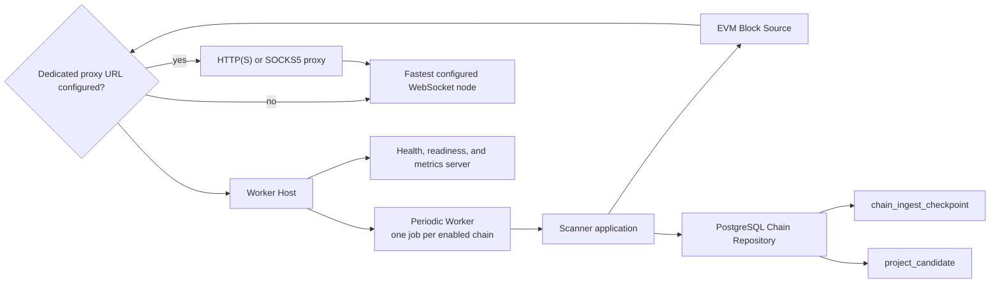

# Token Scanner

## Scope

The Token Scanner discovers contract-creation transactions on configured EVM chains and persists them as pending project candidates. It owns per-chain scan scheduling, checkpoint progress, sequential block retrieval, candidate extraction, and scanner health reporting.

Candidate validation, ERC-20 inspection, project creation, and downstream research are separate Token Intelligence stages and are outside this document.

## Source Locations

| Concern | Source | Key symbols |
| --- | --- | --- |
| Local process declaration | [Procfile](../../../Procfile) | `token-scanner` process |
| Local process orchestration | [hack/local-runtime.sh](../../../hack/local-runtime.sh) | `configure_token_node_ws_proxy`, `start_runtime`, `stop_runtime` |
| Binary dispatch | [cmd/main.go](../../../cmd/main.go) | `main`, `ATHENA_BINARY_NAME` dispatch |
| Scanner composition | [cmd/athena-token-scanner/commands/athena-token-scanner.go](../../../cmd/athena-token-scanner/commands/athena-token-scanner.go) | `NewCommand` |
| Shared worker startup | [cmd/tokenworker/common.go](../../../cmd/tokenworker/common.go) | `CommonFlags.Bind`, `CommonFlags.Open` |
| Chain command configuration | [cmd/tokenchain/flags.go](../../../cmd/tokenchain/flags.go) | `Flags.Bind`, `Flags.Registry` |
| Fixed chain registry | [internal/token/chainregistry/registry.go](../../../internal/token/chainregistry/registry.go) | `New`, `Registry.EnabledChains` |
| Scanner application flow | [internal/token/discovery/application/scanner.go](../../../internal/token/discovery/application/scanner.go) | `Scanner.RunOnce`, `Scanner.estimateInitialStartBlock`, `StartChain`, `StopChain` |
| EVM block source | [internal/token/adapters/evm/block_source.go](../../../internal/token/adapters/evm/block_source.go) | `LatestBlockHeader`, `BlockHeaderByNumber`, `DiscoverProjectCandidates` |
| EVM client lifecycle | [internal/token/adapters/evm/chain_client_registry.go](../../../internal/token/adapters/evm/chain_client_registry.go) | `Client`, `Reset`, `Close` |
| Checkpoint persistence | [internal/token/adapters/postgres/chain_store.go](../../../internal/token/adapters/postgres/chain_store.go) | `SyncChains`, `GetChainIngestCheckpoint`, `UpsertChainIngestCheckpoint` |
| Atomic block persistence | [internal/token/adapters/postgres/chain_ingest_store.go](../../../internal/token/adapters/postgres/chain_ingest_store.go) | `IngestProjectCandidateBlock` |
| Periodic execution | [internal/token/workerhost/periodic.go](../../../internal/token/workerhost/periodic.go) | `PeriodicWorker`, `runJob` |
| Process lifecycle | [internal/token/workerhost/host.go](../../../internal/token/workerhost/host.go) | `Host.Run`, `stopResources` |
| Health and metrics | [internal/token/telemetry/server.go](../../../internal/token/telemetry/server.go), [internal/token/telemetry/tracker.go](../../../internal/token/telemetry/tracker.go) | `Server`, `Tracker` |

## Architecture

`NewCommand` creates one shared PostgreSQL connection, chain registry, EVM client registry, scanner application, and worker host. It creates one independent `PeriodicJob` for every enabled chain. Jobs run concurrently; each job scans its own chain sequentially one block at a time.

The application layer depends only on the `ScannerRepository` and `BlockSource` interfaces. PostgreSQL owns checkpoint and candidate durability. The EVM adapter owns node selection, block retrieval, transaction decoding, and client reset after RPC failures.

## Runtime Flow

1. The `token-scanner` Procfile process runs `cmd/main.go` with `ATHENA_BINARY_NAME=athena-token-scanner`. The dispatcher selects the scanner Cobra command.
2. `CommonFlags.Open` builds the fixed Ethereum Mainnet and BSC Mainnet registry from their individual command settings, applies Token migrations when automatic migration is enabled, connects to the Token PostgreSQL database, synchronizes both chains, creates any missing checkpoint at cursor `0` with status `stopped`, and creates the worker host.
3. `NewCommand` builds one job for each enabled chain. Startup fails when no chain is enabled.
4. `PeriodicWorker.Start` calls `StartChain` for every job before starting the job goroutines. `StartChain` persists status `running` while retaining the cursor.
5. Each job creates its poll ticker and calls `RunOnce` immediately. Later runs start on the next available tick. Because the ticker advances independently, a run that takes longer than its interval can be followed immediately by the next run.
6. `RunOnce` reloads the checkpoint and returns without work when the chain is disabled or not `running`. It then obtains one latest-block header snapshot for the entire run.
7. For a fresh cursor of `0`, the scanner subtracts `scannerInitialLookbackDuration` from the latest header timestamp with saturation at zero. When the chain is older than 100 blocks and the target timestamp is positive, it fetches the header 100 blocks behind the latest snapshot, treats the elapsed time across those blocks as the average block interval, and rounds the projected lookback block count to the nearest block. The estimated start may be earlier or later than the exact timestamp boundary. A chain with at most 100 blocks or a target at timestamp zero starts at block `1`. The scanner persists cursor `start - 1` and logs the estimate before block scanning, so a restart resumes from the initialized range rather than recalculating it.
8. The scanner processes the inclusive range from `cursor + 1` through the latest-block snapshot one block at a time. It makes one `BlockByNumber` call, extracts candidates, and commits that block before requesting the next block.
9. Every transaction with a nil `To` address is treated as a contract creation. The sender and nonce derive the contract address, and the candidate is assigned `pending` status.
10. All candidate upserts from one block and that block's checkpoint update commit in one PostgreSQL transaction. The next block starts only after that transaction succeeds.
11. When the latest snapshot has been reached, `RunOnce` reports success. A later loop obtains a new latest snapshot and continues from the durable cursor.
12. On `SIGINT` or `SIGTERM`, the host cancels the worker context, waits for all job goroutines, calls `StopChain` for each configured job, stops the health server, closes EVM clients, and closes PostgreSQL.

## State / Data

The chain registry is loaded into memory from configuration and synchronized into the `chain` table. Only enabled chains receive scanner jobs.

`chain_ingest_checkpoint` is the durable source of scanner progress and execution status. The important fields are:

- `chain_id`: identifies the independently scanned chain.
- `cursor_block_number`: the highest completely committed block. The next block is always `cursor + 1`.
- `status`: `running` while the process owns active jobs and `stopped` after graceful shutdown.

Fresh checkpoint initialization is a separate durable write. Every later block update is atomic with that block's project candidate upserts, so the cursor cannot advance past candidates that failed to persist.

`project_candidate` stores contract address, sender, transaction hash and index, block number and time, and validation status. Candidate identity is unique by chain and contract. Re-observing a pending candidate refreshes its source data without reverting an already validated or rejected status.

The EVM client registry caches one selected WebSocket client per chain in memory. When no client is cached, the registry probes all configured endpoints concurrently under one shared 15-second deadline. That deadline covers the WebSocket connection, chain ID, sync status, latest block number, and latest block header calls. The lowest-latency healthy result is cached. Node-status inspection uses the same probe behavior and deadline. The deadline is an internal constant rather than chain configuration.

Every registry receives one explicit Token EVM WebSocket proxy URL. A non-empty URL routes endpoint probes, scanner block reads, candidate validation, Token API EVM operations, and on-chain state collectors through that HTTP, HTTPS, or SOCKS5 proxy. An empty URL installs no proxy and forces direct dialing. The EVM dialer never reads the process-wide `http_proxy`, `https_proxy`, or `all_proxy` variables.

A latest-header, historical-header, or block-fetch error or invalid header closes and removes the cached client so a later loop can probe configured endpoints again.

## Configuration

Scanner configuration comes from command flags backed by environment variables:

| Setting | Behavior |
| --- | --- |
| `ATHENA_TOKEN_{ETH,BSC}_ENABLED` / `--{eth,bsc}-enabled` | Required strict boolean for each supported chain. Ethereum Mainnet is fixed to chain ID `1`; BSC Mainnet is fixed to chain ID `56`. |
| `ATHENA_TOKEN_{ETH,BSC}_NODE_WS_URLS` / `--{eth,bsc}-node-ws-urls` | Required non-empty WebSocket node pool for each chain. URLs may be separated by commas, spaces, tabs, or newlines. |
| `ATHENA_TOKEN_{ETH,BSC}_ATHENA_CONTRACT` / `--{eth,bsc}-athena-contract` | Required deployed ATHENA contract address for each chain. |
| `ATHENA_TOKEN_{ETH,BSC}_SCANNER_INITIAL_LOOKBACK_DURATION` / `--{eth,bsc}-scanner-initial-lookback-duration` | Required initial lookback for each chain. Values use Go duration syntax and must be at least one second. |
| `ATHENA_TOKEN_{ETH,BSC}_SCANNER_POLL_INTERVAL` / `--{eth,bsc}-scanner-poll-interval` | Required positive scanner interval for each chain. Values use Go duration syntax. |
| `ATHENA_TOKEN_NODE_WS_PROXY_URL` / `--node-ws-proxy-url` | Optional proxy used only by Token EVM WebSocket connections. Supported schemes are `http`, `https`, and `socks5`; an empty value means direct dialing. |
| `ATHENA_TOKEN_POSTGRES_DSN` | Token database connection used for migrations, chain synchronization, candidates, checkpoints, readiness, and diagnostics. |
| `ATHENA_POSTGRES_AUTO_MIGRATE` | Controls whether embedded Token migrations run during connection setup. The default is `true`. |
| `ATHENA_TOKEN_HEALTH_LISTEN_ADDRESS` / `--health-listen-address` | Health, readiness, and metrics listener. The scanner default is `127.0.0.1:8110`. |
| `ATHENA_TOKEN_HEALTH_STALE_AFTER` / `--health-stale-after` | Maximum age of the last successful loop before readiness fails. The default is 2 minutes, constrained to 1 minute through 1 hour by environment parsing. |
| `ATHENA_LOG_FORMAT`, `ATHENA_LOG_LEVEL` / command flags | Shared worker logging format and level. |

Every chain setting is required even when that chain is disabled, so enabling a maintained chain does not expose a partially configured node pool or contract address. The maintained configuration enables Ethereum and disables BSC. Both chains use an initial lookback of `168h`. Initial block-time estimation always samples the latest 100-block interval; the sample size is an application constant and is not chain configuration. Scanning itself is strictly sequential and has no block-fetch concurrency setting.

Before starting Goreman, `make run` removes the standard lowercase and uppercase HTTP, HTTPS, and ALL proxy variables from its child-process environment. On WSL it then derives the Windows host from the default route and supplies `http://<gateway>:10809` unless `ATHENA_TOKEN_NODE_WS_PROXY_URL` was already set. An explicitly empty value disables that local default. Non-WSL local runs, manual process launches, and production deployments do not synthesize a proxy URL and therefore dial directly. Production Compose does not provide the dedicated proxy setting.

Local PostgreSQL data lives in the `athena-local-postgres-data` Docker volume.
`make stop` and foreground `Ctrl+C` remove the disposable PostgreSQL container
but retain the volume, so the scanner resumes from its durable checkpoint on the
next `make run`. `make run-reset` deletes that volume and therefore restores the
fresh-checkpoint behavior described above. The complete local resource lifecycle
is documented in [Local Runtime Orchestration](../development-runtime/local-runtime-orchestration.md).

## Invariants

- Cursor `0` means fresh data and triggers initial range initialization only after a latest block is available.
- A positive cursor always resumes at exactly `cursor + 1`; it never recalculates the initial lookback.
- The latest block header is sampled once per `RunOnce`, so each run has a finite, stable upper bound and its initial target timestamp comes from chain time rather than host time.
- Initial block estimation uses the average timestamp delta across the latest 100 blocks and intentionally does not verify the estimated start timestamp. The resulting scan window may be shorter or longer than the configured lookback.
- If the target precedes the chain history or the latest height is at most 100, scanning starts at block `1`.
- The scan range is inclusive, and each block is fetched and committed before the next block starts.
- A committed cursor means candidate persistence for that block and every earlier scanned block also committed.
- Each chain has at most one job in a scanner process, and block processing for that chain does not overlap.
- Only contract-creation transactions produce scanner candidates; token validity is determined by the downstream validator.

## Failure Recovery

Invalid chain or Token EVM WebSocket proxy configuration, database connection or migration failure, chain synchronization failure, failure to mark a checkpoint as running, or health-port binding failure prevents process startup.

If obtaining the latest header or the historical header required for initial block-time sampling fails for a fresh chain, the checkpoint cursor remains `0`. A sampled header whose number differs from the requested height or whose timestamp is not earlier than the latest timestamp also fails initialization without persisting an estimate. Failure to persist the initial scan range fails only the current loop. Any EVM read, sender derivation, or database error fails the current loop. The periodic worker records the failure, logs it, waits for the next poll tick, and retries from the last durable cursor. The EVM adapter resets its cached client on header and block-fetch RPC failures or invalid header responses.

If candidate persistence or checkpoint persistence fails, the PostgreSQL transaction rolls back both operations. A retry may re-read the same block and safely upsert the candidates.

Cancellation stops new block processing. Work already committed remains represented by the checkpoint. The host allows up to 10 seconds for worker shutdown and health-server shutdown before returning an error from cleanup.

## Observability

The worker listens on the configured health address:

- `GET /healthz` returns `200 ok` only after worker startup has completed and while the host is running.
- `GET /readyz` checks PostgreSQL and every registered chain-scanner scope. Readiness is false until every enabled chain has completed at least one successful `RunOnce`, when a last success is stale, or when PostgreSQL cannot be pinged. A scanner can therefore be live but not ready during its initial catch-up.
- `GET /metrics` exposes per-chain loop success and failure counters, last-success and last-error timestamps, consecutive failure counts, and shared Token pipeline queue diagnostics.

Fresh initialization emits `initialized token chain scanner checkpoint` at info level with `chain_id`, `lookback_duration`, `latest_block`, `latest_timestamp`, `target_timestamp`, `start_block`, `estimated_lookback_blocks`, `sample_block`, `sample_timestamp`, `sample_block_count`, `sample_elapsed_seconds`, and `average_block_time_ms`. Sample fields are zero when initialization starts at block `1` without sampling.

When a run has blocks to process, `token scanner scan range resolved` reports the cursor, inclusive start and latest block, remaining block count, initial checkpoint-read duration, latest-header duration, and total preparation duration. Each block then emits `token scanner block started` after its checkpoint has been refreshed, including the latest snapshot, remaining block count, and checkpoint-read duration.

The EVM adapter emits `token scanner block discovery completed` after a successful block read and candidate extraction. Its fields separate client acquisition, `BlockByNumber`, and candidate-extraction durations and include the returned block number, transaction count, and candidate count. A newly selected client emits `token EVM client selected` with the chain, credential-free node endpoint, normalized endpoint count, endpoint-probe duration, `proxy_enabled`, and the original unredacted `proxy_endpoint`. Cached client access does not emit this selection event; the event is emitted again after an RPC failure resets the cached client and a later operation reconnects.

Every successfully committed block emits `token scanner block completed` with `chain_id`, `block_number`, `candidate_count`, `checkpoint_read_duration_ms`, `discovery_duration_ms`, `persistence_duration_ms`, and total `duration_ms`. This final duration starts before the per-block checkpoint refresh and ends after the candidate/checkpoint transaction commits. Failed stages emit `token scanner run failed`, `token scanner block failed`, or `token scanner block discovery failed` at error level with `stage`, `phase_duration_ms`, total `duration_ms`, and the relevant chain and block identifiers. Cancellation does not emit these failure events or a completion event. The periodic worker still emits `token periodic job failed` with the job name and error, and successful loops with processed blocks emit a debug log with `job` and `processed`.

## Change Checklist

- [ ] Recheck process wiring, enabled-chain job creation, and shutdown ordering.
- [ ] Recheck first-run lookback, cursor semantics, latest-block snapshot, and sequential block boundaries.
- [ ] Recheck single-block EVM retrieval, candidate extraction, and client reset behavior.
- [ ] Recheck the candidate/checkpoint transaction boundary and database constraints.
- [ ] Recheck retry behavior, health/readiness semantics, logs, and metrics.
- [ ] Update the [design index](../README.md) if this capability is moved or split.
