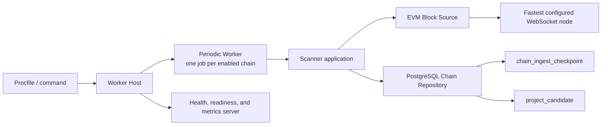

# Token Scanner

## Scope

The Token Scanner discovers contract-creation transactions on configured EVM chains and persists them as pending project candidates. It owns per-chain scan scheduling, checkpoint progress, concurrent block retrieval, candidate extraction, and scanner health reporting.

Candidate validation, ERC-20 inspection, project creation, and downstream research are separate Token Intelligence stages and are outside this document.

## Source Locations

| Concern | Source | Key symbols |
| --- | --- | --- |
| Local process declaration | [Procfile](../../../Procfile) | `token-scanner` process |
| Binary dispatch | [cmd/main.go](../../../cmd/main.go) | `main`, `ATHENA_BINARY_NAME` dispatch |
| Scanner composition | [cmd/athena-token-scanner/commands/athena-token-scanner.go](../../../cmd/athena-token-scanner/commands/athena-token-scanner.go) | `NewCommand` |
| Shared worker startup | [cmd/tokenworker/common.go](../../../cmd/tokenworker/common.go) | `CommonFlags.Bind`, `CommonFlags.Open` |
| Chain configuration | [internal/token/chainregistry/registry.go](../../../internal/token/chainregistry/registry.go) | `Parse`, `Registry.EnabledChains` |
| Scanner application flow | [internal/token/discovery/application/scanner.go](../../../internal/token/discovery/application/scanner.go) | `Scanner.RunOnce`, `Scanner.findFirstBlockAtOrAfter`, `StartChain`, `StopChain` |
| EVM block source | [internal/token/adapters/evm/block_source.go](../../../internal/token/adapters/evm/block_source.go) | `LatestBlockHeader`, `BlockHeaderByNumber`, `DiscoverProjectCandidates` |
| EVM client lifecycle | [internal/token/adapters/evm/chain_client_registry.go](../../../internal/token/adapters/evm/chain_client_registry.go) | `Client`, `Reset`, `Close` |
| Checkpoint persistence | [internal/token/adapters/postgres/chain_store.go](../../../internal/token/adapters/postgres/chain_store.go) | `SyncChains`, `GetChainIngestCheckpoint`, `UpsertChainIngestCheckpoint` |
| Atomic batch persistence | [internal/token/adapters/postgres/chain_ingest_store.go](../../../internal/token/adapters/postgres/chain_ingest_store.go) | `IngestProjectCandidateBatch` |
| Periodic execution | [internal/token/workerhost/periodic.go](../../../internal/token/workerhost/periodic.go) | `PeriodicWorker`, `runJob` |
| Process lifecycle | [internal/token/workerhost/host.go](../../../internal/token/workerhost/host.go) | `Host.Run`, `stopResources` |
| Health and metrics | [internal/token/telemetry/server.go](../../../internal/token/telemetry/server.go), [internal/token/telemetry/tracker.go](../../../internal/token/telemetry/tracker.go) | `Server`, `Tracker` |

## Architecture

`NewCommand` creates one shared PostgreSQL connection, chain registry, EVM client registry, scanner application, and worker host. It creates one independent `PeriodicJob` for every enabled chain. Jobs run concurrently; each job scans its own chain sequentially by batch.

The application layer depends only on the `ScannerRepository` and `BlockSource` interfaces. PostgreSQL owns checkpoint and candidate durability. The EVM adapter owns node selection, block retrieval, transaction decoding, and client reset after RPC failures.

## Runtime Flow

1. The `token-scanner` Procfile process runs `cmd/main.go` with `ATHENA_BINARY_NAME=athena-token-scanner`. The dispatcher selects the scanner Cobra command.
2. `CommonFlags.Open` parses `ATHENA_TOKEN_CHAINS_JSON`, applies Token migrations when automatic migration is enabled, connects to the Token PostgreSQL database, synchronizes configured chains, creates any missing checkpoint at cursor `0` with status `stopped`, and creates the worker host.
3. `NewCommand` builds one job for each enabled chain. Startup fails when no chain is enabled.
4. `PeriodicWorker.Start` calls `StartChain` for every job before starting the job goroutines. `StartChain` persists status `running` while retaining the cursor.
5. Each job creates its poll ticker and calls `RunOnce` immediately. Later runs start on the next available tick. Because the ticker advances independently, a run that takes longer than its interval can be followed immediately by the next run.
6. `RunOnce` reloads the checkpoint and returns without work when the chain is disabled or not `running`. It then obtains one latest-block header snapshot for the entire run.
7. For a fresh cursor of `0`, the scanner subtracts `scannerInitialLookbackDuration` from the latest header timestamp with saturation at zero, then binary-searches headers from block `0` through that latest snapshot for the first block whose timestamp is at or after the target. The scan start is clamped to block `1`; the scanner persists cursor `start - 1` and logs the initialized range. This persistence occurs before block scanning, so a restart resumes from the initialized range rather than recalculating it.
8. The scanner processes the inclusive range from `cursor + 1` through the latest-block snapshot in batches of at most 100 blocks. The configured per-chain block-fetch concurrency limits simultaneous `BlockByNumber` calls inside a batch.
9. Blocks are restored to block-number order after concurrent retrieval. Every transaction with a nil `To` address is treated as a contract creation. The sender and nonce derive the contract address, and the candidate is assigned `pending` status.
10. Candidate upserts and the batch-end checkpoint update commit in one PostgreSQL transaction. The next batch starts only after that transaction succeeds.
11. When the latest snapshot has been reached, `RunOnce` reports success. A later loop obtains a new latest snapshot and continues from the durable cursor.
12. On `SIGINT` or `SIGTERM`, the host cancels the worker context, waits for all job goroutines, calls `StopChain` for each configured job, stops the health server, closes EVM clients, and closes PostgreSQL.

## State / Data

The chain registry is loaded into memory from configuration and synchronized into the `chain` table. Only enabled chains receive scanner jobs.

`chain_ingest_checkpoint` is the durable source of scanner progress and execution status. The important fields are:

- `chain_id`: identifies the independently scanned chain.
- `cursor_block_number`: the highest completely committed block. The next block is always `cursor + 1`.
- `status`: `running` while the process owns active jobs and `stopped` after graceful shutdown.

Fresh checkpoint initialization is a separate durable write. Every later batch update is atomic with its project candidate upserts, so the cursor cannot advance past candidates that failed to persist.

`project_candidate` stores contract address, sender, transaction hash and index, block number and time, and validation status. Candidate identity is unique by chain and contract. Re-observing a pending candidate refreshes its source data without reverting an already validated or rejected status.

The EVM client registry caches one selected WebSocket client per chain in memory. A latest-header, historical-header, or block-fetch error or invalid header closes and removes that cached client so a later loop can probe configured endpoints again.

## Configuration

Scanner configuration comes from command flags backed by environment variables:

| Setting | Behavior |
| --- | --- |
| `ATHENA_TOKEN_CHAINS_JSON` / `--chains-json` | Required chain list. Each entry supplies `id`, `name`, `enabled`, `nodeWsUrls`, `useProxy`, `athenaContract`, `scannerInitialLookbackDuration`, `scannerPollInterval`, and `blockFetchConcurrency`. Chain IDs must be positive and unique; the initial lookback must be at least one second, while the poll interval and concurrency must be positive. Durations use Go duration syntax. |
| `ATHENA_TOKEN_POSTGRES_DSN` | Token database connection used for migrations, chain synchronization, candidates, checkpoints, readiness, and diagnostics. |
| `ATHENA_POSTGRES_AUTO_MIGRATE` | Controls whether embedded Token migrations run during connection setup. The default is `true`. |
| `ATHENA_TOKEN_HEALTH_LISTEN_ADDRESS` / `--health-listen-address` | Health, readiness, and metrics listener. The scanner default is `127.0.0.1:8110`. |
| `ATHENA_TOKEN_HEALTH_STALE_AFTER` / `--health-stale-after` | Maximum age of the last successful loop before readiness fails. The default is 2 minutes, constrained to 1 minute through 1 hour by environment parsing. |
| `ATHENA_LOG_FORMAT`, `ATHENA_LOG_LEVEL` / command flags | Shared worker logging format and level. |

The initial lookback is configured independently for each chain. The maintained Ethereum and BSC configurations both use `168h`. The maximum batch size of 100 blocks remains an application constant.

## Invariants

- Cursor `0` means fresh data and triggers initial range initialization only after a latest block is available.
- A positive cursor always resumes at exactly `cursor + 1`; it never recalculates the initial lookback.
- The latest block header is sampled once per `RunOnce`, so each run has a finite, stable upper bound and its initial target timestamp comes from chain time rather than host time.
- Initial timestamp lookup returns the first block at or after the target time. If the target precedes the chain history, scanning starts at block `1`.
- The scan range and each batch are inclusive.
- A committed cursor means candidate persistence for every earlier scanned batch also committed.
- Each chain has at most one job in a scanner process, and batches for that chain do not overlap.
- Block-fetch concurrency is bounded per batch and per chain.
- Only contract-creation transactions produce scanner candidates; token validity is determined by the downstream validator.

## Failure Recovery

Invalid chain configuration, database connection or migration failure, chain synchronization failure, failure to mark a checkpoint as running, or health-port binding failure prevents process startup.

If obtaining the latest header or any historical header required by initial timestamp lookup fails for a fresh chain, the checkpoint cursor remains `0`. Failure to persist the initial scan range also fails only the current loop. Any EVM read, sender derivation, or database error fails the current loop. The periodic worker records the failure, logs it, waits for the next poll tick, and retries from the last durable cursor. The EVM adapter resets its cached client on header and block-fetch RPC failures or invalid header responses.

If candidate persistence or checkpoint persistence fails, the PostgreSQL transaction rolls back both operations. A retry may re-read the same blocks and safely upsert the candidates.

Cancellation stops new batches. Work already committed remains represented by the checkpoint. The host allows up to 10 seconds for worker shutdown and health-server shutdown before returning an error from cleanup.

## Observability

The worker listens on the configured health address:

- `GET /healthz` returns `200 ok` only after worker startup has completed and while the host is running.
- `GET /readyz` checks PostgreSQL and every registered chain-scanner scope. Readiness is false until every enabled chain has completed at least one successful `RunOnce`, when a last success is stale, or when PostgreSQL cannot be pinged. A scanner can therefore be live but not ready during its initial catch-up.
- `GET /metrics` exposes per-chain loop success and failure counters, last-success and last-error timestamps, consecutive failure counts, and shared Token pipeline queue diagnostics.

Fresh initialization emits `initialized token chain scanner checkpoint` at info level with `chain_id`, `lookback_duration`, `latest_block`, `latest_timestamp`, `target_timestamp`, and `start_block`. Every successfully committed scan batch emits `token scanner batch completed` at info level with `chain_id`, the inclusive `start_block` and `end_block`, `block_count`, `candidate_count`, and `duration_ms`. The duration covers block retrieval, candidate extraction, and the candidate/checkpoint transaction; failed or cancelled batches do not emit this completion log. Failed loops emit `token periodic job failed` with the job name and error. Successful loops with processed blocks emit a debug log with `job` and `processed`.

## Change Checklist

- [ ] Recheck process wiring, enabled-chain job creation, and shutdown ordering.
- [ ] Recheck first-run lookback, cursor semantics, latest-block snapshot, and batch boundaries.
- [ ] Recheck EVM concurrency, candidate extraction, and client reset behavior.
- [ ] Recheck the candidate/checkpoint transaction boundary and database constraints.
- [ ] Recheck retry behavior, health/readiness semantics, logs, and metrics.
- [ ] Update the [design index](../README.md) if this capability is moved or split.
