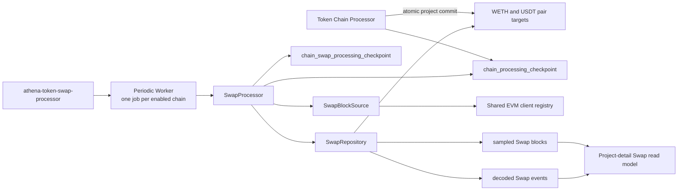

# Token Swap Processor

## Scope

The Token Swap Processor follows the committed Token Chain Processor cursor and
collects Pancake/Uniswap V2-compatible `Swap` events for every accepted
project's wrapped-native and USDT pairs. It owns per-chain Swap scheduling,
topic-only EVM log reads, strict event decoding, transaction-sender derivation,
independent per-pair observation state, the 100-Swap-block limit, inactivity
expiration, numeric Swap checkpoints, and process health reporting.

The Token Chain Processor creates the two pair targets atomically with each
accepted project. The project-detail read model exposes committed Swap
observations through read-only activity and event-detail endpoints. It derives
trade classification, pair-accounting flows, and execution-price summaries at
read time; those concerns do not feed back into this processor. Research
collection schedules, report generation, and project selection do not consume
Swap observations.

## Source Locations

| Concern | Source | Key symbols |
| --- | --- | --- |
| Local process declaration | [Procfile](../../../Procfile) | `token-swap-processor` process |
| Production process declaration | [docker-compose.prod.yml](../../../docker-compose.prod.yml) | `athena-token-swap-processor` service, port `8111` |
| Local cleanup boundaries | [hack/local-runtime.sh](../../../hack/local-runtime.sh) | `coverage_dirs`, `cleanup_athena_ports` |
| Binary dispatch | [cmd/main.go](../../../cmd/main.go) | `main`, `ATHENA_BINARY_NAME` dispatch |
| Process composition | [cmd/athena-token-swap-processor/commands/athena-token-swap-processor.go](../../../cmd/athena-token-swap-processor/commands/athena-token-swap-processor.go) | `NewCommand` |
| Shared worker startup | [cmd/tokenworker/common.go](../../../cmd/tokenworker/common.go) | `CommonFlags.Bind`, `CommonFlags.Open` |
| Chain command configuration | [cmd/tokenchain/flags.go](../../../cmd/tokenchain/flags.go) | `Flags.Bind`, `Flags.Registry` |
| Fixed chain registry | [internal/token/chainregistry/registry.go](../../../internal/token/chainregistry/registry.go) | `Chain.SwapPollInterval`, `Registry.EnabledChains` |
| Application flow | [internal/token/swap/application/processor.go](../../../internal/token/swap/application/processor.go) | `SwapProcessor.RunOnce`, `SwapProcessor.StartChain`, `SwapProcessor.StopChain` |
| Domain state and limits | [internal/token/swap/model.go](../../../internal/token/swap/model.go) | `Pair`, `ProcessingCheckpoint`, `TargetSwapBlockCount`, timeout constants |
| EVM log and block access | [internal/token/adapters/evm/swap_block_source.go](../../../internal/token/adapters/evm/swap_block_source.go) | `SwapBlockSource`, `FilterSwapLogs`, `DecodeBlockSwapEvents` |
| PostgreSQL persistence | [internal/token/adapters/postgres/swap_processing_store.go](../../../internal/token/adapters/postgres/swap_processing_store.go) | `SwapRepository`, `CommitProcessedBlock` |
| Project target initialization | [internal/token/adapters/postgres/chain_processing_store.go](../../../internal/token/adapters/postgres/chain_processing_store.go) | `initializeInspectedProject` |
| Schema and queries | [internal/token/adapters/postgres/migrations/000001_init.sql](../../../internal/token/adapters/postgres/migrations/000001_init.sql), [internal/token/adapters/postgres/queries/swap_processing.sql](../../../internal/token/adapters/postgres/queries/swap_processing.sql) | `chain_swap_processing_checkpoint`, `project_swap_pair`, `project_swap_block`, `project_swap_event` |
| Pair event ABI | [pkg/abi/IPancakePair/IPancakePair.go](../../../pkg/abi/IPancakePair/IPancakePair.go) | `IPancakePairMetaData`, `Swap` event |
| Periodic execution and telemetry | [internal/token/workerhost/periodic.go](../../../internal/token/workerhost/periodic.go), [internal/token/telemetry/server.go](../../../internal/token/telemetry/server.go) | `PeriodicWorker`, `Server` |

## Architecture

`NewCommand` creates one shared PostgreSQL connection, fixed chain registry, EVM
client registry, `SwapBlockSource`, `SwapRepository`, application processor, and
worker host. It creates one independent periodic job for every enabled chain.
Different chains may run concurrently; work for one chain is non-overlapping and
strictly ordered by block number.

The Chain Processor is the only producer of pair targets. The Swap Processor
never discovers projects and never advances beyond the durable
`chain_processing_checkpoint`. EVM reads happen before the PostgreSQL
transaction. PostgreSQL owns the atomic block commit that records observations,
applies terminal pair states, and advances the Swap checkpoint.

## Runtime Flow

1. The `token-swap-processor` Procfile process runs `cmd/main.go` with
   `ATHENA_BINARY_NAME=athena-token-swap-processor`. The dispatcher selects the
   Swap Processor Cobra command.
2. `CommonFlags.Open` validates the fixed chain registry, applies Token
   migrations when enabled, connects to Token PostgreSQL, synchronizes chain
   configuration, and creates the worker host. The command then creates the
   shared EVM client registry, block source, repository, and application.
3. One periodic job is created for each enabled chain. Startup fails when no
   chain is enabled. Each job upserts its Swap checkpoint status to `running`,
   invokes `RunOnce` immediately, and then uses the chain's Swap poll interval.
4. `RunOnce` snapshots `chain_processing_checkpoint.cursor_block_number` as its
   finite source upper bound. The source checkpoint's running or stopped status
   does not change that boundary.
5. An uninitialized Swap checkpoint starts at the earliest collecting target's
   deployment block minus one. If no target is eligible within the source
   snapshot, it initializes at the source cursor. The initialized cursor is
   durable and is not recalculated after restart.
6. The application processes `cursor + 1` through the source snapshot. It
   reloads the Swap checkpoint between blocks so an operator or graceful stop
   takes effect at a block boundary.
7. If there are no collecting targets, the checkpoint advances directly to the
   source snapshot without EVM requests. If the next target starts after the
   next block, the checkpoint advances to the block immediately before that
   target.
8. For an observed block, `FilterSwapLogs` issues one exact-block
   `eth_getLogs` request with no address filter and the `Swap` topic
   `0xd78ad95fa46c994b6551d0da85fc275fe613ce37657fb8d5e3d130840159d822`.
   Active pair count therefore does not create address batches or additional
   log requests.
9. Returned log addresses are deduplicated and used to load matching
   `collecting` targets whose inclusive start block has been reached. After
   exact-block, topic, and removed-log checks, logs for other addresses are
   ignored. One address may map to multiple WETH or USDT targets; the decoded
   events fan out to each target independently.
10. A block with no relevant logs requires only its header for chain time. A
    block with relevant logs is fetched once. Every relevant log's transaction
    hash and index must resolve to that block, and the EVM chain signer derives
    `tx.from` once per transaction.
11. Relevant logs are ordered by transaction index and log index. Each must have
    exactly three topics, canonical address padding, and exactly four encoded
    `uint256` amounts. The event's indexed `sender` and `to` addresses remain
    distinct from the enclosing transaction's `tx.from`.
12. One PostgreSQL transaction inserts each target's sampled Swap block and all
    of that block's events, updates its count and deadlines, completes targets
    that reach 100 sampled blocks, expires due targets, and advances
    `chain_swap_processing_checkpoint` last.
13. Reaching the source snapshot completes the run. A later poll takes a new
    source snapshot. On `SIGINT` or `SIGTERM`, the host cancels workers, waits
    for their goroutines, marks configured Swap checkpoints `stopped`, stops
    telemetry, closes EVM clients, and closes PostgreSQL.

## State / Data

`chain_swap_processing_checkpoint` is the private per-chain progress record:

- `cursor_block_number` is the highest block whose event writes, pair-state
  transitions, expiration evaluation, and checkpoint update committed together.
- `initialized` distinguishes a real cursor at zero from a checkpoint that has
  not yet chosen its first target.
- `status` is `running` while the process owns the chain job and `stopped` after
  shutdown.

The cursor is numeric. It stores no block hash, has no public Token API, and
does not model chain reorganizations.

`project_swap_pair` contains exactly one logical target for each accepted
`(project_id, pair_kind)`, where `pair_kind` is `weth` or `usdt`. Each target
stores the chain, nonzero pair address, inclusive project deployment block and
time, independent Swap-block count, first and last Swap positions, timeout
deadlines, and terminal metadata. Pair address is deliberately not unique, so a
single on-chain address can back multiple independently counted targets.

Pair state is one of:

- `collecting`: fewer than 100 sampled Swap blocks and eligible for matching or
  timeout evaluation.
- `completed`: exactly 100 sampled Swap blocks, with completion position equal
  to the last observed Swap block.
- `expired`: fewer than 100 sampled blocks, with reason `no_swap`, `inactive`,
  or `max_duration`.

`project_swap_block` contains one row for each target and distinct block that
has at least one relevant Swap. `(project_swap_pair_id, block_number)` and
`(project_swap_pair_id, sample_index)` are unique, and `sample_index` is in
`1..100`. Multiple events in one block therefore increase a target's count only
once.

`project_swap_event` contains every relevant event in a sampled block. It stores
transaction hash and position, log index, `tx_from`, event `sender`, event
`to_address`, and the four raw nonnegative `NUMERIC(78,0)` amounts.
`(project_swap_pair_id, transaction_hash, log_index)` is unique. Project, chain,
pair kind, pair address, topic, raw log bytes, price, and trade direction remain
derivable or outside the stored event. The project-detail read model performs
those derivations without changing the processor's storage or collection
rules.

The WETH and USDT targets, even when their addresses are equal, never share
counts or terminal state. Completed and expired targets retain all previously
stored blocks and events.

## Configuration

| Setting | Behavior |
| --- | --- |
| `ATHENA_TOKEN_{ETH,BSC}_ENABLED` / `--{eth,bsc}-enabled` | Selects enabled jobs from the fixed Ethereum Mainnet and BSC Mainnet registry. |
| `ATHENA_TOKEN_{ETH,BSC}_NODE_WS_URLS` / `--{eth,bsc}-node-ws-urls` | Required non-empty WebSocket endpoint pool used for log, header, and full-block reads. |
| `ATHENA_TOKEN_{ETH,BSC}_ATHENA_CONTRACT` / `--{eth,bsc}-athena-contract` | Required shared-registry setting. The Swap Processor validates but does not consume it. |
| `ATHENA_TOKEN_{ETH,BSC}_PROCESSOR_INITIAL_LOOKBACK_DURATION`, `ATHENA_TOKEN_{ETH,BSC}_PROCESSOR_POLL_INTERVAL` / corresponding command flags | Required shared-registry settings. The Swap Processor validates but does not consume them. |
| `ATHENA_TOKEN_{ETH,BSC}_SWAP_POLL_INTERVAL` / `--{eth,bsc}-swap-poll-interval` | Required positive periodic interval. Maintained values are `15s` for Ethereum and `1s` for BSC. |
| `ATHENA_TOKEN_NODE_WS_PROXY_URL` / `--node-ws-proxy-url` | Optional HTTP, HTTPS, or SOCKS5 proxy used only by shared Token EVM WebSocket connections. |
| `ATHENA_TOKEN_POSTGRES_DSN` | Token database containing the source and Swap checkpoints, pair targets, sampled blocks, and events. |
| `ATHENA_POSTGRES_AUTO_MIGRATE` | Controls embedded Token migration during connection setup; default `true`. |
| `ATHENA_TOKEN_HEALTH_LISTEN_ADDRESS` / `--health-listen-address` | Swap Processor telemetry listener; default `127.0.0.1:8111`. |
| `ATHENA_TOKEN_HEALTH_STALE_AFTER` / `--health-stale-after` | Maximum age of the last successful loop before readiness fails; default 2 minutes. |
| `ATHENA_LOG_FORMAT`, `ATHENA_LOG_LEVEL` / command flags | Shared worker logging format and level. |

Every maintained chain setting is required even when that chain is disabled.
The maintained configuration enables Ethereum and disables BSC.

The sample limit is 100 blocks. First-Swap and post-Swap idle timeouts are both
24 hours of chain block time, and the absolute observation limit is seven days.
These values, the exact Swap topic, and topic-only single-block querying are
application constants rather than runtime configuration.

## Invariants

- A Swap cursor never advances beyond the source Chain Processor cursor snapshot.
- Blocks within one chain are observed and committed in strictly increasing
  numeric order.
- Exactly one active Swap Processor instance owns a configured chain. The
  checkpoint uses expected-cursor compare-and-set for atomicity but is not a
  distributed lease or multi-replica ownership protocol.
- The inclusive deployment block is eligible in full; transaction position does
  not truncate it.
- Every observed active block uses one topic-only `eth_getLogs` call regardless
  of collecting-pair count. There is no address-batch fallback.
- Only logs whose address maps to a collecting target are strictly decoded and
  persisted.
- A relevant malformed log fails the block; it is never skipped as invalid
  business data.
- One target counts at most once per block, but every matching event in that
  sampled block is retained.
- The complete 100th Swap block is stored before the target becomes `completed`.
- Events are fanned out independently when one address maps to multiple targets.
- Block events and completion take precedence over expiration. If a target does
  not complete, seven-day expiration takes precedence over no-Swap or idle
  expiration.
- Chain block time, not process wall-clock time, controls all observation
  deadlines.
- The processor assumes the chain does not reorganize and performs no block-hash
  verification, finality delay, rollback, or removed-log repair.

## Failure Recovery

Invalid chain, node, proxy, database, poll-interval, or health configuration;
migration or chain synchronization failure; inability to mark a Swap checkpoint
running; block-source construction failure; or health-port binding failure
prevents startup.

Log, header, or full-block RPC failure, including an inconsistent removed,
topic, block, or transaction position returned by the node, resets the cached
chain client so the next attempt probes the configured endpoints again. A missing or mismatched
transaction, sender-derivation failure, malformed relevant log, context
cancellation, or database error fails the current block. The application does
not fall back to address-filtered queries because doing so could make omission
behavior depend on provider errors.

All durable changes for one block share one PostgreSQL transaction. Failure
rolls back sampled blocks, events, pair counts, terminal state, and the Swap
checkpoint. The periodic job retries from the unchanged cursor; uniqueness
constraints and expected-cursor advancement prevent duplicate or out-of-order
commits.

Targets that never swap expire after 24 hours with `no_swap`. Targets that have
swapped but remain inactive for 24 hours expire with `inactive`. Any target
still below 100 samples expires after seven days with `max_duration`. Expiration
stops future RPC matching for that target without deleting collected data.

## Observability

The process exposes:

- `GET /healthz` for worker-host liveness.
- `GET /readyz` for PostgreSQL readiness and every enabled chain's
  `swap_processor` job scope.
- `GET /metrics` for per-chain loop results, last-success and last-error
  timestamps, consecutive failures, and shared Token pipeline diagnostics.

Range logs identify chain ID, Swap cursor, source cursor, and remaining blocks.
Initialization logs record the chosen cursor. Every completed observed block
reports block number and time, topic and relevant log counts, matched targets,
stored events, completed and expired targets, and separate log-read,
pair-matching, block-RPC, decoding, total block-read, persistence, and overall
durations. Failures identify the chain, block when applicable, stage, duration,
and error. Shared EVM client-selection logs expose endpoint and proxy state
without credentials.

## Change Checklist

- [ ] Recheck source-cursor snapshots, checkpoint initialization, gap
      fast-forwarding, and per-chain ordering.
- [ ] Recheck topic-only RPC behavior, strict decoding, transaction-sender
      derivation, and same-address fan-out.
- [ ] Recheck independent WETH and USDT counts, the complete 100th block, and
      chain-time expiration precedence.
- [ ] Recheck the atomic block transaction, retries, shutdown, health,
      readiness, logs, and metrics.
- [ ] Recheck target initialization inside the Chain Processor block transaction.
- [ ] Keep the raw observation contract aligned with the read-only project-detail
      Swap view.
- [ ] Keep the [design index](../README.md) entry current.
