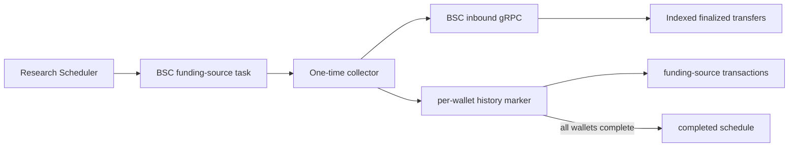

# Wallet Funding Source History

## Scope

This capability captures a one-time snapshot of up to 100 indexed BSC funding-source transactions immediately preceding project creation for every distinct related wallet. It owns the project-creation cutoff request, response validation, per-wallet completion checkpoints, normalized transaction persistence, task lease renewal, and schedule completion.

The upstream index contains only successful finalized top-level BNB transfers with empty calldata and a value strictly greater than `0.01 BNB`. Related-wallet discovery remains part of Validator inspection. Internal transactions, token transfers, observations, research reports, selection policy, and public query APIs are outside this capability.

## Source Locations

| Concern | Source | Key symbols |
| --- | --- | --- |
| Process declaration | [Procfile](../../../Procfile) | `token-collector-wallet-funding-source-history` |
| Collector composition | [cmd/athena-token-collector/commands/athena-token-collector.go](../../../cmd/athena-token-collector/commands/athena-token-collector.go) | `NewCommand` |
| One-time application flow | [internal/token/research/application/wallet_funding_source_history_collector.go](../../../internal/token/research/application/wallet_funding_source_history_collector.go) | `WalletFundingSourceHistoryCollector.RunOnce`, `process`, `renewLease` |
| Typed domain data | [internal/token/research/wallet_funding_source_history.go](../../../internal/token/research/wallet_funding_source_history.go) | `WalletFundingSourceTransaction`, `WalletFundingSourceHistory` |
| BSC inbound adapter | [internal/token/adapters/walletfunding/provider.go](../../../internal/token/adapters/walletfunding/provider.go) | `Provider.ListFundingSourcesBefore` |
| Upstream contract | [internal/bscinbound/bscinbound.proto](../../../internal/bscinbound/bscinbound.proto) | `ListInboundNormalTransactions`, `InboundNormalTransactionPosition` |
| PostgreSQL transaction boundary | [internal/token/adapters/postgres/wallet_funding_source_history_store.go](../../../internal/token/adapters/postgres/wallet_funding_source_history_store.go) | `SaveWalletFundingSourceHistory`, `CompleteWalletFundingSourceHistory` |
| SQL queries | [internal/token/adapters/postgres/queries/project_wallet_funding_source_history.sql](../../../internal/token/adapters/postgres/queries/project_wallet_funding_source_history.sql) | `ListPendingProjectWalletFundingSourceHistoryWallets`, `InsertProjectWalletFundingSourceHistory`, `InsertProjectWalletFundingSourceTransaction` |
| Schema | [internal/token/adapters/postgres/migrations/000001_init.sql](../../../internal/token/adapters/postgres/migrations/000001_init.sql) | `project_wallet_funding_source_history`, `project_wallet_funding_source_transaction` |

## Architecture

The Token process connects directly to the separately deployed BSC inbound service. It does not use the Ethereum API or Etherscan gateway fleet. PostgreSQL stores the result outside `project_observation`, so funding-source history does not increment evidence revisions or enter reports and selection.

## Runtime Flow

1. Validator promotion creates an active `wallet_funding_source_history` schedule only for BSC Mainnet projects, with `next_run_at` set to the promotion time and a 1-minute retry interval.
2. The Scheduler creates a normal versioned collection task. The dedicated collector claims this data type only for enabled chain ID `56`.
3. PostgreSQL returns distinct related-wallet addresses that do not yet have a funding-source history marker.
4. While the task is running, the collector renews its 90-second lease every 30 seconds.
5. For each wallet, the provider calls `ListInboundNormalTransactions` with page size `100` and `before_position` equal to the project creation block number and transaction index.
6. The BSC service performs a strict position-before query. The response also reports the scanner's indexed-through block and timestamp. A scanner position behind project creation is accepted and persisted rather than retried.
7. The provider validates hashes, addresses, the strict creation cutoff, the target recipient, and the value threshold; it deduplicates by transaction hash and sorts newest first. Rank `0` is nearest to project creation.
8. One PostgreSQL transaction inserts the history marker and all normalized rows. A zero-row result still inserts the marker. A concurrent duplicate marker makes the save a no-op.
9. After a wallet commits, later attempts exclude it. The collector reloads the pending set until no distinct related wallet remains.
10. Task success and schedule completion commit together. No later collection task is scheduled for that project and data type.
11. Cancellation stops new requests. Durable wallet markers and transactions remain available for a later task attempt.

## State / Data

`project_wallet_funding_source_history` is keyed by project and wallet. It stores the project-creation anchor, requested and collected counts, upstream indexed-through block and timestamp, and fetch time. Row existence means that wallet is complete, including a valid empty or scanner-lagged result.

`project_wallet_funding_source_transaction` is keyed by project, wallet, and rank. It stores block identity and timestamp, transaction identity and index, sender, recipient, and BNB value in wei. Transaction hash is unique within a project-wallet history.

The child table references the history marker by project and wallet with cascading deletion. Project deletion cascades through the marker. Roles remain in `project_related_wallet`; one address with multiple roles still has one history snapshot.

## Configuration

| Setting | Behavior |
| --- | --- |
| `ATHENA_TOKEN_BSC_INBOUND_SERVER_ADDRESS` / `--bsc-inbound-server-address` | BSC inbound gRPC address. Default `localhost:8130`; the committed runtime environments use `47.245.183.140:8130`. |
| `ATHENA_TOKEN_WALLET_FUNDING_SOURCE_HISTORY_RETRY_INTERVAL` / `--wallet-funding-source-history-retry-interval` | Delay before a new task revision after fast retries fail. Default 1 minute; environment parsing accepts 1 second through 24 hours. |
| `ATHENA_TOKEN_HEALTH_LISTEN_ADDRESS` / `--health-listen-address` | Collector telemetry listener. The process default is `127.0.0.1:8120`. |

The 100-transaction limit, BSC chain ID, 90-second task lease, and 30-second renewal interval are application constants.

## Invariants

- Only successful finalized direct BNB funding transfers indexed by the BSC inbound service are collected.
- Every stored transaction is strictly earlier than the project creation transaction and is addressed to the related wallet.
- Each project-wallet history contains at most 100 distinct transactions in newest-first rank order.
- The stored indexed-through position may be behind the project creation block and records the actual upstream coverage used for the immutable snapshot.
- A history marker and its transaction rows become visible atomically.
- A completed wallet is never requested again for the same project.
- Only BSC Mainnet projects receive this schedule.
- Funding-source history is not an observation and cannot affect report completeness or Selector input.

## Failure Recovery

gRPC, decoding, validation, conversion, or database failures use the shared task retry policy: four fast retries after the initial attempt, followed by a failed task and a new task revision after 1 minute while the project remains eligible. Scanner lag is not a failure; the returned partial coverage is committed once.

Completed wallet transactions are not rolled back when a later wallet fails; the next attempt requests only missing wallets. The per-wallet transaction prevents a history marker from surviving without its complete transaction rows. Task and schedule completion share a transaction. Lease renewal reduces duplicate claims, while marker uniqueness makes overlapping wallet saves idempotent.

Projects in `rejected` or `expired` state cannot claim remaining work and their active schedules are paused. A `selected` project remains eligible until its funding-source schedule completes.

## Observability

The process exposes the shared `GET /healthz`, `GET /readyz`, and `GET /metrics` endpoints on port 8120. Its telemetry scope uses component `data_collector` and data type `wallet_funding_source_history`.

Provider errors include the wallet and invalid response detail. Shared task and schedule rows preserve attempts, availability, lease expiry, last error, failure count, and last checked time. The history marker's collected count, fetch time, and indexed-through position distinguish empty, lagged, and caught-up snapshots through SQL queries.

## Change Checklist

- [ ] Recheck the exclusive creation-position query, response validation, deduplication, sorting, and 100-row limit.
- [ ] Recheck related-wallet distinctness and per-wallet completion semantics.
- [ ] Recheck history/transaction atomicity, task lease renewal, retries, and schedule completion.
- [ ] Recheck the BSC-only schedule, gRPC configuration, process wiring, and port 8120 cleanup.
- [ ] Confirm funding-source history remains outside observations, reports, selection, and public APIs.
- [ ] Update the [design index](../README.md) if this capability is moved or split.
