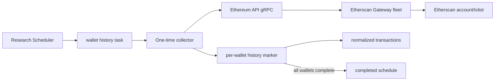

# Wallet Normal Transaction History

## Scope

This capability captures a one-time, immutable snapshot of the normal transactions immediately preceding project creation for every distinct related wallet. It owns Etherscan pagination through the existing Ethereum API service, the exact creation-transaction cutoff, per-wallet completion checkpoints, normalized transaction persistence, task lease renewal, and schedule completion.

Related-wallet discovery remains part of Validator inspection. Internal transactions, token transfer events, observations, research reports, selection policy, and public query APIs are outside this capability.

## Source Locations

| Concern | Source | Key symbols |
| --- | --- | --- |
| Process declaration | [Procfile](../../../Procfile) | `token-collector-wallet-normal-transaction-history` |
| Collector composition | [cmd/athena-token-collector/commands/athena-token-collector.go](../../../cmd/athena-token-collector/commands/athena-token-collector.go) | `NewCommand` |
| One-time application flow | [internal/token/research/application/wallet_normal_transaction_history_collector.go](../../../internal/token/research/application/wallet_normal_transaction_history_collector.go) | `WalletNormalTransactionHistoryCollector.RunOnce`, `process`, `renewLease` |
| Typed domain data | [internal/token/research/wallet_normal_transaction_history.go](../../../internal/token/research/wallet_normal_transaction_history.go) | `WalletNormalTransaction` |
| Ethereum API adapter | [internal/token/adapters/wallettransactions/provider.go](../../../internal/token/adapters/wallettransactions/provider.go) | `Provider.ListNormalTransactionsBefore` |
| Existing upstream contract | [internal/ethereumapi/ethereumapi.proto](../../../internal/ethereumapi/ethereumapi.proto) | `ListNormalTransactions`, `NormalTransaction` |
| PostgreSQL transaction boundary | [internal/token/adapters/postgres/wallet_normal_transaction_history_store.go](../../../internal/token/adapters/postgres/wallet_normal_transaction_history_store.go) | `SaveWalletNormalTransactionHistory`, `CompleteWalletNormalTransactionHistory` |
| SQL queries | [internal/token/adapters/postgres/queries/project_wallet_normal_transaction_history.sql](../../../internal/token/adapters/postgres/queries/project_wallet_normal_transaction_history.sql) | `ListPendingProjectWalletNormalTransactionHistoryWallets`, `InsertProjectWalletNormalTransactionHistory`, `InsertProjectWalletNormalTransaction` |
| Schema | [internal/token/adapters/postgres/migrations/000001_init.sql](../../../internal/token/adapters/postgres/migrations/000001_init.sql) | `project_wallet_normal_transaction_history`, `project_wallet_normal_transaction` |

## Architecture

The Token process never holds an Etherscan API key. The adapter calls the existing typed Ethereum API gRPC boundary, which delegates through the configured API-key and gateway rotation. PostgreSQL stores the result outside `project_observation`, so wallet history does not increment evidence revisions or enter reports and selection.

## Runtime Flow

1. Validator promotion creates an active `wallet_normal_transaction_history` schedule with `next_run_at` set to the promotion time and a 1-minute retry interval.
2. The Scheduler creates a normal versioned collection task. The dedicated collector claims only this data type for enabled chains.
3. Task context includes the project's chain ID, creation block number, and creation transaction index. PostgreSQL returns distinct related-wallet addresses that do not yet have a history marker.
4. While the task is running, the collector renews its 90-second lease every 30 seconds.
5. Wallets are processed sequentially. Each Etherscan request uses `startblock=0`, `endblock=creation block`, a page size of 300, and descending order.
6. The provider maps the typed response, rejects the creation transaction and every later transaction in the creation block, deduplicates by transaction hash, and continues pagination until 300 eligible transactions have been found or the upstream history is exhausted.
7. Eligible transactions are sorted by block number and transaction index descending, with transaction hash as a deterministic tie breaker, and truncated to 300. Rank `0` is nearest to project creation.
8. One PostgreSQL transaction inserts the wallet history marker and all normalized rows. A zero-row result still inserts the marker. A concurrent duplicate marker makes the save a no-op.
9. After a wallet commits, later attempts exclude it. The collector reloads the pending set until no distinct related wallet remains.
10. Task success and schedule completion commit together. No later collection task is scheduled for that project and data type.
11. Cancellation stops new requests. Durable wallet markers and transactions remain available for a later task attempt.

## State / Data

`project_wallet_normal_transaction_history` is keyed by project and wallet. It stores the creation anchor, requested limit, collected count, and fetch time. Row existence means that wallet is complete, including a valid empty history.

`project_wallet_normal_transaction` is keyed by project, wallet, and rank. It stores every field exposed by the internal `NormalTransaction` contract: block identity and timestamp, transaction identity, nonce and index, sender and optional recipient, value, gas data, input and method metadata, optional created-contract address, receipt status, confirmations, and error state. Transaction hash is unique within a project-wallet history.

The child table references the history marker by project and wallet with cascading deletion. Project deletion cascades through the marker. Roles remain in `project_related_wallet`; one address with multiple roles still has one history snapshot.

## Configuration

| Setting | Behavior |
| --- | --- |
| `ATHENA_TOKEN_ETHEREUM_API_SERVER_ADDRESS` / `--ethereum-api-server-address` | Existing Ethereum API gRPC address. Default `localhost:8100`. |
| `ATHENA_TOKEN_WALLET_NORMAL_TRANSACTION_HISTORY_RETRY_INTERVAL` / `--wallet-normal-transaction-history-retry-interval` | Delay before a new task revision after fast retries fail. Default 1 minute; environment parsing accepts 1 second through 24 hours. |
| `ATHENA_TOKEN_HEALTH_LISTEN_ADDRESS` / `--health-listen-address` | Collector telemetry listener. The process default is `127.0.0.1:8120`. |

The 300-transaction limit, 300-row Etherscan page size, 90-second task lease, and 30-second renewal interval are application constants.

## Invariants

- Only Etherscan normal transactions are collected; internal transactions and token transfer events are excluded.
- Every stored transaction is strictly earlier than the project creation transaction by block number and transaction index.
- Each project-wallet history contains at most 300 distinct transactions in newest-first rank order.
- A history marker and its transaction rows become visible atomically.
- A completed wallet is never requested again for the same project.
- The schedule completes only after every distinct current related wallet has a history marker.
- Wallet history is not an observation and cannot affect report completeness or Selector input.

## Failure Recovery

Ethereum API, decoding, conversion, or database failures use the shared task retry policy: four fast retries after the initial attempt, followed by a failed task and a new task revision after 1 minute while the project remains eligible. Completed wallet transactions are not rolled back when a later wallet fails; the next attempt requests only missing wallets.

The per-wallet transaction prevents a history marker from surviving without its complete transaction rows. The task/schedule completion transaction prevents a succeeded task from retaining an active schedule. Lease renewal reduces duplicate claims during multi-wallet collection, while marker uniqueness makes overlapping wallet saves idempotent.

Projects in `rejected` or `expired` state cannot claim remaining work and their active schedules are paused. A `selected` project remains eligible until its wallet-history schedule completes.

## Observability

The process exposes the shared `GET /healthz`, `GET /readyz`, and `GET /metrics` endpoints on port 8120. Its telemetry scope uses component `data_collector` and data type `wallet_normal_transaction_history`.

Provider errors include chain ID, wallet, and page. Shared task and schedule rows preserve attempts, availability, lease expiry, last error, failure count, and last checked time. The history marker's collected count and fetch time distinguish completed empty, partial-project, and fully completed states through SQL queries.

## Change Checklist

- [ ] Recheck the strict creation-transaction cutoff, pagination, deduplication, sorting, and 300-row limit.
- [ ] Recheck related-wallet distinctness and per-wallet completion semantics.
- [ ] Recheck history/transaction atomicity, task lease renewal, retries, and schedule completion.
- [ ] Recheck the Ethereum API boundary, retry configuration, process wiring, and port 8120 cleanup.
- [ ] Confirm wallet history remains outside observations, reports, selection, and public APIs.
- [ ] Update the [design index](../README.md) if this capability is moved or split.
