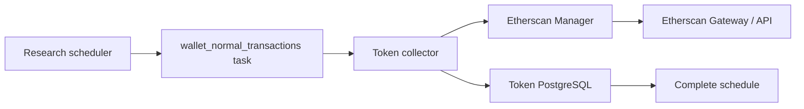

# Project Wallet Pre-Deployment Normal Transactions

## Scope

This capability collects one bounded Etherscan normal-transaction history for
every distinct wallet related to an accepted token project. It owns the strict
pre-deployment block boundary, per-wallet result limit, transaction persistence,
and one-time schedule completion.

Related-wallet discovery, Etherscan key and Gateway scheduling, research
eligibility, report generation, and the project detail read API are outside this
boundary. The collected rows are durable project data but are not research
observations and do not enqueue report builds. Their public filtering and
pagination boundary is documented in the
[Token Project Detail Read Model](project-detail-read-model.md).

## Source Locations

| Concern | Source | Key symbols |
| --- | --- | --- |
| Collector composition | [`cmd/athena-token-collector/commands/athena-token-collector.go`](../../../cmd/athena-token-collector/commands/athena-token-collector.go) | `NewCommand` |
| Collection behavior | [`internal/token/research/application/collector.go`](../../../internal/token/research/application/collector.go) | `WalletNormalTransactionsProcessor` |
| Etherscan Manager adapter | [`internal/token/adapters/normaltransactions/provider.go`](../../../internal/token/adapters/normaltransactions/provider.go) | `Provider.ListNormalTransactions` |
| Atomic persistence | [`internal/token/adapters/postgres/observation_store.go`](../../../internal/token/adapters/postgres/observation_store.go), [`internal/token/adapters/postgres/wallet_normal_transaction_store.go`](../../../internal/token/adapters/postgres/wallet_normal_transaction_store.go) | `CommitCollection`, `insertWalletNormalTransactions` |
| Schema and insert query | [`internal/token/adapters/postgres/migrations/000001_init.sql`](../../../internal/token/adapters/postgres/migrations/000001_init.sql), [`internal/token/adapters/postgres/queries/project_wallet_normal_transaction.sql`](../../../internal/token/adapters/postgres/queries/project_wallet_normal_transaction.sql) | `project_wallet_normal_transaction`, `InsertProjectWalletNormalTransaction` |
| Public read boundary | [`internal/token/adapters/postgres/project_view_store.go`](../../../internal/token/adapters/postgres/project_view_store.go), [`internal/tokenapi/project_detail_service.go`](../../../internal/tokenapi/project_detail_service.go) | `ListProjectWalletNormalTransactionsPage`, `ListProjectWalletNormalTransactions` |
| Process declarations | [`Procfile`](../../../Procfile), [`docker-compose.prod.yml`](../../../docker-compose.prod.yml) | `token-collector-wallet-normal-transactions`, `athena-token-collector-wallet-normal-transactions` |

## Architecture

The collector claims one project task and loads the project's deployment block
plus its related wallets from PostgreSQL. The adapter makes one Manager request
per distinct wallet. PostgreSQL commits the complete result set and the task and
schedule state changes together.

## Runtime Flow

1. The Token Chain Processor's atomic deployment-block commit creates an active
   `wallet_normal_transactions` schedule alongside the other project research
   schedules.
2. The shared Scheduler creates a versioned task while the project remains
   `researching` or `selected`.
3. Task claim loads `project.block_number` and deduplicates
   `project_related_wallet` rows by wallet address while preserving their first
   persisted order.
4. A deployment block of zero has no preceding range and produces a successful
   empty collection without calling Etherscan Manager.
5. Otherwise, the collector queries each wallet sequentially with block range
   `0` through `project.block_number - 1`, page `1`, page size `300`, and
   descending order.
6. Every response is mapped to the token domain model. A successful response
   with no transactions is valid.
7. After every wallet succeeds, one PostgreSQL transaction inserts all returned
   rows idempotently, marks the collection task succeeded, and changes the
   schedule to `completed`.
8. The completed schedule never produces another task. Shutdown follows the
   shared worker-host cancellation and resource-close flow.

## State / Data

`project_wallet_normal_transaction` stores the project and queried-wallet
association plus transaction hash, block number and timestamp, transaction
index, nonce, sender, optional recipient, value, gas limit, gas price, gas used,
input, method ID, function name, receipt status, error flag, and collection
time.

The primary key is `(project_id, wallet, transaction_hash)`. The same chain
transaction may therefore be associated with multiple related wallets, while a
repeated commit for one project-wallet pair remains idempotent. Rows are indexed
by project, wallet, and descending block position. Project deletion cascades to
the transaction rows.

The collection schedule is the durable completion marker. No JSON observation,
current-observation pointer, evidence revision, or report-build task is created
for this data type.

## Configuration

| Setting | Behavior |
| --- | --- |
| `ATHENA_TOKEN_ETHERSCAN_MANAGER_SERVER_ADDRESS` / `--etherscan-manager-server-address` | Manager gRPC address; defaults to `localhost:8100`. |
| `ATHENA_TOKEN_WALLET_NORMAL_TRANSACTIONS_RETRY_INTERVAL` / `--wallet-normal-transactions-retry-interval` | Delay after a failed collection attempt; defaults to 10 minutes. |
| `ATHENA_TOKEN_HEALTH_LISTEN_ADDRESS` / `--health-listen-address` | Collector telemetry address; this collector defaults to `127.0.0.1:8120`. |

The page size `300`, descending ordering, sequential wallet requests, and
strictly pre-deployment block range are application constants.

## Invariants

- Every request ends at exactly one block before the project's deployment
  block, so the deployment transaction and every later transaction are excluded.
- Every distinct related wallet receives at most one request per task attempt
  and at most 300 persisted transaction associations.
- Schedule completion requires every wallet request and the atomic database
  commit to succeed; an empty wallet history still satisfies the request.
- A completed schedule never returns to active.
- This data type does not enter the observation or report pipeline.
- Research lifecycle eligibility remains authoritative: rejected or expired
  projects cannot create or claim collection work.

## Failure Recovery

A Manager RPC failure, invalid response field, numeric overflow, or PostgreSQL
failure fails the task attempt. No transaction rows or success state commit when
the final database transaction fails. Earlier successful RPC calls in the same
attempt are not durable and may be repeated by a later attempt.

The shared collector returns the same task to pending after the configured
10-minute retry interval. Attempts one through nine remain retryable. The tenth
failed call atomically marks the task and schedule failed, and no later task
revision is created. Idempotent inserts protect recovery from a repeated commit.

## Observability

The process uses the shared Token worker endpoints. `GET /healthz` reports host
liveness, `GET /readyz` combines PostgreSQL readiness with the
`wallet_normal_transactions` collector scope, and `GET /metrics` exposes loop
successes, failures, processed tasks, queue counts, and last-error timestamps.
Task and schedule rows retain attempts, last error, last checked time, and
consecutive failures.

## Change Checklist

- [ ] The deployment boundary, wallet deduplication, page size, and ordering remain current.
- [ ] Manager mapping and stored transaction fields remain aligned.
- [ ] Transaction inserts and task/schedule completion remain atomic.
- [ ] Research eligibility, retry behavior, and one-time completion remain current.
- [ ] Configuration, process wiring, health port, and observability remain current.
- [ ] The [design index](../README.md) contains the correct entry.
