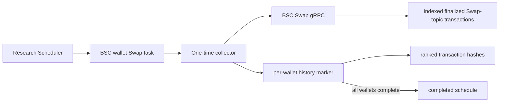

# Wallet Swap Transaction History

## Scope

This capability captures a one-time snapshot of up to 100 indexed BSC V2 Swap-topic transaction hashes sent by every distinct related wallet before the project creation block. It owns the block cutoff request, response validation and deduplication, per-wallet completion checkpoints, rank-preserving hash persistence, task lease renewal, and schedule completion.

The upstream service classifies transactions only by the configured V2 Swap topic and top-level `tx.from`. It does not expose or validate token, pair, Router, Factory, amount, route, or calldata data. This capability therefore records Swap-topic transaction history rather than a list of tokens traded. Related-wallet discovery, observations, reports, selection, and public query APIs remain outside this boundary.

## Source Locations

| Concern | Source | Key symbols |
| --- | --- | --- |
| Process declaration | [Procfile](../../../Procfile) | `token-collector-wallet-swap-transaction-history` |
| Collector composition | [cmd/athena-token-collector/commands/athena-token-collector.go](../../../cmd/athena-token-collector/commands/athena-token-collector.go) | `NewCommand` |
| One-time application flow | [internal/token/research/application/wallet_swap_transaction_history_collector.go](../../../internal/token/research/application/wallet_swap_transaction_history_collector.go) | `WalletSwapTransactionHistoryCollector.RunOnce`, `process`, `renewLease` |
| Typed domain data | [internal/token/research/wallet_swap_transaction_history.go](../../../internal/token/research/wallet_swap_transaction_history.go) | `WalletSwapTransaction`, `WalletSwapTransactionHistory` |
| BSC Swap adapter | [internal/token/adapters/walletswaps/provider.go](../../../internal/token/adapters/walletswaps/provider.go) | `Provider.ListSwapTransactionsBeforeBlock` |
| Upstream contract | [internal/bscswap/bscswap.proto](../../../internal/bscswap/bscswap.proto) | `ListSwapTransactions` |
| PostgreSQL transaction boundary | [internal/token/adapters/postgres/wallet_swap_transaction_history_store.go](../../../internal/token/adapters/postgres/wallet_swap_transaction_history_store.go) | `SaveWalletSwapTransactionHistory`, `CompleteWalletSwapTransactionHistory` |
| SQL queries | [internal/token/adapters/postgres/queries/project_wallet_swap_transaction_history.sql](../../../internal/token/adapters/postgres/queries/project_wallet_swap_transaction_history.sql) | `ListPendingProjectWalletSwapTransactionHistoryWallets`, `InsertProjectWalletSwapTransactionHistory`, `InsertProjectWalletSwapTransaction` |
| Schema | [internal/token/adapters/postgres/migrations/000001_init.sql](../../../internal/token/adapters/postgres/migrations/000001_init.sql) | `project_wallet_swap_transaction_history`, `project_wallet_swap_transaction` |

## Architecture

The Token collector connects directly to the separately deployed BSC Swap indexer with insecure gRPC. It makes one request per wallet and deliberately does not follow the returned page token. PostgreSQL stores the immutable result outside `project_observation`, so the snapshot does not increment evidence revisions or enter reports and selection.

## Runtime Flow

1. Validator promotion creates an active `wallet_swap_transaction_history` schedule only for BSC Mainnet projects, due immediately with a 1-minute full-task retry interval.
2. The Scheduler creates a normal versioned task. The dedicated collector claims this data type only for enabled chain ID `56` and renews its 90-second lease every 30 seconds.
3. PostgreSQL lists distinct related-wallet addresses that do not yet have a Swap history marker.
4. For each wallet, the Provider calls `ListSwapTransactions` with `before_block_number` equal to the project creation block and page size `100`. The entire creation block is excluded.
5. The Provider rejects nil, oversized, out-of-range, or malformed responses. It validates non-zero transaction hashes and removes duplicate hashes while preserving first occurrence order. Rank `0` is the newest returned transaction.
6. The response's indexed-through block and timestamp are persisted even when the indexer is behind the project creation block. A page token is ignored because this capability intentionally keeps only the newest 100 currently indexed hashes.
7. One PostgreSQL transaction inserts the wallet marker and all ranked hashes. A valid zero-result response still inserts the marker. A concurrent duplicate marker makes the save a no-op.
8. Later task attempts skip completed wallets. When every distinct wallet has a marker, task success and schedule completion commit together.
9. Cancellation stops new requests; already committed wallet snapshots remain available to a later task attempt.

## State / Data

`project_wallet_swap_transaction_history` is keyed by project and wallet. It stores the exclusive creation-block anchor, requested and collected counts, upstream indexed-through block and timestamp, and fetch time. Row existence means that wallet is permanently complete, including empty or scanner-lagged responses.

`project_wallet_swap_transaction` is keyed by project, wallet, and rank. It stores only the transaction hash in addition to ownership, ordering, and lifecycle fields. Transaction hash is unique within a project-wallet history. The child table references its marker with cascading deletion, and project deletion cascades through the marker.

One wallet can have multiple roles in `project_related_wallet`; the pending query uses distinct addresses, so those roles produce one snapshot.

## Configuration

| Setting | Behavior |
| --- | --- |
| `ATHENA_TOKEN_BSC_SWAP_SERVER_ADDRESS` / `--bsc-swap-server-address` | BSC Swap gRPC address. Default `localhost:8130`; committed runtime environments use `47.254.154.128:8130`. |
| `ATHENA_TOKEN_WALLET_SWAP_TRANSACTION_HISTORY_RETRY_INTERVAL` / `--wallet-swap-transaction-history-retry-interval` | Delay before a new task revision after fast retries fail. Default 1 minute; accepted range is 1 second through 24 hours. |
| `ATHENA_TOKEN_HEALTH_LISTEN_ADDRESS` / `--health-listen-address` | Collector telemetry listener. The process default is `127.0.0.1:8121`. |

The 100-hash limit, BSC chain ID, 90-second task lease, and 30-second renewal interval are application constants.

## Invariants

- Only hashes returned for the exact related-wallet `tx.from` by the BSC Swap service are collected.
- The entire project creation block and every later block are excluded.
- Each project-wallet history contains at most 100 distinct non-zero hashes in newest-first response order.
- A non-empty next-page token is intentionally ignored.
- Scanner lag is accepted; stored indexed-through values describe the immutable snapshot's actual coverage, and no later backfill occurs.
- A marker and all of its hash rows become visible atomically. A completed wallet is never requested again for the project.
- Only BSC Mainnet projects receive this schedule.
- Swap transaction history is not an observation and cannot affect reports or Selector input.

## Failure Recovery

gRPC, decoding, validation, numeric conversion, or database failures use four fast retries after the initial attempt, followed by a failed task and a new task revision after the configured interval while research remains eligible. Upstream scanner lag and an empty result are successful snapshots rather than retry conditions.

Completed wallet snapshots survive a later wallet failure; the next task attempt loads only missing wallets. The per-wallet transaction prevents a marker from surviving without all of its ranked hashes. Task and schedule completion share a transaction. Lease renewal reduces duplicate claims, while marker uniqueness makes overlapping saves idempotent.

Projects in `rejected` or `expired` state cannot claim remaining work and their active schedules are paused. A selected project remains eligible until this one-time schedule completes.

## Observability

The process exposes the shared `GET /healthz`, `GET /readyz`, and `GET /metrics` endpoints on port 8121. Its telemetry scope uses component `data_collector` and data type `wallet_swap_transaction_history`.

Provider failures include the wallet and invalid response position. Task and schedule rows preserve attempts, availability, lease expiry, last error, failure count, and last checked time. The history marker's counts, fetch time, and indexed-through position distinguish empty, lagged, and caught-up snapshots through SQL queries.

## Change Checklist

- [ ] Recheck the exclusive creation-block request, first-page-only behavior, response validation, deduplication, ordering, and 100-hash limit.
- [ ] Recheck related-wallet distinctness and per-wallet completion semantics.
- [ ] Recheck marker/hash atomicity, task lease renewal, retries, and schedule completion.
- [ ] Recheck the BSC-only schedule, gRPC configuration, process wiring, and port 8121 cleanup.
- [ ] Confirm Swap history remains outside observations, reports, selection, and public APIs.
- [ ] Update the [design index](../README.md) if this capability is moved or split.
