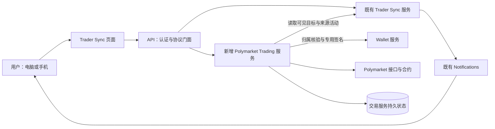

# Trader Sync 手动交易：总体设计提案

> 设计状态：设计中。2026-09-14，用户同意进入前后端与界面设计；2026-09-15 已确认页面组织及[三页的主要交互](../web-ui/trader-sync-manual-trading.md)，包括报价基准、同页核对后直接提交、持仓分组和历史两个视图。同日，用户回复「可以」确认本文的服务分工：新增一个独立交易服务，交易执行与资产同步在其内部按职责和处理资源分开，既有监控、通知和 Wallet 分别承担原有职责及受限签名边界。随后用户再次回复「可以」，确认账户接入优先复用已有账户、核准尚未建立对应账户后再由用户主动启用创建；查询不明或暂不支持时不自动新建。账户接入、执行与占用、领取与同步三段详细设计已确认；八个视图的桌面／手机页面方案也已获用户「认可」。[完整开发规格](../../superpowers/specs/2026-09-15-trader-sync-manual-trading-design.md)已整理、待整体审阅；真实账户验证、实施计划和正式实现仍待完成。

> 用户进一步明确同一账号只允许一个客户端登录，并确认新客户端登录成功后旧客户端立即失效；[单客户端登录](../../requirements/identity-access/single-client-login.md)已记录为全站账户要求，尚未实现。

> 用户已选择交易共用现有 Trader Sync 权限；不增加独立交易授权开关，钱包操作权限、归属、主动启用和逐笔确认继续独立核验。下文记录其目标契约，交易代码尚未实现。

> 用户已选择首次启用采用标准长期资金额度：对已核准的普通／Neg Risk 交易合约设置 pUSD 最大额度，启用页明确展示账户、授权对象和持续有效的范围；每笔交易仍须主动确认。该确认只确定设计，未执行真实授权。

> 用户已选择由 ATHENA 运营方统一配置和维护 Builder 集成凭据；普通用户无需自行填写 Polymarket 接入密钥，各用户的钱包签名与交易身份仍独立管理。真实平台资格、凭据配置和接入尚待验证。

## 设计依据与本次审阅范围

[手动交易需求](../../requirements/polymarket-copy-trading/copy-trading.md)的 25 项业务规则已经确认。本提案把它们落到服务职责、用户流程和信息归属上，不重新讨论金额策略、自动跟单、Combo 执行或站内入金。

已经确认的架构方向是：**在 Trader Sync 内完成用户操作，以一个独立交易服务承接钱包绑定、主动下单、持仓和历史。** 三段详细设计和页面方案已确认；精确接口、数据归属、报价与签名约束及验收矩阵已纳入完整规格。账户实测与正式实现仍待完成。已知平台限制以[平台契约校验](../../requirements/polymarket-copy-trading/manual-trading-contract-verification.md)为依据，不把公开读取样本当成真实交易验证。

2026-09-15，用户已认可[账户接入与首次启用详细设计](polymarket-account-onboarding.md)。该段给出账户类型与控制核验、官网账户及充值地址区分、主动启用步骤、持久状态与恢复、RPC 和 Wallet 专用签名边界；本段设计已确认，真实接入尚未验证。报价、费用、占用及统一派发契约随后由第二段详细设计承接。

第二段[报价、交易执行与资产占用设计](polymarket-trade-execution.md)已于 2026-09-15 获用户认可，确认 15 秒报价期限、整数构单、预计费用与预留分开、按资产合并占用、同库原子接收／派发及原请求恢复。实际部署的费用上界、跨来源资产覆盖和真实执行仍需补证，完整领取与历史同步设计随后由第三段承接并获确认。

第三段[结算领取、持仓与历史同步设计](polymarket-redemption-and-sync.md)已于 2026-09-15 获用户回复「認可」，确认实际领取范围、兑付与准备、范围占用、持仓全集发现、历史精确关联、断点同步和覆盖展示。实际部署、领取到账与完整历史覆盖未通过真实验收，[桌面／手机页面方案 v1](../../requirements/web-ui/trader-sync-manual-trading-proposal.md)已确认，[完整规格](../../superpowers/specs/2026-09-15-trader-sync-manual-trading-design.md)已整合、待整体审阅。

2026-09-15，用户明确无需继续关注 Combo，并允许按需更换公开地址校验。后续验证聚焦普通市场及 Neg Risk 单个选项；已记录的 Combo 字段差异保留为参考，不继续专项追查，也不作为总体设计和普通交易流程细化的前置条件。

## 现状与目标差距

| 能力 | 当前实现 | 本次目标 |
| --- | --- | --- |
| 目标成交提醒 | 独立 Trader Sync 服务发现、核验并发布活动，Notifications 投递通知 | 沿用发现与通知；用户可从活动进入 ATHENA 下单流程 |
| 自有钱包 | Wallet 管理 EVM／Solana 密钥与归属，已有受限 Worm 签名 | 选择属于当前用户的 EVM 钱包，增加专用于 Polymarket 的受限签名能力 |
| Polymarket 交易 | 现有工具库提供部分公开数据读取，没有本次交易执行能力 | 建立实际交易账户映射、明确启用、市价买卖、结算领取及结果核对 |
| 持仓与历史 | 尚无本次自有 Polymarket 钱包的完整资产页面和订单记录 | 展示已接入交易钱包的全部持仓、买卖历史及 ATHENA 提交记录 |

现有源码入口：[Trader Sync API 门面](../../../internal/server/tradersync/tradersync.go)、[独立运行时](../../../internal/tradersync/runtime.go)、[Wallet 服务](../../../internal/wallet/service.go)、[现有 Polymarket 公开读取](../../../util/polymarket/data.go)。

## 服务组织方案

用户于 2026-09-15 已确认下列第一种分工。该次确认覆盖一个独立交易服务的职责、与现有服务的边界，以及下单与历史同步分别安排处理资源；具体 RPC、持久状态和签名协议随后由三段详细设计及完整规格展开。

| 方案 | 职责划分 | 取舍 |
| --- | --- | --- |
| **已确认：一个独立 Polymarket Trading 服务** | 同一服务内分别组织账户准备、交易执行、持仓历史同步；与现有监控和 Wallet 通过接口协作 | 本地提交与实际成交的核对由一个服务负责，部署和故障排查较简单；同步任务必须与提交路径隔离资源，防止历史扫描拖慢下单 |
| 分为交易执行、资产同步两个独立服务 | 执行服务负责启用、签名编排和提交，资产服务负责持仓与历史 | 可以独立扩容和部署，但增加跨服务状态关联、接口、配置和恢复协调；初版需求尚不足以证明拆分收益 |

采用第一种。服务独立运行，内部按职责分模块；当前不增加消息中间件或通用多平台策略引擎。持续核对与同步由交易服务自己的持久任务驱动，不依赖 API 进程里的后台任务。

图中的调用不授予自动交易能力。目标活动只供用户阅读和作为订单来源；交易服务只有在用户明确提交启用、买卖或领取后，才获得相应操作意图。

### 各组件负责什么

| 组件 | 负责 | 边界 |
| --- | --- | --- |
| Trader Sync | 目标身份、订阅、成交活动与活动可见性 | 不因为发现成交调用交易提交或 Wallet 签名 |
| Notifications | 延续现有目标成交的逐条／摘要提醒和站内详情入口 | 用户已确认自行交易结果仅在操作页与历史展示，不额外发布买卖或领取结果通知；点击、重复投递、延迟通知均不生成交易 |
| Polymarket Trading | 目标与钱包绑定、交易账户映射、启用状态、报价、提交记录、签名编排、执行结果核对、持仓和历史投影 | 不持有 Wallet 私钥；不把本地订单尝试冒充 Polymarket 成交 |
| Wallet | 当前用户的 EVM 钱包归属与密钥保管、专用签名 | 私钥不经过浏览器、API 门面或交易服务；签名接口限定用途、账户、链及已确认操作内容 |
| API 门面 | 解析当前认证身份、协议转换、有限结果聚合 | 浏览器传入的 owner、地址、费用或报价不能成为可信执行依据；不托管交易运行时 |
| 前端 | 明确显示交易对象、金额、保护比例、费用与结果，让用户作出本次决定 | 页面访问、自动刷新、返回通知和表单预填均不得签名或提交 |

专用签名能力与现有 Worm 签名隔离；不复用私钥展示接口或增加通用的任意消息／任意交易签名入口。具体签名载荷及服务认证契约在后续设计中确定。

2026-09-15 的[签名可行性调研](../../requirements/polymarket-copy-trading/signing-feasibility-2026-09-15.md)已核对官方协议和 SDK，并完成 26 组 SDK／Go 签名对照及 146 组字段改动检查，证明现有 EVM 密钥与 Go 技术栈可以实现相关签名。此证据不表示专用接口、真实账户认证或交易已经实现。SDK 中存在 V2／V3 合约选择及超出本期范围的默认授权对象，正式接入须核准市场／版本和最小必要操作集合，不能直接照搬通用初始化或授权流程。

## 钱包、绑定与交易账户

这里需要明确三个不同对象：用户在 Wallet 中拥有的 EVM 签名钱包、Polymarket 实际持有资金与仓位的交易账户，以及该钱包当前绑定的目标。前两者的地址可能不同。

绑定记录保存当前目标与自有 Wallet 的关系；交易账户记录保存 Wallet 身份、实际账户地址、账户类型及必要准备状态。二者分别管理，解绑不删除交易账户或历史。当前绑定须同时满足目标与自有钱包一对一；还应避免多个 Wallet 记录指向同一实际交易账户而绕过一对一约束。

账户页面分别展示：当前绑定、实际交易账户、交易准备状态、可用余额及其更新时间。不能用一个「已连接」状态代替这些事实。

1. **选择与绑定：**只读取自有钱包信息并保存关系，不触发签名、部署、授权或入金。
2. **核对账户：**解析并验证自有 EVM 签名身份与 Polymarket 账户的对应关系。可自动解析时带入供核对；不能唯一确定时，需要用户提供官网账户地址并验证实际控制关系，单纯输入地址不算验证通过。
3. **主动启用：**向用户展示本次必要准备，由用户明确确认后执行。复用已有效的准备，分别显示成功、失败或待核对；不能允许 SDK 在报价或普通下单时悄悄补做缺失授权。
4. **外部入金：**用户自行到 Polymarket 为已核准的对应账户入金。ATHENA 显示该账户与余额，返回后重新读取实际资金，不执行划转。
5. **解绑／换绑：**改变当前对应关系，保留原交易账户、持仓、支持范围内的卖出／领取入口及历史；现有订单继续使用提交时冻结的账户。

新建账户与接入已有账户的产品顺序、平台统一管理接入凭据的方式已确认，具体账户类型、平台凭据配置与接入实现仍需落实。[平台校验](../../requirements/polymarket-copy-trading/manual-trading-contract-verification.md)已经发现当前账户类型、Relayer／Builder 凭据和授权要求；必须补证官网登录、官网入金与 ATHENA 操作同一账户的完整链路后才能确定接入实现。当前不承诺点击启用即可为任意 Wallet 自动获得官网可登录账户，也不为解决这一问题扩大为新的私钥导出或站内充值功能。

### 账户接入顺序（已确认）

用户已确认**优先复用所选 EVM 钱包可控制的已有 Polymarket 交易账户；核准尚未建立对应账户时，再在用户主动启用过程中准备新账户**。用户自行到官网入金、ATHENA 内启用及手动交易的要求继续有效。已有账户暂不支持或未核对清楚，均不算尚未建立账户。

现有 [Wallet 接口](../../../internal/wallet/wallet.proto)和[归属设计](../identity-access/wallet-ownership.md)已支持创建与导入 EVM 钱包，本轮复用其选取、归属和密钥保管能力。交易设置只使用 Wallet ID 和安全身份信息，不增加另一个私钥导入入口。

| 账户核对结果 | 已确认的处理方向 |
| --- | --- |
| 存在可核准控制关系、类型受支持的已有账户 | 展示实际账户供核对，复用其资金、持仓及历史；仍须明确启用所需的认证与交易授权 |
| 已核准尚未建立对应账户 | 在启用前说明将准备新账户；用户主动确认后执行必要准备，成功后展示实际账户，再按官网入金流程继续 |
| 查询失败、控制关系不明或存在多个候选 | 展示具体原因或候选供核对；不能把失败解释为账户不存在，也不能自行改用另一个账户 |
| 发现已有账户但暂不支持其类型或缺少必要条件 | 保留明确原因，不通过静默新建账户绕开原有资金和持仓 |

解析和预览只读；SDK 的客户端初始化若会部署、签发凭据或补授权，不能放在查询路径。账户创建或启用提交后结果未知时，只核对原请求，不再次创建。已保存的实际账户不因后续重新发现或当前余额为零而自动切换；已有提交继续关联当时账户。

2026-09-15 再次核对[官方钱包与认证说明](https://docs.polymarket.com/trading/wallets-auth)：已有账户连接与新账户创建是不同路径，签名身份与实际账户分别返回；新建 Deposit Wallet 涉及 Builder 凭据，钱包操作涉及相应 Relayer／Builder 能力。这些文档不替代 ATHENA 的实际接入验证。账户类型支持表、控制关系核对方式、平台凭据配置与校验、必要授权，以及官网可登录并入金到同一账户的验证仍须落实。

### 接入凭据由谁管理（已确认）

2026-09-15，用户选择方案 A，确认由 ATHENA 统一配置集成凭据，普通用户无需额外获取或填写 Polymarket 接入密钥。账户接入顺序、标准长期额度、实际账户归属及逐笔确认规则继续有效。

2026-09-15 核对[官方钱包与认证说明](https://docs.polymarket.com/trading/wallets-auth)：创建 Deposit Wallet 使用集成方 Builder 凭据，钱包操作可使用有效的 Builder 或 Relayer 凭据，订单认证还需要签名身份对应的 CLOB 凭据。集成方凭据与用户钱包签名职责不同，不能用一套平台交易身份替代各用户的钱包身份。

ATHENA 运营方配置和维护有效 Builder 凭据及所需接入条件；交易服务承担凭据状态与错误诊断。普通用户选择自有钱包、核对实际账户并主动启用；初版不增加用户自配 Relayer 凭据的配置路径。

必要的 CLOB 认证通过对应钱包的受限签名流程取得，并按真实签名身份、账户映射及 ATHENA owner 隔离管理；Wallet 私钥继续留在 Wallet 服务。集成凭据只供所需服务使用，不进入浏览器；普通用户页面不增加运营凭据配置字段，也不因此允许 ATHENA API Key 发起交易。

凭据失效或接入条件未满足时，受影响的创建、准备或领取操作展示明确的不可用原因，由平台处理接入配置；具体故障范围按操作实际依赖划分，不将所有读取或已具备条件的操作一律判为不可用。当前只有官方契约依据，尚未验证真实 Builder 资格、有效凭据及各账户类型的实际接入；本节不授权申请账号、生成凭据或执行链上操作。

### 启用流程的承接设计

以下将已确认的主动启用要求细化为处理步骤；标准长期资金额度已确认，具体合约及版本、账户类型和签名载荷仍须核准，不将「启用」解释为任意钱包操作授权。

| 阶段 | 需要记录或展示的内容 | 执行边界 |
| --- | --- | --- |
| 读取准备情况 | 当前 Wallet 与签名身份、已核准实际账户或待创建账户、已有有效准备、仍缺少的步骤 | 只读，不因打开设置调用有部署或签名副作用的初始化方法 |
| 展示本次启用内容 | 是否创建账户、本次需要的认证和交易授权、适用账户与网络 | 用户明确确认本次准备范围；账户或授权范围改变时重新核对 |
| 接收启用提交 | 用户身份、稳定提交标识、确认内容及各步骤执行进度 | 同一次确认的重复请求返回原尝试，不重新开始整套准备 |
| 执行必要步骤 | 每一步的已知结果、实际产生的远端标识与核对证据 | 已核准成功的步骤复用；未知结果先查询，不能当作失败重发 |
| 核验准备结果 | 实际账户对应关系、所需认证和授权是否就绪 | 只有必要条件均已核准才显示准备完成；余额独立展示，准备完成不代表已经入金 |

已确认某一步未发出或失败后，用户可以根据刷新后的准备内容主动继续；如果扩大原确认范围，须再次明确确认。启用记录在交易钱包设置中追溯，买卖和领取仍使用各自独立的提交记录。账户已准备好但余额不足时显示真实缺口，不自动发起入金或划转。

### 首次启用的链上授权额度（已确认）

2026-09-15，用户明确选择方案 A，确认首次启用采用标准长期资金额度。本次批准的是产品与技术设计，不表示已执行或获准立即执行真实账户创建、签名或链上授权。

当日重新核对[官方交易授权说明](https://docs.polymarket.com/trading/wallets-auth#set-up-trading-approvals)：普通与 Neg Risk 两个交易合约分别需要 pUSD 支出额度，以及 Conditional Tokens 的合约级操作授权。官方示例采用 `approve(exchange, maxUint256)` 和 `setApprovalForAll(exchange, true)`；ERC-20 接口也可设置具体金额。SDK 的普通下单路径可能自动补齐缺少的授权，ATHENA 必须按既有主动启用要求控制该副作用，不能把下单确认扩展为追加授权。

采用标准长期额度：用户在启用页明确确认后，对已核准的普通／Neg Risk 交易合约设置 pUSD 最大额度；已符合目标的有效准备按实际条件复用。通常无需因额度消耗再次准备，授权持续有效且金额范围较广，确认内容必须明确说明。首版不提供用户指定有限额度的配置分支。

实施须保留以下边界：

- pUSD 资金额度与 Conditional Tokens 的操作授权分别展示。后者是交易合约对该账户相应代币的整体操作权限，不能描述为只授权当前目标、当前市场或一笔卖出的份额；两者都不能宣传成单笔订单预算或仅对当前余额有效。
- 链上授权不代替 ATHENA 的逐笔确认、钱包归属、当前权限、实时余额与价格保护检查。此项选择不改变买入本金与手续费的口径，不增加自动跟单、自动补单或自动补授权。
- 确认内容列明实际交易账户、授权对象与额度。合约地址、实现版本、调用方法及参数由 Wallet 的专用签名边界核验；不允许浏览器或交易服务请求任意合约授权。
- 这里只讨论普通／Neg Risk 买卖的首次准备。领取所需 adapter、已有账户授权的具体处理和恢复路径仍须在完整执行规格中核准；不借本节加入转账、充值、Combo 操作或额外授权。

上述平台事实来自公开官方文档与当前源码核对；没有执行私有账户接入、真实授权或交易验证。需求和页面确认内容已按本次选择同步；账户接入实测、平台凭据配置与校验、领取所需准备仍须继续设计。

## 用户操作与后端处理如何衔接

### 从提醒买入

用户打开活动，看到目标的历史成交事实；进入下单后，系统读取目标**当前**绑定，展示本次自有钱包、实际交易账户、准确的市场与 Outcome，再读取当前报价。历史成交价与当前买入报价明确分开。

用户于 2026-09-15 已确认价格偏差基准：买入使用本次可见卖一价，卖出使用本次可见买一价，预计成交均价另外展示。报价过期后刷新并由用户重新核对，不静默放宽保护边界。[执行设计](polymarket-trade-execution.md#2-用户看到的报价)中的 15 秒有效期、按 tick 收紧边界及整数构单不变量也已获用户认可，实际实现与验证尚未完成。

用户输入买入本金和允许的价格偏差，核对预计份额、费用与总支出后明确提交。后端记录这次提交，复查当前权限、钱包归属、绑定版本、市场可交易状态、报价有效性、可用余额与授权，再依据确认内容构单、签名和发送。校验失败也更新这次已接收的提交记录；不静默改金额、钱包或保护范围。

同一提交使用稳定的幂等标识，并关联不可变的确认内容。内容不同的请求不能借用旧标识；刷新或网络重试返回原记录。重复点击不创建新订单；用户主动重新下单才建立新的提交。

### 单客户端登录与交易提交

用户已明确要求[同一账号只允许一个客户端登录](../../requirements/identity-access/single-client-login.md)，并确认新客户端登录成功后旧客户端立即失效。电脑与手机均可使用，但不允许同一账号同时在两端保持有效登录；该能力由账户凭据层统一承担，不能只在交易页限制。

交易入口使用当前有效会话，失效会话不能取得新的提交许可。合法接收的已有提交按原记录继续处理和核对，新客户端可在原账号下查看结果；切换客户端本身不取消已发送交易，也不复制订单。会话替换与交易接收的先后依据[单客户端登录目标设计](../identity-access/single-client-login.md)落实。

用户已确认按本笔占用的资金／份额限制后续交易，其余可独立核准的可用资产仍可操作，详见[待处理操作与后续交易](#待处理操作与后续交易已确认)。单客户端仍可能产生重复点击、网络重试和多个请求，后端必须保留同一提交幂等、当前余额与份额校验、受控发送和未知结果核对；具体并发协调继续细化，不以设备数量代替这些约束。

### 从持仓卖出或领取

卖出入口固定到该仓位所属的实际账户和 Outcome，不依赖钱包是否仍绑定目标。用户选择持仓比例，系统换算并展示当前可卖份额和价格保护；余额、精度或行情变化导致原确认不再有效时，先让用户核对更新结果。

领取是独立操作。预览需核对市场结算、当前持有份额和实际可领取资金；不能仅凭 `redeemable` 标志显示正收益。若平台领取实际会处理同一市场的多个 Outcome，确认界面需展示完整影响范围，不能承诺只处理用户点中的一行。Combo 只读范围在前后端同时校验。[领取详细设计](polymarket-redemption-and-sync.md#2-领取到底处理什么)已获确认，进一步区分全余额与指定数量路径、分项兑付及准备步骤。

### 超时、失败和部分成交

| 已知事实 | 用户看到的含义 | 后续处理 |
| --- | --- | --- |
| 提交前业务校验被拒绝 | 本次未发出，显示具体原因 | 保留本次记录；用户修改后可以明确提交新订单 |
| 请求已交付交易所或是否交付未知 | 处理中／待核对 | 查询原订单、原交易和实际成交；不生成新签名订单自动补发 |
| 核准部分成交 | 实际成交金额、份额和费用，剩余未成交 | 更新原记录；不自动补买、补卖或挂单等待 |
| 核准未成交／失败 | 未成交或失败及已知原因 | 保留原结果；用户决定是否再次下单 |
| 已确认实际成交或领取 | 实际结果与关联事实 | 同步持仓和历史；数据尚未追上时明确显示同步中 |

执行前持久化足以核对原请求的身份与内容；签名载荷、提交标识及交易所标识按实际产生顺序关联。数据库事务不能保证远端只执行一次，不将此方案宣传为跨 Polymarket 的 exactly-once。服务重启恢复已有提交的核对，不把未能证明发出过的请求当成新任务重签重发。具体发送许可、崩溃窗口及恢复判定将在执行状态设计中逐项展开。

### 待处理操作与后续交易（已确认）

2026-09-15，用户选择 A：一笔买入、卖出或领取正在处理／结果待核对时，按本笔可能占用的资金或份额限制后续操作；同一钱包中其余已核准可用、且本次必要条件齐备的资产可以继续交易。其他钱包按各自条件操作，不采用「同一钱包上一笔结果核准后才允许任何新操作」的统一限制。

同一提交防重复、未知结果持续核对和不自动补单继续保留。已确认的具体规则如下：

- 买入预留可核准的本金与费用支出上界；卖出预留本次提交的对应 Outcome 份额；领取按实际会处理的 Outcome 范围协调。剩余资产须核准可用，尚未确认到账的卖出收入、买入份额或领取资金不能提前用于另一笔操作。
- 例如，已核准可用资金为 100，本次买入连费用最多使用 30，则处理期间预留 30；剩余 70 在仍可核准且其他条件齐备时，可由用户再次确认用于新交易。这里的数字只说明预留规则，不是实际报价或已确定的费率。
- 预留是 ATHENA 对后续提交的可用量约束，不是链上冻结，也不能阻止同一账户在其他渠道操作。每次提交仍核对上游当前事实及已知占用；无法核准资金或某项份额时，依赖它的操作等待核对，其他可独立核准的资产与钱包不因此统一停用。
- 超时、关闭页面、服务重启或一次查询未找到订单都不能单独释放原占用。根据原提交的实际执行、结算及当前资产事实调整占用；上游已反映的扣减与本地预留须协调，不能简单相减造成重复扣减。已确认部分成交时，剩余部分也须核准不再可能执行后才恢复可用。

后续交易仍须逐笔确认并核验报价有效性，不把等待中的按钮点击转成可在未来自动执行的新订单。页面须说明暂不可用的原因并链接原处理记录；不把处理中金额显示成已成交金额。

2026-09-15 复核的[官方订单生命周期](https://docs.polymarket.com/concepts/order-lifecycle)区分订单匹配和成交最终确认，并要求扣除已有订单占用；[单订单查询](https://docs.polymarket.com/api-reference/trade/get-single-order-by-id)也明确已匹配份额不等于当前持仓。这支持分别核对订单、结算与可用资产的设计方向，不代表 ATHENA 的预留实现已经验证。费用上界计算、占用的原子接收、上游数据与本地预留的协调及恢复证据将在执行规格中落实；不能通过静默缩减买入本金满足预算。

## 数据归属与历史

| 数据 | 权威依据 | 本地用途 |
| --- | --- | --- |
| 当前绑定、用户价格偏好 | ATHENA | 新订单默认钱包与表单设置 |
| 用户主动提交的确认内容、拒绝原因、处理进度 | ATHENA | 保留每次系统接收的提交及其处理过程 |
| 提交时的来源活动与目标 | 经可见性核验的 Trader Sync 事实及冻结关联 | 换绑后仍能回看当时参考的交易，不给外部成交补造来源 |
| 实际订单受理、成交、持仓与结算 | Polymarket 的接口及必要的已核准链上事实 | 持久化、核对、分页展示；预计值不覆盖实际值 |
| 数据覆盖与同步进度 | 实际抓取范围、分页与核对记录 | 展示更新时间、缺失范围和异常，不用「0」代表未获取 |

历史页已确认使用「本系统记录」展示 ATHENA 的主动提交，「成交历史」展示已接入交易账户的全部买卖，包括绑定前和其他渠道。两者根据实际结果关联，一次提交可以对应多笔成交；不混成一张声称完整的交易所订单列表。领取在本系统记录中有独立操作类型，不伪装成卖出；拒绝、失败和待核对的提交同样保留。

### 首次历史同步与交易就绪（已确认）

2026-09-15，用户选择 A：本次交易条件核准后即可操作，更早的完整历史继续后台同步并展示实际进度。交易资格、当前资产读取与历史覆盖分别判断，不以全部历史同步完成作为首次交易的统一前置条件。

| 当前情况 | 操作与展示 |
| --- | --- |
| 本次操作的身份、账户准备、授权、实时余额／可用份额、占用及市场状态已核准 | 允许用户按既有流程核对并确认提交；更早历史继续同步 |
| 仅更早历史尚未同步完成或读取失败 | 展示已有记录、实际覆盖范围、进度及异常；不单独因此阻止已具备条件的交易 |
| 本次操作所需的当前余额、份额、授权或结算事实无法核准 | 说明该操作待核对的条件，条件具备后才允许提交；不依据不完整历史推算可用资产 |

完整持仓和历史的已确认范围保持不变；不能把缺失或同步中的数据填零、隐藏或宣称已全部同步。历史未齐不表示当前交易条件一定已知，两种状态在界面分别展示；后台同步方案不降低每次操作的校验要求。

实现上，初次历史同步和持续更新使用独立处理资源，设置有界并发、分页进度和重试退避。前端读本地稳定分页结果并展示数据时间；提交资格读取实时必要条件，不用陈旧资产缓存放行交易。具体并发占用和未知提交核对仍须在执行规格中落实；本次确认未实现历史同步或交易代码。

当前 Data API 默认时间、成交角色和小额过滤会影响普通市场与 Neg Risk 的覆盖。历史同步不能直接套用现有 V1 数组／offset 读取实现；需按已核对的当前 V2 契约设计，跨页保留原过滤参数。这些市场的归档／inactive、小额及更早历史仍须补证；在覆盖未证实前，不显示「全部同步完成」，也不降低已确认的完整展示要求。Combo 已有独立接口样本，后续专项补证按用户要求停止推进。

[timetowander 公开账户复核](../../requirements/polymarket-copy-trading/timetowander-public-account-verification-2026-09-14.md)补充了实际约束：同一 24 小时内全角色成交 740 条、仅 taker 34 条；CLOSED 中仍有 265 条正份额小额余量，OPEN 即使设置低门槛也没有这些记录。后续资产投影需联合核对 OPEN／CLOSED，并按实际份额及市场状态决定展示；不能把 CLOSED 当作严格归零。另有 874 条可赎回标记为真但价值为零的记录，以及 Combo 腿市场 ID／标签的来源差异，分别要求领取资格复查和市场关联核对。此处只读事实不会新增自动交易，也未闭合真实账户启用或签名验证。

## 页面组织（已确认）

用户于 2026-09-15 回复「确定，这个页面组织方式可以。」确认下列入口和页面职责，以及电脑／手机使用相同买卖确认流程。该次页面组织确认不包含完整字段状态或正式视觉稿；后端服务分工已在随后的单独讨论中确认，见前文。

产品入口仍为 **Trader Sync**，沿用[已确认的首页活动／目标布局](../../requirements/web-ui/trader-sync-home-proposal.md)和[订阅详情层级](../../requirements/web-ui/trader-sync-subscription-detail-proposal.md)。新页面继承[全站 Nansen 深色主题](../../requirements/web-ui/visual-theme.md)、Inter／JetBrains Mono、既有表单与确认状态；本轮不重新选择主题。

| 页面／入口 | 主任务与新增内容 | 电脑与手机处理 |
| --- | --- | --- |
| 首页与活动详情 | 买入活动进入买入；卖出活动提供当前绑定钱包内同一市场、同一选项的对应持仓入口，可继续手动卖出。保留目标方向、完整钱包和原始事实；页级提供持仓、历史入口 | 延续当前阅读层级；手机从通知直达具体活动，登录后恢复该上下文 |
| 目标详情中的交易钱包区 | 绑定／换绑、查看实际账户与准备状态、主动启用、余额与外部入金提示 | 与监控和通知状态分开表达；完成设置后能返回原活动 |
| 下单确认页 | 上方核对市场／Outcome／账户，下方输入金额或卖出比例、价格偏差，并展示报价、预计费用与提交结果 | 使用可直接访问和恢复的页面；桌面充分利用宽度，手机按同一核对顺序排列，提交区不遮挡字段或错误 |
| 持仓页 | 按钱包筛选，展示全部仓位；每个支持操作的仓位提供卖出或领取入口 | 桌面表格、手机逐仓位排列；Combo 清楚标明只读；已解绑钱包仍可筛选 |
| 历史页与记录详情 | 本系统记录／成交历史两种视图，钱包和市场筛选；详情追溯来源、实际成交、失败或待核对原因 | 桌面与手机保留同一字段语义；长地址、原始来源和技术证据沿用按需展开方式 |

下单页复用买卖表单结构，领取使用独立确认内容。新增入口不会把目标卖出行为解释为用户卖出指令；目标活动始终只是参考事实。[下单、持仓与历史的交互提案](../web-ui/trader-sync-manual-trading.md)中，报价基准、均价单独展示和过期后重新核对已确认。用户也已确认同页填写、核对后点击买卖确认按钮直接提交并显示处理结果，电脑与手机一致，不再额外弹出内容重复的确认框。

持仓按未结算／已结算／资料待核对分组、钱包筛选、未结算优先及已结算组内可领取优先也已确认；小额余量与仍有份额的零价值仓位保留，同一市场不同钱包分别展示。历史页的本系统记录／成交历史两个视图、一次提交与多笔成交的关联查看也已确认。随后用户已认可[八个视图的桌面／手机页面方案](../../requirements/web-ui/trader-sync-manual-trading-proposal.md)，字段布局和所展示状态沿用该批方案；必要辅助状态仍须在正式实现中覆盖与验证。视觉继承[最新 v23 共用修订](../../requirements/web-ui/theme-consistency-contract.md)。

## 权限、事务与服务运行边界

本方案遵循[服务开发规范](../../developer-guide/service-development-standards.md)，适用关系如下。

| 规则 | 本次设计约束与后续验证证据 |
| --- | --- |
| SDS-R1 | 新交易能力由独立进程负责；API 停止不会把订单核对状态丢在内存中。后续验证独立启动、重启恢复与有界停止 |
| SDS-R2 | API 只传递服务端解析的 actor；内部默认 gRPC，使用独立服务认证。交易服务核验当前权限，Wallet 重复核验归属；不经 RPC 传递数据库事务 |
| SDS-R3／SDS-R4 | 交易服务拥有自己的构建／运行入口、凭据、超时和就绪状态；监控、通知与交易可分别部署。历史读取失败不能等同于下单结果失败；交易依赖故障不拖垮其他页面 |
| SDS-R5 | 在现有实例运行器中新增可正向选择的交易服务；最小交易组合按功能选取数据库、Wallet、API，涉及来源活动时包含 Trader Sync；通知不成为卖出／领取前提。具体服务名、命令和配置随详细设计给出，目前不存在可运行的新服务命令 |
| SDS-R6 | [执行设计](polymarket-trade-execution.md#5-接收签名与派发)已确认账户权威状态同库的接收／占用／许可表、受控 adapter、统一锁顺序及独立 Wallet 签名边界；未实现或验证撤权与发送竞态，不跨服务借用事务 |
| SDS-R7／SDS-R8 | 本文记录目标与现状，后续规格补齐接口、持久状态、故障与验证矩阵。此次仅核对文档及源码，不宣称私有交易、服务启动或浏览器验收完成 |

### 交易权限沿用 Trader Sync（已确认）

用户已选择共用现有 Trader Sync 权限。初版不增加独立的交易模块授权或交易开关；新增独立交易服务不代表新增产品权限。当前[账户模块模型](../../../internal/accountaccess/access.go)中，`trader_sync` 只允许 NONE／READ_WRITE，`wallet` 允许 NONE／READ／READ_WRITE；现有矩阵继续使用。

目标契约如下：

- 目标提醒沿用既有 Trader Sync 权限，不因为增加交易功能而要求用户先具备 Wallet 权限或先启用钱包。
- 交易启用、买入、卖出和领取需要当前 `trader_sync = READ_WRITE`，同时具备 `wallet = READ_WRITE` 的钱包操作权限；选择的钱包必须仍属于当前用户。Trader Sync 开通本身不授予 Wallet 权限。
- 具备权限、选择绑定、钱包已准备好与用户本次确认是不同条件；管理员开通权限不执行账户准备、签名或交易，已启用钱包仍按每次提交的当前条件核验。
- 提醒和交易共用产品权限，不将此决定扩展为管理员代用户操作、API Key 下单、访问其他用户钱包或逐笔二次身份验证。

当前[账户事务门禁](../../../internal/accountstate/txgate/gate.go)、[授权变更接口](../../../internal/accountstate/store/access_hooks.go)和[账户凭据边界](../identity-access/account-credentials.md)是后续权限实现的核对依据。交易写入拟仅接受当前用户的有效交互式会话；具体读取 RPC 的 Wallet 权限、撤权与已接收操作的先后边界已纳入[完整规格](../../superpowers/specs/2026-09-15-trader-sync-manual-trading-design.md#4-单客户端登录与权限)，等待实现验证。用户已确认的共用产品权限和钱包操作资格不再作为待选择方案；当前尚未实现交易鉴权或交易接口。

## 后续设计需闭合的技术事项

本轮新增的首次启用长期额度、平台统一管理接入凭据、当前条件就绪即可交易并后台同步历史，以及按资金／份额占用限制后续交易，均已获用户选择。当前没有另列待用户选择的业务方案；以下事项已有三段详细设计支撑；页面已确认、完整规格已整理，后续仍须整体审阅规格并完成实施计划、实现与真实验证，包括单客户端登录要求。若进一步核验发现实际能力与已确认需求冲突，再带具体证据和影响提出取舍，不将尚待工程落实的事项视为已实现。

- **账户接入链路：**核准官网与 ATHENA 的同一账户、支持的账户类型、已确认平台凭据的配置与校验、启用授权的具体对象和远程签名接口；实际账户测试目前未执行。
- **报价与执行契约：**落实已确认的买入卖一价／卖出买一价基准，细化报价有效期、按价格步长收紧边界、含费用余额校验、实际签名金额精度，以及 FAK 的结果映射；不得改变已确认的本金与费用口径，报价过期后须重新核对。
- **持久状态和并发：**按已确认的资金／份额占用规则，给出预留与释放证据、上游已扣减资产的协调、绑定唯一约束、提交幂等键、账户与余额并发、撤权边界、签名与网络发送崩溃窗口、未知结果核对和避免自动重发的契约。
- **资产完整范围：**核对普通市场及 Neg Risk 单个选项的 API 覆盖与链上补证策略，未获取数据不能当作零；按需使用其他公开钱包覆盖缺少的场景，不继续追查 Combo。
- **完整交互与验收：**按已确认页面方案实现绑定／启用、买卖确认、领取、持仓与历史的电脑／手机状态，并覆盖旧通知换绑、部分成交、余额不足、数据过期、未知结果和历史分页。

已确认的服务分工、账户接入顺序、页面组织、[主要交互](../web-ui/trader-sync-manual-trading.md)、单客户端登录规则、共用 Trader Sync 权限、自行交易结果仅在页面与历史展示及目标卖出活动进入对应持仓的规则直接沿用。当前会话替换与交易接收边界、授权范围、执行与同步契约已由三段详细设计确认；[本批页面方案](../../requirements/web-ui/trader-sync-manual-trading-proposal.md)已确认；[Superpowers 完整规格](../../superpowers/specs/2026-09-15-trader-sync-manual-trading-design.md)已整合设计、接口、工程边界和验证缺口，待整体审阅后编写实施计划。当前不进行登录或交易代码实现。
