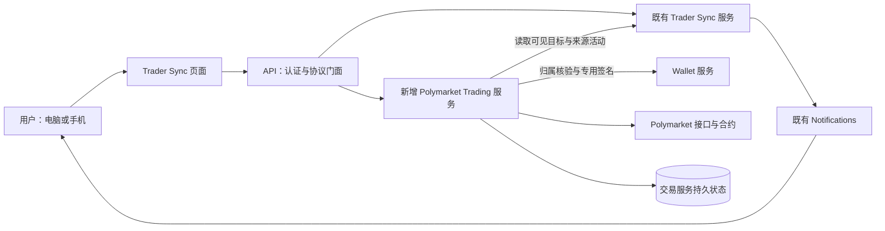

# Trader Sync 手动交易：总体设计提案

> 设计状态：设计中。2026-09-14，用户同意在已确认需求和平台校验的基础上进入前后端与界面设计。本文是第一部分的总体方案，服务划分与页面组织属于本轮建议，尚未获得设计确认；不是已经实现的功能或可直接执行的完整开发规格。

## 设计依据与本次审阅范围

[手动交易需求](../../requirements/polymarket-copy-trading/copy-trading.md)的 25 项业务规则已经确认。本提案把它们落到服务职责、用户流程和信息归属上，不重新讨论金额策略、自动跟单、Combo 执行或站内入金。

本次审阅的核心是：**在 Trader Sync 内完成用户操作，以一个独立交易服务承接钱包绑定、主动下单、持仓和历史。** 账户接入实测、精确接口与数据结构、报价与签名算法、完整页面交互仍需继续细化。已知平台限制以[平台契约校验](../../requirements/polymarket-copy-trading/manual-trading-contract-verification.md)为依据，不把公开读取样本当成真实交易验证。

## 现状与目标差距

| 能力 | 当前实现 | 本次目标 |
| --- | --- | --- |
| 目标成交提醒 | 独立 Trader Sync 服务发现、核验并发布活动，Notifications 投递通知 | 沿用发现与通知；用户可从活动进入 ATHENA 下单流程 |
| 自有钱包 | Wallet 管理 EVM／Solana 密钥与归属，已有受限 Worm 签名 | 选择属于当前用户的 EVM 钱包，增加专用于 Polymarket 的受限签名能力 |
| Polymarket 交易 | 现有工具库提供部分公开数据读取，没有本次交易执行能力 | 建立实际交易账户映射、明确启用、市价买卖、结算领取及结果核对 |
| 持仓与历史 | 尚无本次自有 Polymarket 钱包的完整资产页面和订单记录 | 展示已接入交易钱包的全部持仓、买卖历史及 ATHENA 提交记录 |

现有源码入口：[Trader Sync API 门面](../../../internal/server/tradersync/tradersync.go)、[独立运行时](../../../internal/tradersync/runtime.go)、[Wallet 服务](../../../internal/wallet/service.go)、[现有 Polymarket 公开读取](../../../util/polymarket/data.go)。

## 服务组织方案

| 方案 | 职责划分 | 取舍 |
| --- | --- | --- |
| **推荐：一个独立 Polymarket Trading 服务** | 同一服务内分别组织账户准备、交易执行、持仓历史同步；与现有监控和 Wallet 通过接口协作 | 本地提交与实际成交的核对由一个服务负责，部署和故障排查较简单；同步任务必须与提交路径隔离资源，防止历史扫描拖慢下单 |
| 分为交易执行、资产同步两个独立服务 | 执行服务负责启用、签名编排和提交，资产服务负责持仓与历史 | 可以独立扩容和部署，但增加跨服务状态关联、接口、配置和恢复协调；初版需求尚不足以证明拆分收益 |

推荐第一种。服务独立运行，内部按职责分模块；当前不增加消息中间件或通用多平台策略引擎。持续核对与同步由交易服务自己的持久任务驱动，不依赖 API 进程里的后台任务。

图中的调用不授予自动交易能力。目标活动只供用户阅读和作为订单来源；交易服务只有在用户明确提交启用、买卖或领取后，才获得相应操作意图。

### 各组件负责什么

| 组件 | 负责 | 边界 |
| --- | --- | --- |
| Trader Sync | 目标身份、订阅、成交活动与活动可见性 | 不因为发现成交调用交易提交或 Wallet 签名 |
| Notifications | 延续现有逐条／摘要提醒和站内详情入口 | 点击、重复投递、延迟通知均不生成交易 |
| Polymarket Trading | 目标与钱包绑定、交易账户映射、启用状态、报价、提交记录、签名编排、执行结果核对、持仓和历史投影 | 不持有 Wallet 私钥；不把本地订单尝试冒充 Polymarket 成交 |
| Wallet | 当前用户的 EVM 钱包归属与密钥保管、专用签名 | 私钥不经过浏览器、API 门面或交易服务；签名接口限定用途、账户、链及已确认操作内容 |
| API 门面 | 解析当前认证身份、协议转换、有限结果聚合 | 浏览器传入的 owner、地址、费用或报价不能成为可信执行依据；不托管交易运行时 |
| 前端 | 明确显示交易对象、金额、保护比例、费用与结果，让用户作出本次决定 | 页面访问、自动刷新、返回通知和表单预填均不得签名或提交 |

专用签名能力与现有 Worm 签名隔离；不复用私钥展示接口或增加通用的任意消息／任意交易签名入口。具体签名载荷及服务认证契约在后续设计中确定。

## 钱包、绑定与交易账户

这里需要明确三个不同对象：用户在 Wallet 中拥有的 EVM 签名钱包、Polymarket 实际持有资金与仓位的交易账户，以及该钱包当前绑定的目标。前两者的地址可能不同。

绑定记录保存当前目标与自有 Wallet 的关系；交易账户记录保存 Wallet 身份、实际账户地址、账户类型及必要准备状态。二者分别管理，解绑不删除交易账户或历史。当前绑定须同时满足目标与自有钱包一对一；还应避免多个 Wallet 记录指向同一实际交易账户而绕过一对一约束。

账户页面分别展示：当前绑定、实际交易账户、交易准备状态、可用余额及其更新时间。不能用一个「已连接」状态代替这些事实。

1. **选择与绑定：**只读取自有钱包信息并保存关系，不触发签名、部署、授权或入金。
2. **核对账户：**解析并验证自有 EVM 签名身份与 Polymarket 账户的对应关系。可自动解析时带入供核对；不能唯一确定时，需要用户提供官网账户地址并验证实际控制关系，单纯输入地址不算验证通过。
3. **主动启用：**向用户展示本次必要准备，由用户明确确认后执行。复用已有效的准备，分别显示成功、失败或待核对；不能允许 SDK 在报价或普通下单时悄悄补做缺失授权。
4. **外部入金：**用户自行到 Polymarket 为已核准的对应账户入金。ATHENA 显示该账户与余额，返回后重新读取实际资金，不执行划转。
5. **解绑／换绑：**改变当前对应关系，保留原交易账户、持仓、支持范围内的卖出／领取入口及历史；现有订单继续使用提交时冻结的账户。

新建账户与接入已有账户的具体方式尚未定案。[平台校验](../../requirements/polymarket-copy-trading/manual-trading-contract-verification.md)已经发现当前账户类型、Relayer／Builder 凭据和授权要求；必须补证官网登录、官网入金与 ATHENA 操作同一账户的完整链路后才能确定接入实现。当前不承诺点击启用即可为任意 Wallet 自动获得官网可登录账户，也不为解决这一问题扩大为新的私钥导出或站内充值功能。

## 用户操作与后端处理如何衔接

### 从提醒买入

用户打开活动，看到目标的历史成交事实；进入下单后，系统读取目标**当前**绑定，展示本次自有钱包、实际交易账户、准确的市场与 Outcome，再读取当前报价。历史成交价与当前买入报价明确分开。

用户输入买入本金和允许的价格偏差，核对预计份额、费用与总支出后明确提交。后端记录这次提交，复查当前权限、钱包归属、绑定版本、市场可交易状态、报价有效性、可用余额与授权，再依据确认内容构单、签名和发送。校验失败也更新这次已接收的提交记录；不静默改金额、钱包或保护范围。

同一提交使用稳定的幂等标识，并关联不可变的确认内容。内容不同的请求不能借用旧标识；刷新或网络重试返回原记录。重复点击不创建新订单；用户主动重新下单才建立新的提交。

### 从持仓卖出或领取

卖出入口固定到该仓位所属的实际账户和 Outcome，不依赖钱包是否仍绑定目标。用户选择持仓比例，系统换算并展示当前可卖份额和价格保护；余额、精度或行情变化导致原确认不再有效时，先让用户核对更新结果。

领取是独立操作。预览需核对市场结算、当前持有份额和实际可领取资金；不能仅凭 `redeemable` 标志显示正收益。若平台领取实际会处理同一市场的多个 Outcome，确认界面需展示完整影响范围，不能承诺只处理用户点中的一行。Combo 只读范围在前后端同时校验。

### 超时、失败和部分成交

| 已知事实 | 用户看到的含义 | 后续处理 |
| --- | --- | --- |
| 提交前业务校验被拒绝 | 本次未发出，显示具体原因 | 保留本次记录；用户修改后可以明确提交新订单 |
| 请求已交付交易所或是否交付未知 | 处理中／待核对 | 查询原订单、原交易和实际成交；不生成新签名订单自动补发 |
| 核准部分成交 | 实际成交金额、份额和费用，剩余未成交 | 更新原记录；不自动补买、补卖或挂单等待 |
| 核准未成交／失败 | 未成交或失败及已知原因 | 保留原结果；用户决定是否再次下单 |
| 已确认实际成交或领取 | 实际结果与关联事实 | 同步持仓和历史；数据尚未追上时明确显示同步中 |

执行前持久化足以核对原请求的身份与内容；签名载荷、提交标识及交易所标识按实际产生顺序关联。数据库事务不能保证远端只执行一次，不将此方案宣传为跨 Polymarket 的 exactly-once。服务重启恢复已有提交的核对，不把未能证明发出过的请求当成新任务重签重发。具体发送许可、崩溃窗口及恢复判定将在执行状态设计中逐项展开。

## 数据归属与历史

| 数据 | 权威依据 | 本地用途 |
| --- | --- | --- |
| 当前绑定、用户价格偏好 | ATHENA | 新订单默认钱包与表单设置 |
| 用户主动提交的确认内容、拒绝原因、处理进度 | ATHENA | 保留每次系统接收的提交及其处理过程 |
| 提交时的来源活动与目标 | 经可见性核验的 Trader Sync 事实及冻结关联 | 换绑后仍能回看当时参考的交易，不给外部成交补造来源 |
| 实际订单受理、成交、持仓与结算 | Polymarket 的接口及必要的已核准链上事实 | 持久化、核对、分页展示；预计值不覆盖实际值 |
| 数据覆盖与同步进度 | 实际抓取范围、分页与核对记录 | 展示更新时间、缺失范围和异常，不用「0」代表未获取 |

「下单记录」展示 ATHENA 的主动提交；「成交历史」展示已接入交易账户的全部买卖，包括绑定前和其他渠道。两者相互关联但不混成一张声称完整的交易所订单列表。领取有独立操作类型，不伪装成卖出。

初次历史同步和持续更新可使用同一服务的独立后台工作池，设置有界并发、分页进度和重试退避，避免阻塞报价／提交。前端读本地稳定分页结果并展示数据时间；提交资格读取实时必要条件，不用陈旧资产缓存放行交易。

当前 Data API 默认时间、成交角色、小额过滤以及 Combo 独立接口会影响范围。历史同步不能直接套用现有 V1 数组／offset 读取实现；需按已核对的当前 V2 契约设计，跨页保留原过滤参数。归档／inactive、小额、更早历史和 Combo 买卖仍须补证；在覆盖未证实前，不显示「全部同步完成」，也不降低已确认的完整展示要求。

[timetowander 公开账户复核](../../requirements/polymarket-copy-trading/timetowander-public-account-verification-2026-09-14.md)补充了实际约束：同一 24 小时内全角色成交 740 条、仅 taker 34 条；CLOSED 中仍有 265 条正份额小额余量，OPEN 即使设置低门槛也没有这些记录。后续资产投影需联合核对 OPEN／CLOSED，并按实际份额及市场状态决定展示；不能把 CLOSED 当作严格归零。另有 874 条可赎回标记为真但价值为零的记录，以及 Combo 腿市场 ID／标签的来源差异，分别要求领取资格复查和市场关联核对。此处只读事实不会新增自动交易，也未闭合真实账户启用或签名验证。

## 页面组织提案

产品入口仍为 **Trader Sync**，沿用[已确认的首页活动／目标布局](../../requirements/web-ui/trader-sync-home-proposal.md)和[订阅详情层级](../../requirements/web-ui/trader-sync-subscription-detail-proposal.md)。新页面继承[全站 Nansen 深色主题](../../requirements/web-ui/visual-theme.md)、Inter／JetBrains Mono、既有表单与确认状态；本轮不重新选择主题。

| 页面／入口 | 主任务与新增内容 | 电脑与手机处理 |
| --- | --- | --- |
| 首页与活动详情 | 在原成交事实旁提供进入下单的入口；保留目标方向、完整钱包和原始事实；页级提供持仓、历史入口 | 延续当前阅读层级；手机从通知直达具体活动，登录后恢复该上下文 |
| 目标详情中的交易钱包区 | 绑定／换绑、查看实际账户与准备状态、主动启用、余额与外部入金提示 | 与监控和通知状态分开表达；完成设置后能返回原活动 |
| 下单确认页 | 上方核对市场／Outcome／账户，下方输入金额或卖出比例、价格偏差，并展示报价、预计费用与提交结果 | 使用可直接访问和恢复的页面；桌面充分利用宽度，手机按同一核对顺序排列，提交区不遮挡字段或错误 |
| 持仓页 | 按钱包筛选，展示全部仓位；每个支持操作的仓位提供卖出或领取入口 | 桌面表格、手机逐仓位排列；Combo 清楚标明只读；已解绑钱包仍可筛选 |
| 历史页与记录详情 | 下单记录／成交历史两种视图，钱包和市场筛选；详情追溯来源、实际成交、失败或待核对原因 | 桌面与手机保留同一字段语义；长地址、原始来源和技术证据沿用按需展开方式 |

下单页复用买卖表单结构，领取使用独立确认内容。新增入口不会把目标卖出行为解释为用户卖出指令；目标活动始终只是参考事实。具体操作文案、路由、可见状态、字段顺序和报价刷新交互需要在下一部分集中展示；本表不代表视觉稿已经获批。

## 权限、事务与服务运行边界

本方案遵循[服务开发规范](../../developer-guide/service-development-standards.md)，适用关系如下。

| 规则 | 本次设计约束与后续验证证据 |
| --- | --- |
| SDS-R1 | 新交易能力由独立进程负责；API 停止不会把订单核对状态丢在内存中。后续验证独立启动、重启恢复与有界停止 |
| SDS-R2 | API 只传递服务端解析的 actor；内部默认 gRPC，使用独立服务认证。交易服务核验当前权限，Wallet 重复核验归属；不经 RPC 传递数据库事务 |
| SDS-R3／SDS-R4 | 交易服务拥有自己的构建／运行入口、凭据、超时和就绪状态；监控、通知与交易可分别部署。历史读取失败不能等同于下单结果失败；交易依赖故障不拖垮其他页面 |
| SDS-R5 | 在现有实例运行器中新增可正向选择的交易服务；最小交易组合按功能选取数据库、Wallet、API，涉及来源活动时包含 Trader Sync；通知不成为卖出／领取前提。具体服务名、命令和配置随详细设计给出，目前不存在可运行的新服务命令 |
| SDS-R6 | 提交／签名前的授权与派发边界需与账户撤权、钱包归属、绑定版本和并发提交一起设计；不能只在 API 做一次检查。沿用既有账户事务门禁的语义，必要的同库适配明确归属，不跨服务借用事务；详细锁顺序和发送许可尚未设计完成 |
| SDS-R7／SDS-R8 | 本文记录目标与现状，后续规格补齐接口、持久状态、故障与验证矩阵。此次仅核对文档及源码，不宣称私有交易、服务启动或浏览器验收完成 |

当前[账户事务门禁](../../../internal/accountstate/txgate/gate.go)、[授权变更接口](../../../internal/accountstate/store/access_hooks.go)和[账户凭据边界](../identity-access/account-credentials.md)是后续权限方案的核对依据。交易写入拟仅接受当前用户的交互式会话，不把管理权限、API Key 或浏览器传入的 owner 当作代用户交易的许可；精确模块授权矩阵随接口设计明确，不新增逐笔二次身份验证的业务要求。

## 后续设计需闭合的技术事项

以下属于对已确认需求的落实，不是新增业务策略：

- **账户接入链路：**核准官网与 ATHENA 的同一账户、支持的账户类型、服务凭据来源、启用授权的确切内容和远程签名接口；实际账户测试目前未执行。
- **报价与执行契约：**明确保护比例对应哪一个可见报价、报价有效期、按价格步长收紧边界、含费用余额校验、实际签名金额精度，以及 FAK 的结果映射；不得改变已确认的本金与费用口径。
- **持久状态和并发：**给出绑定唯一约束、提交幂等键、账户与余额并发、撤权边界、签名与网络发送崩溃窗口、未知结果核对和避免自动重发的契约。
- **资产完整范围：**完成当前 API 覆盖与链上补证策略；组合生命周期不能充当全部 Combo 买卖历史，未获取数据不能当作零。
- **完整交互与验收：**集中细化绑定／启用、买卖确认、领取、持仓与历史的电脑／手机状态，并覆盖旧通知换绑、部分成交、余额不足、数据过期、未知结果和历史分页。

总体方案确认后，继续上述详细设计，再将获批内容整理为 Superpowers 规格与后续实现计划。当前不进行交易代码实现。
