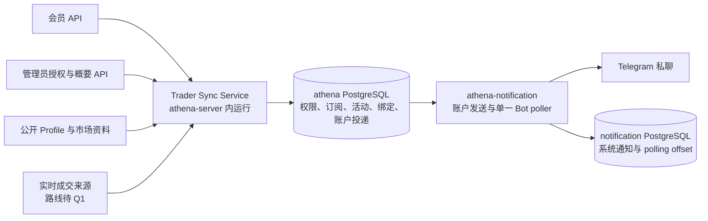

# Trader Sync：Activity Alerts 后端技术设计

> 设计状态：设计中
>
> 关联需求：[Activity Alerts 已确认需求](../../requirements/polymarket-copy-trading/target-trade-monitoring-notifications.md)

本文是目标方案，不代表当前实现。用户已授权开展技术设计，尚未确认技术设计或派发实现。首期为 10 名用户、每人最多 10 个未取消订阅，覆盖 100 个订阅关系及目标完全不重叠时的 100 个不同目标。

源码核对支持下文的同库事务与进程部署建议；主数据源的时间口径、Telegram 摘要时效和超长内容边界尚需处理。本草案保留原需求，不把候选方案中的差异视为已确认变更。实质问题解决前不得标为 `已确认待实现`。

## 需求覆盖

下表的规则和验收编号均来自关联需求。

| 需求条目 | 设计落点 | 说明 |
| --- | --- | --- |
| 规则 1–6、14、30–33；验收 1–9、17、27–28 | 权限、数据模型、事务 | 所有者隔离、10 个名额、管理员概要、撤权停用、手动恢复。 |
| 规则 7–9、12–17、24–29、44；验收 3、10–13、16、24–26、36–37 | 数据源、基线与实时恢复、可观测性 | 逐条真实成交、去重、无历史补查；时间口径待 Q1 对齐。 |
| 规则 10–11、18–23、27、34–39、43；验收 14–15、18–23、29–31、35 | 通知、投递事务、摘要 | 已形成活动持久保留、旧队列处理、未知结果不重发；摘要边界待 Q2/Q3。 |
| 规则 40–42；验收 9、33–34 | 目标确认、接口、备注快照 | 创建前确认资料、数据缺失、私有备注与历史快照。 |
| 规则 45、低频定位与首期规模；验收 38–39 | 配置、容量、可观测性 | 10 人容量目标；不增加高频准入条件或第 11 名用户的自动拒绝规则。 |
| 非目标、规则 17；验收 32 | 范围、安全 | 不执行交易，不接收执行参数，不接入签名或钱包密钥。 |

## 范围

本能力负责目标确认、订阅生命周期、实时成交接收、用户活动记录、Telegram 普通提醒与摘要，以及管理员运行概要。它依赖已有账户身份、权限、Telegram 绑定和 Polymarket 公开资料。

Copy Trading 不在本设计内。前端只约定数据与交互契约，不设计页面布局；页面实现仍需另行完成 UI 布局确认。数据资料查询、处理已收到记录和完成旧通知队列，不属于历史成交补查。

## 现状与目标差距

| 当前事实 | 目标差距与影响 |
| --- | --- |
| [账户权限](../../../internal/accountaccess/access.go)是九个模块与 NONE/READ/READ_WRITE 矩阵；[更新控制器](../../../internal/accountaccess/controller.go)提交后发布进程内快照。 | 新增 Trader Sync 权限；后台操作必须核验数据库权限，撤权必须与订阅、活动及投递串行化，不能只靠页面或缓存刷新。 |
| [账户状态存储](../../../internal/accountstate/store/sql_store.go)默认使用 `athena` 库；[通知存储](../../../internal/notification/store/sql_store.go)默认使用独立 `notification` 库。 | 两库内相同 advisory lock 名称不构成共同事务；按账户判断权限、绑定、活动形成和待发状态需要统一事务范围。 |
| [现有发送路径](../../../internal/notification/store/account_notifications.go)在 Telegram 发送成功后写数据库；[worker](../../../internal/notification/worker.go)对一般错误安排重试。 | 发送成功但写库失败时可能重复发送；缺少 durable `sending` 和 `unknown` 状态。现有入队时取绑定也不能代替活动形成时的绑定资格。 |
| [Data API 客户端](../../../util/polymarket/data.go)有活动、成交和持仓；[Gamma 客户端](../../../util/polymarket/gamma.go)有公开 Profile 与市场数据。 | 缺少 Trader Sync 的类型化源记录、确认卡契约、实时接收和收益曲线适配。现有通用 map 不作为持久业务契约。 |
| [Managed OO](../../../internal/managedoo/log_sync.go)与 [BSC Swap](../../../internal/bscswap/scanner.go)有持久游标扫描。 | 业务事件、网络及中断回补语义不同，不能直接沿用为 Trader Sync 监控。 |
| 当前源码没有 Trader Sync 服务、订阅、站内活动或摘要。 | 本文列出的 Trader Sync 路径均为预计新增；既有设计继续描述当前实现。 |

## 关键决定

以下均为待整份设计确认的建议，不是已经批准的技术决定。

1. **进程部署：**`internal/tradersync.Service` 运行在现有 `athena-server` 内，提供业务 RPC 和后台监控；Telegram 仍由现有 `athena-notification` 的单一 Bot、poller 和 sender 负责。不新增服务进程、消息中间件或 Redis。
2. **事务范围：**账户权限、Trader Sync 数据、账户 Telegram 绑定和账户投递同放 `athena` PostgreSQL 数据库。系统群组通知与 Bot polling offset 保留 `notification` 库；Notification 进程持有两个职责明确的 store。
3. **数据源候选：**优先评估 Polygon 三类 Exchange 的目标钱包过滤 WSS，HTTP 用于链、区块确认和资料核验，公开 API 补身份和市场。Chainstack 是首个开发入口建议，dRPC 保留作手动切换候选；不同时运行两套采集或自动故障切换。此路线需要先解决 Q1，不能自行把链上结算时刻当成原需求中的撮合发生时刻。
4. **活动与外发解耦：**每位用户的站内活动在形成时持久化，并在同一事务冻结 Telegram 资格与备注。普通提醒和摘要均有确定的活动成员关系；不会因发送失败再创建成交活动。
5. **未知结果：**提交网络请求前持久记录发送尝试。凡无法证明请求未成功的结果转入 `unknown`，停止自动重发；取消或重启不把 `unknown` 改为可重试。

同库方案会调整账户通知的持久化边界，代价是影响 accountstate、notification 的存储及运行配置。保留独立库则需要额外的撤权屏障、绑定版本同步与故障协调协议；首期规模和立即撤权要求不支持仅为维持现有数据库拆分而承担这些复杂度。

## 组件与职责

- `TargetResolver`：接受受限 Profile URL 或地址，查询公开身份，返回稳定钱包标识和带可用性状态的确认卡。
- `RealtimeCollector`：管理共享目标集合、连接代次和源数据持久接收；不按订阅用户重复采集同一目标，不追溯中断旧区间。
- `ActivityProjector`：对接收事实做确认、资料补全和用户分发，在账户锁内核验区间、当前状态、权限与绑定。
- `SubscriptionService`：负责创建、暂停、恢复、取消和备注；所有时间与版本由服务端生成。
- `AccountDeliveryPlanner`：与活动形成事务共用 store，决定普通或摘要成员资格，不持有 Bot token。
- `NotificationWorker`：读取账户待发记录，公平调度、发送与保存结果；与系统通知共用 provider 限速器，但不混用目标群组或消息内容。

## 接口与数据契约

### 权限与 RPC

新增 `ModuleTraderSync = "trader_sync"`。该模块只允许 `NONE`、`READ_WRITE`；已有层级中的 `READ` 对此模块拒绝，避免引入“能查看但不能管理订阅”的新产品状态。读接口使用模块读要求、写接口使用写要求；实际获授权用户均具备完整本产品权限。账户完整矩阵由九项扩为十项，注册、更新、开发身份和所有消费方同时对齐。

| 拟议 RPC | 内容 | 权限 |
| --- | --- | --- |
| `ResolveTarget` | 输入地址/Profile URL，返回确认卡与短期确认 token。 | 当前用户模块读。 |
| `CreateSubscription` | 确认 token、请求幂等键、可选备注。 | 当前用户模块写。 |
| `ListSubscriptions` / `GetSubscription` | 分页订阅、状态、有效时间、中断与旧队列概要。 | 当前用户模块读。 |
| `PauseSubscription` / `ResumeSubscription` / `CancelSubscription` | 订阅 ID、expected revision、请求幂等键。 | 当前用户模块写。 |
| `UpdateTargetNote` | 目标钱包、备注、expected revision。 | 当前用户模块写。 |
| `ListActivities` / `GetActivity` | 活动事实、市场资料、来源及投递结果。 | 当前用户模块读。 |
| `ListSubscriptionSummaries` / `GetSubscriptionSummary` | 独立管理员投影；用户、目标、状态、健康和数量。 | 管理员专用。 |
| `GetTraderSyncRuntimeStatus` | 连接、处理队列、异常和数量概要。 | 管理员专用。 |

公开 member 请求不接收 `account_id`，从服务端认证上下文注入 UUID；所有 ID 查询包含 owner 条件，跨用户和不存在资源统一 NotFound。管理员接口不复用完整活动 DTO 后再删字段，其查询和 DTO 从源头排除备注、活动正文、Telegram 正文与逐条投递。

沿用现有业务 API 凭据策略：有效会员登录或获准的 API Key 均须具备产品权限；Telegram 绑定仍仅允许普通账户的交互登录。管理员身份不获得会员数据访问权。登录/API Key 停用遵循现有认证边界，不能未经需求确认将其等同于产品 grant 撤销并取消全部后台订阅。

订阅与备注写操作使用 revision CAS；并发冲突返回 Aborted，配额已满返回 ResourceExhausted，目标重复返回 AlreadyExists，确认 token 无效/过期或目标解析失败返回 FailedPrecondition/InvalidArgument。幂等键按 owner、操作和 payload digest 绑定，相同键不同内容拒绝；重试仍须先通过当前权限检查。

### 目标、成交与时间

- 目标身份区分 `input`、公开接口 `proxyWallet`、解析出的规范钱包；地址保存标准化 20 字节并按完整地址展示。显示名、头像和备注不参加身份或去重。钱包类型需由真实来源核准，不推断同一自然人的其他钱包。
- Profile URL 只接受允许的 Polymarket 域名及已验证路径格式，不任意请求用户指定 URL，不凭相似名称选目标。不能无歧义解析时拒绝；无历史成交不构成拒绝原因。
- 确认 token 绑定 owner、规范钱包、身份查询结果与过期时间。建议有效期 5 分钟；这是用户审阅确认卡的有效期，与订阅生效等待无关。创建时再次核验身份、权限、配额和重复订阅。
- P/L 的六种区间及 `Predictions` 按来源原始口径呈现；各字段携带 `available/unavailable`、来源和查询时间。未证明可靠来源前不得用持仓求和或已交易市场数冒充。创建后不安排收益刷新任务。
- 金额以十进制定点或整数原始量存储，Token/Position ID 使用十进制字符串；不经过浮点类型或 JavaScript number。金额、币种、decimals、费用分开；研究样本中的 pUSD 不能仅因 API 字段名含 USDC 而改标。需求固定“USDC 金额”的措辞需要在 Q1 数据口径核实中明确处理，不能把所有来源直接改标 pUSD。
- 活动保存 `source_record_id`、来源类型、目标、BUY/SELL、原始量、原始事实及市场引用。普通活动有单市场描述；Combo 使用同一活动内的 `legs[]`，每腿标注真实市场和 Outcome；生命周期 SPLIT/MERGE 仅能作为资料，不新增成交。
- 时间分别保存源端时间与 `time_basis`、`received_at`、`recorded_at`、投递尝试和结果时间。不能用 `received_at` 冒充公开可查询时间；不能用链上区块时间冒充已经证实的链下撮合时间。
- 私有备注按 Unicode 字符数校验最多 20 个字符；服务端拒绝超限，不截断。修改不追溯活动或冻结通知的备注快照，取消保留 owner-wallet 备注。

## 数据模型与持久化

所有账户域表在 `athena` 库；下列为拟议实体，不是已创建表。

| 实体 | 关键内容与约束 |
| --- | --- |
| `trader_sync_targets` | 规范钱包唯一、公共资料引用；不保存私有备注。 |
| `trader_sync_target_notes` | `(account_id, wallet)` 唯一、note、revision；不随订阅取消删除。 |
| `trader_sync_target_confirmations` | owner、token digest、规范身份、资料状态、过期时间；用于创建前确认。 |
| `trader_sync_subscriptions` | ID、owner、target、status、revision、activation_generation、created/paused/cancelled/disabled 时间；部分唯一索引约束同 owner-target 的非 cancelled 记录。 |
| `trader_sync_monitor_intervals` | subscription、activation_generation、起止时间、baseline/connection epoch、边界精度；起点包含、终点不包含。恢复新增区间，不覆盖旧区间。 |
| `trader_sync_collector_epochs` | 连接代次、目标集合 revision、观察边界、owner fencing token、启动/结束原因。 |
| `trader_sync_interruptions` | 受影响目标与订阅区间、最后可靠观察、确认失效及恢复/停用时间；未知边界显式记录，不存推测遗漏数量。 |
| `trader_sync_source_records` | 接收时刻、epoch、完整来源定位、原始事实、确认/孤块/无效状态；只存真实收到的记录，不存回补游标。 |
| `trader_sync_activities` | owner、subscription、activation_generation、interval、source record、事实和备注快照、形成时间；`(subscription_id, source_record_id)` 唯一，不自动过期。 |
| `trader_sync_summary_batches` / `..._items` | owner、binding revision、首条待汇总时间、冻结内容、活动成员；一个活动最多归入一个外发单元。 |
| 账户绑定与投递表 | 迁入账户事务范围，保存 binding revision、来源业务引用、状态、attempt ID、不可变 payload digest、next_attempt_at 与 provider 结果；结果更新按 delivery、attempt 和预期状态进行 CAS。 |

`activation_generation` 表示用户的一次订阅激活，创建订阅时初始化，每次用户手动恢复时递增；普通字段修改、基线任务重试、连接故障及自动恢复不改变它。连接 epoch 表示观察连接代次，两者不能混用。投影候选从源记录接收时对应的持久订阅区间取得激活代次，不能在延迟处理时改贴当前代次；手动恢复后旧代次尚未形成活动的记录不再投影。已经形成的活动和旧通知资格不因激活代次变化而失效。

活动成员、摘要、投递引用均检查 owner 一致。分页使用 `(recorded_at, id)` 游标和服务端页大小上限，游标绑定 owner 与过滤条件；不允许客户端借游标改变所有者。活动历史、已取消订阅与备注不做自动 TTL；确认 token、已完成内部任务可按用途清理，不删除需求要求保留的事实。

`athena` 数据库统一由 `internal/accountstate/store/migrations` 管迁移；notification 自有迁移仅拥有系统通知与 polling offset，不能让两套 goose 编号在同一库竞争。`sqlc.yaml` 中各存储查询仍按模块生成，但其 schema 输入引用真实权威迁移。composition root 注入池与受控事务接口，业务服务不创建另一个私有权限副本。

## 运行流程

### 创建与恢复

1. 解析目标并展示确认卡；辅助资料不可用时允许重试与继续确认。
2. 创建事务获取账户 gate，读取数据库产品权限，核验 token 与 10 个配额，创建 `pending_baseline` 订阅。并发创建通过相同 gate 和部分唯一索引约束；失败不占名额。
3. Collector 建立包含目标的真实观察能力后，以经过确认的数据源时间口径建立边界。订阅仍具有权限且 revision 未改变才提交 `monitoring`、区间及明确生效时间。未成功基线不能显示监控中。
4. 手动恢复采用新基线；服务在基线过程中失败可重试建立一个新的实时边界，不读取旧成交。暂停/取消/撤权与基线成功竞争时，较新 revision 和最新权限优先。

### 实时采集候选与数据确认

链上候选监听普通 CTF、Neg Risk、Combos Exchange 的认可地址与各自已核验 ABI，对自身订单资金钱包所在 topic 过滤。Maker/Taker 角色不按事件字段名字直接推断；对手方事件及 `OrdersMatched` 不另算自身成交。[现有调研](../../requirements/polymarket-copy-trading/onchain-trade-data-feasibility.md)支持核心过滤链路，但不代表已证明所有协议语义。

WSS 收到后先持久化来源事实，再完成确认及用户活动投影。候选唯一定位为 `(chain_id, exchange_address, block_hash, transaction_hash, log_index)`；同时保存规范链定位，确认前孤块记录不生成用户活动。同一日志重复推送不重复投影；不同日志即使同交易/同方向也不聚合。只对已接收区块查询头、哈希与最终确认状态，不枚举未接收区块日志填洞。

建议复用一条 WSS 连接上的若干目标分组订阅；分组大小以供应商可验证限制定稿，不用全站日志本地过滤。不订阅目标时不保持高频空转查询。已有目标集合变更采用新旧过滤器重叠安装并按源 ID 去重，避免重建其他目标的基线；扩容失败时已有有效过滤继续工作，新目标保持待基线/异常。离开有效订阅的目标从下一集合移除，已经收到的数据仍按原接收区间处理。

区块最终确认后才生成不可逆成交活动是链上方案建议；收到 `removed` 或规范链不一致时在确认前作废原始候选。若已视作最终确认的事实后来被推翻，应停止受影响源并保留原事实与异常证据，不自动生成相反交易或删除用户历史；具体用户纠错表达需有真实情形再对齐。

### 活动形成

对每个订阅所有者分别取得账户 gate，核验当前 grant、订阅状态、接收 epoch 和成交区间，并确认候选区间的 `activation_generation` 与订阅当前激活代次相同；同一事务插入独立站内活动、备注快照，并读取当前 Telegram 绑定。未绑定只记录站内；绑定则冻结 revision、活动外发资格和普通/摘要归属。市场资料无法获得时按已确认缺失规则展示未知，不伪造标题、方向或收益；异步补全只补引用资料，不把同一成交当成新活动重发。

必须区分源记录接收与活动形成：中断前已经可靠收到的数据使用原接收区间，新的连接 epoch 和恢复边界不抹去同一激活代次的已接收事实；但活动形成时仍须遵守当前权限与订阅状态。暂停、取消或撤权后尚未形成活动的源记录不再为该订阅创建活动；此后手动恢复也不能使旧代次候选重新取得资格。已经形成的队列按下文继续处理，发送阶段不再要求激活代次或订阅状态仍与形成时相同。

### 暂停、取消、撤权与实时恢复

- 暂停关闭当前区间并保留配额；取消关闭区间并释放配额。二者均保留旧活动与旧投递资格，不改变已有摘要成员。
- 产品 grant 从开启变为 NONE 时，同一账户事务关闭全部未取消订阅区间、设置 `permission_disabled`、停止尚未进入外部发送的投递和待摘要成员。重新开通 grant 不恢复任何订阅；用户手动恢复或取消。
- 故障记录当前 epoch 的中断，不设置 pending backfill。连接重新可用后取得新实时边界，仅对仍应监控的订阅自动恢复；故障期间已暂停/取消/撤权的订阅不恢复。
- `athena-server` 每次启动或进程内 Run 重启均建立新的 Collector epoch；持久旧 source records、活动及投递可继续处理，旧中断区间不回补。Stop 停止接收并尽力记录中断，异常退出通过上次心跳与下一次启动记录不确定边界。

## 事务、并发与幂等

### 账户 gate

权限变更、订阅操作、活动形成、绑定变更及外发授权统一使用 `athena` 库内的账户 advisory lock。普通事务用 transaction lock；外部发送用固定 pgx 连接上的 session lock，使发送前持久化提交后仍持有 gate。锁键采用明确命名空间与规范 account UUID，所有调用方用同一函数；绑定唯一身份锁在账户 gate 后获取，其他路径保持固定顺序。

现有 AccountAccessController 的全局更新 mutex 不应在等待某个账户网络发送时阻塞其他账户改权；改为按账户串行更新并保留版本 CAS。进程内快照用于快速入口拒绝，业务数据库事务再次核验权限，避免数据库提交与快照发布间的允许窗口。

发送前先取得速率槽和 worker 名额，再取得账户 gate，避免在持账户锁时等待排队。一个账户的 HTTP 发送设置有限超时；不同账户独立排队。session lock 必须在取得它的连接上释放，失败时关闭并丢弃连接，不带锁归还池；不可调用从另一个池连接再次取同锁的旧 store helper。

### 发送状态机

`pending → sending → sent / failed / unknown`，另有只适用于尚未发出工作的 `cancelled`。只有能够确定未成功的暂时失败允许 `sending → pending`，同时写入下次尝试时间并结束当前 attempt；后续尝试使用新 attempt ID，消息内容和摘要成员保持不变。每个 attempt 有唯一编号和不可变 payload digest；`sent`、`failed`、`unknown`、`cancelled` 均不能由重领任务或迟到回调改回 `pending`。

1. 在 gate 内核验当前产品 grant、绑定 revision 和 pending 状态；暂停/取消订阅不使此前已排队活动失去资格。撤权或绑定不符则终止该 pending 工作。
2. 同一固定连接的事务将 attempt 和 `sending` 提交；提交结果无法确认时，不发送，先读取持久状态核实。不能把不确定提交当成未提交重开网络请求。
3. 保持 gate，以一次显式 provider 调用提交消息；禁用底层 SDK/HTTP 客户端的隐藏自动重试。网络未发出且能证明未成功的暂时失败可有限重排；明确暂时拒绝遵守 Retry-After，永久拒绝或尝试耗尽转 `failed`；请求可能成功的超时、断流、取消和无法解析结果均 `unknown`，不得重新排队。
4. provider 成功后以 `(delivery_id, attempt_id, expected_status = sending)` CAS 写 `sent` 与 message ID。写库失败时，只尝试补记相同已知结果，绝不再次发送；更新未命中时读取当前状态，不覆盖其他 attempt 或已确定的终态。
5. 恢复者必须先取得同一账户 gate，再重新读取残留 `sending` 及 attempt。存活发送者仍持有 gate 时不能仅凭 claim 超时抢占；取得 gate 后无法证明结果的遗留 attempt 通过同样的状态 CAS 终结为 `unknown`。禁止沿用旧 worker 对过期 claim 直接重领并发送的行为；迟到回调不能覆盖 `unknown` 或 `cancelled`。
6. 成功提交或未知终态均不因 HTTP/RPC 重试创建另一消息；摘要成员不重新改派普通通知。所有失败、重排及恢复更新均受账户 gate 和 attempt/status CAS 约束。

撤权与解绑的提交是后续发送许可的线性化边界。先取得 gate 的发送可以完成或形成未知结果，随后撤权提交并禁止新的发送；先提交的撤权让发送直接终止。已经交给 Telegram 的请求无法撤回，也不能把其未知结果伪写成确定未送达。

### 跨库 Bot update

账户绑定处理提交到 `athena` 后，poller 才推进 `notification` 的 offset。账户侧保存已处理的 update ID，处理重放时不重复提高绑定 revision 或重建已消费 attempt。两步之间崩溃会重读 update，通过幂等处理完成 offset 推进；不依赖跨库事务或仅存在于进程内的标记。

## Telegram 摘要与调度

按 owner 锁顺序统计所有已形成活动的滚动 60 秒窗口，窗口边界统一为 `(recorded_at - 60s, recorded_at]`；相同时刻用活动 ID 排序。当前活动纳入计数后 ≤10 时逐条，>10 时进入摘要。未绑定活动仍是站内事实，但绑定变化不补发旧活动或把旧活动加入新摘要。新绑定产生新投递资格；被撤权/解绑终止的成员不会重排。

摘要保存首个待汇总成员的形成时间、成员列表、目标/市场/Outcome/方向集合、完整站内链接、当时备注和 binding revision；冻结后成员与内容不再变化。频率回落只改变后续新活动的归属，已有待汇总成员仍由原摘要完成。

调度按账户公平轮转，优先处理即将达到目标时限的就绪工作；跨 chat 有界并行，同一 chat 串行，并统一取得 Bot 总预算及对应私聊/群组预算，不以一个用户的大队列吞掉其他用户工作。现有全局串行 worker 每次发送后等待 1.1 秒，十个账户同时各有一条普通提醒时也可能使尾部排队超过 5 秒，必须替换为上述调度，不能仅减小全局等待间隔或保留串行出口后宣称满足时效。

全 Bot 预算覆盖账户提醒、系统通知及 poller 的绑定成功/失败回复；现有 `sendBindingReply` 直接调用 Telegram client 的路径也必须接入同一调度与限速器，不能只在业务 worker 内限速。各路径仍保留自己的内容、资格及投递结果语义；共享预算不使系统消息或绑定回复加入 Trader Sync 摘要。速率等待在取得账户 gate 前完成。站内活动不以取得发送名额为形成前提；待发送队列不设置静默丢弃上限，积压影响健康和延迟指标。

原需求的“摘要间隔至少 60 秒”“每条待摘要活动从形成到成功回执最多 60 秒”在连续摘要和非零网络耗时下存在边界冲突，详见 Q2。单条 Telegram 文本容量和任意多市场的完整摘要也存在冲突，详见 Q3。此处不以提前若干秒 flush、静默截断或把一批多条消息称作一条来掩盖差异；调度常量与渲染溢出规则须在决定后定稿。

## 失败处理与恢复

| 情形 | 处理 |
| --- | --- |
| 目标资料缺失 | 身份不可靠则拒绝创建；辅助字段返回明确不可用，不编造 P/L 或 Predictions。 |
| 源断开/限流/无法确认数据新鲜度 | 记录中断并停止宣称正常观察；重连从新边界开始，不补任何遗漏区块。 |
| 原始接收写库失败 | 不能视为可靠接收，标明中断及可能遗漏；不通过后续历史查询掩盖丢失。 |
| 收到并持久化后进程重启 | 按原接收区间及 activation_generation、当前权限/订阅状态判断；仅连接 epoch 改变不丢弃已接收事实，手动重新激活不能复活旧代次候选。这不是回放未接收历史。 |
| metadata 暂时失败 | 保留来源与不可用状态，对已收到记录重试资料查询，不再生成第二个活动。 |
| 明确 Telegram 暂时拒绝 | 仅确定未成功时，在 gate 内以 attempt/status CAS 安排有限重试并遵守 Retry-After；耗尽形成 failed。 |
| Telegram 结果不确定/发送后写库失败 | 停止自动重发；已知成功只补记相同 attempt 的 sent，不能覆盖已确定终态。遗留 sending 由取得同账户 gate 的恢复者重新读取并以 CAS 终结为 unknown，不因 claim 超时再次发送。 |
| 解绑/重绑/撤权与队列竞争 | 相同 gate 决定顺序，终止旧资格；已有 unknown 保留未知，不转成功或可重试。 |
| 活动形成后取消订阅 | 保留旧队列与备注快照，继续完成；新订阅使用新 ID 和基线。 |

## 配置、安全与权限

拟议配置集中在 `athena-server` 的 Trader Sync 部分：Polygon HTTP/WSS 入口、chain ID 137、已核验合约清单、资料 API 基址、源超时、连接健康阈值、finality 查询间隔、目标分组大小、资料请求并发和缓存期限。供应商地址从现有[开发端点清单](../../requirements/polymarket-copy-trading/hosted-polygon-rpc-providers.md#已取得的开发候选端点)引用，设计正文不复制凭据。

业务配额 10 和首期 10 人规模是需求参数，不伪装成每次部署可任意改变的运维开关。候选技术默认值先按 2 秒 finality 查询、资料请求并发 4、外部调用 5 秒超时做预算和时效分解；它们尚需结合完整来源契约与 Q1–Q3 定稿，不据此宣称已达到指标。

`athena-notification` 新增账户库连接，使用同一 `ATHENA_SERVER_POSTGRES_DSN` 所指账户库及 accountstate 权威迁移；原通知 DSN 只承载系统域。两进程都通过现有迁移工具的跨进程锁执行同一账户迁移集，不能互相等待对方才保证 schema 存在。生产继续通过既有 migration 初始化入口设置 schema。

Bot token 仅由 Notification 进程使用；Trader Sync 不读取钱包密钥、目标私有凭据或交易执行客户端。所有外链按服务端可信市场资料构造，展示文本转义，公共 API/日志不泄露其他账户资料。内部管理员概要日志只记代码和数量，不包含完整活动正文或用户备注。

## 可观测性与运维

用户能看到待基线/监控/暂停/异常/权限停用/取消、生效时间、最近可靠观察、最近活动、中断及恢复说明、旧通知是否仍待发。管理员只读看到对应安全概要与 sent/failed/unknown 数量，不能下钻为私有明细。

指标包括：实际目标/订阅数、连接 epoch 和中断时段、接收与投影积压、资料缺失、账户锁等待、finality 等待、普通和摘要排队延迟、provider 提交耗时、unknown/failed/cancelled、绑定不符及撤权终止计数。正常指标与中断、外部错误分别统计，但异常和未完成样本仍可见。

“公开可查询→站内”只有起点证据可靠才计算完整指标；默认 WSS 收到时刻只能直接衡量接收后处理，不能用这个更短的指标替代已确认的 P95≤15 秒/P99≤30 秒。公开前外部延迟同样不能凭发生与收到之差全部推定。技术设计需明确可测值、上/下界与未知，而非为完成指标填写伪精确时间。

容量区分三个维度：100 个订阅关系、最多 100 个不同目标、每条源成交最多分发给 10 个用户。低频场景允许偶发短时集中，实际事件率未被“10 人”定义；已有每天每目标 100 条的预算仍是假设。按该算例 30 天为 300,000 条目标日志，不能只算这些推送：2 秒共享 finality 查询另约 1,296,000 次/月，还应计已接收区块头、身份、Combo 核验、重连和其他服务流量。费用研究的 RU/CU 单价以供应商资料为准，设计不承诺免费额度必然覆盖所有运行情况。

## 源码影响

“预计新增”路径在实现前不存在；已有路径链接用于核查现状。

| 关注点 | 源码位置 | 关键符号 | 动作 |
| --- | --- | --- | --- |
| 新业务域 | `internal/tradersync/`（预计新增） | Service、Collector、Projector、SubscriptionService | 新增。 |
| 公共契约 | `internal/server/tradersync/`、`pkg/apis/application/v1alpha1/trader_sync_types.go`（预计新增） | 上述 member/admin RPC 与 DTO | 新增，生成 apiclient/gateway/Swagger。 |
| API 服务组合 | [athena-server.go](../../../internal/server/athena-server.go)、[authz.go](../../../internal/server/authz.go) | newServiceSet、Run/Stop、RPC authorization maps | 注入业务服务与同库 store；进程重启不重复启动 worker。 |
| 权限矩阵与原子撤权 | [access.go](../../../internal/accountaccess/access.go)、[controller.go](../../../internal/accountaccess/controller.go)、[account.go](../../../internal/server/account/account.go)、[accountstate store](../../../internal/accountstate/store/sql_store.go) | ModuleTraderSync、Validate、UpdateAccountAccess | 十模块矩阵、合法级别、按账户 gate、事务内停用。 |
| 账户数据库 | [accountstate migrations](../../../internal/accountstate/store/migrations)、[sqlc.yaml](../../../sqlc.yaml) | 权威 schema、分模块查询生成 | 增加 Trader Sync 和账户通知实体；避免双迁移源。 |
| Notification 存储和 worker | [service.go](../../../internal/notification/service.go)、[worker.go](../../../internal/notification/worker.go)、[store](../../../internal/notification/store)、[notification.proto](../../../internal/notification/notification.proto) | 双 store、binding gate、sending/unknown、账户投递合同 | 调整账户域；系统通知不进入 Trader Sync 摘要。 |
| Bot update 幂等 | [poller.go](../../../internal/notification/poller.go)、[telegram.go](../../../util/telegram/telegram.go) | update ID、provider 错误分类 | 账户提交后推进 offset；明确是否可能已发送。 |
| Polymarket 资料 | [data.go](../../../util/polymarket/data.go)、[gamma.go](../../../util/polymarket/gamma.go) | 类型化记录、Profile、market/Combo 适配 | 按已核实来源扩展，不手写生成代码。 |
| 运行配置与部署 | [local-runtime.sh](../../../hack/local-runtime.sh)、[docker-compose.prod.yml](../../../docker-compose.prod.yml)、[数据库初始化](../../../hack/postgres/init/00-databases.sql) | 账户 DSN、通知账户 store、迁移初始化 | 沿用既有进程；无需新服务端口或 Trader Sync 独立数据库。 |
| 现有设计消费者 | [账户权限设计](../identity-access/account-access-control.md)、[账户通知设计](../notifications/account-telegram-notifications.md)、[本地运行设计](../development-runtime/local-runtime-orchestration.md) | 当前实现说明 | 实现时同步，设计阶段不把目标方案写成已实现。 |

前端模块枚举、授权编辑器、访问概览和服务契约是 API 消费方，需随实现保持十模块矩阵一致；新产品导航及页面布局另行确认，不在本设计中隐含通过。

## 旧实现清理

没有 Trader Sync 旧业务实现可保留。实现时直接替换账户投递“发送后写库失败回到 pending”的路径和账户通知旧库归属；移除失效的 schema 来源与配置说明，不做双写或长期兼容读取。现有其他账户通知调用方仍有有效用途，沿用其功能并明确新投递结果，不为一条业务引入与旧实现并行的第二套 Bot。

数据库调整不在本阶段执行；不得把本设计当成清空当前数据库、复制历史数据或重置环境的授权。

## 验证方式

本阶段只读核对已确认需求、当前源码、已有样本与官方文档，检查文档链接及 diff。未运行单元、集成、端到端测试，未运行实时端点验收，也未启动或修改服务。

实现阶段按稳定源输入执行对应生成：账户/通知/Trader Sync SQL 对应 `make sqlc-local`；API 类型和 Proto 对应 `make protogen`；若新增 ABI 源才按 `make abigen-local` 处理。生成顺序遵循真实依赖边；这些是实现阶段需明确授权的工作，不在设计阶段运行。构建、静态检查和任何外部联调的具体授权在实现任务中另行确定，不自行规划测试。

## 待确认问题

### Q1：实时来源与时间口径

**原需求：**按实际成交发生时间决定订阅资格，不能用首次发现时间代替。已有链上研究只能证明区块结算时间；一条链上自身记录也不保证在全部情形下等于 API 的每个分片。

**建议方向：**三类 Exchange 的目标过滤 WSS 作为主源，持久接收后核验最终确认，以明确标注的链上结算时间描述该来源的成交。优点是实时推送、可靠来源定位与去重、对任意目标不需私有认证；代价是必须明确接受结算时刻与可能更早的撮合时刻之间的业务区别。例如订阅生效前撮合、生效后结算的活动，不能未经确认按新成交发送。

**另一方向：**保留原时间要求，继续核实公开 Activity API 的时间语义、稳定记录身份和实时轮询边界，再定主源；现有官方字段和样本不足以宣称其提供精确撮合时间或全范围唯一成交 ID。它不是已经证明可满足全部边界的替代方案。

这一项先确认路线及可接受的时间含义，再细化秒级源时间与服务端微秒级生效时刻的同秒处理，不凭实现便利偷偷把边界取整。金额的真实币种和钱包类型属于需要核实的事实，不能让用户选择事实真假。

### Q2：连续摘要的 60 秒目标

原需求同时要求摘要发送间隔至少 60 秒、首条待汇总活动形成到成功回执不超过 60 秒。即使持账户 gate 发送，上一摘要在 `12:00:00.000` 发出、`00.100` 成功，下一待汇总活动在 `00.101` 形成；下一摘要最早 `12:01:00.000` 发出，若正常回执耗时 300ms，就会超过该活动的 `12:01:00.101` 截止点。这里没有外部故障，也不依赖持续高频。

可审查的取舍是：保留每 60 秒至多一条，将“60 秒”作为开始提交时限并单列 provider 成功回执耗时；或保留 60 秒成功回执目标，允许为发送耗时预留余量而缩短摘要间隔。两者均改变已确认规则，必须先经用户选择并同步需求，不能直接写为实现细节。当前草案不擅自选择。

### Q3：超过单条 Telegram 文本容量

Telegram 单条 `sendMessage` 文本有限长，而当前摘要要求直接列出全部涉及目标、市场、Outcome、方向及市场链接，需求没有给活动和不同市场数量设上限。可行取舍为：每个摘要周期允许多条连续消息组成一个明确的摘要批次；或坚持单条消息，超长时显示可容纳的市场概览与站内完整列表入口。前者改变一条消息频率和批次投递状态，后者改变 Telegram 内直接展示全部市场的要求；不能静默截断或自动减少站内活动。

Q1–Q3 中任何被选中的实质业务调整均需先写回需求并重新确认；不会以技术设计确认替代需求确认。组件、数据库、来源供应商和参数最终仍需整份技术设计确认。当前没有实现授权。

## 设计一致性检查

- [x] 以已确认需求为输入，首期规模与不补历史边界已写入。
- [x] 已列出现状差距、目标组件、接口、数据、事务与失败语义。
- [x] 已区分源研究证据、候选技术选择及需要业务确认的差异。
- [ ] Q1–Q3 已解决并与需求一致。
- [ ] 外部数据契约、同秒基线、摘要调度与溢出规则已定稿。
- [ ] 技术设计经用户确认，状态更新为已确认待实现。
- [ ] 实现、生成边界、旧实现清理与逐项一致性审查完成。
