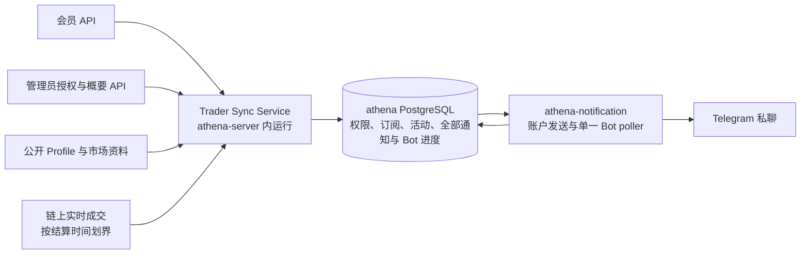

# Trader Sync：Activity Alerts 后端技术设计

> 设计状态：已确认待实现
>
> 关联需求：[Activity Alerts 需求](../../requirements/polymarket-copy-trading/target-trade-monitoring-notifications.md)（已确认；完整书面设计也已整体确认）

本文是目标方案，不代表当前实现。用户已整体确认原后端技术方案；[实现计划](../../superpowers/plans/2026-09-10-trader-sync-activity-alerts.md)已形成并正在执行。随后补充的[UI spec](../../superpowers/specs/2026-09-10-trader-sync-activity-alerts-ui-design.md)已整体确认，本文的 UI 读取补充也已确认；实现计划已扩展为21项前后端联合任务。首期为 10 名用户、每人最多 10 个未取消订阅，覆盖 100 个订阅关系及目标完全不重叠时的 100 个不同目标。

本轮已按 Superpowers 分节确认统一数据库与现有进程边界、发送许可与撤权语义、单供应商 WSS 采集及最终确认路线；同用户集中成交允许限速排队也已确认。接口、资料和验收章节也已确认；[完整书面规格](../../superpowers/specs/2026-09-10-trader-sync-activity-alerts-design.md)已获用户整体确认。后续实现计划细化了源码、生成依赖与验收步骤；当前已实现共享数据库基础、持久发送许可/结果路径、Bot update 原子消费、共享调度、单 sender 恢复及可构造的实时 Collector/基线/持久接收组件，其余目标按联合计划继续实施。

新增技术证据见[数据源契约核验](../../requirements/polymarket-copy-trading/source-contract-verification.md)与[RPC 过滤、确认和额度复核](../../requirements/polymarket-copy-trading/collector-contract-verification.md)。它们记录当前实现版本、100 钱包 OR 推送、Combo 腿映射、Profile 与收益资料的证据及限制。技术参数是可验证的设计默认值，不表示已完成运行验收。

## 需求覆盖

下表的规则和验收编号均来自关联需求。

| 需求条目 | 设计落点 | 说明 |
| --- | --- | --- |
| 规则 1–6、14、30–33；验收 1–9、17、27–28 | 权限、数据模型、事务 | 所有者隔离、10 个名额、管理员概要、撤权停用、手动恢复。 |
| 规则 7–9、12–17、24–29、44；验收 3、10–13、16、24–26、36–37 | 数据源、基线与实时恢复、可观测性 | 逐条真实成交、去重、无历史补查；按已确认链上结算时间划界。 |
| 规则 10–11、18–23、27、34–39、43；验收 14–15、18–23、29–31、35 | 通知、投递事务、摘要 | 已形成活动持久保留、旧队列处理、未知结果不重发；摘要按每 60 秒至多一批及首条提交时限设计。 |
| 规则 40–42；验收 9、33–34 | 目标确认、接口、备注快照 | 创建前确认资料、数据缺失、私有备注与历史快照。 |
| 规则 45、低频定位与首期规模；验收 38–39 | 配置、容量、可观测性 | 10 人容量目标；不增加高频准入条件或第 11 名用户的自动拒绝规则。 |
| 非目标、规则 17；验收 32 | 范围、安全 | 不执行交易，不接收执行参数，不接入签名或钱包密钥。 |

## 范围

本能力负责目标确认、订阅生命周期、实时成交接收、用户活动记录、Telegram 普通提醒与摘要，以及管理员运行概要。它依赖已有账户身份、权限、Telegram 绑定和 Polymarket 公开资料。

Copy Trading 不在本设计内。本文维护后端和跨层数据契约，页面布局、状态呈现与导航见[长期 UI 设计](../web-ui/trader-sync-activity-alerts.md)。UI 整份书面已确认，尚未实现。数据资料查询、处理已收到记录和完成旧通知队列，不属于历史成交补查。

## 现状与目标差距

| 当前事实 | 目标差距与影响 |
| --- | --- |
| [账户权限](../../../internal/accountaccess/access.go)已扩为十模块；Trader Sync grant 仅允许 NONE/RW，READ requirement 合法；[更新控制器](../../../internal/accountaccess/controller.go)按账户串行并在提交后发布快照。 | 订阅和产品撤权已接入账户 gate；活动形成的 grant 核验仍待后续业务实现。 |
| [账户状态存储](../../../internal/accountstate/store/sql_store.go)与[通知存储](../../../internal/notification/store/sql_store.go)共用 `athena` 数据库及唯一权威迁移集；[账户 gate](../../../internal/accountstate/txgate/gate.go)统一账户事务锁。 | 同库基础、权限与订阅事务已实现；活动形成仍待接入。 |
| [发送许可](../../../internal/notification/store/attempts.go)已在短事务提交 sending 与 attempt；[worker](../../../internal/notification/worker.go)以实际 HTTP 起点和结果 CAS 补记，unknown 不重发，绑定变化写永久墓碑。 | 共享并发调度、单 sender 登记和显式停止恢复已经实现；产品 grant 撤权钩子已在账户存储提交前接入，现有入队绑定不能代替活动形成时的资格快照。 |
| [Bot update](../../../internal/notification/store/bot_updates.go)将绑定变更、回复 outbox 和消费进度原子提交；[poller](../../../internal/notification/poller.go)只调用该入口，reply 复用 worker 的发送许可。 | reply 已接入跨 chat 公平调度、统一预算和停止确认恢复；Trader Sync 摘要首条尚待接入。 |
| [Profile 适配器](../../../util/polymarket/profile_identity.go)、[六区间 P/L](../../../internal/tradersync/pnl.go)与[目标确认](../../../internal/tradersync/target_resolver.go)已实现精确数值、逐字段 evidence 和 owner token。 | 官方显示参考时间、YTD 执行时区、舍入语义仍缺证据，对应字段 unavailable；实际 grant/context SQL 已实现；公开入口尚待接入。 |
| [Managed OO](../../../internal/managedoo/log_sync.go)与 [BSC Swap](../../../internal/bscswap/scanner.go)有持久游标扫描。 | 业务事件、网络及中断回补语义不同，不能直接沿用为 Trader Sync 监控。 |
| 当前已有独立 Trader Sync types、TargetResolver、SubscriptionService、Collector、原始 Session 与基线/接收存储；Collector 实现 BaselineRegistrar 并提供可取消、可等待的 Run。 | ActivityProjector、站内活动和摘要仍待实现；Task 12 才接公开 API 和 athena-server 后台组合，不将组件测试视为服务已上线。 |

## 关键决定

2026-09-10 本轮已确认以下总体架构、采集路线与发送许可边界；接口和验收章节也已确认，完整书面规格已获整体确认；当前已实现共享数据库基础、持久发送许可/结果路径、Bot update 原子消费、共享调度、单 sender 恢复及可构造的实时 Collector/基线/持久接收组件，其余目标按联合计划继续实施。

1. **进程部署：**`internal/tradersync.Service` 运行在现有 `athena-server` 内，提供业务 RPC 和后台监控；Telegram 仍由现有 `athena-notification` 的单一 Bot、poller 和 sender 负责。不新增服务进程、消息中间件或 Redis。
2. **事务范围（已确认）：**账户权限、Trader Sync 数据及全部 Notification 数据统一放在 `athena` PostgreSQL 数据库，包括账户绑定、账户投递、系统群组通知、Bot polling offset 和绑定回复 outbox。各模块保留独立 query adapter，共享受控事务和一个权威迁移集；每个进程建立自己的连接池，不跨进程共享连接池对象。Notification 不再因账户/系统通知而持有两个数据库 store。
3. **链上实时路线（已确认）：**Chainstack 为首个开发 HTTP/WSS 入口，dRPC 仅供手动切换；不双采、不自动故障切换。共享目标过滤 WSS 采集普通 CTF、Neg Risk 和 Combos Exchange 自身 OrderFilled，先持久接收、再核验规范链及最终确认、最后投影用户活动；公开资料接口补身份与市场。仅常驻目标 logs；ActivityProjector 拥有唯一每 2 秒确认工作调度，Collector 只负责每 10 秒 latest 健康查询，不永久订阅全链 newHeads。
4. **活动与外发解耦：**每位用户的站内活动在形成时持久化，并在同一事务冻结 Telegram 资格与备注。普通提醒和摘要均有确定的活动成员关系；不会因发送失败再创建成交活动。
5. **未知结果：**提交网络请求前持久记录发送尝试。凡无法证明请求未成功的结果转入 `unknown`，停止自动重发；取消或重启不把 `unknown` 改为可重试。发送许可在短事务中持久化，撤权提交后禁止新许可，既有 sending 可完成或未知；仅摘要首条采用冻结到实际调用起点的短 gate。

同库方案会调整全部通知的持久化边界，影响 accountstate、notification 的存储及运行配置，并共享数据库故障范围。用户比较了完整同库、仅账户域同库和数据库独立事件协调三种方案后选择完整同库：首期没有必须保留物理数据库隔离的业务要求，完整同库可以消除双 store 与跨库 Bot update 协调。模块接口、系统通知与账户通知的内容及权限边界仍分别定义。

## 组件与职责

- `TargetResolver`：接受受限 Profile URL 或地址，查询公开身份，返回稳定钱包标识和带可用性状态的确认卡。
- `RealtimeCollector`：管理共享目标集合、连接代次和源数据持久接收；不按订阅用户重复采集同一目标，不追溯中断旧区间。
- `ActivityProjector`：对接收事实做确认、资料补全和用户分发，在账户锁内核验区间、当前状态、权限与绑定。
- `SubscriptionService`：负责创建、暂停、恢复、取消和备注；所有时间与版本由服务端生成。
- `AccountDeliveryPlanner`：与活动形成事务共用 store，决定普通或摘要成员资格，不持有 Bot token。
- `NotificationWorker`：读取账户待发记录，公平调度、发送与保存结果；与系统通知共用 provider 限速器，但不混用目标群组或消息内容。

## 接口与数据契约

### 权限与 RPC

新增 `ModuleTraderSync = "trader_sync"`。该模块只允许 `NONE`、`READ_WRITE`；已有层级中的 `READ` 对此模块拒绝，避免引入“能查看但不能管理订阅”的新产品状态。读接口使用模块读要求、写接口使用写要求；实际获授权用户均具备完整本产品权限。账户完整矩阵由九项扩为十项，注册、更新、开发身份和所有消费方同时对齐。

| 拟议 RPC | 内容 | 权限 |
| --- | --- | --- |
| `ResolveTarget` | 输入地址/Profile URL，返回确认卡与短期确认 token。 | 当前用户模块读。 |
| `CreateSubscription` | 确认 token、请求幂等键、可选备注（未传沿用，显式空串清空）。 | 当前用户模块写。 |
| `ListSubscriptions` / `GetSubscription` | 分页订阅、状态、有效时间、中断与旧队列概要。 | 当前用户模块读。 |
| `PauseSubscription` / `ResumeSubscription` / `CancelSubscription` | 订阅 ID、expected revision、请求幂等键。 | 当前用户模块写。 |
| `UpdateTargetNote` | 目标钱包、备注、expected revision。 | 当前用户模块写。 |
| `ListActivities` / `GetActivity` | 活动事实、市场资料、来源及投递结果。 | 当前用户模块读。 |
| `ListSubscriptionHistory` | 分页生效区间和中断时间线。 | 当前用户模块读。 |
| `GetSummaryBatch` / `ListSummaryParts` | 批次概要和分条分页；parts 可按同批 activity_id 过滤。 | 当前用户模块读。 |
| `ListSubscriptionSummaries` / `GetSubscriptionSummary` | 独立管理员投影；用户、目标、状态、健康和数量。 | 管理员专用。 |
| `GetTraderSyncRuntimeStatus` | 连接、处理队列、异常和数量概要。 | 管理员专用。 |

公开 member 请求不接收 `account_id`，从服务端认证上下文注入 UUID；所有 ID 查询包含 owner 条件，跨用户和不存在资源统一 NotFound。管理员接口不复用完整活动 DTO 后再删字段，其查询和 DTO 从源头排除备注、活动正文、Telegram 正文与逐条投递。

沿用现有业务 API 凭据策略：有效会员登录或获准的 API Key 均须具备产品权限；Telegram 绑定仍仅允许普通账户的交互登录。管理员身份不获得会员数据访问权。登录/API Key 停用遵循现有认证边界，不能未经需求确认将其等同于产品 grant 撤销并取消全部后台订阅。

订阅与备注写操作使用 revision CAS；并发冲突返回 Aborted，配额已满返回 ResourceExhausted，目标重复返回 AlreadyExists，确认 token 无效/过期或目标解析失败返回 FailedPrecondition/InvalidArgument。幂等键按 owner、操作和 payload digest 绑定，相同键不同内容拒绝；重试仍须先通过当前权限检查。

### UI 读取契约补充

完整定义见 [UI spec 第 10 节](../../superpowers/specs/2026-09-10-trader-sync-activity-alerts-ui-design.md#10-前后端契约补全)。这些是尚未实施的技术细化，保留既有采集、权限和发送业务边界。

- Resolve 返回 owner 保存备注/revision、现有未取消订阅及配额快照；六区间数值与曲线独立 evidence。Create 检查当前权限后优先返回已提交幂等成功，再对未成功请求核验 token，支持响应丢失后恢复。
- ListActivities 按 owner 形成顺序 `id DESC`，替换原 `(recorded_at,id)` 分页草案。bigint ID 在同账户 gate 内由持久 sequence（CACHE 1、正向、NO CYCLE）分配，不预取/回拨；读取同 gate 取 owner 已提交 max(id)，空为 0，作为 snapshot。recorded_at 保留真实时钟，回退不扰动列表。此约束是设计修订，不是现有实现事实。
- 签名 next_cursor 固定 snapshot，refresh_cursor 固定当前页成员；刷新同时提供 has_newer/as_of，点击后才重建最新页。不返回虚构总数。默认 50、最多 100；身份/过滤/页边界均绑定游标。增加 summary_batch_id，时间筛选按结算时间 `[from,to)`。
- Activity.notification_mode 固定 in_app_only/ordinary/summary；summary phase 分 waiting/frozen/cancelled_before_freeze；当前绑定不能推断历史资格。delivery/parts 展示各自结果、计数和缺失时间证据。
- 详情只内嵌有界概要。ListSubscriptionHistory 读取完整观察历史，ListSummaryParts 读取所有相关/全批分条；attempts 后端完整保存，UI 只读最近 attempt 与总次数。批次查询也核验 grant/owner，管理员不复用。
- 管理员数量携带 as_of；活动按订阅生命周期计数，Associated deliveries 按关联 distinct delivery，不能跨订阅求和。全局另聚合 distinct delivery，积压/异常标明单位及窗口或 epoch。

### 目标、成交与时间

- 目标身份区分 `input`、公开接口 `proxyWallet`、解析出的规范钱包；地址保存标准化 20 字节并按完整地址展示。显示名、头像和备注不参加身份或去重。钱包类型需由真实来源核准，不推断同一自然人的其他钱包。
- Profile URL 只接受允许的 Polymarket 域名及已验证路径格式，不任意请求用户指定 URL，不凭相似名称选目标。不能无歧义解析时拒绝；无历史成交不构成拒绝原因。本轮已验证受限读取具体官方 Profile 页的明确身份并以 public-profile 地址复核；禁止选择搜索首条。页面解析器隔离维护，canonical、页面身份与地址复核不一致则失败，不把页面结构当作稳定公开 API 契约。
- 确认 token 绑定 owner、规范钱包、身份查询结果与过期时间。有效期 5 分钟；这是用户审阅确认卡的有效期，与订阅生效等待无关。创建时再次核验身份、权限、配额和重复订阅；身份变更要求重新确认。token 成功消费绑定创建幂等结果，不能被另一请求重复使用。
- P/L 六区间及 `Predictions` 按来源原始口径呈现；各字段携带 `available/unavailable`、来源和查询时间。当前官方页面已验证直接使用 `/traded.traded` 展示 Predictions，可以使用该原值，不能自行重算。P/L 接口与页面数据分别记录，未完成区间语义核验时返回 unavailable，不用排行榜或持仓求和替代。原始曲线、区间金额与精确显示值分别标可用性，时区/参考时间/舍入缺证据时仅相应字段 unavailable，精确算法与失败边界见[P/L 六区间核验](../../requirements/polymarket-copy-trading/profile-pnl-contract-verification.md)。创建后不安排收益刷新任务。
- 金额以十进制定点或整数原始量存储，Token/Position ID 使用十进制字符串；不经过浮点类型或 JavaScript number。金额、币种、decimals、费用分开，按实际来源标注。研究样本中的 pUSD 不能仅因 API 字段名含 USDC 而改标，也不能把所有来源直接改标 pUSD；结算时间的选择不自动完成各协议金额映射核实。
- 活动保存 `source_record_id`、来源类型、目标、BUY/SELL、原始量、原始事实及市场引用。普通活动有单市场描述；Combo 保存组合自身的 YES/NO Outcome 和同一活动内的 `legs[]`，每腿标注真实市场和 Outcome。组合 NO 是整组腿合取条件的补集，不能解释为逐腿取反，也不能把组合 BUY/SELL 表述为每腿独立成交。生命周期 SPLIT/MERGE 仅能作为资料，不新增成交。[组合语义](https://docs.polymarket.com/trading/positions/combinatorial)
- 时间分别保存 `settled_at`（区块时间）、`time_basis=chain_settlement`、`received_at`、`recorded_at`、投递尝试和结果时间。页面和消息使用“结算时间”；订阅生效前撮合但生效后结算的成交按新活动判断。不能用 `received_at` 冒充公开可查询时间；不能用链上区块时间冒充链下撮合时间。
- 私有备注按 Unicode 字符数校验最多 20 个字符；服务端拒绝超限，不截断。修改不追溯活动或冻结通知的备注快照，取消保留 owner-wallet 备注。

### 已实现的成交解码与规范证据组件

[`DecodeOwnTrade`](../../../internal/tradersync/exchange_decode.go)只接受链 137 的三 Exchange 固定版本及 OrderFilled 事件。实际钱包取 topics[2]，不能把仅 topics[3] 命中的目标当作成交归属；后续采集器须再次按实际钱包匹配目标集合。BUY/SELL、position、抵押币/份额与 fee 保留原整数，价格为未含 fee 的精确比值，零份额保留成交且价格不可用。固定 ABI、三实现及实际代理 runtime 的来源见[永久证据](../../../internal/tradersync/abi/README.md)；12 个角色/方向组合含 11 条真实日志及 1 条明确合成 Combo SELL maker，不代表真实来源验收矩阵已全部完成。

[`ConfirmReceived`](../../../internal/tradersync/confirmation.go)先确认 finalized 已覆盖，再重新读取已知 tx receipt，检查成功状态、规范高度头和该条原日志的定位/字节，最后以已知 hash 取时间。不从其他 receipt 日志形成候选，也不缓存正面的规范链结论。removed、明确重组或日志改变为 invalid；空响应、不完整/非法回执证据、403、超时为 unverified；RPC 读取或解析错误另返回底层错误。SourceRPC 在同一次回执请求中检查 status 与回执/日志必需定位字段存在且非 null，再标准解码；明确 status=0 和完整错位仍 invalid，合法高度/交易索引/日志索引 0 不当作缺失。调用方须保存状态与原因、保留未确认候选，不能因 error 永久丢弃。节点链错误同样仅表示无法确认，不能使已存 Polygon raw 作废。

[`VersionVerifier`](../../../internal/tradersync/source_version.go)显式核验 ChainID、已知头及真实 ParentHash，比较候选/父块部署代码；Combo 还校验实际代理 hash、固定槽和实现代码，并读取仅候选 hash 的完整升级日志。未知版本、读取失败、空升级响应或同块升级均为 FailedPrecondition。仅成功代码证据按 chain/exchange/blockHash 缓存（最多 256 项），不会代替规范链重核；失败不缓存。私有 deployment helper 可供后续模块资料核验复用，但调用者须先建立同实例链 137、known 头/hash 与真实 ParentHash 的前置证据，模块不加入 Exchange 解码白名单。

[`SourceRPC`](../../../internal/tradersync/source_rpc.go)借用不可变端点 ethclient，正面的链 137 验证仅在此实例缓存；重建端点必须新实例。它单独负责成功 finalized 头的 2 秒缓存、过期懒刷新及同在途并发合并，不启动独立 poller；ActivityProjector 的唯一 2 秒确认调度消费此入口，不再另设头缓存或独立 finalized 轮询；Collector 不调度 finalized。读取失败不把过期头当 fresh，每次真实 RPC 最多 5 秒；发起者取消会结束共享读取，其他等待者可独立取消，客户端由所有者关闭。当前已提供这些只读组件及独立 Collector；最终确认、版本解码和资料的后台消费由后续 ActivityProjector 统一组合。公开 API 与实际进程启动仍待接入，模块资料实现见市场补全章节。

### 已实现的订阅与撤权边界

[`SubscriptionService`](../../../internal/tradersync/subscriptions.go)要求显式注入身份复核器与 `BaselineRegistrar.RegisterTx`；现有 Collector 提供真实事务登记器，不在服务构造中提供空登记器；测试可显式注入 fake，公开业务入口仍待 Task 12 组合。

创建分为两次短账户事务：各自在当前 grant 之后先读取已提交请求结果。首个事务仅为未成功请求读取 token，锁外沿用 `Identity.ResolutionInput` 复核；第二个事务再次检查幂等结果、token/身份摘要、10 个未取消配额及 owner-wallet 唯一性，随后将备注、订阅、基线登记、token 消费及成功结果一起提交。相同 request 不同 payload 拒绝；过期或已消费 token 不影响已提交成功的重放，但撤权后的重放仍拒绝。

备注独立按 owner-wallet 保存，20 个 Unicode code point；未保存与显式空串分别保留。备注 CAS 使用 note revision，取消保留备注，重新订阅创建新 ID。暂停/取消结束当前区间和 pending attempt；恢复递增 activation generation 并在事务内重新登记。若立即暂停/取消/撤权使 `ended_at < effective_at`，该区间覆盖为空且保留真实终点；资格仍同时要求起点包含、终点排他。

[`AccessChangeHook`](../../../internal/accountstate/store/access_hooks.go)在服务启动时必需注入：账户 gate 内读取真实 previous，在 head CAS 和十模块替换后、commit 前调用。错误使账户与订阅/投递变更一起回滚；`ApplyAccessChangeTx`仅对 RW→NONE 执行关闭区间、permission_disabled、结束 pending attempt 和旧 delivery 永久墓碑，包括 sending。登录/API Key 开关不触发产品撤权，重授不复活订阅或旧 attempt。未冻结摘要成员将在其表实现时接入同一撤权事务。

### 已实现的共享接收与基线边界

[`Collector`](../../../internal/tradersync/collector.go) 通过 `NewCollector(store, latestRPC, Config)` 构造，HTTP 依赖仅为 `HeaderByNumber`，其契约要求先核验端点为 Polygon 137；SourceRPC 在此入口复用已有 ChainID 成功缓存/并发合并，失败不缓存，错链不得继续读头；`rpc.DialHTTP` 创建有 5 秒请求上限的显式 HTTP 客户端，composition owner 负责关闭并构造借用该客户端的 SourceRPC。Collector 的 `Run` 只管理 WSS、latest 健康、基线和 raw 接收；唯一 10 秒 latest 健康 goroutine 独立于 account gate/ACK 等待，失败立即取消 reconcile 并关闭本地 WSS，停止时一并 join；同轮已登记且已有完整 ACK 覆盖的 pending 切片共享随后新读的一个头，各自重新核验 DB now/high。确认、解码、资料及其每 2 秒调度归后续 ActivityProjector。生产仍仅 athena-server 与 athena-notification 两进程。

[`Session`](../../../internal/tradersync/rpc/session.go) 每实例只有一条物理 WSS、一条 read loop 和串行写队列，绝不内部重连。read loop 在有界队列之前生成唯一 `types.ReceivedLog{Raw, ReceivedAt, Sequence}`，时间取实际解码接收时刻；钱包最高已观察高度和全会话接收序号在同一临界区更新。`RegisterTx` 在传入账户事务中取得钱包 gate，短时捕获相同 session/epoch 的快照，释放内存锁后写 pending attempt；所有 SQL 都在内存锁外。Collector 仅读已提交 pending/目标后安装过滤，调用方回滚不会发布过滤。已发出但超时的请求保留 ACK 身份；未决 ACK 达到 64 项后，后续请求以 `wss_pending_ack_capacity_exhausted` 关闭物理 Session，由 Collector 结束 epoch 并以新连接恢复，不淘汰旧请求后复用其 ID。该协议容量故障区别于单次明确的新目标订阅拒绝，后者仍保留旧过滤覆盖。

首次 source INSERT 在钱包 gate 内冻结原 attempt、激活代次与收到时刻，且 `read_sequence > registered_sequence`；注册前已经解出、尚未落库的排队日志不会新归属。仅实际 `topics[2]` 已被观察的钱包入库，对手方命中不登记；重复 source 先补单调 removed 证据，即使最后一个订阅已经暂停、取消或因权限停用；这条路径不覆盖原 raw/时间/序号，也不增加候选。首次 source 仍要求实际钱包存在 enabled 目标，首次 removed 也不创建候选。raw JSON 保留第一次事实，确认状态与 removed 分列；失败 attempt 的候选不转给新 attempt。

新完整过滤全部 ACK 后才替换旧过滤并递增 epoch filter revision，之后查 fresh latest、保存未来秒级边界；保存时已过期则下一轮重新计算，已经成功保存的候选到时提交，不每轮延后。失败的新过滤会清理本轮新 ACK，保留旧覆盖及原基线；已经被旧完整过滤覆盖的钱包，其其他所有者的新基线仍可继续，不受新钱包失败阻塞。成功提交在同一账户事务复核 grant、revision、generation 与 epoch，原子写 succeeded/interval/healthy；COMMIT 回复未知先查原 attempt 和 interval 的真实持久状态。

[`CollectorSession`](../../../internal/tradersync/store/collector_session.go) 用专属 PG session advisory lock 维持常态单实例，用单行 control 的递增 token 拒绝过时代次写入。每个写事务锁序为账户→钱包（需要时）→control fence，intake 只钱包→fence；换代/关闭 epoch 在独立 control 事务提交后，才逐账户结束旧区间。StartEpoch 提交回包未知时，以独立最多 5 秒的读回事务取得 control fence，核验同 token、准确 active epoch 及未结束状态后才采用；无法确认则 Collector 致命退出，保留启动和清理错误，不在同 owner 下永久重连。没有 TTL 接管或 sender 停止确认 CLI。Acquire 在 control 锁内快照已提交的 NULL-epoch pending 精确 ID，提交后逐账户/钱包/fence 终结为 `observation_ownership_changed`；Acquire 后新登记不在快照中，重建还要复核当前用户意图与权限，不虚构曾健康观察或实际遗漏。

物理 Session Done 有独立 watcher，WSS 失败立即取消正在等待账户 gate/ACK 的 reconcile，不受 latest HTTP 成功影响；join 后保留 WSS 原因而非仅记录 context 取消。停止/失锁/接收失败先取消并关闭 Session，等待 read/write 与持久接收 goroutine 全部结束，然后记录 epoch 中断和最后可靠持久接收的时间/序号，逐账户收尾，最后释放专属连接。失锁向 Run 返回致命错误；不能持久结束旧 epoch 时也返回错误，避免悄悄卡在无法开启新 epoch 的重连循环。正常 WSS 故障由外层按退避建立全新 epoch，旧记录留给 Projector，不执行历史补查。尚无最终确认失败与 Projector 的真实组合验收，本任务回环明确禁止 Collector 调用 finality/receipt/版本接口。

### 已实现的目标确认边界

`TargetResolver` 要求显式注入 `GrantCheck` 与 `ResolveContextTx`，缺少任一依赖即构造失败。外部身份和资料查询在账户 gate 外完成，资料请求并发最多 4；随后在同一个短账户事务中核验当前 grant、读取 owner 的备注/现有订阅/配额、使用数据库时钟生成 5 分钟期限并保存确认。SavedNote 的 nil 与空备注保留区别。当前集成测试显式提供授权或拒绝依赖，生产入口尚未注册，不存在临时放行路径。

身份适配器只接受合法 0x 地址或 HTTPS 的 `polymarket.com` / `www.polymarket.com` 单段 `/@handle`。URL 禁止 userinfo、端口、额外路径和 query/fragment；每次读取限制 2 MiB、5 秒，最多 3 次受同样规则验证的跳转。固定版本 RSC SSR 必须有唯一 canonical 与明确钱包，并用 Gamma `GetPublicProfile` 交叉核验；不使用 PublicSearch。身份以 `ResolutionInput` 保留规范原始查询地址或原始受限 URL（包含重定向前入口），并随 `identity_json` 持久保存。摘要绑定原始来源到规范钱包 / canonical 的映射及适配器版本；头像、显示名与收益变化不会使身份失效。重验始终重新解析该来源，不能改查已解析钱包或 canonical URL；来源缺失、不可解析或映射变化均要求重新确认，不读取旧格式兼容路径。

确认表只保存 32 字节随机 token 的 SHA-256 digest；`identity_json`/`identity_digest` 用于身份核验，`card_json` 独立保留完整确认卡查询证据。Read 强制 owner、未消费和数据库到期条件；Consume 另核验身份摘要并原子绑定 request ID，提交后任何再次消费均失败，回滚恢复未消费状态。后续 Create 的已提交请求重试应先读 owner/operation/request ID 唯一的幂等结果，不能靠再次消费 token 实现重试。card_json 不参与身份失效判断。

`Decimal` 在 HTTP 边界保留原始数字 token，未经过浮点；真实 0 与缺失/null 区分。加入时间仅取 `joinDate`，Predictions 仅取 `traded`，PositionValue 使用独立核验的公开 v1 `/value`。辅助字段分别保留来源、查询时间与不可用原因，不因格式异常抹除钱包。六个区间始终返回，默认 1Y；1Y/YTD 共用 ALL 请求，1M 使用严格 31 天历史判断与 30 天裁切。时间序列允许相邻同时间点并保留返回顺序，不排序或去重；缺少展示规则时保留已验证原始点，但不宣称已完成精确裁切或金额显示。当前只对已知请求规划规则使用本地请求时钟计算 ALL 采样年龄，不把它代作官方展示参考时间。

## 数据模型与持久化

所有账户域表在 `athena` 库；`trader_sync_targets`、`trader_sync_target_confirmations`、`trader_sync_request_results` 已创建，其余为后续目标实体。

| 实体 | 关键内容与约束 |
| --- | --- |
| `trader_sync_targets` | 规范钱包唯一、公共资料引用；不保存私有备注。 |
| `trader_sync_target_notes` | `(account_id, wallet)` 唯一、note、revision；不随订阅取消删除。 |
| `trader_sync_target_confirmations` | owner、token digest、规范身份、资料状态、过期时间；用于创建前确认。 |
| `trader_sync_subscriptions` | ID、owner、target、desired_state、observation_state、revision、activation_generation、created/paused/cancelled/disabled 时间；部分唯一索引约束同 owner-target 的非 cancelled 记录。 |
| `trader_sync_monitor_intervals` | subscription、activation_generation、起止时间、baseline/connection epoch、边界精度；起点包含、终点不包含。恢复新增区间，不覆盖旧区间。 |
| `trader_sync_baseline_attempts` / `..._source_candidates` | 创建/恢复时先注册未定边界的 attempt，再安装过滤和填写候选边界；保存订阅代次、epoch、过滤版本、注册前观察高度及接收序号，接收事实绑定当时的 attempt/区间。失败基线候选不能转归后来的成功基线。 |
| `trader_sync_collector_control` / `..._collector_epochs` / `..._interruptions` | 单行 owner/token/active epoch；物理连接代次、已 ACK 过滤版本、最后可靠持久接收时间/序号、启动/结束原因与中断。 |
| `trader_sync_interruptions` | 受影响目标与订阅区间、最后可靠观察、确认失效及恢复/停用时间；未知边界显式记录，不存推测遗漏数量。 |
| `trader_sync_source_records` | 接收时刻、epoch、完整来源定位、原始事实、确认/孤块/无效状态；只存真实收到的记录，不存回补游标。 |
| `trader_sync_activities` | owner、subscription、activation_generation、interval、source record、事实和备注快照、形成时间；`(subscription_id, source_record_id)` 唯一，不自动过期。 |
| `trader_sync_summary_batches` / `..._items` / `..._parts` | owner、binding revision、首条待汇总时间、首条提交时间、冻结内容、活动成员、分条序号及对应 delivery；一个活动只归入一个批次，保存其展示行对应的部分索引。 |
| 账户绑定与投递表 | 迁入账户事务范围，保存 binding revision、来源业务引用、状态、attempt ID、不可变 payload digest、next_attempt_at 与 provider 结果；结果更新按 delivery、attempt 和预期状态进行 CAS。 |

用户意图与观察健康分别持久化：desired_state 为 enabled/paused/permission_disabled/cancelled，observation_state 为 pending_baseline/healthy/interrupted，组合投影为用户六种状态，用户停用状态优先。连接异常不能抹去旧成功区间的持久候选。

`activation_generation` 表示用户的一次订阅激活，创建订阅时初始化，每次用户手动恢复时递增；普通字段修改、基线任务重试、连接故障及自动恢复不改变它。连接 epoch 表示观察连接代次，两者不能混用。投影候选从源记录接收时对应的持久订阅区间取得激活代次，不能在延迟处理时改贴当前代次；手动恢复后旧代次尚未形成活动的记录不再投影。已经形成的活动和旧通知资格不因激活代次变化而失效。

活动成员、摘要、投递引用均检查 owner 一致。分页默认 50、最多 100；活动使用上述形成顺序 ID 与 snapshot/refresh_cursor，其他资源按自身稳定键。游标绑定 owner 与过滤条件，不允许客户端借游标改变所有者。活动历史、已取消订阅与备注不做自动 TTL；确认 token、已完成内部任务可按用途清理，不删除需求要求保留的事实。

`athena` 数据库使用一个权威迁移集；沿用 `internal/accountstate/store/migrations` 作为现有入口并纳入全部通知和 Trader Sync 表，移除 notification 独立迁移归属，不能让两套 goose 编号在同一库竞争。`sqlc.yaml` 中各存储查询仍按模块生成，但其 schema 输入引用真实权威迁移。composition root 注入池与受控事务接口，业务服务不创建另一个私有权限副本。数据库整体重组只是目标设计，本次未执行迁移或重置。

## 运行流程

### 创建与恢复

1. 解析目标并展示确认卡；辅助资料不可用时允许重试与继续确认。
2. 创建事务获取账户 gate，读取数据库产品权限，核验 token 与 10 个配额，创建 `pending_baseline` 订阅和未定边界的 baseline attempt，先注册其接收归属，再建立过滤。并发创建通过相同 gate 和部分唯一索引约束；失败不占名额。
3. Collector 建立包含目标的真实观察能力后，按已确认的链上结算时间口径建立明确边界。订阅仍具有权限且 revision 未改变才提交 `monitoring`、区间及明确生效时间。未成功基线不能显示监控中；同秒边界见下文。
4. 手动恢复采用新基线；服务在基线过程中失败可重试建立一个新的实时边界，不读取旧成交。暂停/取消/撤权与基线成功竞争时，较新 revision 和最新权限优先。

**秒级基线算法：**基线 attempt 注册与钱包 raw 持久接收使用同一 intake gate 串行，记录注册前最高观察高度；全部相关目标过滤获 ACK 后读取新鲜 latest 区块 H，要求高度不低于该记录，令候选 `effective_at = max(下一数据库整秒, H.timestamp + 1秒)`。该边界同时晚于当前数据库时刻与 ACK 后观察到的既有区块时间，避免只取下一数据库秒仍落入略微超前的链头时间标签。等待前为该已注册 attempt 填写订阅代次、epoch、过滤版本及候选边界；边界未定期间也保存接收归属，最终按成功边界裁定；若写入时边界已经过去，重算新的将来边界。边界到达后复核连接 epoch、权限和 revision，原子提交有效区间及基线成功。失败或重启中断的 attempt 保持无资格，不能将其候选改贴后来的基线；不倒填失效时刻，不扫描旧成交。

默认要求 latest 请求 5 秒内完成、最新块距数据库当前时间不超过 10 秒且不领先超过 2 秒；超过阈值则不建立基线并说明时钟/节点异常。该阈值是可调整的健康参数，不是链完整性证明。`settled_at >= effective_at`；暂停/取消/撤权终点取实际业务事务边界且 `< ended_at`，不向后取整。区块时间只有秒级，不伪造逐成交亚秒顺序。

### 实时接收、确认与协议版本

使用一条 WSS 连接，普通 CTF/Neg Risk 共用一类过滤、Combos 单独一类过滤；每组最多 100 个钱包，目标来自全部仍需监控的订阅并去重。本轮两核心合约的 100 钱包 OR 已有真实推送证据，三类协议与 100 活跃钱包的完整负载矩阵留待验收。目标集合调整以新旧过滤重叠安装、源 ID 去重，已有目标不重建生效边界；新增过滤失败只影响尚未获得可靠观察的新目标。

源定位为 `(chain_id, exchange_address, block_hash, transaction_hash, log_index)`。接收事实首先落库，记录 epoch 和 read-loop 实际收到时间/序号，候选经原 attempt 关联过滤版本；同键后到的 removed=true 必须更新候选，不能被去重吞掉；确认前尚不形成不可逆用户成交。源消费者只按自身资金钱包所在 `topics[2]` 识别，分别使用经过核验的事件 ABI；对手方和 OrdersMatched 不另计活动。

当候选高度不高于新读 finalized 水位时，重新查询已知交易回执，核对成功状态、当前规范链定位及该条已收日志的全部原始字段，再以已知 blockHash 取得时间；需要时用近期按高度区块头交叉核验。不能把确认前缓存的回执当作确认后的规范链证据。只查看回执内与已收记录匹配的日志，不将其中其他日志变为新增活动。最终确认后若与已形成活动发生分叉冲突，保留旧事实并标 finality 一致性异常，隔离该交易新分叉候选，不再自动形成第二份活动或提醒；不能用可能跨块变化的 logIndex 简单去重。明确的 removed 或规范链重定位使原候选作废；null、超时、403 只表示未能确认，保留未确认及异常。

Chainstack 免费端点对旧 `eth_getBlockByNumber` 有 Archive 限制；本轮已知旧 blockHash 和已知 txHash receipt 仍可读取。因此确认路径采用已知回执/哈希，不依赖旧区块按高度扫描。缺少规范链证据时不确认，不因 finalized 高度足够就接受任何旧哈希。这是处理已接收事实，不是补查遗漏。

单次 finality 查询失败不推进水位，保留候选重试，不单凭该错误丢弃健康 WSS；采集可用性与确认/资料积压分别报告。真实失去观察能力或无法核准其健康才关闭 epoch，处理延迟不自动等同接收中断。

代理来源与当前实现分开登记，地址与核验范围见源契约报告。Exchange 执行版本证据按规范 blockHash 缓存；区块末实现槽不能单独证明该块日志执行时的版本，须核对候选块/父块版本和已核准代理的升级语义，针对已知块核验升级记录。同块有升级或无法排除变化时保持 unverified，不按末状态猜测，不从版本查询形成其他成交或扫描遗漏。未知 Exchange 版本阻止盲解；CombinatorialModule/BinaryModule 的版本及 getLegs 失败仅使对应 metadata unavailable，不阻止已能确认归属/金额的 TRADE。版本、升级及资料调用费用另计，Archive 使必要证据不可读时保持对应未确认或缺失。

同一 WSS 每 15 秒发送带关联值 ping，5 秒内未得到对应 pong 即关闭连接并终结 epoch；HTTP 健康不覆盖 WSS 失活，没有匹配日志不算故障。心跳流量与实际计费独立观测。实时源显式断开、连接丢失、持久写入失败或健康检查失效时记录中断与最后可靠观察，不补查。WSS ACK、连接心跳和链头健康无法证明上游永不静默漏推；界面“监控中”表示当前可观察健康，不是所有成交完整性的证明。[Geth 订阅语义](https://geth.ethereum.org/docs/interacting-with-geth/rpc/pubsub)

### 市场与 Combo 补全

普通成交使用 CLOB token 查询及 Gamma 精确 token/market 查询，明确处理开放和关闭市场，并按返回 token 数组下标匹配真实 Outcome。金额与费用使用当前已核验的 pUSD 六位单位，份额六位；保留原始整数与来源，不转换币种。

Combo PositionId 先取得组合自身 YES/NO，再以高 31 字节 condition 调用 CombinatorialModule 代理 getLegs。所有腿保持在同一活动中；组合 NO 是整体合取的补集，不逐腿取反或拆成独立买卖。

- 迁移 Binary 腿：调用当前 BinaryModule 的 legacyConditionId/getLegacyPositionId，取得原 CTF token 后查询 Gamma。本轮两个真实腿已经闭合此链路，不要求当前仍有持仓或同交易有 SPLIT。
- 其他已知 Binary/Neg Risk 腿：使用公开 Combo markets 分页形成的 PositionId→market ID 索引，精确查询 Gamma 后核对 positionIds、condition 和真实 Outcome。本轮 module 1/2 目录与精确市场映射均有样本。
- 同钱包、同组合 condition 的公开生命周期资料可补充并交叉核对，但不是必达依赖，不产生新成交。持仓为空不等于不存在成交。
- 目录只覆盖活跃可组合市场；已见映射保留，关闭后不删除。尚未见过的历史腿可能资料缺失，保留精确 PositionId 和逐字段 unknown，允许异步补齐，不丢弃真实已确认 TRADE，也不为补资料重发。

资料实现通过 `MetadataResolver.Resolve` 补全独立 `TradeMetadata`，默认最多 4 个并发解析；单次 Gamma/known-hash RPC 最长 5 秒。调用方拥有最终确认后 2 秒等待预算，Resolve 不固定截断总时长，后台晚补可使用自己的 context。普通 `outcomes`/`clobTokenIds` 保持 JSON 文本；新增 `positionIds` 使用有 presence 的字符串数组，巨大 ID 不经浮点。普通市场和逐腿缺失分别保留 reason；缓存缺失不遍历 Combo 目录。

固定 Module 地址、部署 runtime、最小 ABI 及原始/合成证据边界见 [module-provenance.json](../../../internal/tradersync/abi/module-provenance.json)。模块只在独立固定 registry 中登记，复用候选块/真实父块 code、implementation slot 和候选块升级事件核验，不扩展 Exchange 解码白名单。CombinatorialModule 通过后才按低字节 0/1 解释 YES/NO 并调用 `getLegs(bytes31)`；未知 Outcome 不产生关系表达式。迁移 Binary 先核验 BinaryModule，再向 `getLegacyPositionId(bytes32,uint256)` 传入结构化 condition 的规范补零 bytes32；`legacyConditionId` 返回值用于核对 Gamma condition，不能错误地替代此调用参数。迁移映射不可得时，module 1 可独立走目录与 Gamma 精确核验，来源注明 `combo_directory+gamma`，不声称 native Binary 已被证明；明确冲突保持缺失，不能靠 fallback 消除。

`trader_sync_market_metadata` 保存补全结果/来源；`trader_sync_combo_leg_index` 保留目录声称的 position/market/condition 与完整 positionIds 关系，Resolver 仍须经 Gamma 逐项核验才显示 available。`trader_sync_directory_refresh` 保存 cursor、轮次时刻、next_page_at 与本轮已访问 cursor。目录来自独立 `combos-rfq-api.polymarket.com`，每页不超过 100；专用目录行锁跨单次最多 5 秒的 HTTP 请求，序列化多实例页请求，绝不取得账户/钱包 gate。映射 upsert 与 cursor CAS 同事务；失败保留 cursor 并提交 1 秒节流，已见关闭市场不删除。请求发出后，即使父 context 取消，也在仍持有专用行锁时使用保留 context 值但不继承取消的收尾 context，最多 5 秒保存节流并提交；回滚另限 1 秒，已关闭事务不伪报错误。收尾/回滚失败与原请求或取消错误一起返回，不能吞掉；收尾不再发 HTTP，Run 可在这段有界收尾后结束。末页调度为 `max(round_started_at+10分钟, 数据库当前时刻+1秒)`；慢轮和重启继续原 cursor，不重叠开新轮。

资料查询不能长期阻塞成交形成。先并行补全，最终确认可用后最多另等待 2 秒资料；仍缺失则写入独立活动和缺失状态。getLegs 整体失败时腿数组与腿数均 unavailable，不用空数组/0代替；已知 N 条腿、其中 M 条市场未知时才保存明确 N/M。任何缺失不能被表述为全部协议已经完整验收。

### 活动形成

对每个订阅所有者分别取得账户 gate，核验当前 grant、订阅状态、接收 epoch 和成交区间，并确认候选区间的 `activation_generation` 与订阅当前激活代次相同；同一事务插入独立站内活动、备注快照，并读取当前 Telegram 绑定。未绑定只记录站内；绑定则冻结 revision、活动外发资格和普通/摘要归属。市场资料无法获得时按已确认缺失规则展示未知，不伪造标题、方向或收益；异步补全只补引用资料，不把同一成交当成新活动重发。

必须区分源记录接收与活动形成：中断前已经可靠收到的数据使用原接收区间，新的连接 epoch 和恢复边界不抹去同一激活代次的已接收事实；但活动形成时仍须遵守当前权限与订阅状态。暂停、取消或撤权后尚未形成活动的源记录不再为该订阅创建活动；此后手动恢复也不能使旧代次候选重新取得资格。已经形成的队列按下文继续处理，发送阶段不再要求激活代次或订阅状态仍与形成时相同。

这里的当前资格是“用户没有暂停、取消或被撤权，激活代次未变，原接收基线已经成功”，不是仅允许界面状态为 monitoring。连接异常、旧 epoch 关闭或新基线尚未完成，不使原本合格的持久候选失效；新收到数据仍受新基线约束。源记录第一次落库时同时冻结候选归属，重复推送不能为后来建立的订阅补建候选。

### 暂停、取消、撤权与实时恢复

- 暂停关闭当前区间并保留配额；取消关闭区间并释放配额。二者均保留旧活动与旧投递资格，不改变已有摘要成员。
- 产品 grant 从开启变为 NONE 时，同一账户事务关闭全部未取消订阅区间、设置 `permission_disabled`、终止尚未取得发送许可的投递和待摘要成员，并给包括 sending 的全部旧 delivery 持久设置 eligibility_revoked_at/原因，永久禁止后续 attempt。既有许可的明确成功/未知照实保存，明确失败则取消，不因重新授权恢复重试资格。重新开通 grant 不恢复任何订阅；用户手动恢复或取消。
- 故障记录当前 epoch 的中断，不设置 pending backfill。连接重新可用后取得新实时边界，仅对仍应监控的订阅自动恢复；故障期间已暂停/取消/撤权的订阅不恢复。
- `athena-server` 每次启动或进程内 Run 重启均建立新的 Collector epoch；持久旧 source records、活动及投递可继续处理，旧中断区间不回补。Stop 停止接收并尽力记录中断，异常退出由下一次取得独占所有权后的持久换代记录不确定边界；不以心跳超时证明旧进程已经停止。

## 事务、并发与幂等

### 账户 gate 与发送许可

权限变更、订阅操作、活动形成、绑定变更及发送许可使用同一 `athena` 账户 gate，锁键由统一命名空间和规范 account UUID 生成。普通事务使用 transaction advisory lock；绑定唯一身份锁在账户 gate 后取得。基线注册按 account gate→wallet intake gate，raw 持久化只取 intake gate，不反向申请账户 gate；投影只取账户 gate。不同账户不持有同一业务锁，AccountAccessController 的全局更新 mutex 改为按账户串行并保留 revision CAS。

业务读写核验权威数据库权限；进程内快照只能快速拒绝，不能作为允许访问的唯一证据。`recorded_at` 在取得 gate 后取数据库真实时间，不能用开始事务后等待锁前的 `NOW()` 时间。站内记录以事务成功提交为形成成功，事务耗时纳入可观测分段。

member 读取在同一数据库事务/gate 下核验 grant 并读取 owner 数据；撤权后新读取不会凭缓存获准。此前已获准读取的响应可能随后返回，不持锁等待客户端收包。

用户已确认发送许可边界：在短事务内核验当前权限、绑定 revision 与 delivery 状态，持久提交 attempt 和 `sending` 即获得该次发送许可。普通通知和摘要后续部分在提交后释放账户 gate，再执行单次网络调用，不持锁等待回执。撤权、解绑或重绑提交后禁止新许可，终止未获许可的工作；已有 sending 可完成或成为 unknown，包括已获许可但尚未实际调用的竞争窗口。已失效资格不能因明确暂时失败而再次取得许可。

产品权限只约束相应 Trader Sync 投递，不能因同库而给其他合法账户通知强加 Trader Sync grant。每个 chat 最多有一个在执行的尝试；发送预算和 worker 在授权前准备，取得预算后若因等待而失效，重新排程，不能将过期槽位作为实际调用许可。

### 发送状态机

`pending → sending → sent / failed / unknown`；明确未成功的暂时失败结束本次 attempt 后，可令 delivery 从 sending 回到 pending。资格已经失效则转 cancelled 并保留原因，不安排新尝试。cancelled 仅用于当前没有仍在执行的许可、可确定终止的工作；已有历史 attempt 不妨碍明确失败后取消。`pending` 包括等待可重试时间的工作，每次许可创建新的 attempt ID。`sent/failed/unknown/cancelled` 是 delivery 终态，不被 claim 超时、重新绑定或迟到回调改回 pending。

1. 发送许可事务冻结接收资格、payload digest、attempt ID、owner process incarnation 和 `authorized_at`；先成功提交再调用 Telegram。授权提交结果不确定时不发送，读取持久状态确认；无法确认的已有许可按 unknown 处理。
2. 单次 provider 调用内记录实际 `started_at`，返回后记录结果时间；授权、实际调用与成功回执分别保存，不互相替代。禁用隐藏自动重试。
3. 明确成功只补记同一个 attempt 的 sent 和 message ID。写库失败只重试补记结果，不重新调用 Telegram。所有结果更新使用 `(delivery_id, attempt_id, expected_status=sending)` CAS。
4. 仅确定未成功的暂时错误允许有限重试：最多 5 次总尝试，退避 1、2、4、8 秒，429 至少等待 Retry-After；每次重新核验资格。永久拒绝或次数耗尽为 failed；可能已被接收的超时、断流、取消或无法解析响应为 unknown，不重发。
5. 一次有效运行内，同 chat 的新尝试等待当前调用结束；恢复处理不能仅因 lease 到期重发 sending。确认旧 sender 已停止后，失去结果证据的 sending 转 unknown；有已知结果则补记该事实。恢复者与结果回调通过 attempt/status CAS 竞争，不能复活终态。
6. 首期部署保持单一 Notification sender/poller 实例。DB 锁丢失时停止新授权并中止本实例调度，已有许可保留不确定性；数据库锁不能 fence Telegram。恢复必须确认旧进程停止，不能在旧 sender 可能继续运行时自动并行接管。该故障影响时效但不引入自动重发。

### 摘要首条的短 gate

摘要首条需要额外保护“冻结成员到实际调用起点”的窗口。调度器先准备 worker、Bot/chat 槽与可预计算内容，再用固定连接取得账户 session gate，冻结此时全部同资格待汇总成员并提交首条发送许可，直接进入 provider 调用。调用内部在实际进入本次显式发送处发出 started 握手；协调路径记录实际起点后释放 gate，不等待 HTTP 回执。

后续活动取得同一 gate 后才赋形成时间，因此不会在“本批已经冻结，但首条尚未开始”之间被错误归入下一批。否则若冻结于 f、首条开始于 s，新成员 t 落在 f<t<s，下一批同时要求 start≥s+60 和 start≤t+60，将没有合法时间。在不需要释放 gate 等待动态预算时，该短 gate 解决成员边界；不人为延迟活动形成来制造指标余量。

起点从真实 provider 调用采集，不能在创建 goroutine 或入队时发握手。固定连接释放失败时关闭并丢弃，不带 session lock 归还连接池。冻结、首次提交和起点补记仍可能等待数据库，须单列 gate 延迟；“撤权不等回执”不等于任何故障下都零等待。

若许可提交后无法证明调用起点，started_at 保持未知；明确成功或失败的回执仍如实保存，只有结果也无法确认时 attempt 才为 unknown，不重发。只有确认旧 sender 已停止后才恢复新批次，起点未知时使用恢复时刻作为保守的后续间隔基点，明确标为故障降级，不能伪造原始 started_at。跨进程时间同时保存时钟来源与偏差状态；偏差不可信时相关时效不可判定，不能靠修改时间值修复指标。

短 gate 在连续持有至真实起点时消除成员冻结的逻辑冲突，不表示已经证明任意精度的实时保证。本地调度、内容冻结或数据库延迟导致 60 秒目标失约，计入正常目标 miss，不能归为外部故障，也不能通过延后活动形成时间消除失约。

许可后若收到新的 Retry-After，HTTP 尚未开始的同一 attempt 必须等待冷却；预算等待可取消，不得持摘要短 gate。摘要源须保留持久 head、不可变冻结批次和同一许可，等待后重入 gate，完成非阻塞最后准入及真实 started 握手补记。head 阻止后批抢先，但释放 gate 后仍可能出现 f<t<s，不能继续声称短 gate 无条件消除此窗口。相邻首条至少 60 秒、首个成员形成后 60 秒的目标数值不变；实际 miss 保留总体统计，分别记录本地预算/gate 延迟与外部限流原因。禁止修改形成时间、伪造 started 或为等待 quota 增加 attempt。

当前账户、系统、reply 共用独立 pre-start 准入与实际 transport 起点；五秒 HTTP 超时只在准入完成后开始，本地冷却仍计入总体投递时延。摘要释放/重入短 gate、持久 head 和最后准入组合在摘要源接入任务中实现，不要求当前通用入口提前加入无消费者的摘要会话框架。

### 同库 Bot update

每个 Bot update 的绑定修改、消费进度推进和绑定回复 outbox 在 `athena` 的同一事务提交。按 update ID 防止重复消费；重放不重复提高绑定 revision，也不创建第二条回复。事务失败时不推进 offset，已提交后崩溃则按持久进度继续。回复通过共享 sender 异步发送，不在处理 update 的事务内调用 Telegram。该结构替换旧草案的跨库两步协调。

## Telegram 摘要与调度

按 owner 锁顺序统计所有已形成活动的滚动 60 秒窗口，窗口边界统一为 `(recorded_at - 60s, recorded_at]`；相同时刻用活动 ID 排序。当前活动纳入计数后 ≤10 时逐条，>10 时进入摘要。未绑定活动仍是站内事实，但绑定变化不补发旧活动或把旧活动加入新摘要。新绑定产生新投递资格；被撤权/解绑终止的成员不会重排。

摘要保存首个待汇总成员的形成时间、成员列表、目标/市场/Outcome/方向集合、完整站内链接、当时备注和 binding revision。首条首次发送取得账户 gate 后，将此时同一资格下全部待摘要成员冻结为一个批次；分条内容、序号和成员映射随之固定。依前节短 gate 规则保护到实际 provider 调用起点完成记录后即释放，不等待网络回执；在无需等待动态预算的正常准入路径中避免冻结与开始之间形成下一批更早到期的活动。频率回落只改变后续新活动的归属，已有待汇总成员仍由原摘要完成。

同一用户相邻两批首条的实际提交起点至少相隔 60 秒。首个待汇总活动形成时间为 `first_pending_at`，其首次开始提交截止为 `first_pending_at + 60s`；候选发送时间还受上一批首条提交时间及全 Bot/chat 预算约束。就绪后尽早发送，不故意等到截止。只写 outbox、冻结内容或取得速率槽不算提交开始，起点在 sender 开始该次显式 provider 调用处采集。尝试意图先持久化，实际起点在 started 握手阶段补记后释放 gate；结果回调另开短事务，以 attempt/status CAS 补记。崩溃导致起点无法核实则如实保留缺失，按故障恢复保守维护下一批间隔，不编造正常时效样本。

渲染先按目标、市场、Outcome、方向去重展示行并汇总数量，站内成交仍逐条保存；目标备注沿用各活动快照。单条不超过 Telegram `sendMessage` 的 4096 个解析后字符，按完整展示行拆分并标注批次、`n/m` 及站内入口；长标题可缩短但保留准确身份和可点击市场链接，不省略整个市场。Combo 保留自身 YES/NO 与腿的整体关系，跨条延续时明确同一组合，不能把腿拆成独立成交。[发送契约](https://core.telegram.org/bots/api#sendmessage)

每个部分对应独立投递和不可变 payload digest，逐条执行发送状态机。某部分成功或未知均不再次提交；明确未成功的暂时失败只重试该部分，仍属于原批次，不重置批次首次提交时间，其余未提交部分按当前资格继续。批次保存总条数以及 pending/sending/sent/failed/unknown/cancelled 数量；全部 sent 才展示整批成功，存在未完成或混合终态时分别呈现，不以单一成功覆盖部分未知。一个活动展示对应部分的结果及批次进度；因组合跨条而涉及多个部分时保留全部相关结果，不将部分成功视为完整成功。

调度按账户公平轮转，优先处理即将达到目标时限的就绪工作；跨 chat 有界并行，同一 chat 串行，并统一取得 Bot 总预算及对应私聊/群组预算，不以一个用户的大队列吞掉其他用户工作。共享 Dispatcher 已替换全局串行出口；只有实例登记与attempt历史均为空才能豁免首次恢复等待，其他启动在新授权前等待完整60秒monotonic屏障；未解除长Retry-After跨重启保留并等待完整最大值，monotonic届满后才持久解除。该等待单列本地恢复延迟并保留总体时延。账户、系统和 reply 源均使用同一 Budget，历史 attempt 记录物理 chat/group。其调度与单 sender 恢复操作见[通知设计](../notifications/account-telegram-notifications.md#单-sender-与恢复操作)。摘要首条源尚待后续任务接入；本次调度单元和隔离数据库测试不代表整个产品时效验收通过。

全 Bot 预算覆盖账户提醒、系统通知及 poller 的绑定成功/失败回复；Bot 回复已通过持久 reply outbox 接入同一调度与限速器，poller 不直接发送。各路径仍保留自己的内容、资格及投递结果语义；共享预算不使系统消息或绑定回复加入 Trader Sync 摘要。速率等待在取得账户 gate 前完成。站内活动不以取得发送名额为形成前提；待发送队列不设置静默丢弃上限，积压影响健康和延迟指标。

摘要首条开始提交、每部分回执和整批完成是三个不同指标；只有首条提交适用本次确认的 60 秒目标。旧批次后续部分不能长期挡住新批次首条或普通通知；按截止时间和公平预算调度，必要时不同批次交错发送，通过批次序号保持可辨识。调度也检查尚未到最早发送时刻的下一批首条，按有限 HTTP 超时与 chat 间隔提前预留槽位，其他部分和 Bot 回复不得占用会导致该截止点失守的预算。每条都受 chat 限速及账户 gate 约束，无法满足的积压如实显示，不因 10 人规模就宣称任意事件量达标。已确认保留短时集中中的前 10 条普通提醒，允许同用户限速排队；平稳流量保留成功回执 P95≤5 秒，集中成交单列时延且保留总体统计，不提前改派摘要。[Bot 限速说明](https://core.telegram.org/bots/faq#my-bot-is-hitting-limits-how-do-i-avoid-this)

## 失败处理与恢复

| 情形 | 处理 |
| --- | --- |
| 目标资料缺失 | 身份不可靠则拒绝创建；辅助字段返回明确不可用，不编造 P/L 或 Predictions。 |
| 源断开/限流/无法确认数据新鲜度 | 记录中断并停止宣称正常观察；重连从新边界开始，不补任何遗漏区块。 |
| 原始接收写库失败 | 不能视为可靠接收，标明中断及可能遗漏；不通过后续历史查询掩盖丢失。 |
| 收到并持久化后进程重启 | 按原接收区间及 activation_generation、当前权限/订阅状态判断；仅连接 epoch 改变不丢弃已接收事实，手动重新激活不能复活旧代次候选。这不是回放未接收历史。 |
| metadata 暂时失败 | 保留来源与不可用状态，对已收到记录重试资料查询，不再生成第二个活动。 |
| 明确 Telegram 暂时拒绝 | 仅确定未成功时，在 gate 内以 attempt/status CAS 安排有限重试并遵守 Retry-After；耗尽形成 failed。 |
| Telegram 结果不确定/发送后写库失败 | 停止自动重发；已知成功只补记相同 attempt 的 sent，不能覆盖已确定终态。确认旧 sender 停止后才处理遗留 sending，无法恢复结果时以 CAS 终结为 unknown，不因 claim 超时再次发送。 |
| 解绑/重绑/撤权与队列竞争 | 相同 gate 决定新发送许可顺序，终止未授权旧资格；已授权尝试可结束，已有 unknown 保留未知，不转成功或可重试。 |
| 活动形成后取消订阅 | 保留旧队列与备注快照，继续完成；新订阅使用新 ID 和基线。 |

## 配置、安全与权限

拟议配置集中在 `athena-server` 的 Trader Sync 部分：Polygon HTTP/WSS 入口、chain ID 137、已核验合约清单、资料 API 基址、源超时、连接健康阈值、finality 查询间隔、目标分组大小、资料请求并发和缓存期限。供应商地址从现有[开发端点清单](../../requirements/polymarket-copy-trading/hosted-polygon-rpc-providers.md#已取得的开发候选端点)引用，设计正文不复制凭据。

业务配额 10 和首期 10 人规模是需求参数，不伪装成运维开关。技术默认值为 finality 2 秒、latest 10 秒、WSS ping 15 秒/pong 截止 5 秒、资料并发 4、外部调用超时 5 秒、最终确认后资料预算 2 秒。通知默认跨 chat 并发 12、Bot 20 次/秒、私聊至少 1 秒间隔、群组最多 20 次/分钟，并响应 429 缩紧预算。Combo 市场目录后台每 10 分钟一轮、最多每秒一页，未完成轮次从游标继续不重叠；重连按 1/2/4/8/16/30 秒退避加抖动。它们是已选设计初值，运行效果仍需验收。

`athena-notification` 使用 `ATHENA_SERVER_POSTGRES_DSN` 所指的 `athena` 数据库及同一权威迁移集，替换原独立通知 DSN；部署初始化不再为通知创建独立数据库。两进程都通过现有迁移工具的跨进程锁执行同一迁移集，不能互相等待对方才保证 schema 存在。生产继续通过既有 migration 初始化入口设置 schema。本次不改变运行配置或现有数据库。

Bot token 仅由 Notification 进程使用；Trader Sync 不读取钱包密钥、目标私有凭据或交易执行客户端。所有外链按服务端可信市场资料构造，展示文本转义，公共 API/日志不泄露其他账户资料。内部管理员概要日志只记代码和数量，不包含完整活动正文或用户备注。

## 可观测性与运维

用户能看到待基线/监控/暂停/异常/权限停用/取消、生效时间、最近可靠观察、最近活动、中断及恢复说明、旧通知是否仍待发。管理员只读看到对应安全概要与 sent/failed/unknown 数量，不能下钻为私有明细。

指标包括：实际目标/订阅数、连接 epoch 和中断时段、接收与投影积压、资料缺失、账户锁等待、finality 等待、普通和摘要排队延迟、provider 提交耗时、unknown/failed/cancelled、绑定不符及撤权终止计数。正常指标与中断、外部错误分别统计，但异常和未完成样本仍可见。

“公开可查询→站内”只有起点证据可靠才计算完整指标；默认 WSS 收到时刻只能直接衡量接收后处理，不能用这个更短的指标替代已确认的 P95≤15 秒/P99≤30 秒。公开前外部延迟同样不能凭发生与收到之差全部推定。技术设计需明确可测值、上/下界与未知，而非为完成指标填写伪精确时间。

容量区分三个维度：100 个订阅关系、最多 100 个不同目标、每条源成交最多分发给 10 个用户。低频场景允许偶发短时集中，实际事件率未被“10 人”定义；已有每天每目标 100 条的预算仍是假设。按该算例 30 天为 300,000 条目标日志，不能只算这些推送：2 秒共享 finality 查询另约 1,296,000 次/月，再计 latest 259,200 次、最坏各 300,000 次区块头和回执，合计约 2,455,200 RU，占 Chainstack 3M 的 81.84%；dRPC 为49.104M CU，占210M的23.38%。版本、身份、Combo 核验、重连、心跳、重复推送和其他服务另计。费用研究的 RU/CU 单价以供应商资料为准，设计不承诺免费额度必然覆盖所有运行情况。

## 源码影响

“预计新增”路径在实现前不存在；已有路径链接用于核查现状。

| 关注点 | 源码位置 | 关键符号 | 动作 |
| --- | --- | --- | --- |
| 新业务域 | `internal/tradersync/`（预计新增） | Service、Collector、Projector、SubscriptionService | 新增。 |
| 公共契约 | `internal/server/tradersync/`、`pkg/apis/application/v1alpha1/trader_sync_types.go`（预计新增） | 上述 member/admin RPC 与 DTO | 新增，生成 apiclient/gateway/Swagger。 |
| API 服务组合 | [athena-server.go](../../../internal/server/athena-server.go)、[authz.go](../../../internal/server/authz.go) | newServiceSet、Run/Stop、RPC authorization maps | 注入业务服务与同库 store；进程重启不重复启动 worker。 |
| 权限矩阵与原子撤权 | [access.go](../../../internal/accountaccess/access.go)、[controller.go](../../../internal/accountaccess/controller.go)、[account.go](../../../internal/server/account/account.go)、[accountstate store](../../../internal/accountstate/store/sql_store.go) | ModuleTraderSync、Validate、UpdateAccountAccess | 十模块矩阵、合法级别、按账户 gate、事务内停用。 |
| 账户数据库 | [accountstate migrations](../../../internal/accountstate/store/migrations)、[sqlc.yaml](../../../sqlc.yaml) | 权威 schema、分模块查询生成 | 增加 Trader Sync 和账户通知实体；避免双迁移源。 |
| Notification 存储和 worker | [service.go](../../../internal/notification/service.go)、[worker.go](../../../internal/notification/worker.go)、[store](../../../internal/notification/store)、[notification.proto](../../../internal/notification/notification.proto) | 全部通知同库、binding gate、sending/unknown、账户投递合同 | 统一持久化入口；系统通知不进入 Trader Sync 摘要。 |
| Bot update 幂等 | [poller.go](../../../internal/notification/poller.go)、[telegram.go](../../../util/telegram/telegram.go) | update ID、provider 错误分类 | 绑定、offset 与回复 outbox 同事务；明确是否可能已发送。 |
| Polymarket 资料 | [data.go](../../../util/polymarket/data.go)、[gamma.go](../../../util/polymarket/gamma.go) | 类型化记录、Profile、market/Combo 适配 | 按已核实来源扩展，不手写生成代码。 |
| 运行配置与部署 | [local-runtime.sh](../../../hack/local-runtime.sh)、[docker-compose.prod.yml](../../../docker-compose.prod.yml)、[数据库初始化](../../../hack/postgres/init/00-databases.sql) | 账户 DSN、通知账户 store、迁移初始化 | 沿用既有进程；无需新服务端口或 Trader Sync 独立数据库。 |
| 现有设计消费者 | [账户权限设计](../identity-access/account-access-control.md)、[账户通知设计](../notifications/account-telegram-notifications.md)、[本地运行设计](../development-runtime/local-runtime-orchestration.md) | 当前实现说明 | 实现时同步，设计阶段不把目标方案写成已实现。 |

前端模块枚举、授权编辑器、访问概览和服务契约是 API 消费方，需随实现保持十模块矩阵一致；新产品导航及页面布局已由独立 UI spec 确认，页面仍待后续任务实现；当前只交付授权行，不注册空页面。

## 旧实现清理

没有 Trader Sync 旧业务实现可保留。实现时直接替换账户投递“发送后写库失败回到 pending”的路径和账户通知旧库归属；移除失效的 schema 来源与配置说明，不做双写或长期兼容读取。现有其他账户通知调用方仍有有效用途，沿用其功能并明确新投递结果，不为一条业务引入与旧实现并行的第二套 Bot。

数据库调整不在本阶段执行；不得把本设计当成清空当前数据库、复制历史数据或重置环境的授权。

## 验证方式与审阅进度

设计阶段的只读来源核验及限制见关联证据报告。当前组件实现包含本地 WSS 回环、纯基线及隔离 PostgreSQL 集成测试：注册提交可见性、ACK 前接收、过滤部分失败、重连、fencing、持久化错误和取消收尾均有定向覆盖。没有连接真实链或发送 Telegram；ActivityProjector 的真实最终确认故障组合与整体运行验收仍待 Task 10/13。

已确认：首期规模及既有业务；集中成交保留前 10 条逐条并允许排队；全部通知同库；发送许可边界；单供应商采集、最终确认、秒级基线与故障不补查。原接口、资料和验收章节也已确认，[后端任务 spec](../../superpowers/specs/2026-09-10-trader-sync-activity-alerts-design.md)已获用户整体确认，原后端设计阶段完成。UI 补充进度见下文；长期需求状态与设计状态不增加额外审批流程。

后续实现需验证当前协议完整样本矩阵、同秒与重启故障、授权/撤权/绑定竞争、未知结果不重发、摘要临界 60 秒调度、真实容量及公开时间证据。数据缺失/异常的行为已有明确设计；未完成的运行测试不能写成已通过。

2026-09-10 用户已整体确认[UI 书面规格](../../superpowers/specs/2026-09-10-trader-sync-activity-alerts-ui-design.md)，读取契约补充同时获确认；原后端计划已扩展为21项[前后端联合实现任务](../../superpowers/plans/2026-09-10-trader-sync-activity-alerts.md)，正在执行。当前已实施共享数据库基础及通知许可/结果路径，并验证既有管理员通知状态消费者；新的 Trader Sync 业务页面、Collector 进程组合与完整验收仍待后续任务。计划中的其他测试命令不代表已通过。
