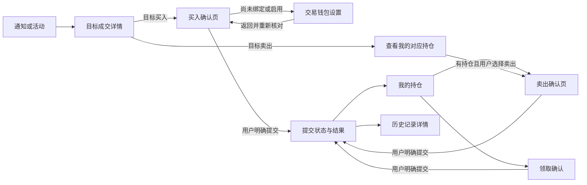

# Trader Sync 手动交易：页面与交互设计

> 设计状态：页面方案已确认，正式交易 UI 尚未实现。[完整开发规格](../../superpowers/specs/2026-09-15-trader-sync-manual-trading-design.md)已整理、待整体审阅。用户于 2026-09-15 明确回复「确定，这个页面组织方式可以。」已确认交易入口继续放在 Trader Sync，活动／成交详情进入买入，目标详情管理交易钱包，独立提供持仓与历史，买卖使用统一下单确认页，电脑和手机遵循相同确认流程。
>
> 用户于 2026-09-15 进一步回复「没问题」，确认买入以卖一价、卖出以买一价作为价格偏差基准，预计成交均价另外展示；报价过期后刷新并重新核对，不静默放宽价格保护。同日，用户回复「没问题。」确认同页填写、核对后点击「确认买入／确认卖出」直接提交并显示处理结果，不再弹出内容重复的确认框，电脑与手机一致。
>
> 同日，用户回复「可以，没问题。」确认持仓按未结算／已结算／资料待核对分组并支持钱包筛选，未结算优先、已结算组内可领取优先；保留小额余量与仍有份额的零价值仓位，同一市场在不同钱包中的持仓分别展示。
>
> 同日，用户对历史页回复「可以，没问题。」确认在一个交易历史页中提供本系统记录／成交历史两个视图：前者保留 ATHENA 买入、卖出和领取的提交，包含拒绝、失败与待核对；后者展示钱包全部实际买卖，包含绑定前和其他渠道成交。一次提交可以关联多笔成交，两个视图可关联查看。
>
> 用户进一步确认同一账号只允许一个客户端有效登录，新客户端登录成功后旧登录立即失效，详见[单客户端登录需求](../../requirements/identity-access/single-client-login.md)。该要求尚未实现。
>
> 用户已选择交易共用现有 Trader Sync 权限；交易仍须具有钱包操作权限、使用自有钱包并主动启用与逐笔确认。该交易能力尚未实现。
>
> 本轮提出的三页主要交互已逐项确认；其余字段布局及辅助状态继续按这些决定细化。后续独立讨论中，用户也已确认[一个独立交易服务的分工](../trading/polymarket-manual-trading.md#服务组织方案)及优先复用已有账户、核准尚无对应账户后再主动启用创建的接入顺序；账户接入、执行与资产占用、领取与同步三段详细设计均已确认，实际能力仍需实现和验证。这些确认不扩大为整份交互或实现计划已经获批。当前没有实现新的交易页面。

## 依据、任务与范围

依据[已确认的 25 项交易规则](../../requirements/polymarket-copy-trading/copy-trading.md)、[总体设计提案](../trading/polymarket-manual-trading.md)、[平台校验](../../requirements/polymarket-copy-trading/manual-trading-contract-verification.md)与[公开账户复核](../../requirements/polymarket-copy-trading/timetowander-public-account-verification-2026-09-14.md)。用户收到目标成交提醒后，需要在电脑或手机上快速理解交易对象、确认自己的金额，并在 ATHENA 内决定是否执行；界面属于 Operate 工作场景。

本轮集中细化下单页、持仓页和历史页，同时交代它们与目标详情的绑定／启用入口及领取确认的连接。初版继续只做用户主动的市价买卖和领取。用户已要求后续无需关注 Combo，本文不展开其字段映射或专项校验，不让该问题阻挡普通市场及 Neg Risk 单个选项的流程设计。

视觉继承[全站主题需求](../../requirements/web-ui/visual-theme.md)、[v23 一致性修订契约](../../requirements/web-ui/theme-consistency-contract.md)，以及既有 [Trader Sync 首页](../../requirements/web-ui/trader-sync-home-proposal.md)和[订阅详情](../../requirements/web-ui/trader-sync-subscription-detail-proposal.md)的阅读层级。本轮不另建主题、字体或共用组件规则。本文中文描述字段语义，正式页面文案沿用会员端既有语言体系。

## 已确认的页面组织

| 位置 | 已确认的职责 | 主要去向 |
| --- | --- | --- |
| 活动列表／成交详情 | 查看目标成交；买入活动进入买入，卖出活动可查看自己的对应持仓 | 买入确认页，或定位后的持仓及手动卖出确认页 |
| 目标详情 | 绑定／换绑自己的钱包，主动启用交易，查看实际账户与余额 | 完成设置后回到原活动或下单上下文 |
| 我的持仓 | 查看自有仓位，主动卖出或领取结算资金 | 同一买卖确认页，或独立的领取确认内容 |
| 交易历史 | 查看 ATHENA 提交记录及钱包真实成交，追溯来源与失败原因 | 可直接打开并恢复的记录详情 |

进入详情、填表、查询报价、返回页面和刷新结果都是读取或草稿操作；图中只有明确提交的边触发相应交易操作。初始化账户的授权仍须在交易钱包设置中单独确认。

### 目标卖出活动的入口（已确认）

用户已选择在目标卖出活动详情中提供「查看我的对应持仓」，以目标当前绑定钱包、同一市场和同一选项定位自有仓位；有持仓时用户可以继续进入既有的手动卖出确认页。用户自己选择卖出比例并核对实际份额；不使用目标卖出数量，不把目标卖出误呈现成用户已经卖出，点击提醒或查看持仓都不提交交易。

没有当前绑定时说明需要先确定对应钱包；已核准没有对应持仓时显示没有对应持仓，持仓数据未知或读取失败时单独说明待核对，不能伪造零仓位或直接放行卖出。定位后的卖出始终核对所选自有仓位的实际钱包和份额，绑定或交易条件变化仍须更新内容并重新核对。

真实从该活动经快捷入口发起的卖出，保留原目标和活动上下文，沿已确认的来源追溯规则记录；用户从一般持仓页独立发起的卖出，不因为当前钱包有绑定就补造活动来源。

## 交易钱包设置：首次启用的授权展示

账户设置的详细事实、分项状态与恢复入口见[账户接入与首次启用设计](../trading/polymarket-account-onboarding.md#7-页面承接)。用户于 2026-09-15 已认可该段详细设计；[桌面／手机页面方案 v1](../../requirements/web-ui/trader-sync-manual-trading-proposal.md)已成组确认，正式实现仍待完成。

接入凭据已确认由 ATHENA 统一配置。普通用户只需选择自有钱包、核对实际账户并主动启用，页面不增加 Builder／Relayer API Key 的填写步骤。平台接入凭据不可用时，在实际受影响的准备或操作处说明服务原因；钱包身份、授权状态和余额仍各自展示，不把平台配置问题归为用户填写错误。

用户于 2026-09-15 选择标准长期授权，交易钱包设置中的启用确认须明确展示实际账户、普通／Neg Risk 交易合约、最大资金使用额度及持续有效的范围。持仓的合约级操作授权分别说明，不能描述为只授权当前目标或一笔卖出；每笔买卖仍须按下文流程明确提交。

该选择不增加自定义有限额度输入，也不增加普通买卖时的自动补授权。具体布局、执行进度与错误状态继续细化；正式视觉尚未因此获批。依据见[长期额度设计](../trading/polymarket-manual-trading.md#首次启用的链上授权额度已确认)。

## 下单确认页

### 同一页完成核对与提交

已确认采用一个独立页面：用户输入买入金额或卖出比例，核对钱包、市场选项、价格保护和预计费用后，点击「确认买入」或「确认卖出」直接提交并显示处理结果，不再弹出内容重复的确认框；电脑与手机一致。市场关闭、绑定改变或报价失效时先更新内容，不能让用户确认旧信息却执行新内容。以下具体字段布局及辅助状态继续细化，不由提交方式的确认整体获批。

桌面以交易对象／来源为辅助区，表单、报价和提交为主区；手机按交易对象 → 本次输入 → 报价及费用 → 提交的顺序排列。历史证据默认折叠，本次实际账户、市场、Outcome、方向、金额与费用始终可见。

| 区域 | 买入 | 卖出 |
| --- | --- | --- |
| 本次交易对象 | 自有钱包名称、完整实际交易账户、市场标题、准确 Outcome、买入方向 | 仓位所属钱包与实际账户、市场、Outcome、卖出方向 |
| 来源 | 目标名称与原活动链接；历史成交方向、时间和价格作为参考事实 | 从哪一个自有仓位进入；不自动附加当前绑定目标为来源 |
| 用户输入 | 本次买入本金，标明手续费另计 | 25%／50%／75%／100% 快捷选择及自定义比例；紧邻展示换算后的实际卖出份额 |
| 价格保护 | 最大允许价格偏差；无历史设置时为空，其后带入该用户上次使用值 | 复用同一用户设置，说明本次保护的是最低卖出价格 |
| 报价核对 | 参照报价、预计成交均价、预计份额、最高买入价格、预计费用、预计总支出 | 参照报价、预计成交均价、拟卖份额、最低卖出价格、预计收入、预计费用及预计净收入 |
| 资金／份额条件 | 对应账户可用余额、读取时间；不足时给出缺口与处理入口 | 当前持有与可卖份额；不可卖余量、最小数量或准备不足的原因 |
| 主操作 | 「确认买入」 | 「确认卖出」 |

首次进入买入页，金额为空，不复制目标金额或上一笔金额。卖出比例也需用户主动选择，不默认选中 100%；有效比例须大于 0 且不超过 100%。价格偏差沿用已经确认的 0%～99.99%、最多两位小数规则；两个百分比输入不能共用错误的校验上限。

买入不提供会把全部余额自动换算为含费预算的「全部买入」按钮，以免混淆已确认的本金口径。余额不足时保留用户输入，提示修改金额或到 Polymarket 入金，不自动缩减本金。

选择 100% 卖出时，显示本次实际可表达的卖出份额与预计余量；不预先承诺余额归零。若份额小于平台最小数量，说明本次无法下单，不把金额舍入为零后显示成功。

### 报价如何供用户确认

用户已确认用**当前方向的最优对手价**作为明确标注的参照报价：买入参考卖一价，即当前最低卖方报价；卖出参考买一价，即当前最高买方报价。预计成交均价另外展示，按本次数量、深度和保护边界计算。不能把预计均价、目标历史成交价与价格保护的参照混成同一个数字。后续报价接口和构单算法须落实此口径，不再将基准选择列为待确认问题。

例如参照价格为 0.50、允许偏差为 2%，未计步长限制时，买入最高接受价为 0.51，卖出最低接受价为 0.49。这里仅说明字段关系，不是实时行情或推荐参数；实际价格边界由后端按市场步长收紧。选择 0% 时可能只能成交盘口中符合该价的部分，不能承诺全额成交。

用户已确认报价过期后刷新并重新核对，不静默放宽价格保护。[执行详细设计](../trading/polymarket-trade-execution.md#2-用户看到的报价)已于 2026-09-15 获用户认可，确认由后端给出 15 秒有效期、必要事实变化时失效，以及预计总支出与本次预留金额分开展示；[页面方案 v1](../../requirements/web-ui/trader-sync-manual-trading-proposal.md)已覆盖桌面／手机主视图并获认可。以下流程沿用原确认：

1. 输入合法后读取报价；修改金额、比例或价格偏差即使旧报价失效，并获取相应的新预览。
2. 报价展示后，用户能看清本次参照价和价格边界；后台行情更新不静默重定本次保护范围。
3. 报价过期时保留输入，显示「报价已过期，请刷新后确认」，提供刷新报价入口。有效期由后端返回，前端不自行发明固定时长。
4. 提交时后端再次校验；若需更换账户、调整实际份额或重新确定保护边界，返回新信息供核对，不在原确认下继续执行。

当前深度只能支持部分成交时，预览明确说明预计只能成交部分，并展示对应估算；仍按已确认的市价处理方式执行，不增加成交策略选择，不自动补足余量。费用未取得、余额读取失败或报价不可用时，保留表单并说明具体原因，不用零费用或旧余额使按钮看起来可用。

### 绑定与准备发生变化

从目标活动准备**新订单**时，显示目标当前绑定的钱包；该钱包在下单页只读。要换执行钱包，进入目标详情明确换绑，返回后重新读取账户与报价。用户核对期间绑定改变时，在同一页指出变化并要求重新核对，不能静默替换。

未绑定、未启用或必要准备失效时，页面给出对应设置入口并保留不具执行权限的表单草稿。绑定、账户准备、授权状态和余额分别显示；用户到官网入金后，返回仅触发余额重读。

从持仓卖出或领取始终使用该仓位账户，不随当前目标绑定改变。已解绑钱包需要恢复交易准备时，也能从该钱包／仓位进入准备流程，不要求为了卖出而重新绑定一个目标。已提交订单的查询和重试上下文始终指向原账户。

### 单客户端登录与切换（已确认）

同一账号只允许一个客户端保持有效登录，新客户端登录成功后旧登录立即失效，遵循[单客户端登录需求](../../requirements/identity-access/single-client-login.md)。电脑与手机继续提供同一交易流程，用户切换设备时由新登录接替旧登录。

旧页面获知会话替换后停止旧请求、清理敏感状态及草稿执行许可，提示「账号已在其他客户端登录，请重新登录」。服务端拒绝旧凭据不依赖页面是否及时刷新；新客户端按账号身份查看原持仓和记录，不将旧草稿或旧确认自动转成新提交。

后端已合法接收的操作继续按原记录处理和核对，页面关闭或切换不触发第二笔订单。用户已确认按本笔占用的资金／份额限制后续交易；同一钱包其余已核准可用资产可以继续操作，重复点击与网络重试仍由既定幂等机制处理。

### 提交与结果

点击提交后立即固定本次参数，显示处理中并阻止同一次提交重复点击。结果在当前页面持续显示，也能进入历史详情查看；页面关闭不会取消后端已收到的操作或触发新操作。用户已确认初版自己的买入、卖出和领取结果仅在操作页与历史展示，不额外通过 Notifications 提醒；待核对结果核准后更新原记录，目标成交提醒继续发送。

| 情况 | 页面反馈 | 可以继续做什么 |
| --- | --- | --- |
| 尚未确认系统是否收到请求 | 显示提交结果待核对；未取得服务端记录 ID 时不伪造 ID | 按原提交标识查询，刷新或恢复同一结果上下文 |
| 后端已接收，业务校验拒绝且未向平台发出 | 原记录展示拒绝原因，保留输入值与确认内容 | 用户修改后主动发起新提交 |
| 平台受理、撮合或链上确认进行中 | 分别显示已知处理阶段；预估或待确认数量不冒充最终成交 | 查看处理进度与原记录 |
| 结果未知 | 显示待核对，说明系统仍在核对原提交 | 查询原结果；该记录不提供会重新下单的「重试交易」按钮 |
| 部分成交 | 显示已核准的实际金额、份额、费用和未成交部分 | 查看持仓／历史；用户自行决定是否另开新订单 |
| 未成交／失败 | 区分已知未成交与失败，展示原因 | 查看详情，或主动重新准备一笔订单 |
| 最终成功 | 展示实际结果；资产数据未同步时单独显示同步中 | 查看持仓或历史 |

普通草稿、未点击提交的提醒不进入下单记录。请求未到达系统时不能声称服务端已持久化记录；恢复查询和同一次提交的幂等协议须由后端设计保证，前端禁用按钮只是交互反馈。

2026-09-15，用户选择[按资金／份额占用限制后续交易](../trading/polymarket-manual-trading.md#待处理操作与后续交易已确认)。结果页保持原提交上下文，用户另开新订单时核对剩余可用资产；不因原记录仍待核对而统一禁用整个钱包。买卖与领取页面说明本次所需资产、已知处理中占用和可用量，暂不可用时提供原记录入口；未知数值显示待核对，待到账资产不提前计为可用。超时、关闭页面和刷新不解除占用，也不把原提交变成新订单；具体字段布局沿用已确认页面方案及共用组件。

## 我的持仓页

### 钱包与持仓阅读顺序

顶部提供钱包筛选、市场搜索和数据更新时间。钱包候选包含仍属于当前用户且有权访问的已接入账户，包括已解绑的原钱包；名称、账户地址和当前绑定状态帮助辨认，不能把当前绑定目标当作每个仓位的来源。

已确认在全部自有持仓的展示范围内，支持按钱包筛选，并按**未结算、已结算、资料待核对**分组。未结算仓位优先呈现，符合交易条件时提供卖出入口；已结算组内可领取的仓位优先，其余仍有份额的零价值持仓继续可查。资料待核对的记录保留，并说明暂时无法确认状态的原因。同一市场在不同钱包中的持仓分别展示。

具体展示继续细化：小额余量以行内标签说明，可出现在前述任何分组，不能因为低于下单门槛而消失。组内分页与筛选状态应明确，分组不等于删掉后续记录。

| 桌面主要列 | 显示内容 |
| --- | --- |
| 市场与 Outcome | 市场标题、选项、结算状态；不能只显示 Yes／No 而丢失对应市场 |
| 钱包 | 自有钱包名称与可复制的实际账户；同一市场不同钱包分开成行 |
| 持有份额 | 保留实际精度；必要时另显示当前可卖份额及小额余量说明 |
| 当前价格与参考市值 | 标明数据时间；未知显示未取得，不显示零，不当作真实可卖报价 |
| 操作 | 适用时提供「卖出」或「领取」；不具备条件时展示原因 |

手机按市场／Outcome → 钱包 → 份额与价值 → 状态与操作排列，每条仓位保持完整关联。成本等来源字段可放在展开详情；初版不从不完整历史推算一套新的收益排名或聚合收益率。

页面依据持有份额与已核准市场状态分类，不能直接把平台 `OPEN`／`CLOSED` 名称翻译成产品分组。CLOSED 中有正份额的记录仍属于自有持仓；已核准余额为零的旧仓位可在历史查看；余额未知不按零处理。`redeemable=true` 也不能单独产生正金额领取入口。

### 卖出与领取

卖出点击后进入统一确认页，固定该钱包、市场与 Outcome，再读取本次可卖数量和报价。列表参考价格不直接成为执行依据。未达到最小数量、市场已关闭、余额尚未核对或准备不足，各显示其自己的原因。

领取采用独立确认内容，展示实际账户、市场、将处理的 Outcome／份额及可领取资金。若平台操作处理同一市场的多个 Outcome，完整列出本次影响范围，不能让用户误以为只处理点击的那一行。只有用户明确确认才提交；结果仍区分处理中、待核对、失败和最终到账。

[领取详细设计](../trading/polymarket-redemption-and-sync.md#3-从预览到到账的流程)已获用户认可，补充两种实际处理范围、零兑付份额说明、领取准备与领取提交分离、15 秒确认期限，以及成功但列表尚未更新的状态。完整视觉稿须承接实际范围，不能把全余额调用显示为固定数量领取。

已结算且没有正金额可领取的记录保留事实，说明「暂无可领取资金」。领取金额未知时显示「领取资格待核对」，不显示承诺到账的金额。

### 大列表、刷新与缺失数据

公开样本已出现数百条已结算零价值记录和数百条小额余量，因此采用服务端分页和稳定的阅读顺序。刷新不突然改变用户正在操作的行、选择和滚动位置；新增或变化的数据提示用户更新。不同钱包的读取错误分别显示，不能因一个钱包失败将其他钱包资产也清空。

首次同步尚未完成时展示已有结果和同步范围；真实空持仓、筛选无结果、接口失败和仍在同步使用不同提示。一次分页耗尽不直接显示「全部资产已核对」。

[持仓与同步详细设计](../trading/polymarket-redemption-and-sync.md#6-同步流程覆盖与分页)已获用户认可，补充 OPEN／CLOSED 与链上候选联合核对、每个账户独立覆盖、缺口状态，以及固定视图版本的本地分页。界面可以展示已取得数量和区间，未知总量时不编造同步百分比。

2026-09-15，用户选择本次交易条件就绪后即可操作，完整历史继续后台同步。钱包设置和下单页按本次必要条件展示可操作状态；历史页独立展示已获取范围、同步进度及异常，不能用历史尚未齐全统一禁用交易。当前资金、可用份额、授权或结算事实仍无法核准时，具体操作继续显示待核对及原因。此项不缩小全部持仓与历史的展示范围，详见[已确认的同步与就绪规则](../trading/polymarket-manual-trading.md#首次历史同步与交易就绪已确认)。

## 交易历史页与详情

已确认保留一个交易历史页，在页内区分两个视图：**本系统记录**与**成交历史**。前者容纳 ATHENA 买入、卖出和领取的提交，包括被拒绝、失败与待核对的记录；后者展示交易钱包全部实际买卖，包含绑定前和其他渠道成交。一次提交可以关联多笔成交，两个视图可关联查看，例如一次买入分两笔成交，对应一条系统提交和两笔真实成交。

账户启用过程仍在交易钱包设置中查看，不伪装成下单。以下具体字段、筛选布局和详情状态继续细化；关联必须以核准事实为依据，没有可靠对应关系时显示未关联。

| 内容 | 本系统记录 | 成交历史 |
| --- | --- | --- |
| 记录粒度 | 用户一次明确提交，包括被拒绝、失败和待核对的提交；领取为独立操作类型 | 已核准的实际买卖成交；一笔订单可以有多条成交 |
| 主要字段 | 提交时间、钱包、市场／Outcome、操作、提交金额或份额、状态、已核准实际结果 | 成交时间、钱包、市场／Outcome、方向、实际份额、成交价与核准金额 |
| 来源 | 有关联时展示当时目标与原活动入口，后续换绑不改写 | 核准关联 ATHENA 记录时可跳转；否则显示未关联，不因当前绑定补造目标 |
| 失败与未知 | 显示原因或待核对，并保留记录详情 | 不把本地失败尝试添加为实际成交 |
| 费用 | 将预计值与已核准实际费用分开 | 来源没有提供时显示未取得，不能填零或从价差猜手续费 |

两种视图均提供钱包、市场与时间筛选；本系统记录另按操作和状态筛选，成交历史按买卖方向筛选。默认时间范围为全部时间，后端以已同步的稳定分页数据供阅读，同时明确历史覆盖范围；不会把接口默认最近三年或只查 taker 当作全部记录。

详情顶部先呈现钱包、交易对象、状态与实际结果；下方分别展开本次确认内容、处理过程、相关成交和原始证据。没有交易所订单 ID 时如实说明尚未取得。订单有多笔成交时，先给汇总，再列明细；链上哈希不能独自承担唯一成交键。

成交提醒继续进入原目标活动；活动已关联本系统提交时，可从活动详情跳转查看对应记录。用户也可从历史或提交结果打开记录详情。返回列表恢复原钱包／市场／时间条件、分页与滚动位置。失败或未知记录只提供有明确语义的「刷新状态」「查看原活动」等入口；如提供「再下单」，它必须明确打开一个新的确认流程，不能复用旧确认自动发单。

## 共用交互与边界

- **产品权限（已确认）：**交易入口共用现有 Trader Sync 权限，管理员不增加独立交易授权开关。用户缺少钱包操作权限时说明原因，保留其原本有权使用的目标提醒；不能将开通产品权限显示为钱包已经启用或允许下单。交易仍需自有钱包、有效准备及本次主动确认，具体读取权限沿后端契约落实。
- **权限与身份：**沿用当前会员认证和资源归属边界；切换账户、退出或撤权时停止旧请求并清理对应草稿、结果和缓存，旧响应不得落入新账户页面。浏览器路径中的钱包和来源 ID 只是请求线索，不能成为权限证明。
- **草稿与恢复：**未提交输入只在同一用户、同一上下文内保留，返回后重新核对当前绑定、账户与报价。草稿中的旧确认不能恢复为有效执行许可；已提交记录则按原标识恢复。
- **按钮和错误：**主操作有清楚的买入／卖出／领取文字。输入错误贴近字段，整单错误在核对区说明；不只靠红绿区分方向或结果。未取得必要数据时显示原因，不将空白骨架变成可点的提交按钮。
- **金额与标识：**沿用统一数值列、原始精度和地址复制规则，钱包及哈希使用既有等宽字体；缺失值与零有不同表达。显示币种由后端核准，不能凭来源字段中含 `usdc` 就推定当前结算币种。
- **电脑与手机：**同一操作只维护一份语义。手机操作区留足正文、键盘和安全区域空间；金额、价格边界、费用或错误不可被固定按钮遮挡，字体放大时可改为文档流布局。
- **读取更新：**列表、订单结果与报价的更新用途分别处理。沿用现有可见页 single-flight、失效请求隔离和返回恢复思路；后台同步与结果核对不依赖用户一直打开页面。

## 前后端承接与后续验证

本轮规定页面需要的事实和动作，不将其直接当作已批准的 RPC／数据库设计。

| 页面所需能力 | 后端需要返回或保证的内容 |
| --- | --- |
| 解析下单上下文 | 当前用户、来源可见性、当前绑定版本、Wallet 与实际账户、准确市场／Outcome、支持的操作及不可用原因 |
| 读取交易预览 | 输入值对应的数量、明确的报价参照及边界、预计成交与费用、可用余额、数据时间和有效期；无签名或授权副作用 |
| 明确提交 | 稳定提交标识、不可变确认内容、当前权限与资格复查、幂等执行与原记录查询；拒绝也有可追溯结果 |
| 持仓与领取预览 | 各账户持有与可卖份额、市场结算、实际领取范围、操作资格、分页与覆盖状态 |
| 历史与详情 | 本地提交与真实成交分别建模、可靠关联、原始来源不变、未知结果继续核对、缺失值如实返回 |

后续验证须同时覆盖桌面与手机的完整主流程，以及旧通知换绑、首次无价格偏好、费用不足、报价过期、部分成交、重复点击、结果待核对、占用期间使用其余可用资产、超时后保留占用、解绑后卖出／领取、小额余量、零价值可赎回、历史分页和权限变化。真实链路、浏览器截图、键盘操作、窄屏与字体放大分别保存证据，文档核对不替代这些验收。

## 确认进度与后续设计

本轮逐项提出的主要交互均已确认：页面组织、买卖报价基准、均价单独展示、过期后重新核对、同页核对后直接提交、持仓分组与钱包筛选，以及历史页的本系统记录／成交历史两个视图。不再重复确认这些决定。

后续按已确认方案实现字段布局、绑定／启用和领取的完整状态、响应式展示及验证场景；共用规则直接沿用，必要辅助状态继续覆盖与验证。[页面方案 v1](../../requirements/web-ui/trader-sync-manual-trading-proposal.md)及[八个视图的桌面／手机截图](../../requirements/web-ui/previews/trader-sync-manual-trading-v1/README.md)已于 2026-09-15 获用户「认可」，具体范围见[确认记录](../../requirements/web-ui/previews/trader-sync-manual-trading-v1/approval.json)；23 张截图、39 项布局检查、16 次自动无障碍检查及 20 项交互检查的结果见预览记录。静态预览不等同于正式前端或真实交易验收。

用户已经确认[总体设计中的服务组织方案](../trading/polymarket-manual-trading.md#服务组织方案)：由一个独立交易服务承接账户准备、交易执行及持仓历史，与既有监控、通知和 Wallet 协作，下单与历史同步分别安排处理资源。优先复用已有账户、核准尚无对应账户后再主动启用创建的顺序也已确认；查不清或暂不支持时不自动新建。同一账号单客户端登录、新登录使旧登录立即失效、交易共用 Trader Sync 权限、自行交易结果仅在页面与历史展示，以及目标卖出活动进入对应持仓的规则已补充确认；三段详细设计已确认会话替换与交易接收边界、账户准备及执行契约；真实账户接入和交易能力仍待验证。[完整规格](../../superpowers/specs/2026-09-15-trader-sync-manual-trading-design.md)已整理、待整体审阅，再进入中文实施计划；当前未进行登录或交易代码实现。
