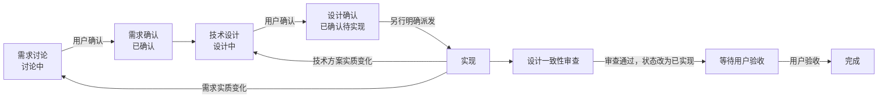

# 设计主导的后端开发工作流

本流程用于 ATHENA 后端功能开发，目标是让业务目标、技术方案和实现授权彼此独立且可审查。用户负责目标与关键取舍，Codex 负责基于仓库事实完善设计、实现代码并证明实现没有偏离；双方以仓库文档而不是聊天记录作为跨任务事实来源。

## 固定流程



确认需求只开放技术设计阶段，确认技术设计只确定实现依据；两者都不会自动授权修改源码。

## 双方职责

| 参与者 | 主要职责 | 不应默认承担 |
| --- | --- | --- |
| 用户 | 决定业务目标、范围、权限和关键取舍；明确确认需求与设计；另行派发实现；最终验收 | 逐个决定函数名、辅助函数拆分或局部代码组织 |
| Codex | 读取需求、设计和源码；识别现状差距与风险；形成可审查的技术设计；按授权实现、同步文档并完成一致性审查 | 用实现便利替代业务目标，或把自己的推断当作已确认决定 |
| 仓库文档 | 保存当前有效的需求、技术决定、状态和源码关系 | 保存聊天流水、历史方案或未确认推断 |

## 文档与状态

| 文档 | 回答的问题 | 状态 |
| --- | --- | --- |
| [`docs/requirements/`](../requirements/README.md) | 为什么做、为谁做、目标行为和验收标准是什么 | `讨论中`、`已确认` |
| [`docs/design/`](../design/README.md) | 后端如何实现、当前代码与目标差距是什么 | `设计中`、`已确认待实现`、`已实现` |

需求按稳定业务能力组织，技术设计按稳定子系统和能力组织。两者必须双向链接；需求变化更新原文档，设计变化更新原设计，不为单次聊天、任务或 PR 建立事实副本。

## 六种工作模式

### 1. 需求讨论

- 读取仓库现状和已有文档，只进行必要的只读分析。
- 使用[需求模板](../requirements/template.md)新增或更新目标、非目标、角色权限、业务规则、流程、边界和验收场景。
- 状态保持 `讨论中`，把会改变后续方案的问题列入“待确认问题”。
- 不创建后端技术方案，不修改后端源码。

### 2. 需求确认

- 将用户确认的结论完整写回需求文档，清除会实质影响方案的待确认问题。
- 由用户明确确认后，将状态改为 `已确认`。
- 输出确认范围和仍不包含的事项；不自动开始技术设计或实现。

### 3. 后端技术设计

- 仅以 `已确认` 需求为输入，读取相关 `已实现` 设计和真实源码。
- 使用[技术设计模板](../design/template.md)记录需求覆盖、现状差距、关键决定、组件与契约、数据与流程、事务并发、失败恢复、配置安全、可观测性、源码影响、验证方式和待确认问题。
- 新建或实质修改中的设计状态为 `设计中`。本阶段可以检查源码，但不得修改后端源码。

### 4. 设计确认

- 向用户说明设计摘要、关键取舍、影响范围、旧实现清理和验证边界。
- 由用户明确确认后，将状态改为 `已确认待实现`，并将决定写回文档。
- 设计确认不等于实现授权；没有新的明确实现任务时停在本阶段。

### 5. 实现

- 开始前检查需求为 `已确认`、技术设计为 `已确认待实现`，并确认用户已经明确派发实现。唯一例外是用户明确要求把代码修复到现有 `已实现` 设计，且文档已经无歧义地定义期望行为。
- 按“实现任务契约”逐项把需求映射到代码；在范围内自主决定命名、辅助函数和局部组织。
- 同步修改设计文档、源码链接及受影响的仓库说明，直接移除被替换的旧实现，不增加仅用于历史兼容的路径。
- 若修改 SQLC、Proto、ABI 或跨越两个及以上依赖层，同时使用 `$sync-athena-changes`；生成与依赖规则以该技能为准，本流程不重复定义。
- 发现实质偏差时，只完成不依赖该偏差的部分。把拟议变更、原因和影响写回文档：业务变化退回需求阶段，技术变化退回设计阶段；重新确认后，用户还需明确授权继续变更后的实现，原实现授权不自动覆盖新范围。
- 所有授权范围完成并通过一致性审查后，才将设计状态改为 `已实现`。

### 6. 设计一致性审查

- 按需求条目核对技术设计、实际源码和清理结果，确认没有遗漏、越界实现或未记录偏差。
- 核对组件边界、契约、数据、事务并发、失败恢复、配置安全、可观测性和源码链接。
- 只在用户已要求实现或修复时修改源码；单独的审查任务默认只读。
- 按“完成报告”返回结果，并把剩余事项留在对应文档中。

## 变更分级与回退

| 发现的变化 | 处理方式 |
| --- | --- |
| 业务规则、权限、业务状态、范围、用户可见行为或验收标准变化 | 需求退回 `讨论中`，更新并重新确认 |
| 组件边界、接口或数据契约、数据模型、事务并发、核心流程或基础设施变化 | 设计退回 `设计中`，更新并重新确认 |
| 命名、辅助函数拆分、同一组件内的局部组织 | Codex 在已确认设计内自主决定 |
| 格式化、注释、文案，或源输入、契约和设计语义均未变化的纯生成文件刷新 | 豁免需求与设计确认门禁；修改 SQL、Proto、ABI 等生成源不豁免 |

用户明确要求修复，且缺陷只是代码偏离现有 `已实现` 设计时，可以直接按该设计修复，不必为了历史能力虚构一份新需求或把设计退回待实现。若代码与文档冲突但无法判断哪一方正确，或期望行为没有被已确认文档定义，则先补充并确认相应需求或技术设计。

## 实现任务契约

派发实现时使用以下输入；路径和边界应具体，不能只引用此前聊天：

```text
请按以下已确认设计实现后端功能：

- 已确认需求：<docs/requirements/...md>
- 已确认技术设计：<docs/design/...md>
- 本次范围：<要实现与明确不实现的内容>
- 成功标准：<可观察、可判定的完成条件>
- 授权验证：<允许运行的生成、构建、静态检查或测试命令；未授权测试则写“不得运行测试”>
- 停止条件：<哪些需求或技术偏差出现时必须回退并等待确认>
```

若任务缺少上述信息，Codex 先从已确认文档补全可确定内容；任何会实质改变结果且无法从文档确定的部分必须停在对应设计阶段，不能以猜测补齐。

## 完成报告

实现任务结束时按以下顺序报告：

1. 需求到实现的对应关系；
2. 主要源码位置和关键符号；
3. 与已确认设计的偏差，若无则明确写“无”；
4. 已替换或删除的旧实现；
5. 实际执行的验证及结果；
6. 剩余事项、风险或需要用户决定的内容。

报告只总结仓库中已经落地的事实，不能用完成报告代替需求或技术设计文档更新。
