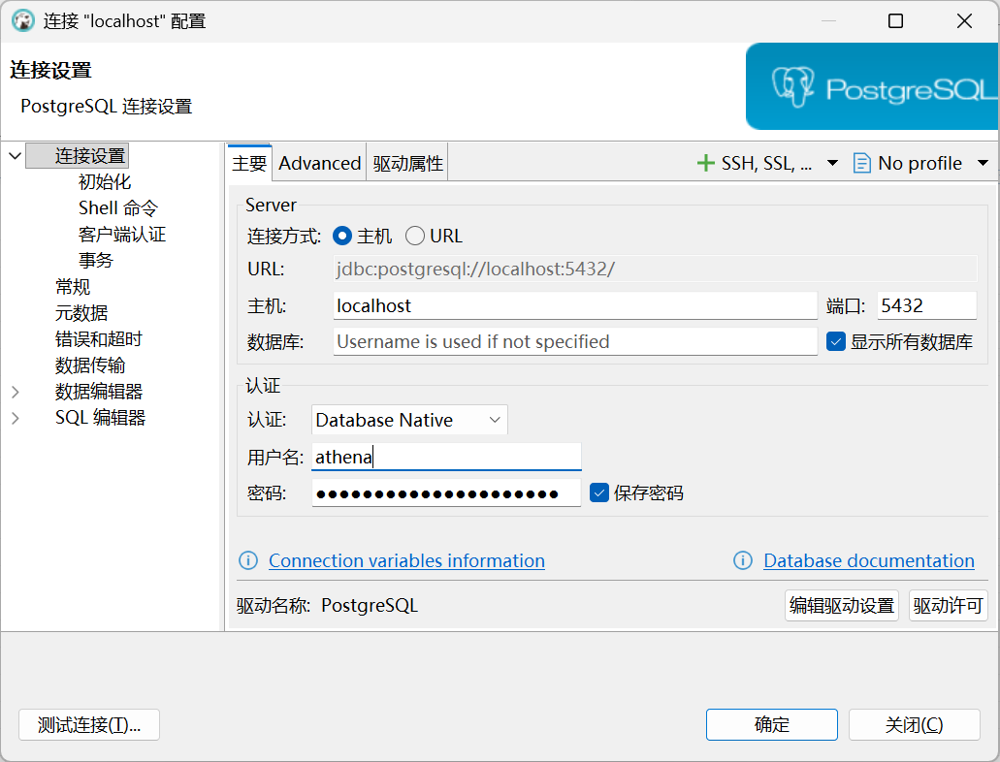

# 使用 DBeaver 连接本地 PostgreSQL

本文说明如何使用 DBeaver 连接 Athena 本地 PostgreSQL，并查看 `application` 和 `worm` 两个数据库。

## 前置条件

先启动本地 PostgreSQL。常见方式包括：

```bash
make run
```

也可以只启动 PostgreSQL：

```bash
hack/start-postgres-with-password.sh
```

`make run` 使用 `athena-local-postgres-data` 命名 volume 保存数据库。
`make stop` 或前台按 `Ctrl+C` 会删除本次运行的 PostgreSQL 容器，但不会
删除该 volume；下一次 `make run` 会继续使用原数据库。只有执行
`make run-reset` 才会删除 volume，使后续启动创建全新数据库。

## 新建连接

1. 打开 DBeaver。
2. 选择新建连接，数据库类型选择 `PostgreSQL`。
3. 在连接配置中填写以下信息：

| 字段 | 值 |
| --- | --- |
| Host | `localhost` |
| Port | `5432` |
| Database | 可留空并勾选显示所有数据库，或填写 `application` / `worm` |
| Authentication | `Database Native` |
| Username | `athena` |
| Password | `.env` 中的 `POSTGRES_PASSWORD`，当前示例为 `ATHENA_REDIS_PASSWORD` |

配置示例：



## 验证连接

点击 `测试连接`，成功后保存连接。

如果 `Database` 留空并勾选显示所有数据库，可以在连接树中展开并查看：

- `application`
- `worm`

`application` 保存 application 模块的数据表；`worm` 是 worm 模块使用的独立数据库，目前可能还没有业务表。

## 常见问题

### 密码是什么？

如果使用项目 `.env`，当前配置为：

```env
POSTGRES_PASSWORD="ATHENA_REDIS_PASSWORD"
```

因此 DBeaver 中密码填写：

```text
ATHENA_REDIS_PASSWORD
```

如果本地启动 PostgreSQL 时没有加载 `.env`，脚本默认 `POSTGRES_PASSWORD` 为空，并可能使用 trust auth。此时 DBeaver 密码可以留空。

PostgreSQL 初始化密码是持久化配置的一部分。修改 `.env` 中的
`POSTGRES_PASSWORD` 后，需要先执行 `make run-reset`，再用新密码启动。

### 连接不上 localhost:5432

先确认 PostgreSQL 是否正在运行：

```bash
psql -h 127.0.0.1 -p 5432 -U athena -d application
```
