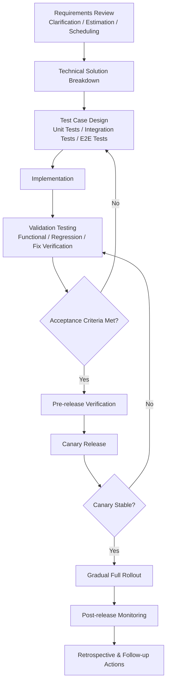

# Development Workflow

## Notes

- The delivery loop includes `Test Case Design`, `Implementation`, and `Validation Testing`.
- The team repeats this loop until the feature meets the agreed acceptance criteria.
- `Validation Testing` should confirm functional correctness, regression safety, and readiness for release.
- After the feature passes acceptance, it moves through pre-release, canary rollout, and gradual full rollout with monitoring at each stage.