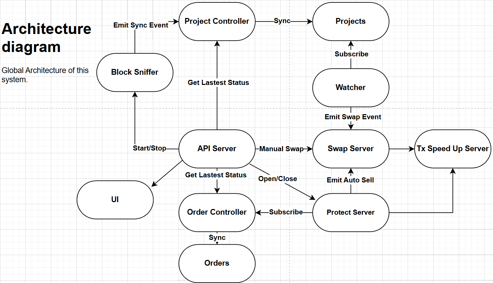

# Overview

<!-- markdownlint-disable MD026 -->
## What Is Athena?
<!-- markdownlint-enable MD026 -->

Athena is a trading/project sync system for the blockchain.

## Business Design and Research

- [业务设计与研究资料索引](token/README.md)
- [Token 目标设计](token/token.md) — 中文业务设计草案，尚未实现。
- [Token 流程图索引](token/README.md#流程图) — 每张流程图独立保存，附规则与待定边界说明。

## Current System Design

- [Living Design Documentation](design/README.md) — English documentation of the currently implemented system for developers and AI agents.

## Operations

- [Makefile Commands and Deployment](operator-manual/makefile-commands.md)
- [BSC Transaction Indexer Server](bsc-transaction-indexer-server.md)
- [BSC Swap Indexer Server](bsc-swap-indexer-server.md)
- [Etherscan Gateway Servers](etherscan-gateway-servers.md)
