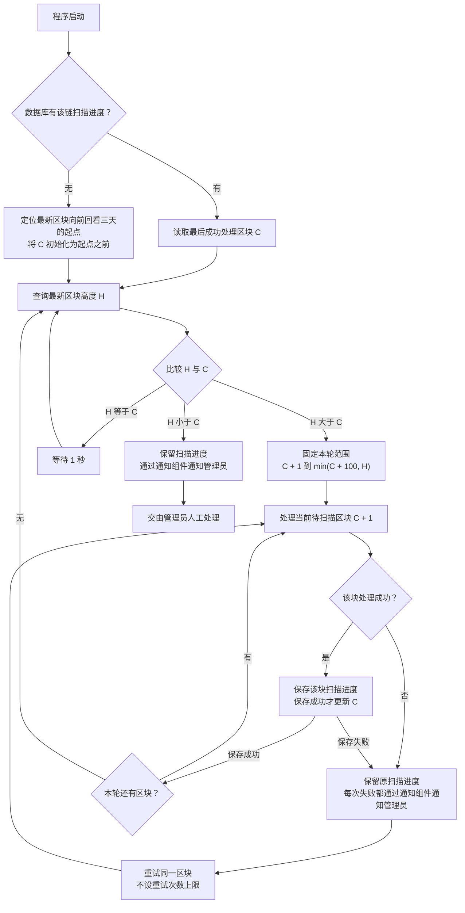

# Token 区块扫描流程

> 文档状态：目标设计草案，尚未实现。本图描述单条链的扫描调度，保持已明确的逐块扫描与失败处理规则。

## 入口与符号

程序启动后，优先恢复数据库中的该链扫描进度；无进度时，定位最新区块向前回看三天的起始区块。

| 符号 | 含义 |
| --- | --- |
| `C` | 最后一个已经成功处理并保存进度的区块高度；下一块是 `C + 1` |
| `H` | 本轮查询得到的最新区块高度 |
| 本轮终点 | `min(C + 100, H)`，以本轮开始时的 `C` 和 `H` 确定，轮内保持不变 |

## 流程图

## 关键说明

- 三天是时间范围，不是固定区块数量。初始 `C` 设在起点之前，保证起始区块会被处理。
- 每轮范围两端均包含，最多 100 个不同区块。例如 `C = 1800`、`H = 2000`，本轮处理 1801–1900。
- 逐块处理，成功一块保存一块；没有部署候选的区块也推进进度。本轮上限固定，不随新块产生而延长。
- 本轮完成立即重新查询 `H`。只有 `H == C` 时等待 1 秒，仍有积压时不额外等待。
- 区块处理或进度保存失败均不越过该块。每次失败都通知管理员并重试，不合并、去重或抑制重复失败通知；100 块上限不限制重试次数。
- `H < C` 保留进度并交由管理员人工处理，不自动回退、重新初始化或按追平处理。通知复用 [系统通知组件](../design/notifications/system-notification-operations.md)。

## 待明确边界

三天起点定位算法、单块完成条件、是否等待 Token 识别、与项目研究的衔接、重试间隔、通知提交失败处理、人工恢复及其他链重组情形仍待设计。图中异常通知属于未来程序行为，本次文档整理不会触发这些运行告警。

扫描中的区块失败无限重试与 [源码请求的有限重试](token-contract-source-flow.md) 是不同层次的规则，两者的失败传播关系尚未确定。

## 关联文档

- [Token 目标设计](token.md)
- [合约发现与 Token 识别流程](token-discovery-identification-flow.md)
- [整体业务流程](token-overall-flow.md)
- [返回业务设计与流程图索引](README.md)
