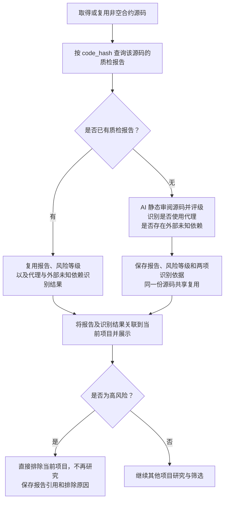

# Token 合约源码 AI 静态审阅流程

> 文档状态：目标设计草案，尚未实现。首版通过 AI 静态审阅源码，生成可复用的质检报告和风险等级；高风险项目直接排除，不再研究。

## 入口与目的

获取合约源码的目的是通过 AI 静态审阅识别源码中可见的明显漏洞、后门或危险逻辑，形成质检报告并评定风险等级，从而筛选项目。报告评定为高风险时，直接排除使用该源码的当前项目，不再继续研究；非高风险的项目继续接受其余研究规则的评估。

本流程从已取得或复用非空源码开始，源码获取及其失败处理沿用 [合约源码获取流程](token-contract-source-flow.md)。通过当前合约运行时字节码的 `code_hash` 匹配该源码的质检报告：已有报告直接复用，没有报告才交给 AI 静态审阅，生成报告及风险等级并保存。同一份源码只生成一份共享报告。

AI 的分析输入是实际提供的源码。项目身份、源码来源和 `code_hash` 用于匹配与关联，不作为读取链上状态的入口。报告保存风险等级，以及“是否使用代理”“是否存在外部未知依赖”两项独立识别结果与依据，作为同一源码的共享分析结果；每个使用该报告的项目仍分别保存报告关联和自身的筛选结果。

## 流程图

## 首版范围

首版仅通过 AI 阅读源码完成审阅，不接入静态分析工具，不执行合约，也不读取链上状态核实当前 owner、角色、税率、开关或代理实现。审阅不依赖钱包资料、底池信息或其他采集结果。

AI 可以分析源码中的权限判断、参数修改范围和调用条件。例如，源码允许某个管理角色无限增发时，应说明相关入口、权限限制及增发逻辑；不能据此声称已经查明当前谁拥有该角色，或该角色目前仍可执行操作。

任意增发、修改他人余额、限制转出、异常税费及隐藏权限等可作为审阅关注方向。具体问题必须由实际代码逻辑支持，不能仅凭函数名称或注释认定存在漏洞，也不从代码单独推断开发者的主观意图。高风险报告直接触发项目排除已经确定；各类发现如何评定风险等级仍待细化。

[AI 分析 owner 读取方式与 Go 链上读取](token-owner-wallet-flow.md)、[税费接收钱包获取](token-fee-recipient-wallet-flow.md)及关联钱包采集属于独立研究资料流程；静态审阅不使用这些逐合约的链上结果核实报告结论，也不以取得 owner 或税费接收地址为前提。

### 代理与外部未知依赖识别

AI 在本次已取得的源码范围内，分别判断以下两项，并给出简短结论及源码位置或代码片段作为依据：

| 识别项 | 判断内容 |
| --- | --- |
| 是否使用代理 | 源码是否通过代理结构将调用交给另一个实现合约执行；结合实际转发逻辑判断，不仅凭合约名、注释或单个关键词认定。 |
| 是否存在外部未知依赖 | 源码是否依赖本次提供的源码中未包含、或无法确定具体实现的外部合约逻辑；指出对应调用位置，以及实现未提供或目标无法确定等原因。 |

两项分别保存，一个合约可以同时使用代理并存在外部未知依赖。已完整提供且能在本次源码中审阅的库或父合约，不因出现导入或继承语句就归为未知依赖；只有接口而没有依赖的具体实现，也不能仅凭接口名称认定其行为已知。结论为“否”表示本次源码范围内未识别到相应结构或依赖，不表示已经通过链上状态核实其全局不存在。源码中的疑点与范围限制在依据说明中保留。

本阶段只完成这两项识别及结果展示，不新增实际代理实现地址的解析或链上读取，不继续获取、追踪或分析代理实现及外部依赖的源码。两项结果不产生新的自动排除或风险等级提升规则；原有风险评级仍依据已审阅源码中的实际代码证据，不将使用代理或存在未知依赖本身直接等同于存在漏洞。

## 报告内容与表达

报告关联本次实际审阅的源码，至少说明以下内容，具体字段和格式待细化：

| 内容 | 要求 |
| --- | --- |
| 审阅范围 | 说明本次审阅了哪些源码，以及缺少或无法判断的部分。 |
| 是否使用代理 | 保存本次源码的识别结论及代理逻辑依据，仅识别，不延伸分析实际实现合约。 |
| 是否存在外部未知依赖 | 保存本次源码的识别结论、调用依据及未知原因，仅识别，不获取或分析外部实现。 |
| 风险发现 | 描述发现的具体漏洞或危险逻辑及可能影响。 |
| 源码依据 | 给出相关函数、代码位置或片段，说明为何支持该发现。 |
| 触发条件 | 说明源码中要求的权限、参数或执行条件；涉及当前链上状态的部分保留为未核实条件。 |
| 风险等级与评级依据 | 根据本次源码审阅评定风险等级，说明支持评级的问题与依据；具体等级划分和评级规则待细化。 |
| 审阅结论 | 汇总本次发现、疑点和判断依据；高风险报告用于直接排除项目，非高风险时继续其他研究，不据此承诺项目安全或可以买入。 |

存在疑点、只有代理外壳或缺少外部依赖源码时，AI 保存上述两项识别结果，在报告中说明审阅范围、疑点和依据，并给出基于所提供源码的风险等级，不把未提供的实现逻辑视为已经审阅，也不继续扩展该部分分析。AI 请求失败等技术异常不能填成两项识别均为“否”。

## 同一源码的分析结果复用

`code_hash` 是运行时字节码的哈希，用于从数据库定位对应的源码记录，不是源码文本哈希。质检报告、风险等级及代理与外部未知依赖的两项识别结果关联实际审阅的源码保存；后续项目匹配到同一份源码时，共用上述结果，不按项目地址重复生成报告。识别结论描述该份源码，不作为新部署实例的链上实现关系证明。

这一共享原则与 [owner 分析结果的复用](token-owner-wallet-flow.md)及[税费接收钱包分析复用](token-fee-recipient-wallet-flow.md)一致：同一份源码共用质检报告、owner 分析结论与读取方式、税费接收钱包的识别结论、固定地址与读取方式。三项都是当前目标设计中的源码分析结果，分别保存，互不作为完成前提，也不要求合并在一次 AI 调用中。

复用读取方式后，实际 owner 及依赖链上状态的税费接收地址仍须按当前链、当前合约分别读取；不复用其他部署实例的地址结果。质检报告只静态分析所提供源码，不包含这些逐合约的链上读取结果，也不因为匹配到相同字节码就宣称已覆盖未提供的代理实现或外部依赖。

## 与项目筛选的关系及待设计事项

高风险报告是已确认的直接排除依据。无论报告是本次生成还是从数据库复用，当前项目都应用同一风险评级；评定为高风险时，保存项目筛选结论、具体原因和报告依据，结束对该项目的研究，不等待其余研究材料到齐，也不交接第二板块。如何处理已经启动的采集任务仍待设计。

非高风险的项目继续其他研究与筛选，不能仅凭源码报告直接判定项目符合全部规则或满足买入条件。同一报告可以用于多个项目的高风险排除，但不复用其他项目结合钱包等资料形成的整体研究结论。

AI 请求失败、超时或返回不符合报告要求时，按技术异常记录，不保存为质检报告或据此给项目定级；具体重试方式另行设计。正常业务输出为质检报告及风险等级，技术异常不画入业务筛选分支。

风险等级划分、具体评级规则、模型、提示词、报告格式、同一源码的并发分析协调和数据结构仍待设计。当前不扩展分析工具、链上核实或执行架构。

## 关联文档

- [Token 目标设计](token.md)
- [合约源码获取流程](token-contract-source-flow.md)
- [owner 获取与读取方式复用](token-owner-wallet-flow.md)
- [税费接收钱包获取与读取方式复用](token-fee-recipient-wallet-flow.md)
- [研究资料整理流程](token-research-materials-flow.md)
- [项目研究与筛选流程](token-research-flow.md)
- [返回业务设计与流程图索引](README.md)
