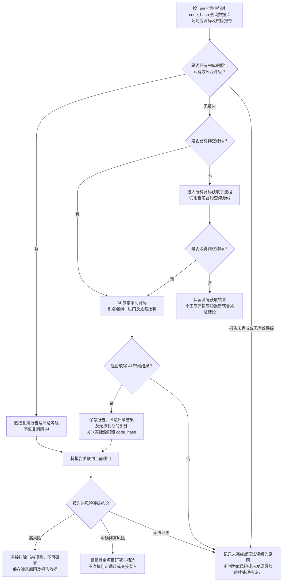

# Token 合约源码 AI 静态审阅流程

> 文档状态：目标设计草案，尚未实现。首版通过 AI 静态审阅源码，生成可复用的质检报告和风险等级；高风险项目直接排除，不再研究。

## 入口与目的

获取合约源码的目的是通过 AI 静态审阅识别源码中可见的明显漏洞、后门或危险逻辑，形成质检报告并评定风险等级，从而筛选项目。报告评定为高风险时，直接排除使用该源码的当前项目，不再继续研究；已有明确非高风险结论的项目继续接受其余研究规则的评估。

先通过当前合约的运行时字节码 `code_hash` 在数据库匹配对应源码及报告。同一份源码只需生成一份质检报告：已有完成的报告及有效风险评级时直接复用，没有报告且已有非空源码时才交给 AI 分析并保存结果。数据库没有非空源码时，先进入 [合约源码获取流程](token-contract-source-flow.md)，取得源码后再审阅；确实未取得源码时记录结果。已有报告未完成或缺少有效评级时，不按成功报告复用，其后续处理待设计。

AI 的分析输入是实际提供的源码。项目身份、源码来源和 `code_hash` 用于匹配与关联，不作为读取链上状态的入口。报告及风险等级属于源码的共享分析结果；每个使用该报告的项目仍分别保存报告关联和自身的筛选结果。

## 流程图

## 首版范围

首版仅通过 AI 阅读源码完成审阅，不接入静态分析工具，不执行合约，也不读取链上状态核实当前 owner、角色、税率、开关或代理实现。审阅不依赖钱包资料、底池信息或其他采集结果。

AI 可以分析源码中的权限判断、参数修改范围和调用条件。例如，源码允许某个管理角色无限增发时，应说明相关入口、权限限制及增发逻辑；不能据此声称已经查明当前谁拥有该角色，或该角色目前仍可执行操作。

任意增发、修改他人余额、限制转出、异常税费及隐藏权限等可作为审阅关注方向。具体问题必须由实际代码逻辑支持，不能仅凭函数名称或注释认定存在漏洞，也不从代码单独推断开发者的主观意图。高风险报告直接触发项目排除已经确定；各类发现如何评定风险等级仍待细化。

已有的 owner 读取与关联钱包采集属于独立研究资料流程；本次静态审阅不使用它们核实报告结论，也不启动 [后续 AI 辅助 owner 读取路线](token-owner-wallet-flow.md)。

## 报告内容与表达

报告关联本次实际审阅的源码，至少说明以下内容，具体字段和格式待细化：

| 内容 | 要求 |
| --- | --- |
| 审阅范围 | 说明本次审阅了哪些源码，以及缺少或无法判断的部分。 |
| 风险发现 | 描述发现的具体漏洞或危险逻辑及可能影响。 |
| 源码依据 | 给出相关函数、代码位置或片段，说明为何支持该发现。 |
| 触发条件 | 说明源码中要求的权限、参数或执行条件；涉及当前链上状态的部分保留为未核实条件。 |
| 风险等级与评级依据 | 对源码评定风险等级，说明支持评级的问题与依据；等级划分及具体评级规则待细化，不将报告缺失或调用失败作为低风险。 |
| 审阅结论 | 汇总本次发现及无法判断的部分；高风险报告用于直接排除项目，已有明确非高风险结论时继续其他研究，无法评级时记录原因；不据此承诺项目安全或可以买入。 |

只有代理外壳或缺少外部依赖源码时，报告说明本次覆盖范围，不把未提供的实现逻辑视为已经审阅。没有源码时不生成源码审阅报告；AI 调用失败或未完成时记录实际原因，不将其写成“未发现风险”。

## 同一源码的分析结果复用

`code_hash` 是运行时字节码的哈希，用于从数据库定位对应的源码记录，不是源码文本哈希。质检报告与风险等级关联实际审阅的源码保存；后续项目匹配到同一份源码时，共用已有完成的报告及有效评级，不按项目地址重复生成报告。未完成报告或无法评级的结果不当作质检成功缓存，其后续处理仍待设计。

这一共享原则与 [owner 读取方式的复用](token-owner-wallet-flow.md) 一致：同一份源码共用质检报告，也共用从该源码确定的 owner 读取方式。两者都是源码层面的分析结果，但 owner 的 AI 识别仍是后续扩展，本轮静态审阅不以生成或执行 owner 读取方式为前提，也不要求两种分析合并在一次 AI 调用中。

复用 owner 读取方式后，实际 owner 地址仍须按当前链、当前合约分别读取；不复用其他部署实例的 owner 地址。质检报告只静态分析所提供源码，不包含这些逐合约的链上读取结果，也不因为匹配到相同字节码就宣称已覆盖未提供的代理实现或外部依赖。

## 与项目筛选的关系及待设计事项

高风险报告是已确认的直接排除依据。无论报告是本次生成还是从数据库复用，当前项目都应用同一风险评级；评定为高风险时，保存项目筛选结论、具体原因和报告依据，结束对该项目的研究，不等待其余研究材料到齐，也不交接第二板块。如何处理已经启动的采集任务仍待设计。

已有明确非高风险结论的项目继续其他研究与筛选，不能仅凭源码报告直接判定项目符合全部规则或满足买入条件。同一报告可以用于多个项目的高风险排除，但不复用其他项目结合钱包等资料形成的整体研究结论。

没有源码、AI 调用失败、报告未完成或无法评级时，不产生低风险或审阅通过结论。图中的“明确非高风险”与“无法评级”用于区分已有评级结论和没有评级结论，不新增风险等级枚举。这些情况能否继续或完成研究、如何重试和通知，以及风险等级划分、具体评级规则、模型、提示词、报告格式、同一源码的并发分析协调和数据结构仍待设计。当前不扩展分析工具、链上核实或执行架构。

## 关联文档

- [Token 目标设计](token.md)
- [合约源码获取流程](token-contract-source-flow.md)
- [owner 获取与读取方式复用](token-owner-wallet-flow.md)
- [研究资料整理流程](token-research-materials-flow.md)
- [项目研究与筛选流程](token-research-flow.md)
- [返回业务设计与流程图索引](README.md)
