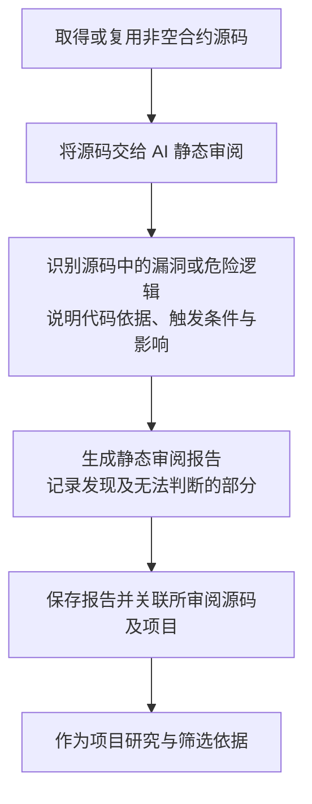

# Token 合约源码 AI 静态审阅流程

> 文档状态：目标设计草案，尚未实现。首版只对已取得的源码进行 AI 静态审阅，生成并保存报告。

## 入口与目的

在取得或复用非空合约源码后，将源码交给 AI 审阅，识别源码中可见的明显漏洞、后门或危险逻辑，形成静态审阅报告，为项目研究和筛选提供依据。

输入是本次实际提供给 AI 的源码。项目身份、源码来源和 `code_hash` 用于关联报告，不作为读取链上状态的入口。源码获取沿用 [合约源码获取流程](token-contract-source-flow.md)。

## 流程图

## 首版范围

首版仅通过 AI 阅读源码完成审阅，不接入静态分析工具，不执行合约，也不读取链上状态核实当前 owner、角色、税率、开关或代理实现。审阅不依赖钱包资料、底池信息或其他采集结果。

AI 可以分析源码中的权限判断、参数修改范围和调用条件。例如，源码允许某个管理角色无限增发时，应说明相关入口、权限限制及增发逻辑；不能据此声称已经查明当前谁拥有该角色，或该角色目前仍可执行操作。

任意增发、修改他人余额、限制转出、异常税费及隐藏权限等可作为审阅关注方向。具体问题必须由实际代码逻辑支持，不能仅凭函数名称或注释认定存在漏洞，也不从代码单独推断开发者的主观意图。这些方向不是已经确定的自动过滤规则。

已有的 owner 读取与关联钱包采集属于独立研究资料流程；本次静态审阅不使用它们核实报告结论，也不启动 [后续 AI 辅助 owner 读取路线](token-owner-wallet-flow.md)。

## 报告内容与表达

报告关联本次实际审阅的源码，至少说明以下内容，具体字段和格式待细化：

| 内容 | 要求 |
| --- | --- |
| 审阅范围 | 说明本次审阅了哪些源码，以及缺少或无法判断的部分。 |
| 风险发现 | 描述发现的具体漏洞或危险逻辑及可能影响。 |
| 源码依据 | 给出相关函数、代码位置或片段，说明为何支持该发现。 |
| 触发条件 | 说明源码中要求的权限、参数或执行条件；涉及当前链上状态的部分保留为未核实条件。 |
| 审阅结论 | 汇总本次发现；未发现明显问题时，只表达本次源码审阅的结果，不据此承诺项目安全或可以买入。 |

只有代理外壳或缺少外部依赖源码时，报告说明本次覆盖范围，不把未提供的实现逻辑视为已经审阅。没有源码时不生成源码审阅报告；AI 调用失败或未完成时记录实际原因，不将其写成“未发现风险”。

## 与项目筛选的关系

本环节交付静态审阅报告，用于识别源码中存在明显问题的项目。哪些报告发现直接触发过滤、哪些需要进一步判断，以及报告缺失时能否完成研究，仍需后续明确。本轮不增加自动过滤阈值或买入判断。

模型、提示词、报告格式、结果复用和失败处理细节留待后续设计；当前不扩展分析工具或执行架构。

## 关联文档

- [Token 目标设计](token.md)
- [合约源码获取流程](token-contract-source-flow.md)
- [研究资料整理流程](token-research-materials-flow.md)
- [项目研究与筛选流程](token-research-flow.md)
- [返回业务设计与流程图索引](README.md)
