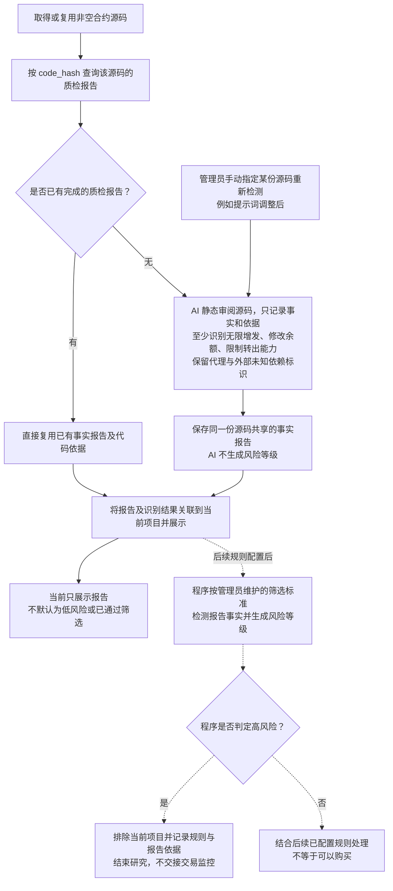

# Token 合约源码 AI 静态审阅流程

> 文档状态：目标设计草案，尚未实现。首版通过 AI 静态审阅源码，生成可复用的事实报告及代码依据，当前只展示、不由 AI 评级。后续由程序依据管理员维护的规则生成风险等级并执行筛选。

## 入口与目的

获取合约源码的目的是通过 AI 静态审阅识别源码中可见的能力、明显漏洞、后门或危险逻辑，形成事实报告和代码依据，为后续筛选提供输入。AI 只生成事实及依据，不负责风险评级；管理员后期维护筛选标准，由程序按报告检测并生成风险等级。本轮不设计具体评级标准，当前只生成和展示报告。

本流程从已取得或复用非空源码开始，源码获取及其失败处理沿用 [合约源码获取流程](token-contract-source-flow.md)。首版仅研究 Ethereum Mainnet，源码查询使用免费 Etherscan Key。通过当前合约运行时字节码的 `code_hash` 匹配该源码的质检报告：已有报告直接复用，没有报告才交给 AI 静态审阅并保存。同一份源码使用共享报告，不因新部署重复分析；管理员可以针对某份源码手动触发重新检测。

AI 的分析输入是实际提供的源码。项目身份、源码来源和 `code_hash` 用于匹配与关联，不作为读取链上状态的入口。报告至少保存是否可无限增发、是否可修改余额、是否可限制转出的事实与依据，以及“是否使用代理”“是否存在外部未知依赖”两项独立识别结果。每个项目关联自己使用的报告；后续程序评级与筛选结果单独保存，不混入 AI 事实报告。

## 流程图

## 首版范围

首版仅通过 AI 阅读源码完成审阅，不接入静态分析工具，不执行合约，也不读取链上状态核实当前 owner、角色、税率、开关或代理实现。审阅不依赖钱包资料、底池信息或其他采集结果。

AI 审阅由后台研究任务独立执行。该块 Token 识别结果、项目资料和研究任务可靠保存后即可推进区块，不等待源码、报告或五层钱包采集完成。

AI 可以分析源码中的权限判断、参数修改范围和调用条件。例如，源码允许某个管理角色无限增发时，应说明相关入口、权限限制及增发逻辑；不能据此声称已经查明当前谁拥有该角色，或该角色目前仍可执行操作。

是否可无限增发、是否可修改余额、是否可限制转出是报告必须覆盖的三个事实维度；异常税费及隐藏权限等也可作为审阅关注方向。报告按实际代码记录能力、限制、触发条件与依据，不能仅凭函数名称或注释认定存在漏洞，也不从代码单独推断开发者的主观意图。AI 不将某个事实自行映射为风险等级或排除结论。

[AI 分析 owner 读取方式与 Go 链上读取](token-owner-wallet-flow.md)、[税费接收钱包获取](token-fee-recipient-wallet-flow.md)、[合约税率读取](token-tax-rate-flow.md)及关联钱包采集属于独立研究资料流程；静态审阅不使用这些逐合约的链上结果核实报告结论，也不以取得地址或税率为前提。

### 代理与外部未知依赖识别

AI 在本次已取得的源码范围内，分别判断以下两项，并给出简短结论及源码位置或代码片段作为依据：

| 识别项 | 判断内容 |
| --- | --- |
| 是否使用代理 | 源码是否通过代理结构将调用交给另一个实现合约执行；结合实际转发逻辑判断，不仅凭合约名、注释或单个关键词认定。 |
| 是否存在外部未知依赖 | 源码是否依赖本次提供的源码中未包含、或无法确定具体实现的外部合约逻辑；指出对应调用位置，以及实现未提供或目标无法确定等原因。 |

两项分别保存，一个合约可以同时使用代理并存在外部未知依赖。已完整提供且能在本次源码中审阅的库或父合约，不因出现导入或继承语句就归为未知依赖；只有接口而没有依赖的具体实现，也不能仅凭接口名称认定其行为已知。结论为“否”表示本次源码范围内未识别到相应结构或依赖，不表示已经通过链上状态核实其全局不存在。源码中的疑点与范围限制在依据说明中保留。

本阶段只完成这两项识别及结果展示，不新增实际代理实现地址的解析或链上读取，不继续获取、追踪或分析代理实现及外部依赖的源码。两项结果不产生自动排除或风险等级提升规则，也不将使用代理或存在未知依赖本身直接等同于存在漏洞；后续是否纳入管理员筛选标准另行确定。

## 报告内容与表达

报告关联本次实际审阅的源码，至少说明以下内容，具体字段和格式待细化：

| 内容 | 要求 |
| --- | --- |
| 审阅范围 | 说明本次审阅了哪些源码，以及缺少或无法判断的部分。 |
| 是否可无限增发 | 说明代码是否提供无总量上限的增发能力，给出入口、权限限制、总量约束及相关源码依据；不凭存在普通铸币入口就认定可无限增发。 |
| 是否可修改余额 | 说明代码是否允许通过特殊入口或逻辑修改账户余额，注明可作用的账户范围、限制及源码依据；与正常转账、铸币或销毁造成的余额变化区分表达。 |
| 是否可限制转出 | 说明代码是否提供限制持币地址转出的能力，给出条件、作用范围、相关入口及源码依据。 |
| 是否使用代理 | 保存本次源码的识别结论及代理逻辑依据，仅识别，不延伸分析实际实现合约。 |
| 是否存在外部未知依赖 | 保存本次源码的识别结论、调用依据及未知原因，仅识别，不获取或分析外部实现。 |
| 风险发现 | 描述发现的具体漏洞或危险逻辑及可能影响。 |
| 源码依据 | 给出相关函数、代码位置或片段，说明为何支持该发现。 |
| 触发条件 | 说明源码中要求的权限、参数或执行条件；涉及当前链上状态的部分保留为未核实条件。 |
| 审阅结论 | 汇总本次事实、发现、疑点和判断依据，不给出风险等级、筛选通过或买入结论。 |

存在疑点、只有代理外壳或缺少外部依赖源码时，AI 保存上述两项识别结果，在报告中说明审阅范围、疑点和依据，不把未提供的实现逻辑视为已经审阅，也不继续扩展该部分分析。事实判断限定在实际提供的源码；不足以判断的部分保留原因，不补成能力不存在。AI 请求失败等技术异常不能填成全部识别结果均为“否”。

## 同一源码的分析结果复用

`code_hash` 是运行时字节码的哈希，用于从数据库定位对应的源码记录，不是源码文本哈希。报告事实、代码依据及代理与外部未知依赖的两项识别结果关联实际审阅的源码保存；后续项目匹配到同一份源码时，共用上述结果，不按项目地址重复生成报告。识别结论描述该份源码，不作为新部署实例的链上实现关系证明。

默认相信已完成报告的准确性并直接复用，不增加新部署自动复核或自动批量重评。管理员可以针对某份源码手动触发重新检测，例如更改提示词后重新生成该份报告。该操作属于重新调用 AI 分析指定源码，报告更新与项目关联的具体保存方式后续细化；手动重检不自动恢复已经结束研究的项目或本轮参与。管理员修改筛选规则后，程序重新检测已有报告属于规则再评估，与重新调用 AI 生成报告分别设计；规则变化不自动要求重写全部 AI 报告。

这一共享原则与 [owner 分析结果的复用](token-owner-wallet-flow.md)、[税费接收钱包分析复用](token-fee-recipient-wallet-flow.md)及[税率分析复用](token-tax-rate-flow.md)一致：同一份源码共用质检报告、owner 分析结论与读取方式、税费接收钱包的识别结论、固定地址与读取方式，以及税率分析结论、读取与解释方案。各项分别保存，互不作为完成前提，也不要求合并在一次 AI 调用中。

[源码公开资料链接](token-public-links-flow.md)也是独立的源码分析资料，按实际源码复用已完成提取结果，保存多条链接、分类及出处。该资料仅提取和展示，不把发现官网或审计报告链接视为已核实项目身份或审计结论，不跟随链接获取网页或扩大审阅范围，也不作为生成质检报告的前提。

复用读取方式后，实际 owner、依赖链上状态的税费接收地址及税率仍须按当前链、当前合约分别读取；不复用其他部署实例的链上结果。质检报告只静态分析所提供源码，不包含这些逐合约的链上读取结果，也不因为匹配到相同字节码就宣称已覆盖未提供的代理实现或外部依赖。

## 与项目筛选的关系及待设计事项

当前只生成、复用并展示事实报告，不设计或执行具体评级标准，也不因尚未配置规则就将项目记为低风险或已通过。后续由管理员维护筛选标准，程序使用报告事实与依据生成风险等级；只有该流程判为高风险时，才保存规则、报告引用与排除原因，结束当前项目研究且不交接第二板块，不等待其他资料齐备。已启动任务的处理后续细化。

后续程序给出的非高风险结果也不等于项目符合全部规则或满足买入条件。同一源码报告可以作为多个项目的规则输入，不复用其他项目的整体研究结论。规则版本变化时，哪些项目需要程序再评估及如何更新结果仍待细化，不自动扩大为批量重新调用 AI。

项目首次真实 Swap 是研究截止，识别范围不限定 V2、V3 或 V4。截止不等于资料全部完成、高风险排除或满足买入条件，也不因报告尚未生成而延后截止。首次 Swap 时尚未交接的项目结束研究并放弃本轮参与；管理员手动重检共享报告不自动恢复该项目。具体状态衔接与在途分析结果处理，见 [项目研究与筛选流程](token-research-flow.md)。

AI 请求失败、超时或返回不符合报告要求时，按技术异常记录，不保存为质检报告或据此给项目定级；具体重试方式另行设计。正常业务输出为事实报告及依据，技术异常不画成风险等级分支。

管理员维护标准的具体方式、程序评级规则与等级划分、规则再评估、模型、提示词、报告格式、管理员手动重新检测的记录方式、同一源码的并发分析协调和数据结构仍待设计。当前不扩展分析工具、链上核实或执行架构，也不实现管理 UI。

## 关联文档

- [Token 目标设计](token.md)
- [合约源码获取流程](token-contract-source-flow.md)
- [owner 获取与读取方式复用](token-owner-wallet-flow.md)
- [税费接收钱包获取与读取方式复用](token-fee-recipient-wallet-flow.md)
- [合约税率读取与分析复用](token-tax-rate-flow.md)
- [源码公开资料链接提取与复用](token-public-links-flow.md)
- [研究资料整理流程](token-research-materials-flow.md)
- [项目研究与筛选流程](token-research-flow.md)
- [返回业务设计与流程图索引](README.md)
