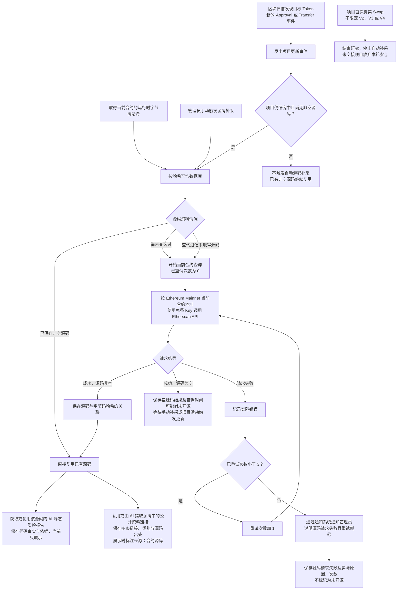

# Token 合约源码获取流程

> 文档状态：目标设计草案，尚未完整实现。当前已有按代码哈希复用资料的机制；本图还包含待实施的手动补采、项目活动触发补采和请求重试规则。

## 入口与目的

首版仅研究 Ethereum Mainnet 项目，Etherscan 请求使用现有免费 Key。取得当前合约的运行时字节码哈希后，先查询数据库中的源码资料。相同哈希已有源码时直接复用；没有可复用源码时，通过当前合约的链和地址调用 Etherscan API。后续扩展其他链时，现有免费 Key 全部替换为付费 Key；持币资料仍保留专用 PRO 凭据安排，见 [持币地址资料获取流程](token-holder-flow.md)。

区块处理在完成该块 Token 识别，并可靠保存识别结果、项目资料及研究任务后即可推进。源码获取、AI 分析和五层钱包采集由后台独立执行，本流程的 API 请求、失败重试、补采与报告生成不阻塞区块推进。

## 流程图

## 关键说明

| 情况 | 处理方式 |
| --- | --- |
| 相同哈希已保存非空源码 | 关联并复用已有源码，无需为本次采集请求 Etherscan |
| 尚未查询过，或此前查询过但没有源码 | 使用当前合约的链和地址查询，不沿用其他地址的空结果跳过采集 |
| 请求成功且源码非空 | 保存源码与字节码哈希的关联，供后续相同哈希的合约复用 |
| 请求成功但源码为空 | 保存成功空响应、链、地址与查询时间，表示可能尚未开源；支持手动补采，研究期间由新的目标 Token `Approval` 或 `Transfer` 事件触发更新后再次查询，不触发请求失败重试 |
| 请求失败 | 记录实际错误并重试；耗尽后通过通知系统通知管理员，保存请求失败、原因和次数，不标记为“未开源” |

“最多重试三次”目前按首次请求之外最多再重试三次记录，即总计最多四次请求。重试次数初始为 0，允许重试时先加 1，再发起请求；任一次请求成功后即停止失败重试，按源码是否为空处理。

成功空源码和请求失败分别记录，不能合并为“未开源”。成功空源码只说明本次接口尚未返回源码，可能是尚未开源，需要再查询；请求失败只说明没有成功取得本次响应。空源码补采与失败重试是两类安排，不把首次请求加三次失败重试的次数上限套用为空源码补采上限。通知只画在失败重试耗尽分支，复用 [系统通知组件](../design/notifications/system-notification-operations.md)，向管理员说明当前链、合约、失败原因与请求次数。

图中的手动补采针对研究中的项目；已经结束项目的独立源码维护入口另行设计，不自动恢复研究。尚未取得源码时支持管理员手动补采。项目研究期间，区块扫描发现目标 Token 新的 `Approval` 授权事件或 `Transfer` 代币转账事件后，发出项目更新事件；若该项目仍无非空源码，再次尝试获取。活动检测针对当前目标 Token 的新事件，不修改关联钱包历史固定的部署前 300 笔范围，也不把其他代币或其他钱包活动自动当作该项目的更新依据。已取得非空源码时继续复用，不因每个新事件重复请求源码或重新生成 AI 报告。

该补采方式由手动操作或新活动事件触发，不设置定时无限轮询。每次真正发起查询仍按成功非空、成功为空、请求失败分别处理；活动事件聚合、同一项目在途请求协调及补采调度细节后续确定。

缓存键是运行时字节码哈希，不是源码文本哈希，也不是 `code.length`。有哈希记录不等于已经取得源码；某个地址的空结果不会使同哈希的其他地址永久停止源码查询。按哈希匹配到同一份源码后，共享其质检报告中的事实与依据、AI 已完成的 owner 分析结论与读取方式、[税费接收钱包分析](token-fee-recipient-wallet-flow.md)的识别结论、固定地址与读取方式，以及[税率分析](token-tax-rate-flow.md)的结论、读取与解释方案。依赖链上状态的 owner、税费接收地址及税率，由 Go 程序按当前链、当前合约分别读取。AI 报告不含风险评级；后续程序依据管理员维护的规则对报告检测并生成等级。复用源码不复制其他项目的链上状态，也不等于当前地址已在 Etherscan 完成独立源码验证。

[公开资料链接提取](token-public-links-flow.md)同样复用实际源码已有的完成结果，缺失时由 AI 识别源码中实际出现的 HTTPS 链接，支持官网、X、Telegram、项目文档、GitHub、公开审计报告等多条资料，保留分类与源码出处。该分支独立于质检报告及其他读取方案，不要求同一次 AI 调用，也不访问外部页面核验内容；展示时标注“来源：合约源码”。两条后续连线只表达资料依赖，当前均保存并展示已有结果，不新增资料必须全部完成的门槛。

取得或复用非空源码后，进入 [AI 静态质检流程](token-contract-review-flow.md)：先查该源码已有的完成报告，命中即复用；没有报告才调用 AI 静态分析，至少记录是否可无限增发、是否可修改余额、是否可限制转出及代码依据，同时保留代理与外部未知依赖识别。默认相信并复用报告，不因新部署重复分析；管理员可针对某份源码手动触发重新检测，例如调整提示词后更新报告。AI 不评级，后续由程序按管理员维护的筛选规则生成风险等级；只有该规则流程判为高风险时才按设计排除项目，当前只生成和展示报告，未配置规则不表示低风险或通过。静态审阅不读取链上状态核实角色、参数或实际执行情况。空源码及源码请求失败的分支没有可供本次审阅的源码，不生成成功报告，也不默认为低风险。

本流程属于项目研究阶段，以项目首次真实 Swap 为研究截止，识别范围不限定 V2、V3 或 V4。截止后停止项目活动触发的自动源码补采；尚未交接的项目结束研究并放弃本轮参与。截止不等于源码与报告已齐备、项目高风险或可以买入。管理员对共享报告的手动重新检测不自动恢复已结束项目，衔接见 [项目研究与筛选流程](token-research-flow.md)。

## 待明确边界

失败重试间隔、通知提交失败时的处理、活动更新事件的聚合与在途请求协调、研究截止时在途结果的保存方式、同一哈希的并发请求协调，以及数据结构仍待设计。空源码已确认采用手动补采与新 `Approval`／`Transfer` 活动触发，不另设定时轮询或自行增加补采次数上限。通知组件自身的投递和重试机制沿用现有设计。当前不把源码缺失设为过滤条件。该有限失败重试上限不替代 [区块失败的无限重试规则](token-block-scan-flow.md)。

## 关联文档

- [Token 目标设计](token.md)
- [合约源码 AI 静态审阅流程](token-contract-review-flow.md)
- [税费接收钱包获取与读取方式复用](token-fee-recipient-wallet-flow.md)
- [合约税率读取与分析复用](token-tax-rate-flow.md)
- [源码公开资料链接提取与复用](token-public-links-flow.md)
- [项目研究与筛选流程](token-research-flow.md)
- [研究资料整理流程](token-research-materials-flow.md)
- [当前源码采集与任务重试实现](../design/token-intelligence/collection-profile.md)
- [返回业务设计与流程图索引](README.md)
