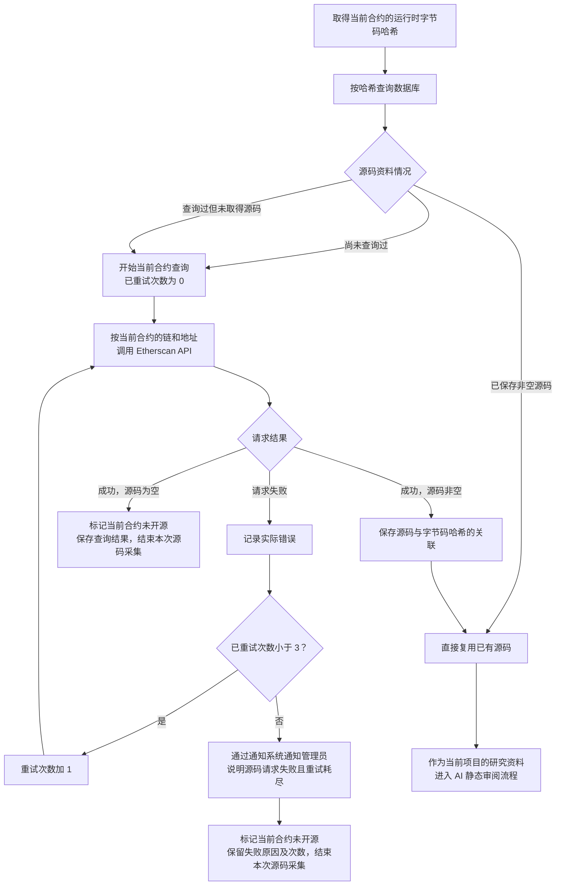

# Token 合约源码获取流程

> 文档状态：目标设计草案，尚未完整实现。当前已有按代码哈希复用资料的机制；本图还包含待实施的空源码重新查询和请求重试规则。

## 入口与目的

取得当前合约的运行时字节码哈希后，先查询数据库中的源码资料。相同哈希已有源码时直接复用；没有可复用源码时，通过当前合约所属链和地址调用 Etherscan API。

## 流程图

## 关键说明

| 情况 | 处理方式 |
| --- | --- |
| 相同哈希已保存非空源码 | 关联并复用已有源码，无需为本次采集请求 Etherscan |
| 尚未查询过，或此前查询过但没有源码 | 使用当前合约的链和地址查询，不沿用其他地址的空结果跳过采集 |
| 请求成功且源码非空 | 保存源码与字节码哈希的关联，供后续相同哈希的合约复用 |
| 请求成功但源码为空 | 标记当前合约“未开源”，关联链、地址与查询时间，结束本次采集，不触发失败重试 |
| 请求失败 | 记录实际错误并重试；耗尽后通过通知系统通知管理员，将当前合约标记为“未开源”，同时保留失败原因和次数 |

“最多重试三次”目前按首次请求之外最多再重试三次记录，即总计最多四次请求。重试次数初始为 0，允许重试时先加 1，再发起请求；任一次请求成功后即停止失败重试，按源码是否为空处理。

“未开源”按本业务规则包含两类记录：接口成功但源码为空，以及请求失败且重试耗尽。两者必须保留各自的实际原因，后者不表示已经确认该合约在外部平台没有公开源码。通知只画在重试耗尽分支，复用 [系统通知组件](../design/notifications/system-notification-operations.md)，向管理员说明当前链、合约、失败原因与请求次数。

缓存键是运行时字节码哈希，不是源码文本哈希，也不是 `code.length`。有哈希记录不等于已经取得源码；某个地址的空结果不会使同哈希的其他地址永久停止源码查询。复用的是源码资料，不直接复用其他项目的研究结论，也不等于当前地址已在 Etherscan 完成独立源码验证。

取得或复用非空源码后，交给 [AI 静态审阅流程](token-contract-review-flow.md) 生成报告。首版仅审阅所提供的源码，不读取链上状态核实角色、参数或实际执行情况。空源码及源码请求失败的分支没有可供本次审阅的源码，不生成审阅成功报告。

## 待明确边界

重试间隔、通知提交失败时的处理、与研究完成或区块处理的衔接、同一合约日后的定时补采、同一哈希的并发请求协调，以及数据结构仍待设计。通知组件自身的投递和重试机制沿用现有设计。“合约未开源”是否触发研究过滤也未确定。该有限重试上限不替代 [区块失败的无限重试规则](token-block-scan-flow.md)。

## 关联文档

- [Token 目标设计](token.md)
- [合约源码 AI 静态审阅流程](token-contract-review-flow.md)
- [项目研究与筛选流程](token-research-flow.md)
- [研究资料整理流程](token-research-materials-flow.md)
- [当前源码采集与任务重试实现](../design/token-intelligence/collection-profile.md)
- [返回业务设计与流程图索引](README.md)
