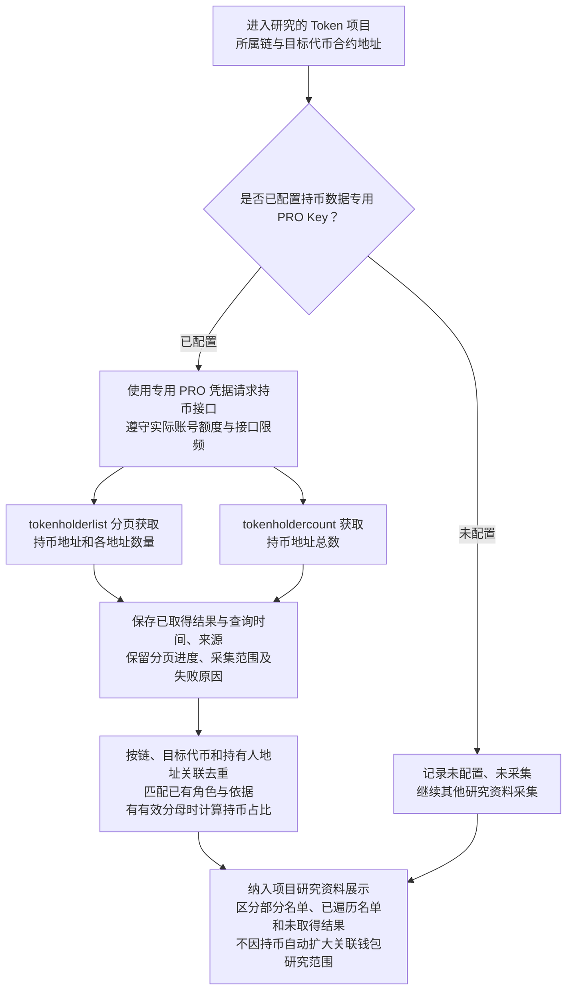

# Token 持币地址资料获取流程

> 文档状态：目标设计草案，尚未实现。系统当前使用的 Etherscan API Key 均为免费 Key；持币地址采集保留设计，待后续开通并接入专用 PRO Key。

## 入口与目的

按项目所属链和目标代币合约地址，获取当前持币地址名单、各地址持币数量及持币地址总数。结合可用的总供应量计算占比，并关联已有的部署者、owner、初始接收钱包、税费接收钱包和资金来源等身份，作为独立的项目研究资料展示。

持币资料查询依赖链和目标代币地址，不依赖合约已开源，也不等待 AI 源码分析。本板块只采集、整理、保存和展示资料，不增加持仓集中度评分、筛选阈值或项目排除规则；源码静态质检的高风险排除仍独立执行，已排除的项目不继续研究。

## 流程图

名单和总数分别保存结果，任一请求失败不丢弃另一项已取得资料；图中不要求两项都成功才展示。实际调用顺序、分页调度和刷新频率后续细化，不增加持币资料必须齐备的研究完成条件。

## 数据来源与凭据安排

| 资料 | 数据来源与用途 |
| --- | --- |
| 持币地址及数量 | Etherscan V2 `module=token`、`action=tokenholderlist`，按 `chainid`、`contractaddress` 查询，用 `page`、`offset` 分页。接口提供当前 ERC-20 持有人名单及数量，要求 Standard 或以上套餐。[官方文档](https://docs.etherscan.io/api-reference/endpoint/tokenholderlist) |
| 持币地址总数 | Etherscan V2 `module=token`、`action=tokenholdercount`，按同一链与目标代币查询，要求 Standard 或以上套餐。保存接口返回的总数及其独立查询时间。[官方文档](https://docs.etherscan.io/api-reference/endpoint/tokenholdercount) |
| 持币排名的按需能力 | `topholders` 可作为后续按需获取排名的接口选择，要求 Standard 或以上套餐，最多返回前 1000 个地址，并有每秒 2 次的接口限制。本轮不将其设为必须额外请求的第二份名单，也不把它的 1000 条上限用于限制分页名单。[官方文档](https://docs.etherscan.io/api-reference/endpoint/topholders) |

后续接入一个专用于持币地址数据的 PRO Key。现有免费 Key 继续用于原有的源码、普通交易等请求；持币类请求使用专用 PRO 凭据，该凭据不加入普通请求的轮询池。用途分开不代表 Etherscan 一定按 Key 提供独立配额，调度仍应遵守实际账号、套餐与接口限制。

尚未配置专用 Key 时，记录“未配置／未采集”，继续其他研究。权限不足、额度耗尽、限流或请求失败时记录实际原因，不切换免费 Key 重试 PRO 接口，也不把错误当作零持有人或空名单。专用配置的字段名、接入现有组件的方式和调度实现后续设计，本次不修改实际配置。

## 分页与保存结果

名单支持分页获取，不预设只取前 5、300 或 1000 个地址。固定采集数量、每页数量、抓取策略和刷新频率尚未确定；每次保存实际获取的页码、范围、条数和开始及结束时间。

分页未结束或部分请求失败时，保留已取得地址和数量，明确标记“部分名单”及未完成原因。只有依据本次实际分页响应确认已到末页，才能标记本次名单遍历完成；不能仅凭另一次 `tokenholdercount` 的总数与已取数量相等就宣布完成。只有确认接口实际返回无记录时才保存空名单，不能将鉴权错误、限流等响应中的失败状态解释成没有持有人。

| 保存内容 | 表达要求 |
| --- | --- |
| 项目与地址 | 所属链、目标代币合约地址、持有人地址；同批资料按这三个维度关联去重，保留可追溯的原始结果与查询来源。 |
| 持币数量 | 保存接口原始值及其单位依据、展示数量和所用精度；不假定不同余额接口都使用相同单位，也不对重复出现的地址累加余额。 |
| 持币地址总数 | 区分接口返回的持有人总数与当前已获取的去重地址数；任一项未取得时保留缺失原因，不填零。 |
| 持币占比 | 数量与总供应量统一单位后，按 `持币数量 / 总供应量 × 100%` 计算；保留分母值、来源及采集时点。没有有效分母时保留数量，占比记为未取得。 |
| 已有角色 | 匹配当前项目已有的身份和证据，同一地址可以保留多个标签；持有人名单本身不证明地址由某个团队或个人控制。 |
| 采集依据 | 接口来源、请求范围、各次查询时间、采集开始与结束时间、分页进度、取得结果和实际未取得原因。 |

持有人接口返回 Etherscan 当前索引的结果，未提供按指定区块查询的参数；当前也不能假定多页请求、持有人总数和独立读取的总供应量对应同一区块。查询期间数据可能变化，已遍历名单表达本次查询范围，不表述为同一区块的全量快照。接口未提供实际区块时不补造来源区块，供应量已知的采集区块和时间仍单独保留。

持币结果属于具体链、具体代币部署实例在查询期间的资料，不能随源码或 `code_hash` 跨合约共享，也不把旧查询结果直接作为当前持仓。

## 与关联钱包研究的边界

取得持币地址后可以匹配已有 L1–L5 钱包身份，但仅因持有目标代币，不自动将该地址加入 L1，也不自动触发该地址的部署前 300 笔历史、资金来源追溯或其他资产余额采集。已有钱包的研究继续沿用 [多层关联钱包研究流程](token-wallet-research-flow.md)。

本板块记录“谁持有当前目标代币、持有多少”。L1 钱包资产板块记录相关钱包持有的 WETH/WBNB、USDT 等既有追踪资产，两者分别保存；本次不扩大 L1 的追踪资产配置，不增加 L2–L5 的资产余额采集。

持币地址及数量用于展示当前分布，不代替部署交易中的初始分配，也不扩展为历史区块的持有人名单。初始分配明细、历史持仓、其他资产和新增钱包筛选规则均不属于本次新增范围。未配置、部分采集或采集失败不阻塞其他研究，也不单独导致项目被排除。

## 待设计事项

专用 PRO Key 的实际接入、名单采集策略与每页数量、按需排名用途、调用调度、重试恢复、刷新及数据更新方式后续细化。本轮不固定接口字段映射、数据库结构或新增执行服务，只确定采集资料、凭据用途和展示范围。

## 关联文档

- [Token 目标设计](token.md)
- [项目研究与筛选流程](token-research-flow.md)
- [研究资料整理流程](token-research-materials-flow.md)
- [多层关联钱包研究流程](token-wallet-research-flow.md)
- [合约源码 AI 静态质检与报告复用](token-contract-review-flow.md)
- [返回业务设计与流程图索引](README.md)
