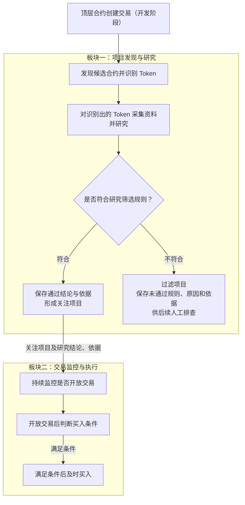

# Token 整体业务流程

> 文档状态：目标设计草案，尚未实现。本图整理已明确的两板块业务关系，不代表当前程序已经具备完整目标能力。

## 入口与目的

从开发阶段纳入范围的顶层合约创建交易发现项目，识别 Token 并开展研究。符合研究筛选规则的项目交接给交易监控与执行板块，在交易开放且满足买入条件时及时买入。

## 流程图

## 关键说明

- 第一板块判断项目是否符合研究筛选规则，第二板块判断当前是否满足买入条件。进入关注范围不直接触发买入。
- 第一板块以交易开放前完成研究为目标，不采集或研究底池，也不以证明项目尚未添加流动性作为研究或交接前提。
- 添加流动性、开放交易和实际可以买入分别判断；底池和交易开放状态由第二板块研究与监控。
- 早期买入用于寻找盈利机会，不构成盈利保证。两个板块是业务职责划分，不固定服务数量、进程或通信方式。
- 本图展示业务主线。不是 Token 的分支见识别流程；研究不合格的项目仍可保持“是 Token”的识别结论。

## 待明确边界

研究规则与买入条件、研究完成前已开放交易的处理、买入条件不满足后的处理、交接后继续研究或撤销关注、买入结果确认和防重复执行仍待设计。第二板块将扩展协议、报价资产及底池类型，具体范围待定；持仓和卖出尚未纳入确定范围。

## 关联文档

- [Token 目标设计](token.md)
- [区块扫描流程](token-block-scan-flow.md)
- [合约发现与 Token 识别流程](token-discovery-identification-flow.md)
- [项目研究与筛选流程](token-research-flow.md)
- [返回业务设计与流程图索引](README.md)
