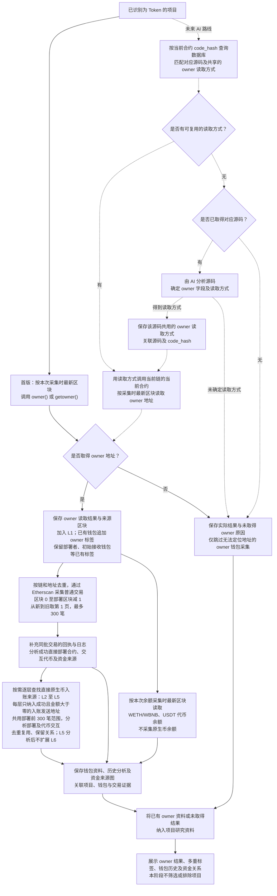

# Token owner 钱包获取与研究流程

> 文档状态：目标设计草案，尚未实现。本图记录已确认的首版 owner 读取与关联钱包研究范围，并用虚线表示未来的 AI 分析路线；具体执行细节仍待设计。

## 入口与目的

对已识别为 Token 的项目尽量读取合约 owner，将取得的 owner 作为 L1 直接关联钱包，继续采集其普通交易和已追踪代币余额，分析历史部署、代币交互及资金来源，并逐层研究由此发现的 L2–L5 地址。owner、部署者和初始接收钱包是不同角色；地址相同时也应保留角色关系。各层研究的完整范围见 [多层关联钱包研究流程](token-wallet-research-flow.md)，展示方式见 [钱包资金来源关系图](token-wallet-funding-graph.md)。

owner 属于尽力采集的信息。直接函数调用和未来 AI 分析路线都可能无法取得 owner，这一结果可以接受：保存实际结果及原因后继续研究，仅跳过无法定位地址的 owner 钱包采集，不阻塞其他资料采集或项目研究，也不因缺少 owner 自动否决项目。未取得地址不代表已经确认合约没有 owner。

当前 owner 与关联钱包板块只执行资料采集、事实解析和展示。取得的多重角色、历史项目、资金来源、余额及未取得资料的结果都不触发项目筛选或排除；本流程不输出项目通过／不通过结论。独立的源码质检规则见 [AI 静态质检流程](token-contract-review-flow.md)。

首版直接调用目标合约的 `owner()` 或 `getowner()` 读取地址。函数名称按已确认的大小写记录，源码不是首版读取的前置条件。整体资料范围见 [研究资料整理流程](token-research-materials-flow.md)。

## 流程图

实线表示已确认的首版读取及取得 owner 后的资料依赖；虚线表示未来 AI 分析与结果复用路线，不是首版读取失败后自动启动的备用流程。已有可用读取方式时直接复用，不重复分析源码；未命中时才需要实际源码供 AI 分析。最终 owner 地址由当前合约的最新链上状态读取取得，AI 对源码的分析用于确定读取方式。AI 未能确定读取方式，或按该方式仍未读到地址时，同样保存实际结果与原因并继续研究，不要求 AI 路线必须取得 owner。

## 已确认的数据范围

| 内容 | 采集范围与时点 |
| --- | --- |
| owner 地址 | 首版通过 `owner()` 或 `getowner()` 读取，使用本次采集时最新区块，记录实际读取结果及来源区块与时间。 |
| 关联钱包关系 | 取得 owner 后将其与部署者、最多 5 个初始接收钱包一同纳入 L1。若地址已存在，给该钱包追加当前项目的 owner 标签，保留部署者、初始接收钱包等其他角色，不创建重复节点；L1–L5 历史交易按链和钱包地址去重查询，同一窗口的资料与分析复用。 |
| 普通交易 | 原样保留部署前最近最多 300 笔的规则：对每个去重钱包，通过 Etherscan `account/txlist` 查询区块 `0..部署区块-1`，按 `desc` 排序，仅取第 `1` 页、每页上限 `300`；不足 300 笔保留实际数量。保留查询范围和采集结果，不包含部署区块内及之后的交易，不以采集时最新区块为截止。 |
| 历史行为与资金来源 | 补充同批交易的回执与日志，分析成功直接部署过的合约、识别其中的 Token 并匹配已有项目报告，识别代币交互并区分主动调用、授权、转出和被动收款。从当前层样本中提取成功直接转入 ETH/BNB 等原生币且金额大于零的发送地址，逐层查找至 L5，保存双方地址、金额、交易哈希、区块与时间。首版不纳入代币入账和内部转账来源，不增加金额阈值或每层来源地址数量上限。 |
| L2–L5 历史研究 | 各层资金来源地址按同一项目部署区块减 1 截止，获取最近最多 300 笔普通交易及同批回执日志，使用同样的部署与代币交互分析。L5 对应从 L1 向上查找四轮，仍开展历史分析，不向 L6 扩展。所有层按链和地址共同去重；重复来源只分析一次并保留全部关系，已属任一层则复用分析，循环转账保留连线且不重复展开地址。 |
| 资金来源图 | 按距任一 L1 的最短路径分层，底层保存有向图，保留共同来源、循环边和全部角色。默认展示 L1、L2，支持逐层展开、折叠及一键展开至 L5；折叠不删除数据。连线按来源、接收地址及资产聚合，点击查看去重后的交易依据。 |
| 代币余额 | 仅 L1 钱包使用余额采集时的最新区块，读取 WETH/WBNB、USDT，保留实际来源区块与时间；不获取原生币余额，也不作为完整钱包估值。本轮不将余额采集扩展到 L2–L5。 |
| 未取得 owner | 保存实际结果及原因供后续排查，仅跳过无法定位地址的 owner 钱包普通交易与代币余额采集，将该结果纳入资料并继续项目研究，不因此阻塞或自动否决项目。 |

owner 读取与余额采集使用各自采集时的最新区块，不要求两者或其他研究资料共用同一区块。owner 为合约地址时也纳入上述采集，不预先限定为无代码地址。普通交易中的转账金额和原生币资金往来仍属于历史交易资料；取消原生币余额采集不扩大为删除这些历史信息。

例如项目部署在第 `30000` 区块，即使 owner 在之后才取得，owner 及 L2–L5 各层资金来源地址的历史交易仍查询 `0..29999` 区块内最近最多 300 笔普通交易。该数量上限按每个去重钱包计算，补充回执和日志不扩大交易范围，也不代表完整钱包或代币交互历史。跨项目复用分析时需匹配链、地址、截止区块与采样规则。

资金来源图保存样本内的历史关系。追溯某笔入账的连续来源时，需要核对各跳交易先后顺序，不能以较晚的上游入账解释较早的转出；核对过程不改变部署前最近 300 笔的查询范围，也不直接证明各跳是同一笔资金。逐层与一键展开是展示及取数入口，不要求默认自动分析所有分支，也不增加研究完成门槛。

图中的交易与余额分支只表示取得钱包地址后的数据依赖，不规定固定并发或串行方式，也不建立全部资料到齐的研究完成条件。owner 读取不是部署者、初始接收钱包及其他研究资料采集的前置条件；即使未取得 owner，其他已知关联钱包仍按既定范围采集。

## 未来路线与待设计事项

未来 AI 分析得到的 owner 读取方式与实际源码及其对应的运行时字节码 `code_hash` 关联保存。同一份源码共用同一份 owner 读取方式，不按项目重复分析。下次按当前合约的 `code_hash` 先查询数据库匹配源码及读取方式，已有可用方式时跳过 AI 分析；没有可用方式且已取得对应源码时，再由 AI 分析并保存读取方式。源码获取规则见 [合约源码获取流程](token-contract-source-flow.md)。

源码的 [AI 静态质检报告及风险等级](token-contract-review-flow.md) 采用相同的共享原则：通过 `code_hash` 匹配到对应源码后，已有完成的质检报告就直接复用，仅在没有报告且有非空源码时生成并保存。因此，同一份源码的质检报告、风险等级和 owner 读取方式都属于源码层面的共享结果。报告用于高风险项目排除；读取方式用于取得当前合约的 owner 地址。静态质检不核实链上 owner，也不依赖 owner 读取成功；此处的共享关系不要求本轮实现未来 AI owner 路线，或将两种分析合并为一次调用。

复用的是读取方式，各部署实例的 owner 地址仍分别读取。每次都对当前链、当前合约按采集时最新区块读取 owner，不将其他合约的地址或历史 owner 快照作为本次结果。缓存命中不保证读取成功；没有可用方式且没有源码、AI 未能确定方式或链上读取未取得地址，都保留实际结果与原因并继续研究。

已分析但没有可用方式的结果如何复用或重新分析、方法失效后的更新、结果校验与版本管理仍待设计，不在本轮增加数据库结构、模型、提示词或重试策略。

- `owner()` 与 `getowner()` 的调用选择、顺序及返回冲突时的处理仍待设计，不新增其他函数名单。
- 零地址等特殊返回值的解释、具体调用错误分类，以及合约 owner 的额外分析仍待设计；本轮不自行规定排除条件。不同角色地址相同时，历史交易按地址去重查询并保留各角色关系。
- owner 读取及后续钱包采集的重试次数、间隔和通知等机制仍待设计，不沿用源码请求重试次数作为这些采集的规则。未取得 owner 后记录原因并继续研究的基本处理已经确定。
- owner 变化后的更新、旧关联关系与新地址资料的处理方式，以及未来 AI 路线的接入时机仍待设计。

本文件只补充 owner 关联钱包流程，不改变第一板块不研究底池、不采集 Ave、模拟结果非必采及不保留两类自有黑名单的既定范围。

## 关联文档

- [Token 目标设计](token.md)
- [研究资料整理流程](token-research-materials-flow.md)
- [多层关联钱包研究流程](token-wallet-research-flow.md)
- [钱包资金来源关系图](token-wallet-funding-graph.md)
- [合约源码获取流程](token-contract-source-flow.md)
- [合约源码 AI 静态质检与报告复用](token-contract-review-flow.md)
- [返回业务设计与流程图索引](README.md)
