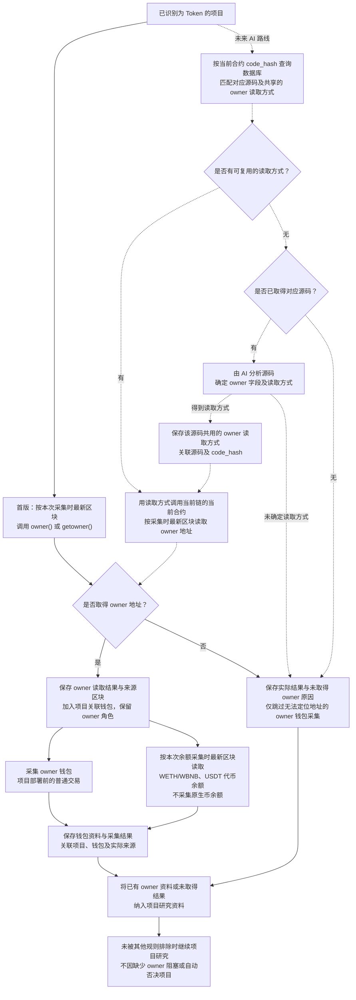

# Token owner 钱包获取与研究流程

> 文档状态：目标设计草案，尚未实现。本图记录已确认的首版 owner 读取与关联钱包研究范围，并用虚线表示未来的 AI 分析路线；具体执行细节仍待设计。

## 入口与目的

对已识别为 Token 的项目尽量读取合约 owner，将取得的 owner 作为关联钱包，继续采集其普通交易和已追踪代币余额。owner、部署者和初始接收钱包是不同角色；地址相同时也应保留角色关系。

owner 属于尽力采集的信息。直接函数调用和未来 AI 分析路线都可能无法取得 owner，这一结果可以接受：保存实际结果及原因后继续研究，仅跳过无法定位地址的 owner 钱包采集，不阻塞其他资料采集或项目研究，也不因缺少 owner 自动否决项目。未取得地址不代表已经确认合约没有 owner。

上述继续研究指项目尚未被其他筛选规则排除。若源码质检报告评定为高风险，项目直接排除、不再研究；owner 获取及其结果不改变该结论。高风险筛选规则见 [AI 静态质检流程](token-contract-review-flow.md)。

首版直接调用目标合约的 `owner()` 或 `getowner()` 读取地址。函数名称按已确认的大小写记录，源码不是首版读取的前置条件。整体资料范围见 [研究资料整理流程](token-research-materials-flow.md)。

## 流程图

实线表示已确认的首版读取及取得 owner 后的资料依赖；虚线表示未来 AI 分析与结果复用路线，不是首版读取失败后自动启动的备用流程。已有可用读取方式时直接复用，不重复分析源码；未命中时才需要实际源码供 AI 分析。最终 owner 地址由当前合约的最新链上状态读取取得，AI 对源码的分析用于确定读取方式。AI 未能确定读取方式，或按该方式仍未读到地址时，同样保存实际结果与原因并继续研究，不要求 AI 路线必须取得 owner。

## 已确认的数据范围

| 内容 | 采集范围与时点 |
| --- | --- |
| owner 地址 | 首版通过 `owner()` 或 `getowner()` 读取，使用本次采集时最新区块，记录实际读取结果及来源区块与时间。 |
| 关联钱包关系 | 取得 owner 后将其纳入项目关联钱包研究，保留 owner 角色，不默认 owner 与部署者或初始接收钱包相同。 |
| 普通交易 | 沿用项目部署前的普通交易范围，保留查询范围和采集结果；不会因 owner 在当前时点取得就改为查询部署后的交易。 |
| 代币余额 | 使用钱包余额采集时的最新区块，读取 WETH/WBNB、USDT，保留实际来源区块与时间；不获取原生币余额，也不作为完整钱包估值。 |
| 未取得 owner | 保存实际结果及原因供后续排查，仅跳过无法定位地址的 owner 钱包普通交易与代币余额采集，将该结果纳入资料并继续项目研究，不因此阻塞或自动否决项目。 |

owner 读取与余额采集使用各自采集时的最新区块，不要求两者或其他研究资料共用同一区块。owner 为合约地址时也纳入上述采集，不预先限定为无代码地址。普通交易中的转账金额和原生币资金往来仍属于历史交易资料；取消原生币余额采集不扩大为删除这些历史信息。

图中的交易与余额分支只表示取得钱包地址后的数据依赖，不规定固定并发或串行方式，也不建立全部资料到齐的研究完成条件。owner 读取不是部署者、初始接收钱包及其他研究资料采集的前置条件；即使未取得 owner，其他已知关联钱包仍按既定范围采集。

## 未来路线与待设计事项

未来 AI 分析得到的 owner 读取方式与实际源码及其对应的运行时字节码 `code_hash` 关联保存。同一份源码共用同一份 owner 读取方式，不按项目重复分析。下次按当前合约的 `code_hash` 先查询数据库匹配源码及读取方式，已有可用方式时跳过 AI 分析；没有可用方式且已取得对应源码时，再由 AI 分析并保存读取方式。源码获取规则见 [合约源码获取流程](token-contract-source-flow.md)。

源码的 [AI 静态质检报告及风险等级](token-contract-review-flow.md) 采用相同的共享原则：通过 `code_hash` 匹配到对应源码后，已有完成的质检报告就直接复用，仅在没有报告且有非空源码时生成并保存。因此，同一份源码的质检报告、风险等级和 owner 读取方式都属于源码层面的共享结果。报告用于高风险项目排除；读取方式用于取得当前合约的 owner 地址。静态质检不核实链上 owner，也不依赖 owner 读取成功；此处的共享关系不要求本轮实现未来 AI owner 路线，或将两种分析合并为一次调用。

复用的是读取方式，各部署实例的 owner 地址仍分别读取。每次都对当前链、当前合约按采集时最新区块读取 owner，不将其他合约的地址或历史 owner 快照作为本次结果。缓存命中不保证读取成功；没有可用方式且没有源码、AI 未能确定方式或链上读取未取得地址，都保留实际结果与原因并继续研究。

已分析但没有可用方式的结果如何复用或重新分析、方法失效后的更新、结果校验与版本管理仍待设计，不在本轮增加数据库结构、模型、提示词或重试策略。

- `owner()` 与 `getowner()` 的调用选择、顺序及返回冲突时的处理仍待设计，不新增其他函数名单。
- 零地址等特殊返回值的解释、具体调用错误分类、合约 owner 的额外分析，以及不同角色地址相同后的查询复用方式仍待设计；本轮不自行规定排除条件。
- owner 读取及后续钱包采集的重试次数、间隔和通知等机制仍待设计，不沿用源码请求重试次数作为这些采集的规则。未取得 owner 后记录原因并继续研究的基本处理已经确定。
- owner 变化后的更新、旧关联关系与新地址资料的处理方式，以及未来 AI 路线的接入时机仍待设计。

本文件只补充 owner 关联钱包流程，不改变第一板块不研究底池、不采集 Ave、模拟结果非必采及不保留两类自有黑名单的既定范围。

## 关联文档

- [Token 目标设计](token.md)
- [研究资料整理流程](token-research-materials-flow.md)
- [合约源码获取流程](token-contract-source-flow.md)
- [合约源码 AI 静态质检与报告复用](token-contract-review-flow.md)
- [返回业务设计与流程图索引](README.md)
