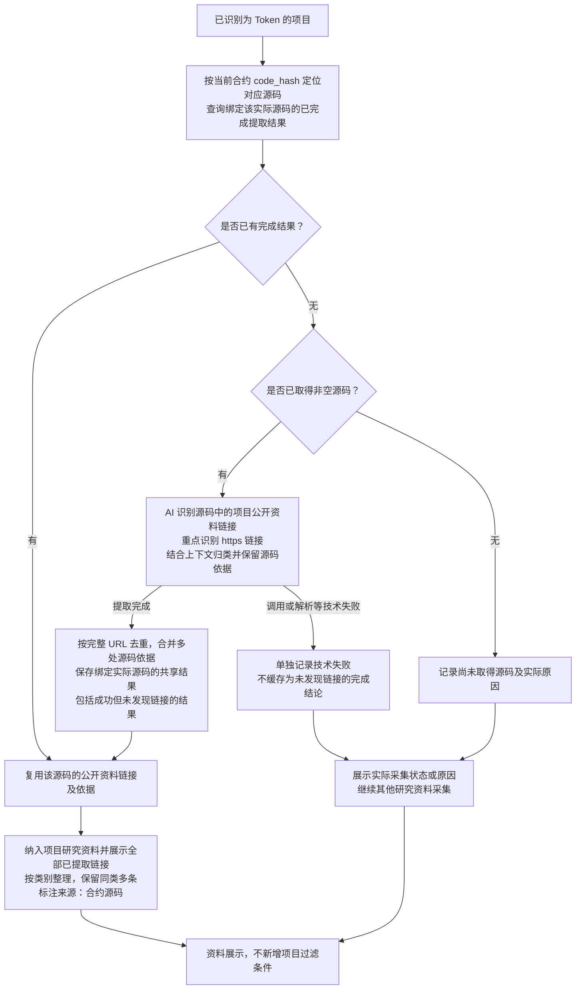

# Token 源码公开资料链接提取流程

> 文档状态：目标设计草案，尚未实现。本图记录已确认的 AI 源码链接识别、同源码结果复用及研究资料展示范围。

## 入口与目的

取得合约源码后，由 AI 从实际源码中识别项目公开资料链接，重点识别 `https://` 链接，包括官网、X、Telegram、项目文档、GitHub、公开审计报告等。一份源码可以包含多条公开资料，同一类别也可以有多个链接，均收集、保存并展示。

每条资料都保留“来源：合约源码”及具体源码依据。该来源说明表示链接从源码中提取，不代表系统已经确认它属于官方、内容真实、可访问，或对应项目已通过审计。本板块只提取、归类和展示，不增加项目评分、筛选或排除规则。

## 流程图

连线只表示资料依赖，不要求本板块与静态质检、owner、税费接收钱包或税率分析合并为一次 AI 调用，也不要求互相等待。源码静态质检一旦判定高风险，仍按原规则立即排除项目并结束研究，不等待链接提取完成。

## 提取与保存规则

| 内容 | 已确认的要求 |
| --- | --- |
| 链接范围 | 重点识别源码中实际出现的 `https://` 链接，不通过搜索、拼接账号或猜测域名补全链接。不得将 `http://`、裸域名或社交账号自动改写为 HTTPS 链接；其他协议的具体收集范围后续另行确定。 |
| 分类 | 结合链接及所在源码上下文识别官网、X、Telegram、项目文档、GitHub、公开审计报告等类别；无法明确归类或归属不明的链接保留为“其他链接”，依赖库、许可证等第三方链接按实际用途标注。 |
| 项目相关性 | 区分当前项目资料与依赖库、许可证、示例代码等引用。不能仅因为源码中出现某个网址，就将其标记为当前项目官网、项目 GitHub 或项目审计报告。 |
| 多条与去重 | 不限制每类只能有一条，不只选取 AI 认为最主要的一条。按完整 URL 去重，同一 URL 在多处出现时保留全部源码依据；不同路径、查询参数或片段的链接不因域名相同而合并。 |
| 原始内容与证据 | 保存完整 URL、资料类别、与项目的关系或用途说明、提取来源与提取时间，以及实际源码记录、源码文件、位置和支持分类的原始片段。位置按实际取得的源码记录，不虚构文件名或行号；提取时间不表示链接的发布时间或验证时间。 |
| 展示来源 | 展示所有已收集的链接及类别，第三方用途或归属不明的链接保留相应说明；每条资料明确标注“来源：合约源码”，能够查看对应源码依据。来源标签不能替换为“已验证官方资料”。 |

AI 只对实际提供的源码进行识别，源码中的文字作为待分析数据，不作为要求 AI 访问链接、改变任务或执行操作的指令。本轮不访问网页、不抓取网页内容、不检查链接可达性，也不核验账号归属、项目官方身份、审计结论或报告是否对应当前合约。

## 同源码复用与采集状态

运行时字节码 `code_hash` 用于定位对应源码，完成的提取结果绑定实际分析的源码记录。同一份实际源码只需提取一次，其他匹配到该源码的项目直接复用完整链接、类别和证据；不能脱离实际源码依据，将另一份源码中的链接套用到当前项目。复用展示仍注明来自对应合约源码，不将复用结果视为对当前部署实例的官方身份确认。

成功提取到链接和成功分析但未发现链接，都是可复用的完成结果。“未发现”仅指本次实际分析的源码范围，不代表项目没有官网、社交账号或其他公开资料。

没有取得源码、AI 调用失败或结果解析失败分别保存实际状态及原因。技术失败不能记为“未发现链接”，不能作为空的完成结果复用，也不能覆盖已有有效提取结果。没有取得公开资料链接时不阻塞其他资料采集与展示。

公开资料提取与 [静态质检报告](token-contract-review-flow.md)、[owner 分析](token-owner-wallet-flow.md)、[税费接收钱包分析](token-fee-recipient-wallet-flow.md)、[税率分析](token-tax-rate-flow.md) 各自复用完成结果。只分析已经取得的源码，不为补充链接而解析代理实现或继续获取、分析外部依赖源码。

## 待设计事项

提取结果的具体数据结构、无法明确归属链接的展示方式、分类冲突处理、其他协议范围、技术失败重试及源码分析更新机制仍待设计。本轮不新增网页采集流程、固定链接数量上限或研究完成门槛，不涉及 UI 布局与代码实现。

## 关联文档

- [Token 目标设计](token.md)
- [研究资料整理流程](token-research-materials-flow.md)
- [合约源码获取流程](token-contract-source-flow.md)
- [合约源码 AI 静态质检与报告复用](token-contract-review-flow.md)
- [返回业务设计与流程图索引](README.md)
