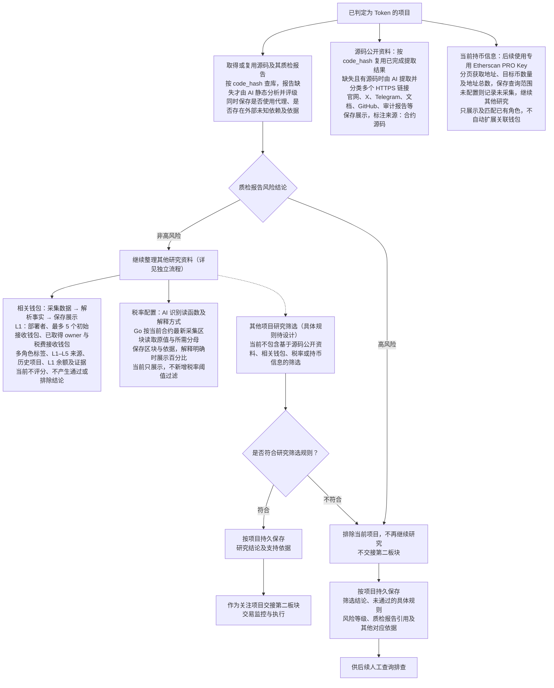

# Token 项目研究与筛选流程

> 文档状态：目标设计草案，尚未实现。本文件记录已确认的研究职责和流程，不代表当前程序已经按该流程执行；具体研究规则及技术实现仍待设计。

本流程从已经判定为 Token 的项目开始。源码筛选取得或复用质检报告及风险等级，高风险项目直接排除，不再继续研究；非高风险的项目继续其他研究。关联钱包当前只采集数据、解析事实并保存展示，源码提取的公开资料、税率配置与当前持币信息也只采集展示，不参与项目筛选；其他项目研究规则及交接条件仍待设计。持币地址采集是独立资料分支，无需等待源码或 AI 报告完成。独立筛选产生的结论、原因和依据关联项目保存，供后续人工排查。完整业务背景见 [Token 目标设计](token.md)。

“整理研究资料”环节的独立展开图见 [研究资料整理流程](token-research-materials-flow.md)，包含基础信息、源码及 AI 静态审阅报告、源码公开资料提取、owner 读取、税费接收钱包获取、税率读取、当前持币地址采集、多层关联钱包研究及结果汇集。钱包的资金来源扩展和历史行为分析见 [多层关联钱包研究流程](token-wallet-research-flow.md)，分层展示及交易依据见 [钱包资金来源关系图](token-wallet-funding-graph.md)。

## 流程图

图中明确高风险质检的排除关口：生成或命中高风险报告后立即结束当前项目研究，不等待其他研究材料齐备。源码公开资料、钱包、税率配置与持币信息分支到保存展示为止；虚线表示仍待设计的其他项目研究筛选，不以这些展示结果触发通过或排除。公开资料分支先按 `code_hash` 定位源码的已完成提取结果，命中直接复用；缺失时才需要实际源码，不要求等待质检报告完成。持币信息分支直接依赖当前链、目标代币地址与专用 PRO Key，不等待源码、AI 报告或 owner；其他资料的采集顺序、并发方式和已启动任务的结束处理另行设计。owner 由 AI 分析源码或复用已有结论，再由 Go 按可用方式读取当前合约；税费接收钱包由 AI 提取源码中的固定地址或给出方式让 Go 读取，支持多个及混合来源；税率由 AI 根据源码给出可用读函数及解释方式，再由 Go 读取当前合约的配置值。owner、税费接收地址、税率或持币信息未取得本身不构成排除理由，也不使已因高风险排除的项目恢复研究。其他资料缺失、冲突或采集失败的处理仍待设计。

取得源码后，AI 输出静态质检报告及风险等级，源码中的疑点在报告中说明。AI 超时、请求失败或返回内容不符合报告要求属于技术异常，单独记录，不作为业务判断分支。

报告另外保存两个独立的源码识别结果：“是否使用了代理”和“是否存在外部未知依赖”，附简短源码依据并随报告按 `code_hash` 复用。外部未知依赖指行为依赖本次源码未提供或无法确定的外部实现；完整提供的库或父合约不因 `import` 被判为未知。两项可以同时存在；“未发现”只描述本次源码范围，不代表已核实链上不存在。当前不读取实际代理实现地址，不继续获取或分析代理实现、外部依赖源码，不递归扩展。两项标识只保存展示，不新增直接排除或升级风险规则；原有根据源码代码证据评为高风险后直接排除的规则保留。

## 已确认的研究材料

| 材料 | 内容与边界 |
| --- | --- |
| 代币基础信息 | 合约地址、Token 识别结果，以及按采集时最新区块取得的名称、符号、精度、总供应量、`code.length`、`code_hash`，保存对应链、实际来源区块与时间。`code.length` 是目标地址运行时代码的字节数，具体研究用途待定；`code_hash` 来自运行时字节码，不是源码文本哈希。 |
| 合约源码与验证资料 | 按 `code_hash` 复用已取得的非空源码；没有可复用源码时按当前合约查询。源码请求重试耗尽后通知管理员，当前合约记为未开源，同时保留实际失败原因。具体查询、空源码和失败重试规则见 [合约源码采集流程](token-contract-source-flow.md)。复用源码不代表新地址已经独立完成源码验证，采集源码也不等于完成安全分析。 |
| AI 静态质检报告 | 按 `code_hash` 匹配源码，复用其报告与风险等级；没有报告且已有源码时才由 AI 静态分析并评级，同一源码只生成一份共享报告。保存代码依据、触发条件、潜在影响、评级依据及源码中的疑点；独立保存是否使用代理、是否存在外部未知依赖及简短源码依据，随报告共享复用，不核实链上状态或延伸分析实现与依赖。两项标识本身不新增排除或升级风险规则；高风险报告仍直接排除当前项目，不再研究，非高风险继续其他研究。详见 [合约源码 AI 静态审阅流程](token-contract-review-flow.md)。 |
| 源码中的项目公开资料 | AI 从实际源码中提取 HTTPS 链接，按官网、X、Telegram、项目文档、GitHub、公开审计报告及其他分类；同源码、同类型均可有多条，按完整 URL 去重并保留各处源码依据。按 `code_hash` 定位同一源码的已完成提取结果，命中复用，缺失且有源码才提取。只保存展示，明确标注“来源：合约源码”，不搜索网络、抓取页面或核验真实性；没有源码且无可复用结果、未发现链接均不阻塞其他研究。详见 [源码公开资料提取流程](token-public-links-flow.md)。 |
| 合约 owner | 按 `code_hash` 复用同一源码已完成的 AI 分析结论及读取方式；缺失且有源码时由 AI 判断能否读取 owner 及具体方式，不限定函数名。有可用方式后，由 Go 按采集时最新区块读取当前合约，取得地址后作为关联钱包，保存实际读取结果及来源；未取得时记录结果与可知原因，继续已知钱包和其他资料采集。具体流程见 [owner 获取与钱包采集](token-owner-wallet-flow.md)。 |
| 税费接收钱包 | 按 `code_hash` 复用同一源码的 AI 分析结论；缺失且有源码时，识别一个或多个税费接收方，确实固定的地址直接提取，需要链上读取的地址由 AI 给出可执行方式，再由 Go 读取当前链、当前合约在本次最新采集区块的状态。同一合约可以同时包含两种来源，合并已取得地址并保留源码依据、来源类型、读取结果及实际区块；动态实际地址不跨部署复用。部分或全部未取得时记录真实原因，继续已知钱包资料采集。详见 [税费接收钱包获取流程](token-fee-recipient-wallet-flow.md)。 |
| 税率配置 | 按 `code_hash` 复用同一源码的 AI 读取与解释方案；缺失且有源码时，识别实际可读取的税率项目、读函数、参数、返回类型、单位、分母及换算公式，不固定方法名，也不要求买入、卖出和转账税率全部存在。Go 在当前链、当前合约的本次最新采集区块读取原始值与需要动态读取的分母，同项相关调用使用同一区块；保存原值、源码依据、实际区块与时间，解释明确时展示百分比。实际税率逐合约读取，不跨部署复用；未取得不记为零税率，部分成功结果保留。当前只展示配置，不新增税率阈值过滤。详见 [税率读取流程](token-tax-rate-flow.md)。 |
| L1–L5 关联钱包 | L1 为部署者、最多 5 个初始接收钱包、已取得 owner 和税费接收钱包。5 个上限仅针对初始接收钱包，税费接收钱包可以有多个，也可以是合约地址。从当前层样本中成功直接转入 ETH/BNB 等原生币且金额大于零的交易提取发送地址，逐层查找 L2–L5，共向上扩展四轮；保留来源到接收钱包的关系、金额、交易哈希、区块与时间。首版不纳入代币入账和内部转账来源，不增加每层来源地址数量上限；L5 仍开展历史分析，不向 L6 扩展。 |
| 各层钱包的历史交易 | L1–L5 均按链和地址去重，原样保留每个钱包部署前最近最多 300 笔普通交易的规则。通过 Etherscan `account/txlist` 查询区块 `0..当前项目部署区块-1`，按 `desc` 排序，仅取第 `1` 页、每页上限 `300`；不足 300 笔保留实际数量，不包含部署区块内及之后的交易，也不以采集时最新区块为截止。补充同一批交易的回执与日志，不扩大 300 笔范围，也不视为完整钱包历史。 |
| 各层钱包的历史行为 | L1–L5 共用相同分析逻辑：整理成功直接部署过的合约，识别 Token 并匹配数据库已有项目与研究报告；结合调用数据和回执识别钱包代币关系，再按协议语义区分实际买卖、授权、普通转账、被动收款和其他交互。交易识别不限定 PancakeSwap V2 或 Uniswap V2，覆盖不同 DEX、版本及路由；协议未识别时保留已有事实，不将转账直接判为买卖。不能直接把路由合约或所有中间代币认作钱包交易项目，也不能凭该样本声称取得全部代币交互。详见 [多层关联钱包研究](token-wallet-research-flow.md)。 |
| 钱包资金来源图 | 底层保存有向图，按 L1–L5 展示资金来源树，保留共同来源、循环关系及全部角色；同一地址只显示一个节点，层级取距任一 L1 的最短路径。默认展示 L1、L2，支持逐层展开、折叠和一键展开至 L5，折叠不删除数据。同一来源、接收地址和资产的转账聚合展示金额、笔数及时间，点击查看去重后的交易依据。详见 [钱包资金来源关系图](token-wallet-funding-graph.md)。 |
| L1 钱包资产 | 对部署者、最多 5 个初始接收钱包、已取得 owner 和税费接收钱包，按本次采集时最新区块读取 WETH/WBNB、USDT 等已追踪代币余额，不采集原生币余额；本轮不扩展到 L2–L5。记录实际来源区块，作为辅助背景，不视为完整钱包估值，也不单独用于断言项目可靠。 |
| 当前持币地址资料 | 后续使用一个持币数据专用 Etherscan PRO Key，以当前链和目标代币地址调用 `tokenholderlist` 分页取得持有人及目标代币数量，调用 `tokenholdercount` 取得持有人地址总数。记录查询起止时间、来源、分页范围及各项实际结果，按链、目标代币与持有人去重；匹配已有角色，有足够总供应量等依据时统一单位计算占比并保存分母时点。使用当前索引结果，不当作初始分配或固定区块的一致快照，不按 `code_hash` 跨部署复用。未配置专用 Key 时记录未采集，不使用免费 Key 尝试；权限不足、失败或部分成功保留真实原因与成功数据，不填为零持有人或完整列表。详见 [当前持币地址采集流程](token-holder-flow.md)。 |

例如项目部署在第 `30000` 区块，L1–L5 每个去重钱包均查询 `0..29999` 区块内最近最多 300 笔普通交易。owner、税费接收地址和各层来源地址即使在部署后才取得，也使用同一历史范围；300 笔是每个钱包的上限，不是全部关联钱包合计的上限。

同一资金来源涉及多个钱包，只分析一次并保留全部资金关系；来源已属于任一层时复用已有分析，循环关系保留连线且不重复展开地址。同一钱包可以同时拥有部署者、owner、初始接收钱包、税费接收钱包等多个项目角色标签，新增标签不覆盖已有角色，也不重复采集；同一接收地址对应多项税费用途时保留各项源码依据。跨项目复用钱包分析时匹配链、地址、截止区块和采样规则。多层研究汇集历史项目、代币交互与资金关联，保存供查询展示；共同资金来源不单独证明属于同一团队。

当前不根据钱包身份、多层资金来源、历史部署或交易项目、余额以及数据未取得结果生成风险评分、通过／不通过结论或排除当前项目。历史项目及其已有报告只作为关联资料展示，不将其结论自动应用到当前项目。空交易样本、协议未识别和技术采集失败按实际情况展示，不作为项目过滤条件。钱包事实解析照常保留，基于这些事实的筛选逻辑不纳入当前阶段；图中的钱包展示分支不通向研究通过或排除节点。

资金图表达样本内的历史关系。核对某笔入账的连续来源时，还需确认各跳转账先后顺序，不能用较晚的上游入账解释较早的下游转账；即使时间顺序符合，也不直接认定为同一笔钱。该核对不改变部署前最近 300 笔的采样范围。逐层与一键展开提供展示及取数入口，不规定默认自动展开全部分支，也不增加所有层采集齐备的研究完成条件。

owner、部署者、初始接收钱包和税费接收钱包是不同角色，不默认地址相同；取得 owner 或税费接收地址后需沿用 L1 普通交易及代币余额采集。owner 当前设计统一由 AI 分析源码确定读取方式，再由 Go 读取链上状态，尚未实现。已完成的“有可用方式”或“未识别可用方式”结论都与源码及 `code_hash` 关联保存；命中则复用，未命中且有源码再分析。Go 每次读取当前合约最新链上状态获取 owner 地址，不复用其他合约的地址。没有源码且没有可复用结论、未识别可用方式或读取失败时，只跳过该未知地址的钱包采集，记录实际原因并继续已知钱包与其他资料采集，不因缺少 owner 阻塞研究或单独过滤项目，也不据此认定合约没有 owner。AI 或 RPC 技术失败不记为“不可读取”的共享分析结论，不覆盖已有读取方式。owner 分析和链上读取独立于源码静态质检，静态报告不核实链上 owner。具体读取方式表达、冲突或特殊返回值、重试及 owner 变化后的更新方式仍待设计。

税费接收钱包分析同样只使用实际取得的源码，不继续获取或分析代理实现与外部依赖。固定地址须由实际税费流向和不可变的地址用法支持；可变变量的初始字面量不等于当前接收地址，不为此新增部署初始化资料采集。逐项保留已取得地址和未取得原因，读取失败不清空其他成功结果，不将技术失败缓存为不存在税费接收钱包，也不把取得所有地址作为继续其他资料采集的前提。同一源码的报告、公开资料提取、owner 分析、税费接收钱包分析和税率分析分别共享，不要求同次 AI 调用或共同完成，也不互相作为前提；静态质检不以这些链上读取为依据。税费接收钱包设计尚未实现，具体数据结构、特殊返回值、技术重试及后续更新仍待细化。

税率作为独立研究资料，不纳入钱包身份或 Token 六项识别条件。AI 根据实际计税源码确定字段含义和换算依据，不仅凭方法名判断，不按 Token 精度换算或假定通用分母，也不将总税率与其分项重复相加；百分比无法确定时保留原值及原因。只使用可执行的读函数取得当前配置，不将源码固定值当作链上结果，不增加直接存储读取、买卖模拟、角色白名单核实、代理实现或外部依赖分析。读取结果只代表指定区块的税率配置，不代表已验证某笔交易的实际扣税。已完成但未识别出可用读函数的分析结论可以随源码复用，不据此推定无税。AI 或 RPC 技术失败不缓存为否定分析结论，不覆盖其他成功读取项，也不单独过滤当前项目；具体方案结构、重试及后续更新仍待设计。

源码公开资料只提取源码实际出现的 HTTPS 链接，不补写或猜测链接；AI 根据上下文分类，无法确定类型或归属时保留为其他；依赖库、许可证等链接标明实际用途，不标为当前项目的官方资料。保留完整 URL、类型、提取时间、源码文件与位置或原文依据，同一链接多处出现时保留全部出处。展示来源说明表示链接来自合约源码，不代表已核验它属于当前项目或已核验审计报告。提取结果依附实际源码共享，不依赖链上读取，与质检报告、owner、税费接收钱包及税率分析分别复用，不要求同一次 AI 调用或共同完成；没有源码且无可复用结果、未发现链接或技术失败时如实记录，不新增项目过滤，已被高风险报告排除的项目不继续研究。该设计尚未实现。

持币地址采集是预留的目标设计，尚未实现。现有 Etherscan Key 均为免费 Key，继续用于源码、普通交易等原有请求；后续专用 PRO Key 只服务持币相关接口，不加入普通请求轮询，两类 Key 不互相回退。名单与地址总数分别记录查询时点及实际覆盖范围；接口没有提供来源区块时不编造区块号，多页读取期间的数据变化不被包装为同一区块快照。占比计算所需单位、分母及其时点需有依据，不能用已取得部分余额之和冒充总供应量。普通持有人不因出现在名单中自动成为 L1，不触发部署前 300 笔交易、L2–L5 资金来源或其他代币余额采集；已有直接关联角色的钱包继续原有流程。当前只展示持币信息，不新增集中度阈值、风险评分或项目过滤；专用 Key 的配置、调度、分页执行、存储和后续更新方式待细化，不以名单完整或专用 Key 已配置作为研究完成条件。

## 筛选结果与职责边界

筛选结论关联对应链和项目持久保存。高风险报告直接触发排除，保存当前项目引用的共享报告、风险等级与排除原因；相同源码的新部署项目同样应用该报告，无需重复质检。非高风险只表示可以继续研究，符合其余规则后才交接；其他不符合规则的项目也要能查到具体原因和依据。具体存储结构和人工查询入口后续设计。

Token 识别与项目研究是两个判断：一个项目可以是 Token，但不符合研究筛选规则。研究阶段过滤项目，不将其重新标记为不是 Token；前置识别规则见 [项目发现与 Token 识别流程](token-discovery-identification-flow.md)。

- 本研究阶段不采集或研究任何底池信息；开始研究、形成结论和交接均不要求池地址、池状态快照，也不要求先证明尚未添加流动性。
- `simulation_result` 暂不作为必采项，是否按需采集及结果用途仍待设计；Ave 数据在本阶段不采集，不作为可选补充来源。
- 不保留系统自有的合约代码黑名单和钱包黑名单，也不把它们的命中作为筛选条件；源码、代码哈希及关联钱包研究继续保留。
- 进入关注范围不等于允许买入；底池、交易开放状态和买入条件由第二板块判断，整体衔接见 [Token 总体流程](token-overall-flow.md)。

owner、税费接收地址或税率未取得本身不排除项目、同一源码共享质检报告及风险等级、报告高风险时直接排除且不再研究，均已明确。风险评级细则、其余研究规则与分工、未取得源码或其他资料缺失时的处理，以及交接后的更新与撤销关注，仍待设计。本文件不增加数值阈值，也不沿用当前六类任务全部结束后构建不可变画像的流程作为固定完成条件。

返回 [Token 目标设计](token.md) 或 [业务设计与研究资料索引](README.md)。
