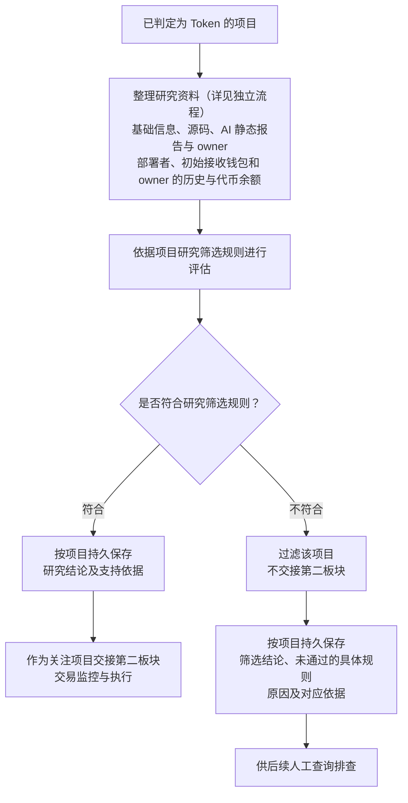

# Token 项目研究与筛选流程

> 文档状态：目标设计草案，尚未实现。本文件记录已确认的研究职责和流程，不代表当前程序已经按该流程执行；具体研究规则及技术实现仍待设计。

本流程从已经判定为 Token 的项目开始。研究的目的是依据筛选规则保留符合要求的项目，过滤不符合要求的项目，并保存结论、原因和依据，供后续人工排查。完整业务背景见 [Token 目标设计](token.md)。

“整理研究资料”环节的独立展开图见 [研究资料整理流程](token-research-materials-flow.md)，包含基础信息、源码及 AI 静态审阅报告、owner 读取、关联钱包采集及结果汇集。

## 流程图

资料收集节点表示研究材料的范围，不规定各项采集的固定先后顺序、并发方式或执行进程，也不要求所有资料到齐才允许开展研究。owner 明确尽力采集，未取得时记录结果与原因并继续研究，不将其作为研究完成的必要条件。图中只表达形成研究筛选结论后的主流程；其余最小证据要求，以及资料缺失、冲突或采集失败时的处理仍待设计，不能直接将缺失资料判为不符合规则。

## 已确认的研究材料

| 材料 | 内容与边界 |
| --- | --- |
| 代币基础信息 | 合约地址、Token 识别结果，以及按采集时最新区块取得的名称、符号、精度、总供应量、`code.length`、`code_hash`，保存对应链、实际来源区块与时间。`code.length` 是目标地址运行时代码的字节数，具体研究用途待定；`code_hash` 来自运行时字节码，不是源码文本哈希。 |
| 合约源码与验证资料 | 按 `code_hash` 复用已取得的非空源码；没有可复用源码时按当前合约查询。源码请求重试耗尽后通知管理员，当前合约记为未开源，同时保留实际失败原因。具体查询、空源码和失败重试规则见 [合约源码采集流程](token-contract-source-flow.md)。复用源码不代表新地址已经独立完成源码验证，采集源码也不等于完成安全分析。 |
| AI 静态审阅报告 | 取得源码后由 AI 阅读并生成报告，识别源码中可见的漏洞或危险逻辑，保留代码依据、触发条件、潜在影响及无法判断的部分。首版不通过链上读取核实角色、参数或代理实现。报告属于分析材料，如何映射到项目筛选规则仍待细化。详见 [合约源码 AI 静态审阅流程](token-contract-review-flow.md)。 |
| 合约 owner | 首版按采集时最新区块直接调用 `owner()` 或 `getowner()`，取得地址后作为关联钱包，保存读取结果及来源；未取得时记录实际结果与可知原因，继续研究。具体流程见 [owner 获取与钱包采集](token-owner-wallet-flow.md)。 |
| 关联钱包的历史交易 | 采集部署者、初始接收钱包及已取得 owner 的部署前普通交易，结合发现阶段已有的部署交易、初始分配等线索，为资金往来和关联行为研究提供材料。当前采样边界不代表完整钱包历史，也不固定未来的采样规则。 |
| 相关钱包资产 | 对部署者、初始接收钱包及已取得 owner，按本次采集时最新区块读取 WETH/WBNB、USDT 等已追踪代币余额，不采集原生币余额；记录实际来源区块，作为辅助背景，不视为完整钱包估值，也不单独用于断言项目可靠。 |

owner、部署者和初始接收钱包是不同角色，不默认地址相同；取得 owner 后需采集其普通交易及代币余额。首版直接读取不依赖源码。后续 AI 分析得到的 owner 读取方式与源码及 `code_hash` 关联保存；先查库匹配可用方式，命中则跳过 AI，未命中且有源码再分析。复用方式后仍读取当前合约最新链上状态获取 owner 地址，不复用其他合约的地址；该扩展不在首版实现。两种路线都允许未取得 owner，此时只跳过该未知地址的钱包采集，继续已知钱包与其他资料采集，不因缺少 owner 阻塞研究或单独过滤项目，也不据此认定合约没有 owner。函数尝试顺序、冲突或特殊返回值、具体重试及 owner 变化后的更新方式仍待设计。

## 筛选结果与职责边界

筛选结论关联对应链和项目持久保存。符合规则的项目保存结论和支持依据后交接；不符合的项目也要能查到具体未通过规则、原因和依据，不能只留下“劣质项目”或“不通过”的笼统描述。具体存储结构和人工查询入口后续设计。

Token 识别与项目研究是两个判断：一个项目可以是 Token，但不符合研究筛选规则。研究阶段过滤项目，不将其重新标记为不是 Token；前置识别规则见 [项目发现与 Token 识别流程](token-discovery-identification-flow.md)。

- 本研究阶段不采集或研究任何底池信息；开始研究、形成结论和交接均不要求池地址、池状态快照，也不要求先证明尚未添加流动性。
- `simulation_result` 暂不作为必采项，是否按需采集及结果用途仍待设计；Ave 数据在本阶段不采集，不作为可选补充来源。
- 不保留系统自有的合约代码黑名单和钱包黑名单，也不把它们的命中作为筛选条件；源码、代码哈希及关联钱包研究继续保留。
- 进入关注范围不等于允许买入；底池、交易开放状态和买入条件由第二板块判断，整体衔接见 [Token 总体流程](token-overall-flow.md)。

owner 缺失时继续研究的原则，以及取得源码后由 AI 静态审阅并生成报告的职责已明确；具体研究规则、阈值、规则组合方式、报告如何参与筛选、其余人工与 AI 的分工、其他资料缺失或矛盾时的处理，以及交接后是否持续研究、更新或撤销关注，均留待后续设计。本文件不补充这些规则，也不沿用当前六类任务全部结束后构建不可变画像的流程作为固定完成条件。

返回 [Token 目标设计](token.md) 或 [业务设计与研究资料索引](README.md)。
