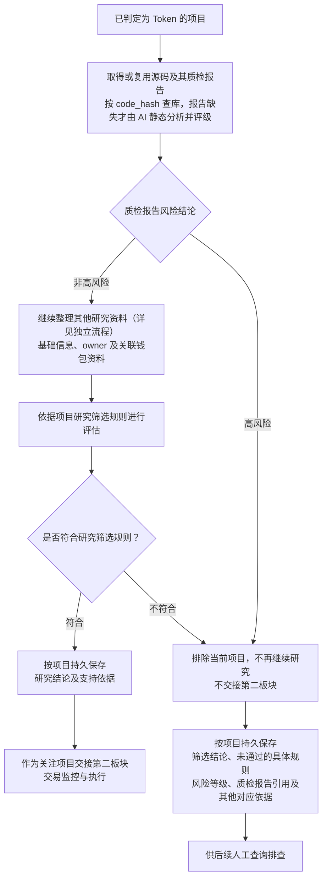

# Token 项目研究与筛选流程

> 文档状态：目标设计草案，尚未实现。本文件记录已确认的研究职责和流程，不代表当前程序已经按该流程执行；具体研究规则及技术实现仍待设计。

本流程从已经判定为 Token 的项目开始。先取得或复用源码质检报告及风险等级，高风险项目直接排除，不再继续研究；非高风险的项目继续其他研究和规则筛选。筛选结论、原因和依据关联项目保存，供后续人工排查。完整业务背景见 [Token 目标设计](token.md)。

“整理研究资料”环节的独立展开图见 [研究资料整理流程](token-research-materials-flow.md)，包含基础信息、源码及 AI 静态审阅报告、owner 读取、关联钱包采集及结果汇集。

## 流程图

图中明确高风险质检的排除关口：生成或命中高风险报告后立即结束当前项目研究，不等待其他研究材料齐备。其他资料的采集顺序、并发方式和已启动任务的结束处理另行设计。owner 明确尽力采集，未取得本身不构成排除理由，也不使已因高风险排除的项目恢复研究。其他资料缺失、冲突或采集失败的处理仍待设计。

取得源码后，AI 输出静态质检报告及风险等级，源码中的疑点在报告中说明。AI 超时、请求失败或返回内容不符合报告要求属于技术异常，单独记录，不作为业务判断分支。

## 已确认的研究材料

| 材料 | 内容与边界 |
| --- | --- |
| 代币基础信息 | 合约地址、Token 识别结果，以及按采集时最新区块取得的名称、符号、精度、总供应量、`code.length`、`code_hash`，保存对应链、实际来源区块与时间。`code.length` 是目标地址运行时代码的字节数，具体研究用途待定；`code_hash` 来自运行时字节码，不是源码文本哈希。 |
| 合约源码与验证资料 | 按 `code_hash` 复用已取得的非空源码；没有可复用源码时按当前合约查询。源码请求重试耗尽后通知管理员，当前合约记为未开源，同时保留实际失败原因。具体查询、空源码和失败重试规则见 [合约源码采集流程](token-contract-source-flow.md)。复用源码不代表新地址已经独立完成源码验证，采集源码也不等于完成安全分析。 |
| AI 静态质检报告 | 按 `code_hash` 匹配源码，复用其报告与风险等级；没有报告且已有源码时才由 AI 静态分析并评级，同一源码只生成一份共享报告。保存代码依据、触发条件、潜在影响、评级依据及源码中的疑点，不核实链上状态。高风险直接排除当前项目，不再研究；非高风险继续其他研究。详见 [合约源码 AI 静态审阅流程](token-contract-review-flow.md)。 |
| 合约 owner | 首版按采集时最新区块直接调用 `owner()` 或 `getowner()`，取得地址后作为关联钱包，保存读取结果及来源；未取得时记录实际结果与可知原因，继续研究。具体流程见 [owner 获取与钱包采集](token-owner-wallet-flow.md)。 |
| 关联钱包的历史交易 | 对部署者、最多 5 个初始接收钱包及已取得 owner 按地址去重，原样保留每个钱包部署前最近最多 300 笔普通交易的规则。通过 Etherscan `account/txlist` 查询区块 `0..部署区块-1`，按 `desc` 排序，仅取第 `1` 页、每页上限 `300`；不足 300 笔保留实际数量，不包含部署区块内及之后的交易，也不以采集时最新区块为截止。结合发现阶段已有的部署交易、初始分配等线索，为资金往来和关联行为研究提供材料；该范围不代表完整钱包历史。 |
| 相关钱包资产 | 对部署者、最多 5 个初始接收钱包及已取得 owner，按本次采集时最新区块读取 WETH/WBNB、USDT 等已追踪代币余额，不采集原生币余额；记录实际来源区块，作为辅助背景，不视为完整钱包估值，也不单独用于断言项目可靠。 |

例如项目部署在第 `30000` 区块，每个去重关联钱包均查询 `0..29999` 区块内最近最多 300 笔普通交易。owner 即使在部署后才取得地址，也使用同一历史范围；300 笔是每个钱包的上限，不是全部关联钱包合计的上限。

owner、部署者和初始接收钱包是不同角色，不默认地址相同；取得 owner 后需采集其普通交易及代币余额。首版直接读取不依赖源码。后续 AI 分析得到的 owner 读取方式与源码及 `code_hash` 关联保存；先查库匹配可用方式，命中则跳过 AI，未命中且有源码再分析。复用方式后仍读取当前合约最新链上状态获取 owner 地址，不复用其他合约的地址；该扩展不在首版实现。两种路线都允许未取得 owner，此时只跳过该未知地址的钱包采集，继续已知钱包与其他资料采集，不因缺少 owner 阻塞研究或单独过滤项目，也不据此认定合约没有 owner。函数尝试顺序、冲突或特殊返回值、具体重试及 owner 变化后的更新方式仍待设计。

## 筛选结果与职责边界

筛选结论关联对应链和项目持久保存。高风险报告直接触发排除，保存当前项目引用的共享报告、风险等级与排除原因；相同源码的新部署项目同样应用该报告，无需重复质检。非高风险只表示可以继续研究，符合其余规则后才交接；其他不符合规则的项目也要能查到具体原因和依据。具体存储结构和人工查询入口后续设计。

Token 识别与项目研究是两个判断：一个项目可以是 Token，但不符合研究筛选规则。研究阶段过滤项目，不将其重新标记为不是 Token；前置识别规则见 [项目发现与 Token 识别流程](token-discovery-identification-flow.md)。

- 本研究阶段不采集或研究任何底池信息；开始研究、形成结论和交接均不要求池地址、池状态快照，也不要求先证明尚未添加流动性。
- `simulation_result` 暂不作为必采项，是否按需采集及结果用途仍待设计；Ave 数据在本阶段不采集，不作为可选补充来源。
- 不保留系统自有的合约代码黑名单和钱包黑名单，也不把它们的命中作为筛选条件；源码、代码哈希及关联钱包研究继续保留。
- 进入关注范围不等于允许买入；底池、交易开放状态和买入条件由第二板块判断，整体衔接见 [Token 总体流程](token-overall-flow.md)。

owner 缺失本身不排除项目、同一源码共享质检报告及风险等级、报告高风险时直接排除且不再研究，均已明确。风险评级细则、其余研究规则与分工、未取得源码或其他资料缺失时的处理，以及交接后的更新与撤销关注，仍待设计。本文件不增加数值阈值，也不沿用当前六类任务全部结束后构建不可变画像的流程作为固定完成条件。

返回 [Token 目标设计](token.md) 或 [业务设计与研究资料索引](README.md)。
