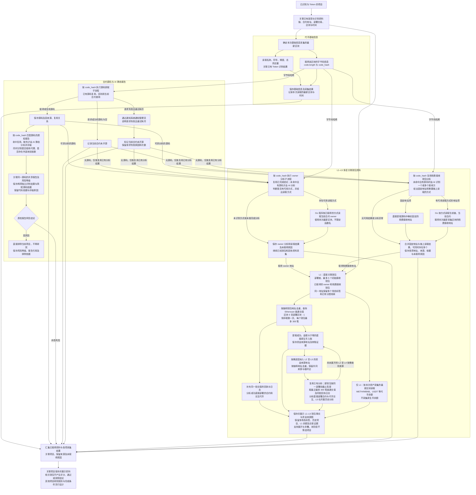

# Token 研究资料整理流程

> 文档状态：目标设计草案，尚未实现。本图展开项目研究中的资料整理环节，表达资料范围及数据依赖；不固定执行顺序、并发方式或所有采集必须完成的条件。

## 入口与目的

输入是已经识别为 Token 的项目，以及发现和识别阶段已经取得的资料。沿用已有的链、合约地址、部署交易、部署区块与时间、识别结果等上下文，整理基础信息、源码和关联钱包资料。关联钱包当前只执行“采集数据 → 解析事实 → 保存展示”，不在此阶段筛选项目；源码 AI 静态质检继续按独立规则过滤高风险项目。基础信息、字节码信息、合约 owner、需要链上读取的税费接收地址和钱包资产等链上状态，以各自采集时最新区块作为数据源，并保留实际读取的区块号与时间。此前取得的发现、识别记录保留其原始时点，不将旧快照直接当作本次最新链上状态。

## 流程图

## 数据依赖与结果说明

| 部分 | 依赖与需要保留的内容 |
| --- | --- |
| 发现与识别资料 | 项目身份、部署交易和区块、部署者、Token 识别结果及已取得的基础事实；复用已有资料，不额外增加部署交易成功判断。 |
| 代币基础信息 | 以本次采集时最新区块读取名称、符号、精度、总供应量、`code.length` 与 `code_hash`，保存实际区块与时间，并关联已有识别结果；`code.length` 是运行时代码字节数，具体研究用途待定；`code_hash` 来自运行时字节码。 |
| 合约源码资料 | 依赖 `code_hash` 查询已有源码；没有可复用源码时，使用当前链和合约地址查询。成功返回空源码时标记未开源；请求失败重试耗尽时通知管理员，再标记未开源并保留实际失败原因。完整分支见 [合约源码获取流程](token-contract-source-flow.md)。 |
| AI 静态质检报告 | 通过 `code_hash` 定位源码及报告，有报告就复用风险等级；没有报告且已有源码时才由 AI 静态分析并评级，同一源码只生成一份报告。报告保存代码依据、触发条件、影响及评级原因，并分别保存“是否使用了代理”“是否存在外部未知依赖”及简短源码依据，随报告共享复用；不核实链上状态或依赖钱包资料。两项标识本身不新增排除或升级风险规则；有代码证据的高风险报告仍直接排除项目，不再研究，非高风险继续其他研究。完整流程见 [合约源码 AI 静态审阅](token-contract-review-flow.md)。 |
| 合约 owner | 按 `code_hash` 复用同一源码已完成的 AI 分析结论及读取方式；未命中且有源码时，AI 判断能否取得 owner 及具体方式，不限定函数名。存在方式后由 Go 程序按采集时最新区块读取当前合约，保存实际结果、读取方式与来源区块，取得地址后采集其普通交易和代币余额。未取得时保留结果与可知原因，继续已知钱包和其他资料采集。详见 [owner 获取与钱包采集流程](token-owner-wallet-flow.md)。 |
| 税费接收钱包 | 按 `code_hash` 复用同一源码的 AI 分析结论；缺失且有源码时识别一个或多个税费接收方及源码依据。确实固定的地址直接提取，需要读取的地址由 AI 提供可执行方式，再由 Go 读取当前链、当前合约在本次最新采集区块的状态；两种来源可同时存在，合并全部已取得地址，逐项保留来源类型、依据、读取方式、结果及实际区块。动态实际地址不跨部署复用。部分或全部未取得时记录真实结果与原因，继续已知钱包资料采集。详见 [税费接收钱包获取流程](token-fee-recipient-wallet-flow.md)。 |
| L1 直接关联钱包 | 围绕部署者、最多 5 个初始接收钱包、已取得的合约 owner 和税费接收钱包整理资料，保留不同角色和初始分配线索。同一地址可以同时拥有多个角色标签，按项目保留全部角色及税费用途依据，采集与分析不因标签重复。初始接收钱包按部署交易内该代币的净接收量降序，从净接收量为正且查询时无合约代码的地址中最多选取 5 个；该上限仅针对初始接收钱包，不限制税费接收钱包数量，税费接收地址也可以是合约地址。 |
| L2–L5 资金来源地址 | 从当前层交易样本中提取成功向该钱包直接转入 ETH/BNB 等原生币、金额大于零的发送地址，逐层查找至 L5，即从 L1 向上扩展四轮。保留来源地址、接收钱包、金额、交易哈希及区块与时间；首版不纳入代币入账和内部转账来源，不增加金额阈值或每层来源地址数量上限。L5 仍开展历史研究，不向 L6 扩展。 |
| 各层钱包历史交易 | 原样保留当前查询规则并用于 L1–L5：按链和钱包地址去重后，通过 Etherscan `account/txlist` 查询区块 `0` 至 `当前项目部署区块 - 1`，`sort=desc`、`page=1`、`offset=300`，每个钱包获取部署前最近的最多 300 笔普通交易，不足则保留实际数量，只取第一页。各层同样使用当前项目的部署边界。保留交易资料及查询范围；失败处理与研究流程的衔接后续设计。 |
| 各层钱包历史行为分析 | 补充同一批交易的回执与日志，整理成功直接部署的合约及交易依据，识别其中的 Token，匹配已有项目与研究报告；结合调用数据和代币事件识别交互项目，再按协议语义区分实际买卖、授权、普通转账、被动收款和其他交互。交易识别不限定 PancakeSwap V2 或 Uniswap V2，覆盖不同 DEX、版本及路由，未识别协议仍保留已有事实。补充详情不扩大 300 笔范围，不将路由合约或所有中间代币直接认作钱包交易项目，也不将该样本视为完整代币交互历史。L1–L5 共用该分析逻辑，具体流程见 [多层关联钱包研究](token-wallet-research-flow.md)。 |
| 资金来源图 | 底层保存有向关系图，按 L1–L5 展示资金来源树。地址节点去重，保留共同来源和循环边，以距任一 L1 的最短路径分层；同一来源、接收地址和资产的转账汇总展示，点击查看每笔交易依据，同一交易不重复计数。默认展示 L1、L2，支持逐层展开、折叠及一键展开至 L5，折叠不删除数据。详见 [钱包资金来源关系图](token-wallet-funding-graph.md)。 |
| L1 钱包资产 | 对 L1 直接关联钱包，按本次采集时最新区块读取 WETH/WBNB、USDT 等已追踪代币余额并记录来源区块，不采集原生币余额；本轮不将余额采集扩展到 L2–L5。余额作为辅助背景，不是完整钱包估值，采集触发、频率及失败处理后续设计。 |
| 资料汇集 | 将已经取得的事实、来源、采集结果、共享质检报告及实际未取得原因关联到项目并展示；AI 分析内容与实际采集事实分别表达。关联钱包保留事实解析结果，不产生风险评分、通过／不通过结论或项目排除。源码高风险报告单独触发直接排除，不等待资料汇集完成。 |

图中的分支表示资料类别及实际数据依赖，不表示已确认全部并行或固定串行。源码获取依赖字节码哈希；owner 与税费接收钱包分析子流程分别先按该哈希查库，未命中已完成结果时才需要源码进行 AI 分析，命中可复用结果时不等待新的源码查询。图中源码结果到这些子流程的连线表示未命中时所需的输入，不要求所有入边齐备才执行。税费接收钱包按每项结果分别处理固定地址或读取方式，同一合约可以走两条路径，合并时保留已成功取得的地址，不要求两类来源都存在或所有读取都成功。钱包查询依赖钱包地址；没有规定全部基础字段都取得后才能请求源码。生成或命中高风险报告后直接排除项目，不等待其他资料齐备，也不继续研究。其他资料的采集时机、已启动采集如何结束等执行细节待设计；图中资料汇集路径不使已排除的项目继续研究。

AI 静态质检只依赖已取得的源码；同一源码的报告、已完成的 owner 分析与税费接收钱包分析分别共享复用，需要链上读取的地址仍按当前合约读取。三个分析结果不要求在同一次 AI 调用中产生，也不互相作为完成前提。owner、税费接收钱包的链上读取和后续钱包采集不进入静态报告的核实过程。取得源码后，AI 输出报告及风险等级，并在报告中说明源码中的疑点；报告描述源码中的逻辑与条件，不将其表述为已核实的当前链上状态。AI 超时、请求失败或返回内容不符合报告要求属于技术异常，单独记录，不作为业务判断分支。

代理与外部未知依赖只在本次取得的源码范围内识别。两项结论独立，代理合约也可能存在外部未知依赖；外部未知依赖指行为依赖本次源码未提供或无法确定的外部实现，完整提供的库或父合约不因 `import` 被判为未知。“未发现”不是链上全局不存在的核实结论。当前不读取实际代理实现地址，不继续获取或分析代理实现、外部依赖源码，也不递归扩展。两项识别结果及源码依据随质检报告保存展示，不新增命中标识即排除或升级风险的规则，不增加风险评级分支。

owner 统一由 AI 根据源码识别读取方式，再由 Go 程序执行链上读取；同一源码已完成的“有可用方式”或“未识别可用方式”结论均关联源码与 `code_hash` 保存并复用，实际地址不跨部署复用。没有源码且没有可复用结论时不进行 AI 分析；未识别方式、AI 技术异常或 Go 读取未取得地址时，保留实际结果与可知原因。技术失败不作为“不可读取”的共享分析结论，也不覆盖已有方式。对于尚未被排除的项目，只跳过依赖该未知地址的 owner 钱包采集，继续已知钱包采集和研究。成功取得 owner 不是研究完成的必要条件，缺少 owner 不单独触发项目过滤，也不代表合约没有 owner；已被高风险报告排除的项目不继续研究。

税费接收钱包根据实际源码中的税费流向识别，不只凭变量或函数名判断。固定地址提取需要有源码依据；可变变量的初始字面量不能当作当前固定接收地址，需要可用读取方式才能取得当前值，本阶段不新增部署初始化资料采集。Go 只执行当前合约的读取方式，不继续解析代理实现地址或获取外部依赖源码。没有源码且没有可复用结论、没有可用取得方式、AI 或 RPC 技术失败时保留实际原因；部分读取失败不丢弃其他已取得地址，不将技术失败缓存为不存在税费接收钱包，也不因未取得全部地址阻塞其他资料采集或单独排除项目。

各层钱包按链和地址去重。同一资金来源关联多个钱包只分析一次，来源已经属于任一层时复用已有分析，同时完整保留资金关系及角色；循环转账保留连线，不重复展开地址。税费接收地址与其他 L1 角色相同时合并标签与依据，使用同一份钱包样本及余额资料。跨项目复用钱包分析必须匹配链、地址、截止区块和采样规则，不永久复用某次 300 笔结果。共同资金来源只构成关联事实，不单独证明属于同一团队。

钱包资料当前只用于事实展示：多角色标签、多层来源、历史部署或交易项目、余额及数据未取得结果，均不作为项目过滤条件，也不生成钱包或当前项目的风险评分。匹配到历史项目已有报告时仅展示关联事实与报告引用，不把历史项目结论传递为当前项目的排除结论。空样本、协议未识别或采集失败保留实际结果及原因，不转化为项目不通过；技术失败的重试和恢复方式仍待设计。

资金来源图表达样本内的历史关系。追溯某笔入账的上游来源时，还需按交易先后顺序核对路径：发生在该笔入账之后的上游转账不能解释该笔资金，但仍可作为历史关系保留。该核对不改变各层部署前最近 300 笔的采集范围，时间顺序成立也不等于证明各跳流转的是同一笔资金。逐层与一键展开是展示及取数入口，不规定默认自动完成所有分支，也不新增研究完成门槛。

基础信息、owner、需要链上读取的税费接收地址与钱包资产使用各自采集时确定的最新区块，不要求不同来源共用同一区块。部署上下文保留实际部署区块，钱包历史固定以 `项目部署区块 - 1` 为截止高度，不包含部署区块内及之后的交易。例如部署区块为 `30000`，每个钱包始终在 `0–29999` 范围内倒序取最近的最多 300 笔普通交易；owner 或税费接收地址即使在部署后才取得，也沿用这个范围，采集时的最新区块不改变截止高度。Etherscan 源码资料记录实际查询时间与资料来源，不将其标记为某个链上区块的源码快照。

源码请求失败最多重试三次，目前按首次请求之外再重试三次、总计最多四次请求记录。成功但源码为空时标记当前合约未开源，结束本次源码采集；请求失败重试耗尽后，通过 [系统通知组件](../design/notifications/system-notification-operations.md) 通知管理员，再将当前合约状态记为未开源，保留失败原因与次数。两种未开源记录需要区分实际原因。该重试规则只适用于已设计的源码请求，不扩展为其他采集任务的统一策略。

## 待设计内容与阶段边界

- owner 已确定采用“AI 分析源码或复用已完成结论 → Go 按方式读取当前合约 → 纳入关联钱包”流程，尚未实现。具体读取方式表达、多个结果不同、零地址等特殊返回值、合约 owner 的额外分析、具体重试和后续更新仍待细化；这些细节不改变同源码复用分析、逐合约读取实际地址及未取得 owner 时继续研究的原则。
- 税费接收钱包已确定支持多个固定或链上读取地址、混合来源合并及纳入 L1，尚未实现；读取方式的数据结构、特殊返回值、技术重试和地址变化后的更新方式仍待细化，不影响保留已取得地址及真实未取得原因的原则。
- owner 缺失的基本处理已明确；其余最小研究证据、各类采集的启动与完成条件、采集失败和资料矛盾时的处理、后续更新方式仍待设计。未开源、请求失败或资料缺失不直接等同于项目不符合筛选规则。
- 关联钱包当前阶段的输出为已采集数据、解析出的事实与展示结果；基于钱包资料的筛选过滤不纳入当前阶段。该边界不改变前置 Token 识别和独立源码 AI 高风险过滤。
- 本阶段不采集或研究底池，不采集 Ave，也不引入系统自有的合约代码黑名单和钱包黑名单。模拟结果暂不作为必采项，按需采集方式与用途仍待设计。
- 高风险报告直接排除项目及同一源码只生成一份共享报告已经确定；风险评级细则和并发去重方式待细化。图中没有沿用当前六类任务全部结束后构建不可变画像的完成条件，也没有增加接口、数据结构或执行组件要求。

## 关联文档

- [项目研究与筛选流程](token-research-flow.md)
- [合约源码获取流程](token-contract-source-flow.md)
- [合约源码 AI 静态审阅流程](token-contract-review-flow.md)
- [合约 owner 获取与关联钱包采集流程](token-owner-wallet-flow.md)
- [税费接收钱包获取与采集流程](token-fee-recipient-wallet-flow.md)
- [多层关联钱包研究流程](token-wallet-research-flow.md)
- [钱包资金来源关系图](token-wallet-funding-graph.md)
- [合约发现与 Token 识别流程](token-discovery-identification-flow.md)
- [Token 目标设计](token.md)
- [返回业务设计与流程图索引](README.md)
