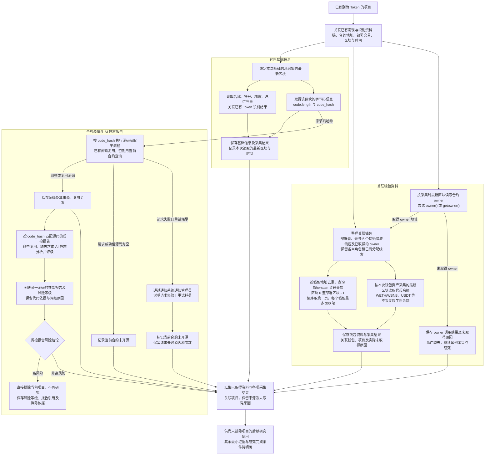

# Token 研究资料整理流程

> 文档状态：目标设计草案，尚未实现。本图展开项目研究中的资料整理环节，表达资料范围及数据依赖；不固定执行顺序、并发方式或所有采集必须完成的条件。

## 入口与目的

输入是已经识别为 Token 的项目，以及发现和识别阶段已经取得的资料。沿用已有的链、合约地址、部署交易、部署区块与时间、识别结果等上下文，整理基础信息、源码和关联钱包资料，供后续按研究规则筛选项目。基础信息、字节码信息、合约 owner 和钱包资产等链上状态，以各自采集时最新区块作为数据源，并保留实际读取的区块号与时间。此前取得的发现、识别记录保留其原始时点，不将旧快照直接当作本次最新链上状态。

## 流程图

## 数据依赖与结果说明

| 部分 | 依赖与需要保留的内容 |
| --- | --- |
| 发现与识别资料 | 项目身份、部署交易和区块、部署者、Token 识别结果及已取得的基础事实；复用已有资料，不额外增加部署交易成功判断。 |
| 代币基础信息 | 以本次采集时最新区块读取名称、符号、精度、总供应量、`code.length` 与 `code_hash`，保存实际区块与时间，并关联已有识别结果；`code.length` 是运行时代码字节数，具体研究用途待定；`code_hash` 来自运行时字节码。 |
| 合约源码资料 | 依赖 `code_hash` 查询已有源码；没有可复用源码时，使用当前链和合约地址查询。成功返回空源码时标记未开源；请求失败重试耗尽时通知管理员，再标记未开源并保留实际失败原因。完整分支见 [合约源码获取流程](token-contract-source-flow.md)。 |
| AI 静态质检报告 | 通过 `code_hash` 定位源码及报告，有报告就复用风险等级；没有报告且已有源码时才由 AI 静态分析并评级，同一源码只生成一份报告。报告保存代码依据、触发条件、影响及评级原因，不核实链上状态或依赖钱包资料。高风险直接排除项目，不再研究；非高风险继续其他研究。完整流程见 [合约源码 AI 静态审阅](token-contract-review-flow.md)。 |
| 合约 owner | 首版按采集时最新区块直接尝试 `owner()` 或 `getowner()`，取得地址后纳入关联钱包，采集其普通交易和代币余额。调用结果、函数与来源区块按实际记录；尽力采集，未取得时保留结果与可知原因，继续其他资料采集和研究。详见 [owner 获取与钱包采集流程](token-owner-wallet-flow.md)。 |
| 关联钱包 | 围绕部署者、最多 5 个初始接收钱包和已取得的合约 owner 整理资料，保留不同角色和初始分配线索。初始接收钱包按部署交易内该代币的净接收量降序，从净接收量为正且查询时无合约代码的地址中最多选取 5 个；该上限仅针对初始接收钱包，角色不默认对应同一地址。 |
| 钱包历史交易 | 已确认原样保留当前查询规则：关联钱包地址去重后，通过 Etherscan `account/txlist` 查询区块 `0` 至 `项目部署区块 - 1`，`sort=desc`、`page=1`、`offset=300`，每个钱包获取部署前最近的最多 300 笔普通交易，不足则保留实际数量，只取第一页。保留交易资料及查询范围；失败处理与研究流程的衔接后续设计。 |
| 钱包资产 | 依赖关联钱包地址，按本次采集时最新区块读取 WETH/WBNB、USDT 等已追踪代币余额并记录来源区块，不采集原生币余额。余额作为辅助背景，不是完整钱包估值，采集触发、频率及失败处理后续设计。 |
| 资料汇集 | 将已经取得的事实、来源、采集结果、共享质检报告及实际未取得原因关联到项目；AI 分析内容与实际采集事实分别表达。高风险报告单独触发直接排除，不等待资料汇集完成；其余资料汇集不直接生成项目通过结论。 |

图中的分支表示资料类别及实际数据依赖，不表示已确认全部并行或固定串行。源码获取依赖字节码哈希，钱包查询依赖钱包地址；没有规定全部基础字段都取得后才能请求源码。生成或命中高风险报告后直接排除项目，不等待其他资料齐备，也不继续研究。其他资料的采集时机、已启动采集如何结束等执行细节待设计；图中资料汇集路径不使已排除的项目继续研究。

AI 静态质检只依赖已取得的源码；同一源码的报告与 owner 读取方式共享复用，owner 地址仍按当前合约读取。owner 和钱包采集不进入静态报告的核实过程。取得源码后，AI 输出报告及风险等级，并在报告中说明源码中的疑点；报告描述源码中的逻辑与条件，不将其表述为已核实的当前链上状态。AI 超时、请求失败或返回内容不符合报告要求属于技术异常，单独记录，不作为业务判断分支。

owner 首版读取不依赖源码，取得地址后进入与其他关联钱包相同的历史交易和代币余额采集流程。owner 信息尽力获取，首版直接读取和未来 AI 辅助读取都可能无法取得地址；未取得时保留实际结果与可知原因。对于尚未被排除的项目，只跳过依赖该未知地址的 owner 钱包采集，继续已知钱包采集和研究。成功取得 owner 不是研究完成的必要条件，缺少 owner 不单独触发项目过滤，也不代表合约没有 owner；已被高风险报告排除的项目不继续研究。

基础信息与钱包资产使用各自采集时确定的最新区块，不要求不同来源共用同一区块。部署上下文保留实际部署区块，钱包历史固定以 `项目部署区块 - 1` 为截止高度，不包含部署区块内及之后的交易。例如部署区块为 `30000`，每个钱包始终在 `0–29999` 范围内倒序取最近的最多 300 笔普通交易，采集时的最新区块不改变该范围。Etherscan 源码资料记录实际查询时间与资料来源，不将其标记为某个链上区块的源码快照。

源码请求失败最多重试三次，目前按首次请求之外再重试三次、总计最多四次请求记录。成功但源码为空时标记当前合约未开源，结束本次源码采集；请求失败重试耗尽后，通过 [系统通知组件](../design/notifications/system-notification-operations.md) 通知管理员，再将当前合约状态记为未开源，保留失败原因与次数。两种未开源记录需要区分实际原因。该重试规则只适用于已设计的源码请求，不扩展为其他采集任务的统一策略。

## 待设计内容与阶段边界

- owner 首版已确定直接调用读函数并纳入关联钱包采集；函数尝试顺序、多个结果不同、零地址等特殊返回值、合约 owner 的额外分析、具体重试和后续更新仍待细化。后续 AI 分析的 owner 读取方式与源码及 `code_hash` 关联保存；先查库复用可用方式，未命中且有实际源码时再分析。每次均用该方式读取当前合约的最新 owner 地址，不复用其他合约的地址；该 AI 路线不在首版实现。上述细节不改变未取得 owner 时继续研究的原则。
- owner 缺失的基本处理已明确；其余最小研究证据、各类采集的启动与完成条件、采集失败和资料矛盾时的处理、后续更新方式仍待设计。未开源、请求失败或资料缺失不直接等同于项目不符合筛选规则。
- 本阶段不采集或研究底池，不采集 Ave，也不引入系统自有的合约代码黑名单和钱包黑名单。模拟结果暂不作为必采项，按需采集方式与用途仍待设计。
- 高风险报告直接排除项目及同一源码只生成一份共享报告已经确定；风险评级细则和并发去重方式待细化。图中没有沿用当前六类任务全部结束后构建不可变画像的完成条件，也没有增加接口、数据结构或执行组件要求。

## 关联文档

- [项目研究与筛选流程](token-research-flow.md)
- [合约源码获取流程](token-contract-source-flow.md)
- [合约源码 AI 静态审阅流程](token-contract-review-flow.md)
- [合约 owner 获取与关联钱包采集流程](token-owner-wallet-flow.md)
- [合约发现与 Token 识别流程](token-discovery-identification-flow.md)
- [Token 目标设计](token.md)
- [返回业务设计与流程图索引](README.md)
