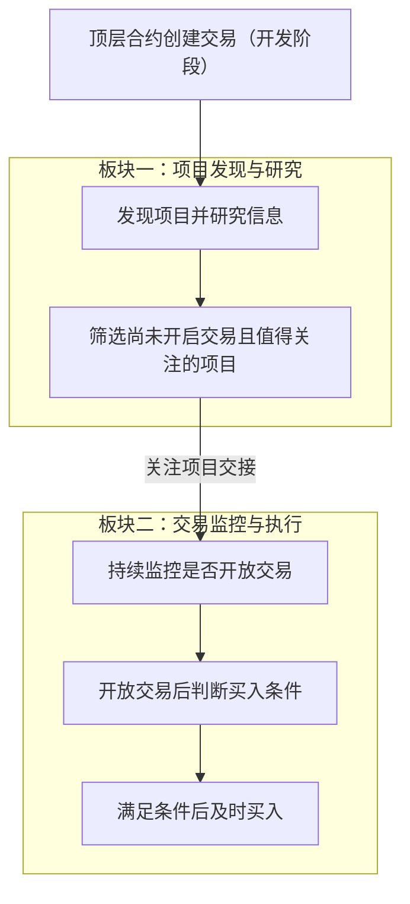

# Token 两板块目标设计

> 文档状态：目标设计草案，尚未实现。本文件记录已明确的业务目标与开发阶段范围，并将待确认建议、待细化规则和未采用的调研方案分别列出；不代表当前程序已经具备完整目标能力。

本文用于后续需求讨论和开发设计。本次只整理文档，具体技术方案与代码开发将在业务规则明确后推进。

## 业务目标

Token 的核心目的是发现区块链上的新代币项目，从合约部署后开始捕捉和研究项目信息，判断项目是否值得关注、是否具备买入价值。

系统争取在项目尚未开启交易时完成研究和筛选，持续关注筛选出的项目，并在其开启交易且满足买入条件时及时买入。尽早参与是寻找盈利机会的业务动机，不构成盈利保证。

## 项目的典型阶段

| 阶段 | 项目侧的活动 | 系统关注的业务问题 |
| --- | --- | --- |
| 合约部署 | 发起者发布合约和代币 | 如何尽早发现项目并开始收集信息？ |
| 交易开放前的准备 | 发起者准备交易条件，包括添加流动性等操作 | 项目是否值得关注，能否在开放交易前完成筛选？ |
| 开放交易 | 项目开始允许交易 | 关注项目是否已经开放交易，当前是否满足买入条件？ |
| 普通交易者参与 | 链上交易者开始买卖项目代币 | 如何在符合条件的前提下及时参与？ |

这些阶段用于说明业务目标，不是已确定的程序状态枚举，也不假设每个项目都严格按此顺序经历独立的阶段。添加流动性与开放交易分别描述：添加底池本身不作为已经开放交易的充分判据，具体判定规则仍待设计。项目在研究完成前就开放交易的情况也需要单独明确处理方式。

## 已明确的两个业务板块

| 板块 | 核心问题 | 输入 | 主要工作 | 输出 |
| --- | --- | --- | --- | --- |
| 项目发现与研究 | 这个新项目是否值得关注？ | 开发阶段范围内的顶层部署候选及可获得的项目资料 | 从部署后开始发现项目、捕捉信息、开展研究并筛选 | 尚未开启交易且值得关注的项目及其研究结论与依据 |
| 交易监控与执行 | 这个关注项目现在是否满足买入条件？ | 第一板块交接的关注项目及研究信息 | 持续检测是否开放交易，在开放交易且满足条件后及时买入 | 买入执行结果，具体结果分类与处理规则待细化 |

“值得关注”是第一板块的筛选结论；“满足买入条件”是第二板块执行买入前的条件判断。两者需要分别定义，进入关注范围不直接等于执行买入。

以下流程只表达已明确的业务主线，省略尚未决定的异常分支与执行细节。

两个板块目前是业务职责划分，不预先决定服务数量、部署进程或通信技术。项目身份、研究结论与依据是描述交接所需的概念信息；本轮不定义字段结构、API 或事件协议。

## 已明确的开发阶段发现范围

当前开发阶段仅关注区块内满足 `transaction.To() == nil` 的顶层合约创建交易，使用交易发送者和 nonce 推导候选合约地址。该范围沿用当前扫描入口，便于先推进项目研究和交易监控的业务设计。

- 工厂合约内部通过 `CREATE` 或 `CREATE2` 创建的合约暂不纳入发现范围；即使内部创建发生在顶层部署交易中，也只跟踪顶层候选合约。
- 项目发现暂不接入 Bitquery 或 Allium，也不在本阶段增加内部调用追踪或工厂事件扫描来扩展创建路径覆盖。
- `transaction.To() == nil` 只用于确定部署候选，不代表部署已经成功、候选一定是代币，或项目已经值得关注。部署结果、代币识别及研究筛选仍需分别验证和判断，具体目标规则后续细化。

因此，本阶段的发现结果不代表区块内创建的全部合约。内部创建路径的扩展可在后续重新讨论，不作为当前开发的前置条件。支持链、DEX 和交易池范围仍需另外明确。

## 已明确的未添加流动性阶段采集范围

本节针对合约已经部署、尚未添加流动性时的项目发现与研究。以下为已确定的目标安排，尚未修改当前六源采集代码；添加流动性以后但尚未开放交易的情况，需要在后续监控设计中继续细化。

| 当前数据类别 | 本阶段安排 | 研究用途与边界 |
| --- | --- | --- |
| 链上状态 `chain_state` | 拆分后采集基础信息与轻量池状态 | 为项目身份、代币基础事实和当前阶段提供依据；依赖流动性的池子运行信息交由后续监控阶段采集 |
| 合约源码 `contract_code_source` | 继续采集 | 保留源码、验证状态和代码哈希，为后续合约逻辑与权限研究提供材料；采集源码不等于已完成安全分析 |
| 钱包历史交易 `wallet_normal_transactions` | 继续采集 | 研究部署者和初始接收钱包的部署前交易，为资金往来与关联行为分析提供线索；owner 数据的补充见后文待设计需求 |
| 钱包资产 `wallet_asset_state` | 继续采集，作为辅助信息 | 读取相关钱包的原生币、WETH/WBNB、USDT 等已追踪资产；这些余额用于研究背景，不作为完整钱包估值或项目可靠性的单独判据 |
| 模拟结果 `simulation_result` | 暂不作为必采项 | 不作为形成研究结论或交接关注项目的前置条件；是否按需采集、如何解释结果，后续再设计 |
| Ave 数据 `ave` | 本阶段不采集 | 本阶段不调用 Ave 获取市场数据、项目资料或风险标签；后续阶段是否采集及何时触发，另行设计 |

### 链上状态的拆分

链上状态是研究的重要依据，需要按数据用途和适用阶段拆分，不将整个现有 `chain_state` 作为一个必须同时取得全部内容的整体。

| 数据部分 | 内容 | 归属与采集时机 |
| --- | --- | --- |
| 代币基础信息 | 合约地址、ERC-20 探测结果、名称、符号、精度、总供应量及对应区块与时间 | 项目发现与研究阶段采集，不依赖项目已经建立交易池或添加流动性 |
| 轻量池状态 | 在支持的 DEX 与池类型范围内，区分候选池地址、池合约是否存在，以及是否已观察到流动性 | 研究阶段保留当前阶段快照，后续由交易监控持续检测变化；候选池地址不能当作池子存在的证据 |
| 池子运行与交易条件信息 | 池内资产余额、池深、LP 供应与持有情况、锁定情况及流动性估值等 | 放入后续交易监控与执行板块，在对应池状态具备适用条件后采集，支持交易准备与买入条件判断；具体规则待定 |

尚未创建交易池、尚未添加流动性都是这一阶段可能出现的正常事实，不因缺少池深、价格或 LP 信息就判定项目异常。池子存在、已添加流动性、已开放交易和实际可以买入需要分别判断。任何“未观察到流动性”的判断都受已支持的链、DEX 和池类型范围限制。

这里先确定数据职责与阶段边界，不预先确定拆分后的任务名称、服务数量、采集频率、接口或数据库结构。当前基础信息、池信息和模拟字段的实现背景见 [ATHENA 聚合查询](../design/token-intelligence/athena-contract.md) 与 [现有采集数据定义](../../internal/token/collection/payload.go)。

### 研究证据与完成条件

部署交易、部署者、代码哈希、初始接收钱包及分配线索等发现阶段已经取得的信息，应一并作为研究材料。当前钱包历史采集只覆盖部署者和部署交易内识别出的初始接收钱包，去重后读取部署区块之前、每个钱包最多 300 笔普通交易；这些是现状边界，不代表完整钱包历史，也不固定未来采样规则。详见 [钱包历史交易现状](../design/token-intelligence/wallet-normal-transactions.md)。

现有 `simulation_result` 是六项独立的 `transfer` / `transferFrom` 调用探测，当前仅记录调用是否报错，不是完整的买入、卖出模拟。因此不将现有结果直接作为项目安全、增发能力或买卖可执行性的结论。辅助合约探测与后续买卖可执行性检查的目标和方式仍需分别设计。实现依据见 [当前模拟调用](../../internal/token/adapters/evm/project_state_reader.go)。

研究阶段不再以现有六类采集任务全部结束作为完成或交接的统一前提。本阶段未采集 Ave，或没有取得非必采的模拟结果，不应仅因此阻塞研究或将研究结论标为不完整。源码、钱包及基础链上信息缺失时的处理、形成研究结论所需的最小证据，以及源码后续验证后的补采方式仍待细化；这不代表可以跳过必要的项目研究直接买入。

## 已明确的后续研究需求

### 合约 owner 数据（待设计、尚未实现）

项目发现与研究板块需要补充获取代币合约的 owner 数据，为关联钱包研究提供依据。当前钱包历史交易采集围绕部署者和初始接收钱包展开，尚未独立读取合约 owner 地址并将其纳入关联钱包研究流程。

合约 owner、部署者和初始接收钱包是不同角色，不默认它们对应同一地址。本轮仅记录补充 owner 数据的需求；获取方式、读取时点、owner 变化后的处理，以及与钱包历史交易采集的衔接均留待后续设计，不进行代码开发。

## 待确认的设计建议

以下建议来自前期讨论，尚未作为已确定规则。后续需要逐项确认，再纳入正式设计。

| 建议 | 希望解决的问题 | 需要确认的边界 |
| --- | --- | --- |
| 交接后继续研究，并允许更新或撤销关注 | 项目出现新信息后，原有研究结论可能发生变化 | 是否持续研究、何时更新或撤销，以及如何影响第二板块 |
| 第二板块接收项目时立即检查当前交易状态 | 交易可能在研究或交接期间开放 | 接收时如何检查，以及发现已经开放交易后如何处理 |
| 第二板块内部区分监控与执行职责 | 一次买入处理过程中仍需关注其他项目的变化 | 内部职责如何协作；尚未决定组件、进程或并发方式 |
| 将买入结果确认、失败处理和防重复执行纳入执行闭环 | 提交买入请求后，需要确定实际结果并处理不确定状态 | 完成标准、异常恢复方式和重复执行的判断边界 |

## 待进一步明确的业务规则

| 议题 | 后续需要明确的内容 |
| --- | --- |
| 发现范围 | 支持哪些链、DEX 和交易池类型；开发阶段的创建路径已限定为顶层创建交易，未来是否扩展内部创建另行讨论 |
| 研究标准 | “可靠”“值得关注”“具备买入价值”的依据，需要哪些资料，以及如何处理信息缺失或矛盾 |
| 研究方式 | 人工、规则、AI 或组合方式的职责，以及研究触发和信息更新方式 |
| 阶段采集与研究完成条件 | 已明确链上状态拆分、模拟结果非必采、未添加流动性阶段不采集 Ave；剩余采集字段、触发与更新方式、最小研究证据和数据缺失处理后续细化 |
| 合约 owner 数据 | 已明确需要补充获取；具体读取与更新方式、无法识别 owner 或 owner 为合约地址时的处理，以及关联钱包历史交易采集范围后续设计 |
| 交易开放判定 | 添加流动性、存在交易对、开放交易和实际可以买入之间的判定关系 |
| 买入条件 | 研究结论以外还需要检查哪些条件，何时允许执行，以及条件不满足后的处理方式 |
| 研究与开盘的先后关系 | 研究未完成就开放交易，或交接时已经开放交易的项目，是放弃还是允许继续参与 |
| 监控与时效 | 使用哪些变化信息、如何持续检测，以及发现和买入响应的时间目标 |
| 交易执行 | 使用的钱包、执行方式、额度、滑点、手续费、路由、授权与异常处理规则 |
| 买入之后的范围 | 是否包括持仓跟踪、卖出和退出策略，以及这些职责如何组织 |

当前业务主线覆盖到首次买入；持仓和卖出的范围尚未确定。除上述已明确的发现范围、阶段采集安排和后续研究需求外，本轮不自行设定其他规则阈值、技术选型、数据库结构、接口契约或状态枚举。

## 与当前实现及研究资料的关系

当前 Token 代码主要实现按区块发现项目、创建六类一次性采集任务，并在任务全部结束后尝试构建唯一的不可变画像。该流程提供现状背景，尚未实现本文描述的完整两板块业务主线。前述链上状态拆分、模拟结果非必采和未添加流动性阶段不采集 Ave 的目标安排也尚未实现。相关说明见：

- [Token 链扫描与项目初始化](../design/token-intelligence/chain-processor.md)。
- [Token 六源采集与项目画像](../design/token-intelligence/collection-profile.md)。
- [Token 项目查询模型](../design/token-intelligence/project-read-model.md)。

六类数据源、一次性采集、不可变画像以及现有组件边界均不作为新方案的固定约束。后续设计应依据业务要求决定保留、替换或重新组织哪些能力；真正实施代码变更时，再同步更新 [当前系统设计文档](../design/README.md)。

[项目案例笔记](project.md)、[Market Maker 钱包笔记](market_maker.md) 和 [合约研究素材](mintable/) 保留为研究资料。这些具体案例中的观察可用于后续讨论和求证，不直接作为已经确认的筛选规则。

## 第三方发现方案调研备忘（本阶段未采用）

以下记录截至 2026 年 9 月 6 日的官方公开资料，供以后重新评估时参考，不是接入计划或当前开发依赖。价格、权限和数据覆盖可能调整，尚未实际调用接口核验完整性、延迟与账单消耗。

### Bitquery

Bitquery 的 EVM `Calls` 数据可按区块号与合约创建条件查询创建记录，包括内部创建路径，可作为未来扩展发现范围的候选来源。能力说明见 [合约创建查询](https://docs.bitquery.io/docs/blockchain/Ethereum/calls/contract-creation/) 与 [Calls 数据说明](https://docs.bitquery.io/docs/schema/evm/calls/)。

API 积分是调用查询时消耗的额度。根据 [积分规则](https://docs.bitquery.io/docs/ide/points/#how-are-points-calculated-for-the-realtime-dataset)，使用 `dataset: realtime` 时，每次查询每个数据集合（cube）消耗 5 积分，与返回记录数量无关；同一请求涉及多个数据集合时分别计费。只查询一次 `Calls` 按 5 积分计算，不能将所有 HTTP 请求一概视为 5 积分。

| 套餐 | 月付价格（美元） | 每月 API 积分 | 单次只查一个实时数据集合时的查询次数 |
| --- | --- | --- | --- |
| Personal | $49 | 10 万 | 约 2 万次 |
| Pro | $99 | 100 万 | 约 20 万次 |
| Scale | $299 | 500 万 | 约 100 万次 |

例如，1,000 个区块各发起一次仅查询 `Calls` 的实时请求，预计消耗 5,000 积分。分页、重复轮询和额外的数据查询增加用量；历史查询不直接套用这项实时计费规则。积分按付款日期对应的账期刷新，且与每分钟请求数、并发数限制独立。详见 [套餐与账期说明](https://docs.bitquery.io/docs/ide/paid/)。

Personal 仅限个人非商业用途；按区块主动查询可从商用 Pro 评估。若需要 Calls / Traces 的持续推送，则应评估 Scale，其订阅时长和推送数据量单独计量。完整历史数据不包含在基础套餐中，需要核实具体数据集合的历史范围及购买方式。详见 [官方定价](https://bitquery.io/pricing)。

### Allium

Allium 的 [Ethereum contracts 表](https://docs.allium.so/historical-data/supported-blockchains/evm/ethereum/raw/contracts) 来源于 `CREATE` / `CREATE2` 创建记录，包含 `block_number`，可供按区块查询。Explorer 属于历史分析产品；[产品比较](https://docs.allium.so/product-comparison)给出的通用数据新鲜度约为 1 小时，不能直接视为秒级发现新合约的能力，具体合约表延迟和实时产品覆盖仍需确认。

官网列出 [通用付费入口 $200/月起](https://www.allium.so/use-case/product-engineering)，但未承诺该价格包含所需 contracts SQL 权限和额度；[常规生产套餐](https://www.allium.so/compare/allium-vs-zerion)中的 Explorer SQL 与实时数据服务需具体报价。

另有 [Machine Payments 按次付费方式](https://docs.allium.so/ai/machine-payments/endpoints-pricing)：提交 SQL 为 $0.01/次，查询状态为 $0.01/次，获取结果为动态计费。因此 $0.01 不是一次完整查询的总成本；该价格表中状态与结果接口仍要求 API key，具体表权限也需确认，不能只凭提交价格确定可用性和总预算。

返回 [业务设计与研究资料索引](README.md) 或 [文档首页](../index.md)。
