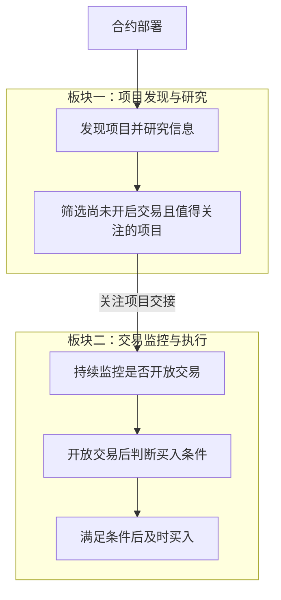

# Token 两板块目标设计

> 文档状态：目标设计草案，尚未实现。本文件记录已明确的业务目标，并将待确认建议与待细化规则分别列出；不代表当前程序已经具备这些能力。

本文用于后续需求讨论和开发设计。本次只整理文档，具体技术方案与代码开发将在业务规则明确后推进。

## 业务目标

Token 的核心目的是发现区块链上的新代币项目，从合约部署后开始捕捉和研究项目信息，判断项目是否值得关注、是否具备买入价值。

系统争取在项目尚未开启交易时完成研究和筛选，持续关注筛选出的项目，并在其开启交易且满足买入条件时及时买入。尽早参与是寻找盈利机会的业务动机，不构成盈利保证。

## 项目的典型阶段

| 阶段 | 项目侧的活动 | 系统关注的业务问题 |
| --- | --- | --- |
| 合约部署 | 发起者发布合约和代币 | 如何尽早发现项目并开始收集信息？ |
| 交易开放前的准备 | 发起者准备交易条件，包括添加流动性等操作 | 项目是否值得关注，能否在开放交易前完成筛选？ |
| 开放交易 | 项目开始允许交易 | 关注项目是否已经开放交易，当前是否满足买入条件？ |
| 普通交易者参与 | 链上交易者开始买卖项目代币 | 如何在符合条件的前提下及时参与？ |

这些阶段用于说明业务目标，不是已确定的程序状态枚举，也不假设每个项目都严格按此顺序经历独立的阶段。添加流动性与开放交易分别描述：添加底池本身不作为已经开放交易的充分判据，具体判定规则仍待设计。项目在研究完成前就开放交易的情况也需要单独明确处理方式。

## 已明确的两个业务板块

| 板块 | 核心问题 | 输入 | 主要工作 | 输出 |
| --- | --- | --- | --- | --- |
| 项目发现与研究 | 这个新项目是否值得关注？ | 合约部署信息及可获得的项目资料 | 从部署后开始发现项目、捕捉信息、开展研究并筛选 | 尚未开启交易且值得关注的项目及其研究结论与依据 |
| 交易监控与执行 | 这个关注项目现在是否满足买入条件？ | 第一板块交接的关注项目及研究信息 | 持续检测是否开放交易，在开放交易且满足条件后及时买入 | 买入执行结果，具体结果分类与处理规则待细化 |

“值得关注”是第一板块的筛选结论；“满足买入条件”是第二板块执行买入前的条件判断。两者需要分别定义，进入关注范围不直接等于执行买入。

以下流程只表达已明确的业务主线，省略尚未决定的异常分支与执行细节。

两个板块目前是业务职责划分，不预先决定服务数量、部署进程或通信技术。项目身份、研究结论与依据是描述交接所需的概念信息；本轮不定义字段结构、API 或事件协议。

## 待确认的设计建议

以下建议来自前期讨论，尚未作为已确定规则。后续需要逐项确认，再纳入正式设计。

| 建议 | 希望解决的问题 | 需要确认的边界 |
| --- | --- | --- |
| 交接后继续研究，并允许更新或撤销关注 | 项目出现新信息后，原有研究结论可能发生变化 | 是否持续研究、何时更新或撤销，以及如何影响第二板块 |
| 第二板块接收项目时立即检查当前交易状态 | 交易可能在研究或交接期间开放 | 接收时如何检查，以及发现已经开放交易后如何处理 |
| 第二板块内部区分监控与执行职责 | 一次买入处理过程中仍需关注其他项目的变化 | 内部职责如何协作；尚未决定组件、进程或并发方式 |
| 将买入结果确认、失败处理和防重复执行纳入执行闭环 | 提交买入请求后，需要确定实际结果并处理不确定状态 | 完成标准、异常恢复方式和重复执行的判断边界 |

## 待进一步明确的业务规则

| 议题 | 后续需要明确的内容 |
| --- | --- |
| 发现范围 | 支持哪些链、DEX、交易池类型，以及哪些合约创建路径 |
| 研究标准 | “可靠”“值得关注”“具备买入价值”的依据，需要哪些资料，以及如何处理信息缺失或矛盾 |
| 研究方式 | 人工、规则、AI 或组合方式的职责，以及研究触发和信息更新方式 |
| 交易开放判定 | 添加流动性、存在交易对、开放交易和实际可以买入之间的判定关系 |
| 买入条件 | 研究结论以外还需要检查哪些条件，何时允许执行，以及条件不满足后的处理方式 |
| 研究与开盘的先后关系 | 研究未完成就开放交易，或交接时已经开放交易的项目，是放弃还是允许继续参与 |
| 监控与时效 | 使用哪些变化信息、如何持续检测，以及发现和买入响应的时间目标 |
| 交易执行 | 使用的钱包、执行方式、额度、滑点、手续费、路由、授权与异常处理规则 |
| 买入之后的范围 | 是否包括持仓跟踪、卖出和退出策略，以及这些职责如何组织 |

当前业务主线覆盖到首次买入；持仓和卖出的范围尚未确定。本轮不自行设定规则阈值、技术选型、数据库结构、接口契约或状态枚举。

## 与当前实现及研究资料的关系

当前 Token 代码主要实现按区块发现项目、创建六类一次性采集任务，并在任务全部结束后尝试构建唯一的不可变画像。该流程提供现状背景，尚未实现本文描述的完整两板块业务主线。相关说明见：

- [Token 链扫描与项目初始化](../design/token-intelligence/chain-processor.md)。
- [Token 六源采集与项目画像](../design/token-intelligence/collection-profile.md)。
- [Token 项目查询模型](../design/token-intelligence/project-read-model.md)。

六类数据源、一次性采集、不可变画像以及现有组件边界均不作为新方案的固定约束。后续设计应依据业务要求决定保留、替换或重新组织哪些能力；真正实施代码变更时，再同步更新 [当前系统设计文档](../design/README.md)。

[项目案例笔记](project.md)、[Market Maker 钱包笔记](market_maker.md) 和 [合约研究素材](mintable/) 保留为研究资料。这些具体案例中的观察可用于后续讨论和求证，不直接作为已经确认的筛选规则。

返回 [业务设计与研究资料索引](README.md) 或 [文档首页](../index.md)。
