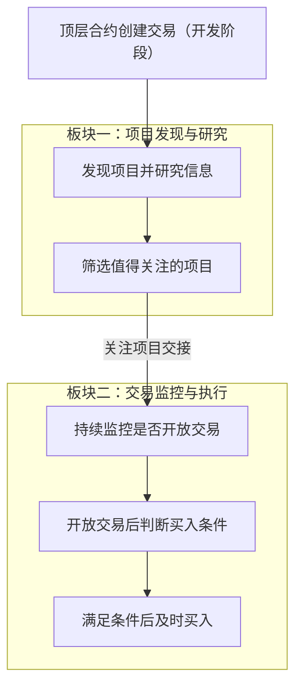
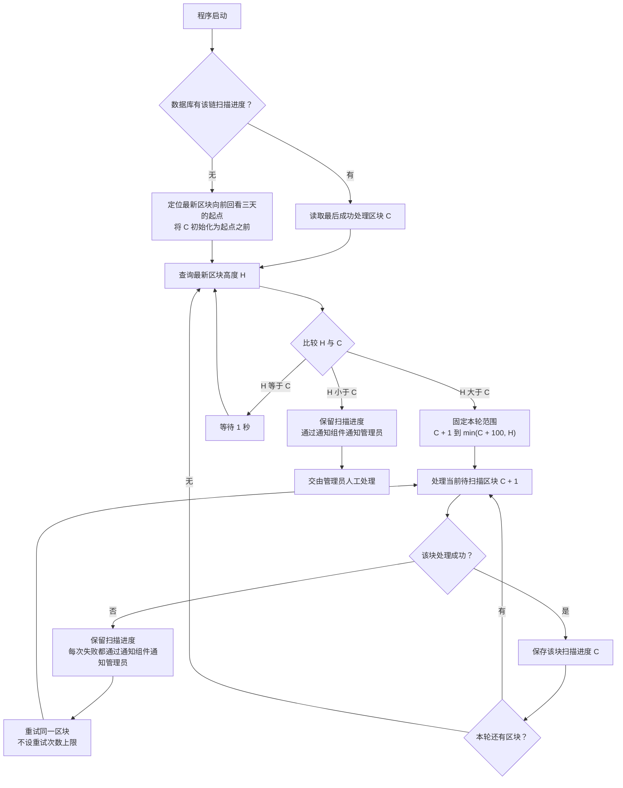

# Token 两板块目标设计

> 文档状态：目标设计草案，尚未实现。本文件记录已明确的业务目标与开发阶段范围，并将待确认建议、待细化规则和未采用的调研方案分别列出；不代表当前程序已经具备完整目标能力。

本文用于后续需求讨论和开发设计。本次只整理文档，具体技术方案与代码开发将在业务规则明确后推进。

## 业务目标

Token 的核心目的是发现区块链上的新代币项目，从合约部署后开始捕捉和研究项目信息，判断项目是否值得关注、是否具备买入价值。

系统争取在项目尚未开启交易时完成研究和筛选，持续关注筛选出的项目，并在其开启交易且满足买入条件时及时买入。尽早参与是寻找盈利机会的业务动机，不构成盈利保证。

## 项目的典型阶段

| 阶段 | 项目侧的活动 | 系统关注的业务问题 |
| --- | --- | --- |
| 合约部署 | 发起者发布合约和代币 | 如何尽早发现项目并开始收集信息？ |
| 交易开放前的准备 | 发起者准备交易条件，包括添加流动性等操作 | 项目是否值得关注，能否在开放交易前完成筛选？ |
| 开放交易 | 项目开始允许交易 | 关注项目是否已经开放交易，当前是否满足买入条件？ |
| 普通交易者参与 | 链上交易者开始买卖项目代币 | 如何在符合条件的前提下及时参与？ |

这些阶段用于说明业务目标，不是已确定的程序状态枚举，也不假设每个项目都严格按此顺序经历独立的阶段。添加流动性与开放交易分别描述：添加底池本身不作为已经开放交易的充分判据，具体判定规则仍待设计。项目在研究完成前就开放交易的情况也需要单独明确处理方式。

## 已明确的两个业务板块

| 板块 | 核心问题 | 输入 | 主要工作 | 输出 |
| --- | --- | --- | --- | --- |
| 项目发现与研究 | 这个新项目是否值得关注？ | 开发阶段范围内的顶层部署候选及可获得的项目资料 | 从部署后开始发现项目、捕捉信息、开展研究并筛选 | 值得关注的项目及其研究结论与依据 |
| 交易监控与执行 | 这个关注项目现在是否满足买入条件？ | 第一板块交接的关注项目及研究信息 | 持续检测是否开放交易，在开放交易且满足条件后及时买入 | 买入执行结果，具体结果分类与处理规则待细化 |

“值得关注”是第一板块的筛选结论；“满足买入条件”是第二板块执行买入前的条件判断。两者需要分别定义，进入关注范围不直接等于执行买入。

在交易开放前完成研究是业务时效目标。第一板块的研究与交接不以检查底池或证明尚未添加流动性为前提，实际交易状态和买入条件由第二板块判断。

以下流程只表达已明确的业务主线，省略尚未决定的异常分支与执行细节。

两个板块目前是业务职责划分，不预先决定服务数量、部署进程或通信技术。项目身份、研究结论与依据是描述交接所需的概念信息；本轮不定义字段结构、API 或事件协议。

## 已明确的开发阶段发现范围

当前开发阶段仅关注区块内满足 `transaction.To() == nil` 的顶层合约创建交易，使用交易发送者和 nonce 推导候选合约地址。该范围沿用当前扫描入口，便于先推进项目研究和交易监控的业务设计。

- 工厂合约内部通过 `CREATE` 或 `CREATE2` 创建的合约暂不纳入发现范围；即使内部创建发生在顶层部署交易中，也只跟踪顶层候选合约。
- 项目发现暂不接入 Bitquery 或 Allium，也不在本阶段增加内部调用追踪或工厂事件扫描来扩展创建路径覆盖。
- `transaction.To() == nil` 只用于确定部署候选，不代表候选一定是代币或项目已经值得关注。发现地址后，由聚合合约内部先检查代码是否存在，再按下文已明确的条件识别 Token；不设置独立的部署结果确认环节，也不通过交易回执判断交易是否成功。项目研究筛选标准后续细化。

因此，本阶段的发现结果不代表区块内创建的全部合约。内部创建路径的扩展可在后续重新讨论，不作为当前开发的前置条件。支持链范围仍需另外明确；DEX 和交易池覆盖属于后续交易监控设计，不作为顶层项目发现与研究的前提。

## 已明确的区块扫描调度（目标规则、尚未实现）

扫描采用主动查询最新区块、按高度连续逐块处理的循环。每轮最多处理 100 个区块，轮末重新查询最新高度；追平后等待 1 秒再查询。同一条链按顺序追赶已有进度之后的区块，历史补扫和新区块扫描沿用同一条连续扫描流程。

### 启动与扫描进度

- 数据库已有该链的扫描进度时，从已保存位置继续，不重新按三天回看窗口初始化。
- 数据库没有该链的扫描进度时，读取当前最新区块，定位向前回看三天所对应的起始区块，从该区块开始扫描。三天是时间范围，不固定换算成某个区块数量；具体定位方式后续设计。
- 本文将扫描游标 `C` 定义为最后一个已成功处理并保存进度的区块高度，下一块为 `C + 1`。首次确定起始区块后，将初始扫描位置设为该区块之前，以包含起始区块。
- 每个区块成功处理后保存进度；没有部署候选的区块也需要记录扫描完成。每轮 100 块是调度上限，不是要求整批完成后才保存进度。

### 每轮执行规则

1. 查询本轮最新区块高度 `H`。
2. 若 `H > C`，确定本轮范围为 `C + 1` 到 `min(C + 100, H)`，两端均包含；本轮上限确定后不随新块产生而延长。
3. 在本轮范围内逐块处理，成功处理一块后保存该块进度，再处理下一块。区块处理失败时，每次都通过通知组件通知管理员，然后重试同一区块；重试次数不设上限，持续失败就持续通知，直到该区块成功或程序停止。失败或尚未完成的区块不越过、不推进为已完成。
4. 本轮完成后立即回到第 1 步，重新查询最新高度，再计算下一轮范围；仍有积压时不额外等待 1 秒。
5. 若 `H == C`，说明按当前高度已追平，等待 1 秒后回到第 1 步。等待应允许程序停止时退出。
6. 若 `H < C`，进入异常分支，保留已保存的扫描进度，通过通知组件向管理员发送异常通知，交由管理员人工处理。该分支不按正常追平处理，也不自动回退或重新初始化扫描进度。

例如，已成功处理到 1800，最新高度为 2000，下一轮处理 **1801–1900，共 100 块**；完成后重新查询最新高度，再从 1901 继续。另一个例子中，若游标为 1900 且最新高度为 1950，则这一轮只处理 1901–1950，共 50 块。已处理到 2100 且最新高度也为 2100 时，等待 1 秒后重新查询。

本节确定正常扫描的启动、顺序、批次和等待规则；不采用新区块订阅作为触发方式，也不增加实时优先与历史补扫的独立处理流程。逐区块处理属于扫描调度约束，单块完成需要取得并保存哪些发现结果、是否等待候选验证、与后续项目研究如何衔接，仍需明确。

区块处理失败的每一次尝试都产生一次管理员通知，不因同一区块或同类错误重复发生而去重、合并或抑制，也不设置只通知首次失败的规则。每轮最多 100 个区块限制的是不同区块的处理范围，不限制同一区块的重试次数；失败块成功后，才继续本轮的下一块。重试间隔及通知提交失败时的处理方式后续细化。

区块处理失败后的持续通知与重试，以及 `H < C` 时通知管理员人工处理，均复用仓库的 [系统通知组件](../design/notifications/system-notification-operations.md)。`H < C` 的人工处理分支独立于区块失败重试循环；该分支的重复通知控制、异常期间扫描控制及人工恢复方式仍待细化。具体告警内容、通知接入方式与接收配置后续设计；本轮不改变通知组件自身的投递和重试机制。

上述高度比较不覆盖同高度区块被替换等全部链重组情况。区块哈希核验、其他重组情形的处理及其对候选、研究和关注结果的影响，继续留待设计。本轮只更新目标文档，尚未接入异常通知或修改扫描代码，现状见 [Token 链扫描与项目初始化](../design/token-intelligence/chain-processor.md)。

## 已明确的 Token 识别与逐项诊断

### 合约内部先检查目标地址代码（待实现）

Token 识别入口在聚合合约内部先检查目标地址的 `code.length`：

- `code.length == 0`：直接判定为 **不是 Token**，返回并保存原因“地址无合约代码”，不继续执行后续六项调用。
- `code.length > 0`：继续执行下述现有筛选条件。

不单独检查部署交易是否成功，也不把交易回执的 `status` 作为识别前置条件。诊断原因记录查询时的实际事实“地址无合约代码”，不将其直接推断为原始部署交易失败。回执中的转账日志仍可作为初始接收钱包等研究资料的来源，具体研究采集范围按相关章节设计。

### 保留现有六项检测条件

Token 识别保留当前全部筛选条件，不放宽元数据、精度或供应量要求，也不以其他识别建议替换现有规则。以下五组业务条件对应六个独立调用。

**识别结论只有两种：是 Token、不是 Token。** 目标地址有代码且六项全部通过时判定为 Token；目标地址无代码或任意一项未通过时判定为不是 Token，并返回对应原因。不设置“暂时无法判断”“待进一步识别”等第三种识别结果。

| 检测项 | 通过条件 |
| --- | --- |
| `name()` | 能读取且非空 |
| `symbol()` | 能读取且非空 |
| `decimals()` | 能读取且大于 0 |
| `totalSupply()` | 能读取且大于 0 |
| `balanceOf(零地址)` | 能正常返回并按现有要求解码；允许返回 0 |
| `allowance(零地址, 零地址)` | 能正常返回并按现有要求解码；允许返回 0 |

读取和解码要求沿用 [当前 Token 探测逻辑](../../pkg/abi/ATHENA/ATHENA.sol) 的 `_getToken` 及相关 `_safe*` 方法。名称或符号为空、精度或总供应量为 0，均按现有规则判定该项不通过；余额和授权额度不增加大于 0 的要求。这一步记录项目采用的 Token 筛选结果，是否值得关注仍由后续研究判断。

### 返回并保存逐项检测结果（待实现）

本次新增要求是在“是 Token / 不是 Token”的整体识别结论之外，让调用方能够明确知道哪些检测未通过。识别结论、未通过的检测项及对应原因必须随结果返回，并关联到对应链和合约持久保存，供后续人工查询排查。判定为不是 Token 的合约也要保留这份记录，不能仅返回原因或输出日志后丢弃。

- 记录合约内部的代码存在检查结果；目标地址无代码时返回不是 Token 及“地址无合约代码”的原因，不把未执行的六项调用伪造为已经检测失败。
- 目标地址有代码时，分别返回六个调用对应的检测结果；`name` 与 `symbol` 各自记录，不合并成一个无法定位的失败项。
- 对未通过项说明原因，区分调用失败、返回数据无法解码，以及成功读取但值不满足条件。这些情况均判定对应检测项未通过，整体为不是 Token。例如，`balanceOf(零地址)` 调用失败和 `decimals()` 返回 0 是不同原因。
- 单项不通过时，继续完成其余可执行检测，并列出所有已发现的未通过项，避免只保留第一个失败原因。
- 已取得的返回值可作为诊断依据；底层失败原因只能记录实际取得的信息，不能把“调用失败”直接断言为“方法不存在”。
- 若节点请求或外层聚合调用整体失败，按实际情况记录执行错误，不伪造逐项检测结果，也不新增第三种 Token 识别结论。此类执行异常与既定区块失败通知、重试流程的衔接仍待细化。

以下为目标地址有代码时的诊断内容示意，不定义实际返回字段或错误码：

| 检测项 | 检测结果 | 排查信息 |
| --- | --- | --- |
| `name()` | 通过 | 返回非空名称 |
| `symbol()` | 通过 | 返回非空符号 |
| `decimals()` | 不通过 | 调用成功，返回 0，不满足大于 0 的条件 |
| `totalSupply()` | 通过 | 返回值大于 0 |
| `balanceOf(零地址)` | 不通过 | 调用失败，未取得余额结果 |
| `allowance(零地址, 零地址)` | 通过 | 正常返回 0 |

该示例的整体识别结论为 **不是 Token**，未通过项为 `decimals()` 和 `balanceOf(零地址)`，两项原因均应返回并保存，后续人工能够按对应合约查到该结论和原因。具体返回结构、错误码、存储结构与人工查询入口、检测资源限制及异常传播方式后续设计。本轮只记录目标要求；当前筛选条件继续保留，逐项诊断能力尚未实现。

## 已明确的未添加流动性阶段采集范围

本节针对合约部署后的早期项目发现与研究，以尚未添加流动性的项目为业务场景。第一板块不采集或研究底池信息，也不通过查询底池来验证项目是否属于该阶段。以下为已确定的目标安排，尚未修改当前六源采集代码；底池与交易开放状态的判断交由后续交易监控与执行板块设计。

| 当前数据类别 | 本阶段安排 | 研究用途与边界 |
| --- | --- | --- |
| 链上状态 `chain_state` | 拆分后仅采集代币基础信息 | 为项目身份和代币基础事实提供依据；本阶段不采集底池地址、创建状态、流动性或 LP 信息 |
| 合约源码 `contract_code_source` | 继续采集 | 保留源码、验证状态和代码哈希，为后续合约逻辑与权限研究提供材料；采集源码不等于已完成安全分析 |
| 钱包历史交易 `wallet_normal_transactions` | 继续采集 | 研究部署者和初始接收钱包的部署前交易，为资金往来与关联行为分析提供线索；owner 数据的补充见后文待设计需求 |
| 钱包资产 `wallet_asset_state` | 继续采集，作为辅助信息 | 读取相关钱包的原生币、WETH/WBNB、USDT 等已追踪资产；这些余额用于研究背景，不作为完整钱包估值或项目可靠性的单独判据 |
| 模拟结果 `simulation_result` | 暂不作为必采项 | 不作为形成研究结论或交接关注项目的前置条件；是否按需采集、如何解释结果，后续再设计 |
| Ave 数据 `ave` | 本阶段不采集 | 本阶段不调用 Ave 获取市场数据、项目资料或风险标签；后续阶段是否采集及何时触发，另行设计 |

### 链上状态的拆分

链上状态是研究的重要依据，需要将代币基础信息与底池信息拆开。项目发现与研究板块只保留代币基础信息，底池相关内容由后续交易监控与执行板块另行设计。

| 数据部分 | 内容 | 归属与采集时机 |
| --- | --- | --- |
| 代币基础信息 | 合约地址、ERC-20 探测结果、名称、符号、精度、总供应量及对应区块与时间 | 项目发现与研究阶段采集，不依赖项目已经建立交易池或添加流动性 |
| 底池信息 | 候选池地址、池合约是否创建、是否添加流动性，以及池内资产余额、池深、LP 供应与持有情况、锁定情况和流动性估值等 | 本研究阶段全部不采集、不研究；后续由交易监控与执行板块确定所需内容、采集时机及判断规则 |

研究的启动、完成和关注项目交接均不要求提供底池地址或底池状态快照，也不因没有这些数据就判定项目异常或研究证据不完整。第一板块未采集底池数据，不表示已经确认项目没有底池或流动性。池子存在、已添加流动性、已开放交易和实际可以买入的关系，由第二板块的后续设计明确。

这里先确定数据职责与阶段边界，不预先确定拆分后的任务名称、服务数量、采集频率、接口或数据库结构。当前基础信息、池信息和模拟字段的实现背景见 [ATHENA 聚合查询](../design/token-intelligence/athena-contract.md) 与 [现有采集数据定义](../../internal/token/collection/payload.go)。

### 研究证据与完成条件

部署交易、部署者、代码哈希、初始接收钱包及分配线索等发现阶段已经取得的信息，应一并作为研究材料。当前钱包历史采集只覆盖部署者和部署交易内识别出的初始接收钱包，去重后读取部署区块之前、每个钱包最多 300 笔普通交易；这些是现状边界，不代表完整钱包历史，也不固定未来采样规则。详见 [钱包历史交易现状](../design/token-intelligence/wallet-normal-transactions.md)。

现有 `simulation_result` 是六项独立的 `transfer` / `transferFrom` 调用探测，当前仅记录调用是否报错，不是完整的买入、卖出模拟。因此不将现有结果直接作为项目安全、增发能力或买卖可执行性的结论。辅助合约探测与后续买卖可执行性检查的目标和方式仍需分别设计。实现依据见 [当前模拟调用](../../internal/token/adapters/evm/project_state_reader.go)。

研究阶段不再以现有六类采集任务全部结束作为完成或交接的统一前提。本阶段未采集底池信息、未采集 Ave，或没有取得非必采的模拟结果，不应仅因此阻塞研究或将研究结论标为不完整。源码、钱包及基础链上信息缺失时的处理、形成研究结论所需的最小证据，以及源码后续验证后的补采方式仍待细化；这不代表可以跳过必要的项目研究直接买入。

## 已明确的后续研究需求

### 合约 owner 数据（待设计、尚未实现）

项目发现与研究板块需要补充获取代币合约的 owner 数据，为关联钱包研究提供依据。当前钱包历史交易采集围绕部署者和初始接收钱包展开，尚未独立读取合约 owner 地址并将其纳入关联钱包研究流程。

合约 owner、部署者和初始接收钱包是不同角色，不默认它们对应同一地址。本轮仅记录补充 owner 数据的需求；获取方式、读取时点、owner 变化后的处理，以及与钱包历史交易采集的衔接均留待后续设计，不进行代码开发。

## 已明确移除的黑名单设计（待删除、尚未实施）

目标设计不再保留系统自有的合约代码黑名单和钱包黑名单，也不将这两类黑名单命中作为项目筛选、关注或买入条件。

| 移除对象 | 当前实现与后续安排 |
| --- | --- |
| 合约代码黑名单 | 当前以合约链上字节码的 `code_hash` 记录黑名单；后续删除该黑名单能力 |
| 钱包黑名单 | 当前以钱包地址记录黑名单；后续删除该黑名单能力 |

后续代码重构时，一并清理两类黑名单对应的数据模型与存储、管理接口、前端页面与导航、接口权限映射和命中检查方法。合约源码、代码哈希及关联钱包仍按前述范围用于项目研究；删除黑名单不扩大其他研究数据的删除范围。

当前两类黑名单的存储和管理能力仍然存在，发现、采集和画像构建流程未调用其命中检查。本轮只记录已确认的移除决定，不删除代码或数据；实际清理时再同步更新当前实现文档。现状入口见 [黑名单模型](../../internal/token/policy/model.go)、[黑名单仓储](../../internal/token/adapters/postgres/blocklist_store.go) 和 [Token 模块访问控制](../design/token-intelligence/access-control.md)。

## 已明确的交易监控覆盖方向（待设计、尚未实现）

第二板块需要扩大底池覆盖范围，支持更多协议、报价资产和底池类型。当前实现只围绕 Ethereum 的 Uniswap V2、BSC 的 PancakeSwap V2，以及目标 Token 与 WETH/WBNB、USDT 组成的交易对采集底池信息；这些现状不作为新设计的固定限制。现状说明见 [ATHENA 聚合查询](../design/token-intelligence/athena-contract.md)。

| 扩展方向 | 目标要求 |
| --- | --- |
| DEX 与协议 | 能够纳入其他 DEX 和交易协议，不将现有两个协议或固定 Factory 作为覆盖边界 |
| 报价资产 | 能够研究和监控与其他报价资产组成的底池，不将 WETH/WBNB、USDT 作为唯一允许的报价资产 |
| 底池类型 | 根据不同协议的池结构和交易机制识别流动性与交易条件，不要求所有协议都符合现有 V2 交易对模型 |
| 同一项目的多个底池 | 允许识别同一项目在不同协议、报价资产和池类型下的多个底池，不预设每个项目只有两个固定底池 |

底池发现、状态监控与交易条件判断由第二板块承担。第一板块继续从 `transaction.To() == nil` 的顶层创建交易发现项目，并按既定范围研究合约与相关钱包，不采集或研究底池。

扩大覆盖是已明确的设计方向，具体接入的链、协议、报价资产与池类型清单、接入优先级、底池识别方式、多池选择及交易执行规则后续确定。文档不将扩展方向表述为已经支持所有链上协议，也不在本轮固定技术方案或修改代码。

## 待确认的设计建议

以下建议来自前期讨论，尚未作为已确定规则。后续需要逐项确认，再纳入正式设计。

| 建议 | 希望解决的问题 | 需要确认的边界 |
| --- | --- | --- |
| 交接后继续研究，并允许更新或撤销关注 | 项目出现新信息后，原有研究结论可能发生变化 | 是否持续研究、何时更新或撤销，以及如何影响第二板块 |
| 第二板块接收项目时立即检查当前交易状态 | 交易可能在研究或交接期间开放 | 接收时如何检查，以及发现已经开放交易后如何处理 |
| 第二板块内部区分监控与执行职责 | 一次买入处理过程中仍需关注其他项目的变化 | 内部职责如何协作；尚未决定组件、进程或并发方式 |
| 将买入结果确认、失败处理和防重复执行纳入执行闭环 | 提交买入请求后，需要确定实际结果并处理不确定状态 | 完成标准、异常恢复方式和重复执行的判断边界 |

## 待进一步明确的业务规则

| 议题 | 后续需要明确的内容 |
| --- | --- |
| 发现范围 | 支持哪些链；开发阶段的创建路径已限定为顶层创建交易，未来是否扩展内部创建另行讨论 |
| 区块扫描细节 | 已明确有进度则续扫、无进度回看三天、逐块处理且每轮最多 100 块、轮末刷新最新高度、追平后等待 1 秒；区块处理失败时每次通知管理员并无限次重试同一区块，`H < C` 时通知管理员人工处理；起点定位方式、单块完成条件、与候选验证和研究的衔接、重试间隔、通知提交失败处理、其余告警细节、人工恢复及其他重组情形的处理后续设计 |
| Token 识别与诊断 | 已明确由聚合合约内部先检查目标地址是否有代码，无代码直接判定不是 Token 并记录原因；有代码后执行现有六项检测，全部通过才为 Token，不独立判断交易是否成功；识别结论及原因返回并关联具体合约持久保存供人工查询；具体返回结构、错误码、存储结构与人工查询入口、检测资源限制及执行异常与区块重试的衔接后续设计 |
| 交易场所范围 | 已明确第二板块需要扩展协议、报价资产和底池类型覆盖；具体清单、接入优先级、底池识别、多池选择及采集范围后续设计 |
| 研究标准 | “可靠”“值得关注”“具备买入价值”的依据，需要哪些资料，以及如何处理信息缺失或矛盾 |
| 研究方式 | 人工、规则、AI 或组合方式的职责，以及研究触发和信息更新方式 |
| 阶段采集与研究完成条件 | 已明确链上状态仅保留代币基础信息、本研究阶段不采集或研究底池、模拟结果非必采、不采集 Ave；剩余采集字段、触发与更新方式、最小研究证据和数据缺失处理后续细化 |
| 合约 owner 数据 | 已明确需要补充获取；具体读取与更新方式、无法识别 owner 或 owner 为合约地址时的处理，以及关联钱包历史交易采集范围后续设计 |
| 交易开放判定 | 添加流动性、存在交易对、开放交易和实际可以买入之间的判定关系 |
| 买入条件 | 研究结论以外还需要检查哪些条件，何时允许执行，以及条件不满足后的处理方式 |
| 研究与开盘的先后关系 | 研究未完成就开放交易，或交接时已经开放交易的项目，是放弃还是允许继续参与 |
| 监控与时效 | 使用哪些变化信息、如何持续检测，以及发现和买入响应的时间目标 |
| 交易执行 | 使用的钱包、执行方式、额度、滑点、手续费、路由、授权与异常处理规则 |
| 买入之后的范围 | 是否包括持仓跟踪、卖出和退出策略，以及这些职责如何组织 |

当前业务主线覆盖到首次买入；持仓和卖出的范围尚未确定。除上述已明确的发现范围与扫描调度、Token 识别条件与逐项诊断要求、阶段采集安排、后续研究需求、黑名单移除决定和交易监控覆盖方向外，本轮不自行设定其他规则阈值、技术选型、数据库结构、接口契约或状态枚举。

## 与当前实现及研究资料的关系

当前 Token 代码主要实现按区块发现项目、创建六类一次性采集任务，并在任务全部结束后尝试构建唯一的不可变画像。该流程提供现状背景，尚未实现本文描述的完整两板块业务主线。前述研究阶段仅采集代币基础链上信息、不研究底池、模拟结果非必采和不采集 Ave 的目标安排也尚未实现。相关说明见：

- [Token 链扫描与项目初始化](../design/token-intelligence/chain-processor.md)。
- [Token 六源采集与项目画像](../design/token-intelligence/collection-profile.md)。
- [Token 项目查询模型](../design/token-intelligence/project-read-model.md)。

六类数据源、一次性采集、不可变画像以及现有组件边界均不作为新方案的固定约束。后续设计应依据业务要求决定保留、替换或重新组织哪些能力；真正实施代码变更时，再同步更新 [当前系统设计文档](../design/README.md)。

[项目案例笔记](project.md)、[Market Maker 钱包笔记](market_maker.md) 和 [合约研究素材](mintable/) 保留为研究资料。这些具体案例中的观察可用于后续讨论和求证，不直接作为已经确认的筛选规则。

## 第三方发现方案调研备忘（本阶段未采用）

以下记录截至 2026 年 9 月 6 日的官方公开资料，供以后重新评估时参考，不是接入计划或当前开发依赖。价格、权限和数据覆盖可能调整，尚未实际调用接口核验完整性、延迟与账单消耗。

### Bitquery

Bitquery 的 EVM `Calls` 数据可按区块号与合约创建条件查询创建记录，包括内部创建路径，可作为未来扩展发现范围的候选来源。能力说明见 [合约创建查询](https://docs.bitquery.io/docs/blockchain/Ethereum/calls/contract-creation/) 与 [Calls 数据说明](https://docs.bitquery.io/docs/schema/evm/calls/)。

API 积分是调用查询时消耗的额度。根据 [积分规则](https://docs.bitquery.io/docs/ide/points/#how-are-points-calculated-for-the-realtime-dataset)，使用 `dataset: realtime` 时，每次查询每个数据集合（cube）消耗 5 积分，与返回记录数量无关；同一请求涉及多个数据集合时分别计费。只查询一次 `Calls` 按 5 积分计算，不能将所有 HTTP 请求一概视为 5 积分。

| 套餐 | 月付价格（美元） | 每月 API 积分 | 单次只查一个实时数据集合时的查询次数 |
| --- | --- | --- | --- |
| Personal | $49 | 10 万 | 约 2 万次 |
| Pro | $99 | 100 万 | 约 20 万次 |
| Scale | $299 | 500 万 | 约 100 万次 |

例如，1,000 个区块各发起一次仅查询 `Calls` 的实时请求，预计消耗 5,000 积分。分页、重复轮询和额外的数据查询增加用量；历史查询不直接套用这项实时计费规则。积分按付款日期对应的账期刷新，且与每分钟请求数、并发数限制独立。详见 [套餐与账期说明](https://docs.bitquery.io/docs/ide/paid/)。

Personal 仅限个人非商业用途；按区块主动查询可从商用 Pro 评估。若需要 Calls / Traces 的持续推送，则应评估 Scale，其订阅时长和推送数据量单独计量。完整历史数据不包含在基础套餐中，需要核实具体数据集合的历史范围及购买方式。详见 [官方定价](https://bitquery.io/pricing)。

### Allium

Allium 的 [Ethereum contracts 表](https://docs.allium.so/historical-data/supported-blockchains/evm/ethereum/raw/contracts) 来源于 `CREATE` / `CREATE2` 创建记录，包含 `block_number`，可供按区块查询。Explorer 属于历史分析产品；[产品比较](https://docs.allium.so/product-comparison)给出的通用数据新鲜度约为 1 小时，不能直接视为秒级发现新合约的能力，具体合约表延迟和实时产品覆盖仍需确认。

官网列出 [通用付费入口 $200/月起](https://www.allium.so/use-case/product-engineering)，但未承诺该价格包含所需 contracts SQL 权限和额度；[常规生产套餐](https://www.allium.so/compare/allium-vs-zerion)中的 Explorer SQL 与实时数据服务需具体报价。

另有 [Machine Payments 按次付费方式](https://docs.allium.so/ai/machine-payments/endpoints-pricing)：提交 SQL 为 $0.01/次，查询状态为 $0.01/次，获取结果为动态计费。因此 $0.01 不是一次完整查询的总成本；该价格表中状态与结果接口仍要求 API key，具体表权限也需确认，不能只凭提交价格确定可用性和总预算。

返回 [业务设计与研究资料索引](README.md) 或 [文档首页](../index.md)。
