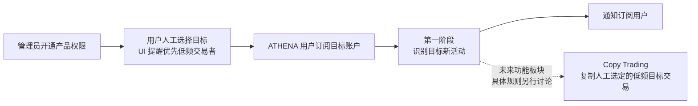

# Trader Sync 产品需求

本目录属于 [`docs/requirements/`](../README.md)，记录 ATHENA 围绕 Polymarket 目标账户提供的交易员跟随产品。产品规划包含活动订阅与通知、未来 Copy Trading 两个功能板块。

产品面向用户人工挑选的低频交易者：当前通过 Activity Alerts 帮助用户发现目标正在交易哪些市场，未来 Copy Trading 的总体目标是复制这些人工选定的低频交易者的交易。高频交易监控和高频跟单不属于产品的性能支持目标。

产品正式名称已确认为 `Trader Sync`。该名称同时容纳活动信息同步与未来交易执行同步，不能被解释为第一阶段的通知功能名。当前只讨论第一阶段的用户授权、目标订阅、活动监控和用户通知。Copy Trading 的具体业务规则不属于当前讨论范围，也不因第一阶段需求或未来技术设计获得任何实现授权。

第一阶段的核心目标是让订阅用户及时知道目标正在交易哪些市场，随后由用户自行前往对应市场判断是否手动下单。通知突出目标、市场、Outcome、方向和市场链接。按单条新成交记录独立触发并保留市场摘要、完成基线后立即生效、当前不做历史补查等业务规则均已逐项确认；整份需求仍为 `讨论中`，等待用户最终确认。

当前保持简单的实时监控范围：断线、服务重启或故障期间可能遗漏成交，恢复后从新的实时边界继续，不补查或补发遗漏交易。中断范围和恢复情况仍可见；已保存活动和已排队通知按原规则处理。市场资料补全、创建前收益资料查询和已有站内活动的查看不受该范围调整影响。

产品说明和创建订阅流程应明确提示用户优先选择低频交易目标。这是产品定位、使用建议和性能保障范围，不增加自动筛选、频率判定或禁止订阅规则。既有突发摘要处理短时消息集中，不是高频目标准入门槛；已识别活动仍遵守保留和投递规则。Copy Trading 目前仅确认上述方向，复制金额、订单执行等具体规则另行讨论。

## 需求地图

| 能力 | 文档 | 状态 | 关联技术设计 |
| --- | --- | --- | --- |
| 第一阶段：Activity Alerts（目标账户订阅与活动通知） | [目标账户订阅与活动通知需求](target-trade-monitoring-notifications.md) | `讨论中` | 未创建 |
| 未来：Copy Trading | 总体方向已明确：复制人工选定的低频交易者交易；高频跟单不在性能支持目标内，具体需求另行讨论 | 具体需求未开始 | 未创建 |

## 数据源可行性资料

[链上成交数据可行性调研](onchain-trade-data-feasibility.md)保存部署源码核对、目标钱包 RPC 过滤和 Token 到市场的实际查询证据。普通 CTF 与 Neg Risk 的核心识别链路已得到样本支持；协议完整覆盖、源记录粒度、时间及金额口径仍需对齐。该资料不构成主数据源选型、需求整体确认或技术设计确认。

用户已明确当前暂不自建 Polygon PoS 节点。[托管 Polygon RPC 服务与费用调研](hosted-polygon-rpc-providers.md)比较第三方 HTTP/WSS 能力、日志查询限制与公开价格，并给出相同工作量下的预算。供应商、套餐与采集架构尚未选定。

Chainstack 与 dRPC 的四个已验证可用 URL 已集中保存在[开发候选端点清单](hosted-polygon-rpc-providers.md#已取得的开发候选端点)，包含完整地址、协议和验证时间，供后续接入查找。

用户随后提供了 Chainnodes HTTP/WSS 开发候选端点。[2026-09-10 端点验证](chainnodes-endpoint-verification.md)发现连接正常但区块数据严重滞后、近期日志查询失败，因此当前未将该端点接入实时监控。

随后提供的 Chainstack 端点已完成[实时数据与订阅验证](chainstack-endpoint-verification.md)：HTTP 数据新鲜，目标成交推送与 HTTP 结果一致；当前套餐拒绝较早历史的 Archive 查询。两个 URL 已保存为开发候选。用户已明确当前不做历史补查，因此 Archive 限制不构成本阶段实时监控范围的阻碍，不再将补查来源或 Archive 套餐列为待解决事项。

用户提供的 dRPC 账户端点也已通过[实时验证](drpc-endpoint-verification.md)：HTTP 区块持续推进，与 Chainstack、PublicNode 同高度哈希一致；WSS 收到三个连续新区块和一条目标成交，成交与 HTTP 核对一致。HTTP/WSS URL 已保存，可作为开发实时采集候选；未据此确定套餐或配置自动故障切换。

## 阶段关系

第一阶段保留已识别活动的完整、可核验事实，不承诺中断期间的成交完整性；不得生成订单、签名、资金操作或任何其他交易副作用。

[返回需求索引](../README.md)
