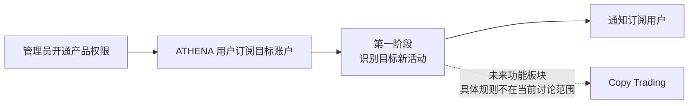

# Trader Sync 产品需求

本目录属于 [`docs/requirements/`](../README.md)，记录 ATHENA 围绕 Polymarket 目标账户提供的交易员跟随产品。产品规划包含活动订阅与通知、未来 Copy Trading 两个功能板块。

产品正式名称已确认为 `Trader Sync`。该名称同时容纳活动信息同步与未来交易执行同步，不能被解释为第一阶段的通知功能名。当前只讨论第一阶段的用户授权、目标订阅、活动监控和用户通知。Copy Trading 的具体业务规则不属于当前讨论范围，也不因第一阶段需求或未来技术设计获得任何实现授权。

第一阶段的核心目标是让订阅用户及时知道目标正在交易哪些市场，随后由用户自行前往对应市场判断是否手动下单。通知突出目标、市场、Outcome、方向和市场链接；当前正在完善按单条成交记录独立触发、生效时间及投递边界，需求仍为 `讨论中`。

## 需求地图

| 能力 | 文档 | 状态 | 关联技术设计 |
| --- | --- | --- | --- |
| 第一阶段：Activity Alerts（目标账户订阅与活动通知） | [目标账户订阅与活动通知需求](target-trade-monitoring-notifications.md) | `讨论中` | 未创建 |
| 未来：Copy Trading | 仅确认属于本产品；具体需求不在当前讨论范围 | 未开始 | 未创建 |

## 阶段关系

第一阶段可以保留完整、可核验的目标活动事实，但不得生成订单、签名、资金操作或任何其他交易副作用。

[返回需求索引](../README.md)
