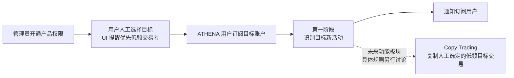

# Trader Sync 产品需求

本目录属于 [`docs/requirements/`](../README.md)，记录 ATHENA 围绕 Polymarket 目标账户提供的交易员跟随产品。产品规划包含活动订阅与通知、未来 Copy Trading 两个功能板块。

产品面向用户人工挑选的低频交易者：当前通过 Activity Alerts 帮助用户发现目标正在交易哪些市场，未来 Copy Trading 的总体目标是复制这些人工选定的低频交易者的交易。高频交易监控和高频跟单不属于产品的性能支持目标。

产品正式名称已确认为 `Trader Sync`。该名称同时容纳活动信息同步与未来交易执行同步，不能被解释为第一阶段的通知功能名。本次确认范围为第一阶段的用户授权、目标订阅、活动监控和用户通知。Copy Trading 的具体业务规则另行讨论，也不因第一阶段需求或未来技术设计获得任何实现授权。

第一阶段的核心目标是让订阅用户及时知道目标正在交易哪些市场，随后由用户自行前往对应市场判断是否手动下单。通知突出目标、市场、Outcome、方向和市场链接。首期 10 人规模、逐条活动、完成基线立即生效及不补历史等既有规则继续有效。技术设计核实后，用户已逐项确认以链上结算时间判断边界，以及摘要 60 秒内开始提交、每 60 秒至多一批且超长分多条完整展示；时限针对该批首条，成功回执及整批完成耗时单列。随后确认同用户集中成交保留前 10 条逐条提醒并允许限速排队，以及撤权/解绑按持久发送许可划界，不等待网络回执。本轮业务边界已逐项确认，需求状态为 `已确认`；[后端技术设计](../../design/trading/trader-sync-activity-alerts.md)保持 `设计中`，完整书面规格待整体审阅，尚未实施。

当前保持简单的实时监控范围：断线、服务重启或故障期间可能遗漏成交，恢复后从新的实时边界继续，不补查或补发遗漏交易。中断范围和恢复情况仍可见；已保存活动和已排队通知按原规则处理。市场资料补全、创建前收益资料查询和已有站内活动的查看不受该范围调整影响。

产品说明和创建订阅流程应明确提示用户优先选择低频交易目标。这是产品定位、使用建议和性能保障范围，不增加自动筛选、频率判定或禁止订阅规则。既有突发摘要处理短时消息集中，不是高频目标准入门槛；已识别活动仍遵守保留和投递规则。Copy Trading 目前仅确认上述方向，复制金额、订单执行等具体规则另行讨论。

首期使用规模已确认为 10 名用户同时保持后台订阅监控，每位用户最多 10 个未取消订阅；容量目标覆盖 100 个订阅关系，以及目标完全不重叠时的 100 个不同目标。该规模不新增用户准入限制，既有低频时效目标继续适用；实际成交负载和节点承载能力仍需后续技术设计核实，详见[首期使用规模](target-trade-monitoring-notifications.md#首期使用规模已确认)。

## 需求地图

| 能力 | 文档 | 状态 | 关联技术设计 |
| --- | --- | --- | --- |
| 第一阶段：Activity Alerts（目标账户订阅与活动通知） | [目标账户订阅与活动通知需求](target-trade-monitoring-notifications.md) | `已确认`（业务边界已逐项确认） | [Activity Alerts 后端技术设计](../../design/trading/trader-sync-activity-alerts.md)（设计中） |
| 未来：Copy Trading | 总体方向已明确：复制人工选定的低频交易者交易；高频跟单不在性能支持目标内，具体需求另行讨论 | 具体需求未开始 | 未创建 |

本次完整规格见[2026-09-10 后端设计 spec](../../superpowers/specs/2026-09-10-trader-sync-activity-alerts-design.md)，已完成分节确认，待用户整体审阅；本次没有开始实现计划或业务实施。

## 数据源可行性资料

[链上成交数据可行性调研](onchain-trade-data-feasibility.md)保存部署源码核对、目标钱包 RPC 过滤和 Token 到市场的实际查询证据。普通 CTF 与 Neg Risk 的核心识别链路已有样本；[当前数据源契约核验](source-contract-verification.md)进一步记录真实代理实现、事件粒度与金额、Combo 腿映射、精确 Profile 解析及 Predictions 来源。[P/L 六区间规则](profile-pnl-contract-verification.md)明确已核准算法及独立 unavailable 边界。技术样本不代表完整运行验收。

用户已明确当前暂不自建 Polygon PoS 节点。[托管 Polygon RPC 服务与费用调研](hosted-polygon-rpc-providers.md)比较第三方 HTTP/WSS 能力、日志查询限制与公开价格，并给出相同工作量下的预算。用户已选择 Chainstack 免费端点为开发入口、dRPC 仅供手动切换，使用单供应商共享 WSS；没有采购、升级或修改配置。

Chainstack 与 dRPC 的四个已验证可用 URL 已集中保存在[开发候选端点清单](hosted-polygon-rpc-providers.md#已取得的开发候选端点)，包含完整地址、协议和验证时间，供后续接入查找。

用户随后提供了 Chainnodes HTTP/WSS 开发候选端点。[2026-09-10 端点验证](chainnodes-endpoint-verification.md)发现连接正常但区块数据严重滞后、近期日志查询失败，因此当前未将该端点接入实时监控。

随后提供的 Chainstack 端点已完成[实时数据与订阅验证](chainstack-endpoint-verification.md)：HTTP 数据新鲜，目标成交推送与 HTTP 结果一致；当前套餐拒绝较早历史的 Archive 查询。两个 URL 已保存为开发候选。用户已明确当前不做历史补查，不为补查升级套餐；处理已经持久接收的旧候选仍须核验规范链，已知回执与 blockHash 路径及限制见[RPC 过滤、确认与免费额度复核](collector-contract-verification.md)。

用户提供的 dRPC 账户端点也已通过[实时验证](drpc-endpoint-verification.md)：HTTP 区块持续推进，与 Chainstack、PublicNode 同高度哈希一致；WSS 收到三个连续新区块和一条目标成交，成交与 HTTP 核对一致。HTTP/WSS URL 已保存，现作为手动替代入口；没有配置自动故障切换。

用户已补充说明 Chainstack 与 dRPC 均使用免费节点。[免费额度与实时开发算例](hosted-polygon-rpc-providers.md#实时开发的额度算例)评估现有服务足以开始当前范围的开发和小规模联调；账户剩余额度未读取。包含 finality、latest、区块头与回执的当前算例为 2.4552M RU/30 天，尚有版本及其他额外调用；100 钱包 OR 已验证，但不是 100 活跃目标压测，容量和端到端时效仍需实现验收。

## 阶段关系

第一阶段保留已识别活动的完整、可核验事实，不承诺中断期间的成交完整性；不得生成订单、签名、资金操作或任何其他交易副作用。

[返回需求索引](../README.md)
