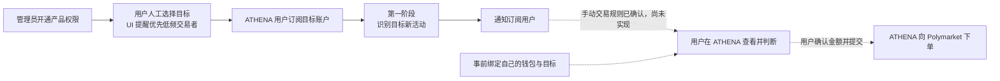

# Trader Sync 产品需求

本目录属于 [`docs/requirements/`](../README.md)，记录 ATHENA 围绕 Polymarket 目标账户提供的交易员跟随产品。产品包含已实现的活动订阅与通知，以及首版规则已逐项确认、尚未实现的[交易板块（初版手动交易）](copy-trading.md)；用户自行到 Polymarket 入金。

产品面向用户人工挑选的低频交易者：Activity Alerts 帮助用户发现目标正在交易哪些市场，交易板块初版让用户收到通知后，在 ATHENA 内自主判断、确认金额并手动下单。高频交易监控不属于产品的性能支持目标，初版不实现自动跟单。

产品正式名称已确认为 `Trader Sync`。该名称同时容纳活动信息与交易能力，不能被解释为第一阶段的通知功能名。第一阶段已确认并实现用户授权、目标订阅、活动监控和用户通知；交易板块手动交易规则与用户到 Polymarket 入金的方式均已确认，已进入[前后端总体设计讨论](../../design/trading/polymarket-manual-trading.md)，尚未开始实现。

第一阶段的核心目标是让订阅用户及时知道目标正在交易哪些市场，随后由用户自行前往对应市场判断是否手动下单。通知突出目标、市场、Outcome、方向和市场链接。首期 10 人规模、逐条活动、完成基线立即生效及不补历史等既有规则继续有效。技术设计核实后，用户已逐项确认以链上结算时间判断边界，以及摘要 60 秒内开始提交、每 60 秒至多一批且超长分多条完整展示；时限针对该批首条，成功回执及整批完成耗时单列。随后确认同用户集中成交保留前 10 条逐条提醒并允许限速排队，以及撤权/解绑按持久发送许可划界，不等待网络回执。本轮业务边界已逐项确认，需求状态为 `已确认`；[后端技术设计](../../design/trading/trader-sync-activity-alerts.md)与[长期 UI 设计](../../design/web-ui/trader-sync-activity-alerts.md)均已实现，证据边界见[验收记录](../../testing/trader-sync-activity-alerts-acceptance.md)。

当前保持简单的实时监控范围：断线、服务重启或故障期间可能遗漏成交，恢复后从新的实时边界继续，不补查或补发遗漏交易。中断范围和恢复情况仍可见；已保存活动和已排队通知按原规则处理。市场资料补全、创建前收益资料查询和已有站内活动的查看不受该范围调整影响。

产品说明和创建订阅流程应明确提示用户优先选择低频交易目标。这是产品定位、使用建议和性能保障范围，不增加自动筛选、频率判定或禁止订阅规则。既有突发摘要处理短时消息集中，不是高频目标准入门槛；已识别活动仍遵守保留和投递规则。交易板块的[首版需求](copy-trading.md)已逐项确认：用户事前将目标与自己的 Wallet 钱包一一绑定并主动确认启用交易，收到成交通知后在电脑或手机上的 ATHENA 中自行确认金额、提交订单。初版不自动跟单，手动买入不限制次数；展示钱包全部持仓与买卖历史，普通市场及 Neg Risk 单个选项支持手动买卖与结算领取，Combo 持仓和历史只读展示。当前开展前后端总体设计；已完成的公开平台核验与尚待实测的私有链路分别记录。[Polymarket 跟单产品调研](copy-trading-product-research-2026-09-14.md)仅保存为研究资料。

首期使用规模已确认为 10 名用户同时保持后台订阅监控，每位用户最多 10 个未取消订阅；容量目标覆盖 100 个订阅关系，以及目标完全不重叠时的 100 个不同目标。该规模不新增用户准入限制，既有低频时效目标继续适用；本地隔离容量已覆盖 100 个关系的共享与非共享目标矩阵，100 个真正活跃实网目标、公开时刻时效和长期节点稳定仍需外部环境验证，详见[首期使用规模](target-trade-monitoring-notifications.md#首期使用规模已确认)。

## 需求地图

| 能力 | 文档 | 状态 | 关联技术设计 |
| --- | --- | --- | --- |
| 第一阶段：Activity Alerts（目标账户订阅与活动通知） | [目标账户订阅与活动通知需求](target-trade-monitoring-notifications.md) | `已确认`（业务边界已逐项确认） | [Activity Alerts 后端技术设计](../../design/trading/trader-sync-activity-alerts.md)（已实现）；[UI 设计](../../design/web-ui/trader-sync-activity-alerts.md)（已实现）；[验收记录](../../testing/trader-sync-activity-alerts-acceptance.md) |
| 交易板块：初版手动交易 | [交易需求](copy-trading.md)：钱包绑定与启用、用户到 Polymarket 入金、通知后在 ATHENA 手动市价买卖、全部持仓与买卖历史、下单记录与来源追溯、结算领取；普通市场与 Neg Risk 单个选项支持执行，Combo 仅展示 | `已确认`（包括校验补充的外部入金方式，尚未实现） | [总体设计提案](../../design/trading/polymarket-manual-trading.md)设计中，一个独立交易服务的分工、账户接入顺序、[单客户端登录的新登录替换规则](../identity-access/single-client-login.md)、共用 Trader Sync 权限、交易结果仅在页面／历史展示及目标卖出活动的对应持仓入口已确认，会话与交易接收边界及执行契约继续细化；[下单／持仓／历史](../../design/web-ui/trader-sync-manual-trading.md)的页面组织与主要交互已确认，其余详细设计继续推进；[平台校验](manual-trading-contract-verification.md)已完成官方契约与公开样本核对，账户入金一致性、私有执行和完整覆盖待实测 |

后端完整规格见[2026-09-10 后端设计 spec](../../superpowers/specs/2026-09-10-trader-sync-activity-alerts-design.md)，已获用户整体确认。[UI spec](../../superpowers/specs/2026-09-10-trader-sync-activity-alerts-ui-design.md)也已整体确认。[21项前后端联合实现计划](../../superpowers/plans/2026-09-10-trader-sync-activity-alerts.md)的产品源码、页面、运行时组合和相关验收已经落实；最终证据与外部限制以长期验收记录为准。

## 数据源可行性资料

用户于 2026-09-15 明确后续无需关注 Combo，允许按需更换公开地址。后续校验聚焦普通市场与 Neg Risk 单个选项；已保存的 Combo 样本和差异仅作为参考，不继续专项追查或作为设计推进前提。

[timetowander 公开账户复核](timetowander-public-account-verification-2026-09-14.md)使用用户提供、仅授权只读的朋友资料页，核准公开交易账户并对照持仓、两页成交、固定 24 小时成交和 Combo。补证了默认成交角色筛选遗漏、CLOSED 中仍有小额余量及 Combo 市场字段差异；不验证该账户的托管、控制权或交易执行。

[手动交易平台契约校验](manual-trading-contract-verification.md)记录 2026-09-14 的官方规则、公开接口、金额边界和现有源码核对。市价执行有对应能力；数据默认筛选、持仓分页差异及钱包实际交易账户需要在设计中处理。用户已确认自行到 Polymarket 入金，账户一致性、私有交易和完整历史仍需实测。

[链上成交数据可行性调研](onchain-trade-data-feasibility.md)保存部署源码核对、目标钱包 RPC 过滤和 Token 到市场的实际查询证据。普通 CTF 与 Neg Risk 的核心识别链路已有样本；[当前数据源契约核验](source-contract-verification.md)进一步记录真实代理实现、事件粒度与金额、Combo 腿映射、精确 Profile 解析及 Predictions 来源。[P/L 六区间规则](profile-pnl-contract-verification.md)明确已核准算法及独立 unavailable 边界。技术样本不代表完整运行验收。

用户已明确当前暂不自建 Polygon PoS 节点。[托管 Polygon RPC 服务与费用调研](hosted-polygon-rpc-providers.md)比较第三方 HTTP/WSS 能力、日志查询限制与公开价格，并给出相同工作量下的预算。Chainstack 免费端点是开发默认入口，dRPC 仅供成对手动切换，系统使用单供应商共享 WSS；没有采购、自动故障切换或双采。

Chainstack 与 dRPC 的四个已验证可用 URL 已集中保存在[开发候选端点清单](hosted-polygon-rpc-providers.md#已取得的开发候选端点)，包含完整地址、协议和验证时间，供后续接入查找。

用户随后提供了 Chainnodes HTTP/WSS 开发候选端点。[2026-09-10 端点验证](chainnodes-endpoint-verification.md)发现连接正常但区块数据严重滞后、近期日志查询失败，因此当前未将该端点接入实时监控。

随后提供的 Chainstack 端点已完成[实时数据与订阅验证](chainstack-endpoint-verification.md)：HTTP 数据新鲜，目标成交推送与 HTTP 结果一致；当前套餐拒绝较早历史的 Archive 查询。两个 URL 已保存为开发候选。用户已明确当前不做历史补查，不为补查升级套餐；处理已经持久接收的旧候选仍须核验规范链，已知回执与 blockHash 路径及限制见[RPC 过滤、确认与免费额度复核](collector-contract-verification.md)。

用户提供的 dRPC 账户端点也已通过[实时验证](drpc-endpoint-verification.md)：HTTP 区块持续推进，与 Chainstack、PublicNode 同高度哈希一致；WSS 收到三个连续新区块和一条目标成交，成交与 HTTP 核对一致。HTTP/WSS URL 已保存，现作为手动替代入口；没有配置自动故障切换。

用户已补充说明 Chainstack 与 dRPC 均使用免费节点。[免费额度与实时开发算例](hosted-polygon-rpc-providers.md#实时开发的额度算例)评估现有服务足以支持当前范围的开发和小规模联调；账户剩余额度未读取。包含 finality、latest、区块头与回执的当前算例为 2.4552M RU/30 天，尚有版本及其他额外调用；100 钱包 OR 和本地合成容量已验证，但不是 100 个真正活跃目标实网压测，也不证明端到端公网时效。

## 阶段关系

第一阶段保留已识别活动的完整、可核验事实，不承诺中断期间的成交完整性；不得生成订单、签名、资金操作或任何其他交易副作用。

[返回需求索引](../README.md)
