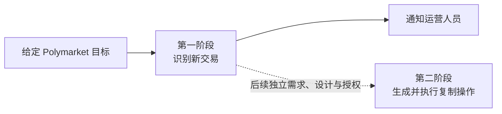

# Polymarket 跟单需求

本目录属于 [`docs/requirements/`](../README.md)，记录 Polymarket 跟单能力的业务目标、阶段边界和可观察行为。跟单能力按可独立确认的阶段拆分；每一阶段必须先确认需求，再进入后端技术设计。

当前只讨论第一阶段的目标交易监控与通知。复制下单属于第二阶段，不因第一阶段需求或未来技术设计获得任何实现授权。

## 需求地图

| 能力 | 文档 | 状态 | 关联技术设计 |
| --- | --- | --- | --- |
| 第一阶段：目标交易监控与通知 | [目标交易监控与通知需求](target-trade-monitoring-notifications.md) | `讨论中` | 未创建 |
| 第二阶段：复制交易 | 未创建 | 未开始 | 未创建 |

## 阶段关系

第一阶段可以为后续复制交易保留完整、可核验的交易事实，但不得生成订单、签名、资金操作或任何其他交易副作用。

[返回需求索引](../README.md)
